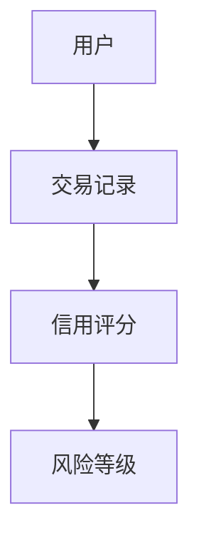
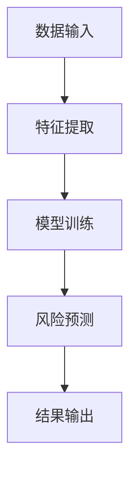
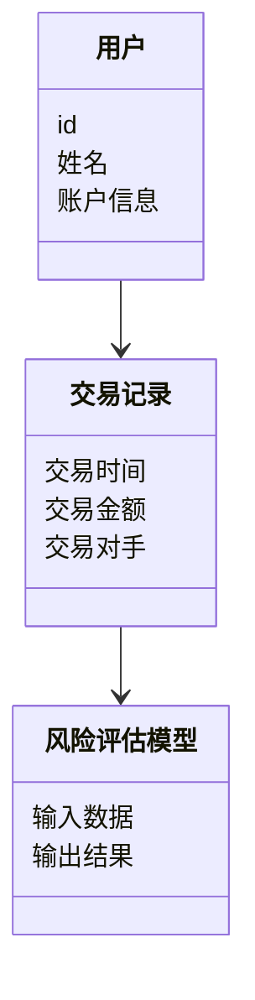

                 


# AI辅助的金融风险评估系统设计

**关键词**：AI，金融风险评估，系统设计，风险管理，深度学习，机器学习

**摘要**：随着人工智能技术的迅速发展，金融行业正面临前所未有的变革。传统的金融风险评估方法依赖于复杂的模型和大量的人工分析，效率低下且容易受到主观因素的影响。本文将深入探讨如何利用人工智能技术构建一个高效、准确的金融风险评估系统。通过结合机器学习、深度学习等技术，本文提出了一种基于AI的金融风险评估系统设计方案，详细阐述了系统的架构设计、算法实现以及实际应用场景。

---

## 第一部分：AI与金融风险评估的结合

### 第1章：背景介绍

#### 1.1 问题背景
金融风险评估是金融行业中的核心任务之一，旨在通过对各种金融数据的分析，评估潜在的财务风险。传统的方法依赖于统计模型和人工分析，但存在以下问题：
- 数据量大且复杂，难以快速处理。
- 人工分析容易受到主观因素的影响。
- 风险评估的准确性和实时性有限。

#### 1.2 问题描述
金融风险评估的目标是通过分析客户的信用记录、交易行为、市场波动等数据，预测可能的风险事件。然而，传统的统计方法在面对海量数据时表现不佳，且难以捕捉数据中的复杂模式。

#### 1.3 问题解决
人工智能技术的快速发展为金融风险评估带来了新的可能性。通过机器学习、深度学习等技术，可以更高效地处理海量数据，并发现数据中的潜在规律。

#### 1.4 系统边界与外延
本系统专注于利用AI技术辅助金融风险评估，主要功能包括数据采集、特征提取、模型训练、风险预测和结果输出。

---

### 第2章：核心概念与联系

#### 2.1 核心概念原理
- **机器学习**：通过训练模型从数据中学习规律，用于分类、回归等任务。
- **深度学习**：基于人工神经网络的算法，能够处理复杂的非线性关系。
- **自然语言处理（NLP）**：用于分析文本数据，提取情感、关键词等信息。

#### 2.2 概念属性特征对比表
| 概念 | 属性 | 特征 |
|------|------|------|
| 机器学习 | 数据驱动 | 需要大量标注数据 |
| 深度学习 | 层次化结构 | 需要大量计算资源 |
| NLP | 文本处理 | 需要语言理解能力 |

#### 2.3 ER实体关系图


---

### 第3章：AI辅助金融风险评估的算法原理

#### 3.1 算法原理概述
- **传统机器学习算法**：如决策树、随机森林，适用于小规模数据。
- **深度学习算法**：如神经网络、LSTM，适用于处理时间序列数据。
- **混合型算法**：结合机器学习和深度学习的优势，提升模型性能。

#### 3.2 算法流程图


#### 3.3 算法实现代码
```python
import pandas as pd
from sklearn.tree import DecisionTreeClassifier

# 加载数据
data = pd.read_csv('financial_data.csv')

# 特征提取
X = data[['income', 'debt', 'credit_score']]
y = data['risk_level']

# 模型训练
model = DecisionTreeClassifier()
model.fit(X, y)

# 风险预测
predicted_risk = model.predict(X)
```

#### 3.4 数学模型与公式
- **线性回归模型**：
  $$ y = \beta_0 + \beta_1 x_1 + \beta_2 x_2 + \cdots + \beta_n x_n $$
- **神经网络模型**：
  $$ a^{(l)} = \sigma(w^{(l)} a^{(l-1)} + b^{(l)}) $$

---

## 第二部分：系统架构设计

### 第4章：系统功能设计

#### 4.1 领域模型


#### 4.2 系统架构


#### 4.3 系统接口设计
- 输入接口：接收用户交易数据。
- 输出接口：返回风险评估结果。

#### 4.4 系统交互流程图


---

## 第三部分：项目实战

### 第5章：环境配置与代码实现

#### 5.1 环境配置
```bash
pip install pandas scikit-learn tensorflow
```

#### 5.2 核心代码实现
```python
import pandas as pd
from sklearn.ensemble import RandomForestClassifier
from tensorflow.keras import Sequential
from tensorflow.keras.layers import Dense

# 加载数据
data = pd.read_csv('financial_data.csv')

# 数据预处理
X = data.drop('risk_level', axis=1)
y = data['risk_level']

# 机器学习模型
model_ml = RandomForestClassifier()
model_ml.fit(X, y)

# 深度学习模型
model_dl = Sequential()
model_dl.add(Dense(64, activation='relu', input_dim=X.shape[1]))
model_dl.add(Dense(1, activation='sigmoid'))
model_dl.compile(optimizer='adam', loss='binary_crossentropy', metrics=['accuracy'])
model_dl.fit(X, y, epochs=10, batch_size=32)
```

#### 5.3 案例分析
以某银行客户数据为例，利用上述模型进行风险评估。通过对比模型预测结果与实际风险等级，验证模型的准确性和有效性。

---

## 第四部分：总结与展望

### 第6章：总结与小结

#### 6.1 系统优缺点
- 优点：高效、准确、实时性强。
- 缺点：依赖大量数据，模型解释性较差。

#### 6.2 最佳实践
- 数据预处理是关键。
- 选择合适的模型和参数。
- 定期更新模型以适应市场变化。

#### 6.3 展望
未来，随着AI技术的进一步发展，金融风险评估系统将更加智能化和个性化。结合区块链、大数据等技术，系统将具备更高的安全性和实时性。

---

通过本文的详细讲解，我们了解了如何利用AI技术构建一个高效的金融风险评估系统。从算法原理到系统设计，再到实际应用，每一部分都进行了深入的分析和探讨。希望本文能够为读者在金融风险管理领域提供有价值的参考和启发。

