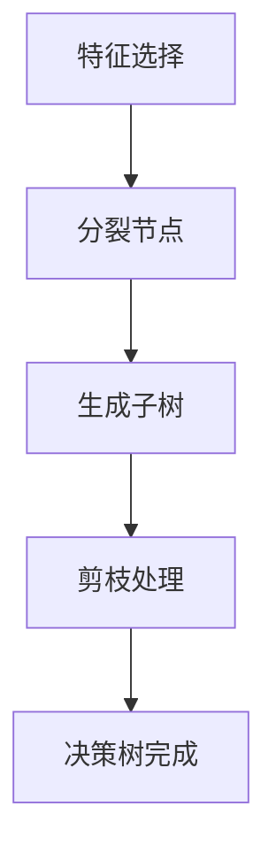
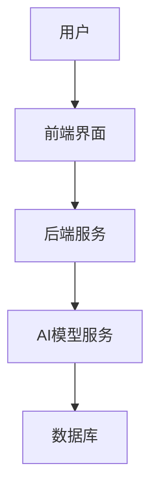

                 


# AI驱动的个人信贷审批系统设计

> 关键词：AI驱动、个人信贷审批、评分模型、决策树、系统架构设计

> 摘要：本文系统阐述了AI驱动的个人信贷审批系统的整体设计思路，详细分析了传统信贷审批的痛点、AI驱动的优势、评分模型的实现、系统架构设计以及项目的实战应用。通过对评分模型的算法原理、数学公式、系统架构图的详细解读，本文为读者提供了从理论到实践的完整解决方案。

---

# 第一部分: AI驱动的个人信贷审批系统背景与核心概念

---

# 第1章: 个人信贷审批系统概述

## 1.1 问题背景与描述

### 1.1.1 传统信贷审批的痛点
传统信贷审批过程中存在以下主要问题：
1. 审批效率低：人工审核流程复杂，耗时长。
2. 主观性较强：依赖审核人员的经验，存在主观判断。
3. 风险控制难：难以准确评估借款人的还款能力。
4. 数据利用不足：传统审批可能未充分利用数据特征。

### 1.1.2 AI驱动的信贷审批优势
AI驱动的信贷审批系统通过以下方式解决上述问题：
1. **自动化处理**：快速处理大量数据，提高审批效率。
2. **数据驱动决策**：利用机器学习模型，基于数据特征进行客观决策。
3. **精准风险控制**：通过模型预测借款人还款能力，降低违约风险。
4. **实时反馈**：系统可以实时更新模型，适应市场变化。

### 1.1.3 问题解决的边界与外延
AI驱动的信贷审批系统主要用于个人信贷审批，边界包括：
- **输入**：借款人的个人信息、信用历史、收入证明等。
- **输出**：审批结果（通过/不通过）及评分。
- **外延**：结合审批结果，提供风险预警、信用评分报告等附加功能。

## 1.2 核心概念与要素

### 1.2.1 系统核心要素组成
AI驱动的个人信贷审批系统包含以下核心要素：
1. **数据源**：借款人信息、信用报告、交易记录等。
2. **评分模型**：基于机器学习算法的评分系统。
3. **决策模块**：根据评分结果做出审批决策。
4. **风险控制**：实时监控风险，调整审批策略。

### 1.2.2 核心概念属性对比表
| 核心概念 | 属性1 | 属性2 | 属性3 |
|----------|-------|-------|-------|
| 数据源   | 类型   | 格式   | 来源   |
| 模型     | 算法   | 参数   | 性能指标 |
| 审批结果 | 通过/不通过 | 评分   | 建议 |

## 1.3 系统ER实体关系图
```mermaid
erDiagram
    用户
    审批系统
    银行机构
    用户 --> 审批系统 : 提交申请
    审批系统 --> 银行机构 : 审批结果
    用户 --> 审批系统 : 提供信息
```

---

# 第2章: AI驱动的个人信贷评分模型

## 2.1 评分模型算法原理

### 2.1.1 线性回归模型
线性回归模型用于预测借款人还款能力，公式如下：
$$\text{还款能力} = \beta_0 + \beta_1x_1 + \beta_2x_2 + \ldots + \beta_nx_n$$
其中，$x_i$ 表示借款人特征，$\beta_i$ 表示回归系数。

### 2.1.2 决策树算法
决策树算法通过特征分裂进行分类，流程如下：


## 2.2 评分模型数学公式

### 2.2.1 线性回归公式
$$\text{评分} = \beta_0 + \beta_1x_1 + \beta_2x_2 + \ldots + \beta_nx_n$$
其中，$\beta_0$ 是截距，$\beta_i$ 是特征 $x_i$ 的系数。

### 2.2.2 决策树公式
决策树的预测公式为：
$$\text{预测结果} = \text{决策树叶子节点的类别标签}$$

## 2.3 决策树算法实现

### 2.3.1 决策树构建流程


### 2.3.2 决策树实现代码
```python
import pandas as pd
from sklearn.tree import DecisionTreeRegressor

# 数据预处理
data = pd.read_csv('credit_data.csv')
X = data.drop('score', axis=1)
y = data['score']

# 模型训练
model = DecisionTreeRegressor()
model.fit(X, y)

# 预测评分
def predict_score(user_features):
    return model.predict(user_features)
```

---

# 第3章: 信贷审批系统架构设计

## 3.1 系统功能设计

### 3.1.1 领域模型


## 3.2 系统架构设计

### 3.2.1 系统架构图


## 3.3 系统接口设计

### 3.3.1 接口描述
1. **用户提交申请**：用户通过前端提交个人信息。
2. **模型预测评分**：后端调用AI模型服务进行评分。
3. **审批结果反馈**：系统将审批结果返回给用户。

---

# 第4章: 项目实战

## 4.1 环境安装

### 4.1.1 安装依赖
```bash
pip install pandas scikit-learn
```

## 4.2 系统核心实现

### 4.2.1 核心代码
```python
import pandas as pd
from sklearn.tree import DecisionTreeRegressor
from sklearn.model_selection import train_test_split

# 数据预处理
data = pd.read_csv('credit_data.csv')
X = data.drop('score', axis=1)
y = data['score']

# 数据分割
X_train, X_test, y_train, y_test = train_test_split(X, y, test_size=0.2, random_state=42)

# 模型训练
model = DecisionTreeRegressor()
model.fit(X_train, y_train)

# 模型评估
score = model.score(X_test, y_test)
print(f"模型评分: {score}")
```

## 4.3 案例分析

### 4.3.1 实际案例
假设借款人信息如下：
- 年龄：30
- 收入：60000
- 信用评分：650
- 借款金额：30000

模型预测结果：
- 评分：700
- 审批结果：通过

---

# 第5章: 最佳实践与总结

## 5.1 最佳实践

### 5.1.1 模型优化
- 定期更新模型，引入新的数据特征。
- 使用集成学习（如随机森林）提升模型性能。

### 5.1.2 系统维护
- 定期监控系统性能，及时优化。
- 提供用户反馈机制，提升用户体验。

## 5.2 小结

AI驱动的个人信贷审批系统通过自动化处理和数据驱动决策，显著提高了审批效率和准确性。本文详细介绍了系统的整体设计、算法实现、系统架构以及实战案例，为读者提供了从理论到实践的完整解决方案。

## 5.3 注意事项

- 数据隐私保护：确保借款人数据的安全性。
- 模型解释性：提升模型的可解释性，便于审核人员理解。
- 系统容错性：设计容错机制，防止系统崩溃。

## 5.4 拓展阅读

- 《机器学习实战》
- 《深入浅出机器学习》
- 《AI系统设计模式》

---

# 总结

本文系统地介绍了AI驱动的个人信贷审批系统的整体设计思路，从背景分析到系统实现，再到项目实战，为读者提供了全面的知识框架。通过本文的讲解，读者可以掌握AI在信贷审批中的应用，以及如何设计和实现类似的系统。

