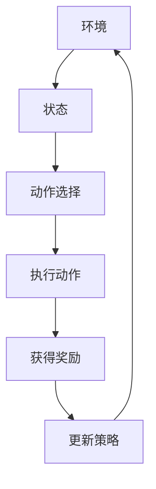
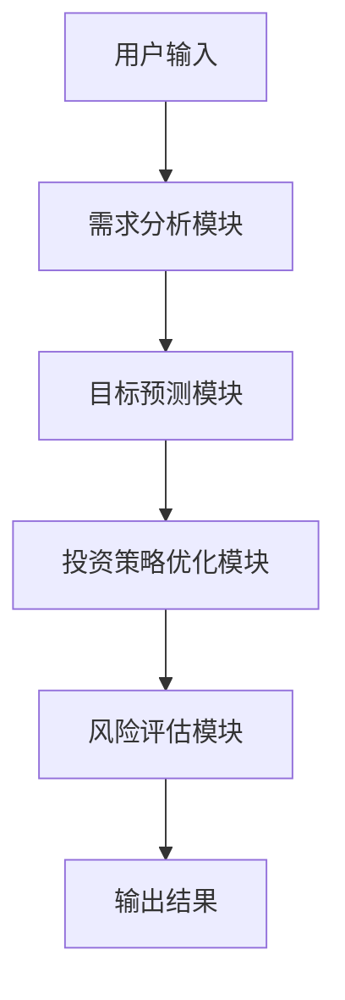
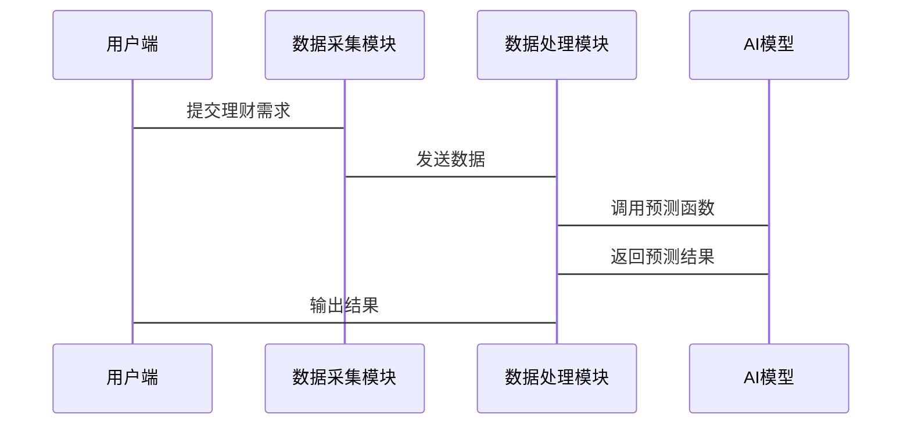

                 


```markdown
# AI驱动的个人理财目标规划助手

## 关键词
AI技术，个人理财，目标规划，机器学习，自然语言处理，强化学习

## 摘要
本文详细探讨了如何利用人工智能技术构建一个智能的个人理财目标规划助手。通过结合机器学习、自然语言处理和强化学习等技术，本文提出了一种基于AI的理财目标规划系统，旨在帮助用户实现个性化的财务目标。文章从背景介绍、算法原理、系统架构设计到项目实战，全面分析了该系统的实现过程，并给出了详细的代码实现和案例分析。

---

## 第1章 个人理财与AI技术的结合

### 1.1 个人理财的基本概念
#### 1.1.1 个人理财的定义与目标
个人理财是指个人对自己财务资源的管理与规划，旨在通过合理的资产配置、投资决策和风险管理，实现财务目标的最大化。常见的财务目标包括资产保值、增值、风险控制等。

#### 1.1.2 理财规划的核心要素
理财规划的核心要素包括：
1. **收入与支出**：记录和分析个人的收入来源和支出情况。
2. **资产配置**：根据风险承受能力和财务目标，合理分配资金到不同的资产类别（如股票、债券、房地产等）。
3. **投资决策**：基于市场环境和个体需求，制定有效的投资策略。
4. **风险管理**：识别和评估潜在的财务风险，并制定相应的应对措施。

#### 1.1.3 个人理财的常见误区
1. 过度追求高收益，忽视风险。
2. 缺乏长期规划，仅关注短期收益。
3. 未能及时调整投资策略以应对市场变化。

### 1.2 AI技术在理财中的应用前景
#### 1.2.1 AI技术的基本原理
人工智能（AI）是一种模拟人类智能的技术，通过机器学习、自然语言处理、计算机视觉等技术手段，实现对数据的分析、理解和决策。

#### 1.2.2 AI在理财中的潜在应用场景
1. **个性化投资建议**：基于用户的财务状况和风险偏好，提供个性化的投资建议。
2. **市场趋势预测**：利用历史数据和机器学习模型，预测市场趋势。
3. **风险管理**：通过AI技术实时监控市场动态，识别潜在风险。

#### 1.2.3 AI驱动理财助手的优势与挑战
优势：
- 高效性：AI能够快速处理大量数据，提供实时反馈。
- 精准性：基于大数据分析，提供个性化建议。
- 智能性：能够根据市场变化和用户需求动态调整策略。

挑战：
- 数据隐私问题：用户数据的安全性和隐私性需要严格保护。
- 算法的可解释性：复杂的AI模型可能难以让用户理解其决策逻辑。

### 1.3 本章小结
通过本章的介绍，我们了解了个人理财的基本概念及其核心要素，同时探讨了AI技术在理财中的潜在应用场景和优势。接下来，我们将深入分析AI驱动的理财目标规划助手的技术实现细节。

---

## 第2章 理财目标规划的核心算法

### 2.1 基于机器学习的目标规划模型
#### 2.1.1 机器学习的基本原理
机器学习是一种通过数据训练模型，使其能够进行预测或决策的技术。常见的机器学习算法包括线性回归、支持向量机（SVM）、随机森林等。

#### 2.1.2 常见的目标规划算法
- **线性回归**：用于预测连续型变量，如资产回报率。
- **随机森林**：用于分类和回归问题，适合处理高维数据。
- **XGBoost**：一种高效的梯度提升算法，适用于分类和回归问题。

#### 2.1.3 基于回归分析的理财目标预测
**数学模型**：
$$
y = \beta_0 + \beta_1x_1 + \beta_2x_2 + \cdots + \beta_nx_n + \epsilon
$$
其中，$y$为预测目标（如资产回报率），$x_i$为自变量（如收入、支出等），$\beta_i$为回归系数，$\epsilon$为误差项。

---

### 2.2 自然语言处理在理财中的应用
#### 2.2.1 NLP的基本概念
自然语言处理（NLP）是人工智能的一个分支，旨在让计算机能够理解、处理和生成人类语言。

#### 2.2.2 理财文本分析的NLP技术
- **文本分类**：将理财相关的文本（如新闻、报告）进行分类，识别其主题和情感倾向。
- **实体识别**：从文本中提取关键实体（如公司名称、财务指标）。

#### 2.2.3 基于NLP的用户需求分析
通过分析用户的文本输入（如“我想增加我的投资收益”），生成个性化的理财建议。

---

### 2.3 强化学习在投资决策中的应用
#### 2.3.1 强化学习的基本原理
强化学习是一种通过试错机制，学习最优决策策略的技术。其核心是通过与环境的交互，不断优化动作以获得最大化的累积奖励。

#### 2.3.2 基于强化学习的投资策略优化
**算法流程图**：



#### 2.3.3 强化学习在风险控制中的应用
通过强化学习模型，实时监控市场动态，动态调整投资组合以规避风险。

---

## 第3章 理财目标规划系统的架构设计

### 3.1 系统功能模块划分
#### 3.1.1 用户需求分析模块
- 收集用户的财务状况、风险偏好等信息。
- 通过NLP技术分析用户的理财需求。

#### 3.1.2 理财目标预测模块
- 基于机器学习模型预测用户的财务目标。
- 输出预测结果和实现路径。

#### 3.1.3 投资策略优化模块
- 根据市场环境和用户需求，优化投资策略。
- 输出最优投资组合。

#### 3.1.4 风险评估与预警模块
- 实时监控市场动态，评估潜在风险。
- 发出预警信号。

### 3.2 系统功能流程图


### 3.3 系统架构设计
#### 3.3.1 系统架构图


#### 3.3.2 系统接口设计
- 用户端接口：提供输入和输出界面。
- 服务器接口：处理数据和调用AI模型。
- 数据库接口：存储和管理数据。

#### 3.3.3 系统交互流程图


---

## 第4章 项目实战：AI理财目标规划助手的实现

### 4.1 环境安装
- 安装Python和必要的库（如numpy、pandas、scikit-learn、transformers）。

### 4.2 核心代码实现
#### 4.2.1 数据预处理代码
```python
import pandas as pd

# 读取数据
data = pd.read_csv('finance_data.csv')

# 数据清洗
data.dropna(inplace=True)
data = pd.get_dummies(data)
```

#### 4.2.2 机器学习模型实现
```python
from sklearn.ensemble import RandomForestRegressor

# 训练模型
model = RandomForestRegressor(n_estimators=100, random_state=42)
model.fit(X_train, y_train)

# 预测结果
y_pred = model.predict(X_test)
```

#### 4.2.3 NLP模块实现
```python
from transformers import pipeline

# 初始化NLP管道
nlp = pipeline("text-classification", model="bert-base-cased")

# 分析用户需求
text = "I want to increase my investment returns"
result = nlp(text)
print(result)
```

#### 4.2.4 强化学习策略实现
```python
import gym
from gym import spaces

class FinanceEnv(gym.Env):
    def __init__(self):
        super().__init__()
        self.observation_space = spaces.Box(low=-1, high=1, shape=(4,))
        self.action_space = spaces.Discrete(3)
```

### 4.3 案例分析
通过实际案例，展示系统的实现过程和效果。例如，用户输入“我想在一年内实现资产增值10%”，系统通过分析用户的财务状况和市场环境，生成个性化的投资策略。

### 4.4 项目总结
本项目展示了如何利用AI技术构建一个智能的理财目标规划助手。通过结合机器学习、NLP和强化学习，系统能够提供高效、个性化的理财建议。

---

## 第5章 最佳实践与总结

### 5.1 最佳实践
- 数据隐私保护：采用加密技术确保用户数据的安全。
- 算法可解释性：选择能够解释的模型，增强用户信任。
- 系统可扩展性：设计灵活的架构，方便后续功能的扩展。

### 5.2 小结
通过本文的介绍，我们了解了AI驱动的理财目标规划助手的实现过程和关键点。AI技术的应用不仅提高了理财规划的效率，还为用户提供了更加个性化的服务。

### 5.3 注意事项
- 数据来源的可靠性：确保数据的准确性和完整性。
- 模型的实时性：及时更新模型以应对市场变化。
- 用户教育：帮助用户理解AI理财助手的工作原理和局限性。

### 5.4 拓展阅读
- 推荐阅读相关领域的书籍和论文，深入了解AI在金融领域的应用。

---

## 总结
本文详细探讨了AI驱动的个人理财目标规划助手的实现过程，从背景介绍到技术实现，再到项目实战，全面分析了该系统的核心技术和应用场景。通过本文的阅读，读者可以深入了解AI在理财中的应用价值，并掌握如何利用AI技术构建智能的理财助手。
```

