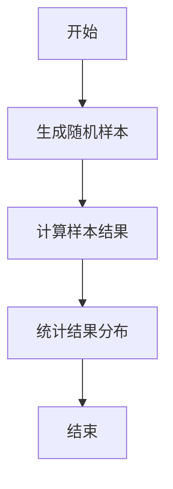
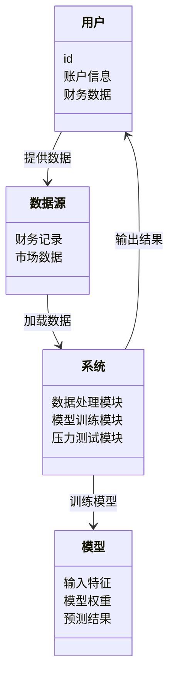
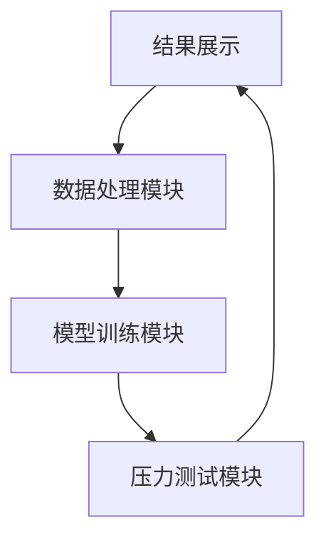

                 


# AI驱动的个人财务 stress testing系统设计与实现

## 关键词：AI技术，个人财务管理，压力测试，系统设计，算法实现

## 摘要：本文详细探讨了AI驱动的个人财务压力测试系统的背景、核心概念、算法原理、系统架构设计以及实际项目实现。通过结合数据分析与AI技术，提出了一种高效的个人财务压力测试解决方案，并展示了如何利用Python代码实现这一系统。

---

## 第一部分: 背景与概念

### 第1章: 问题背景与需求分析

#### 1.1 问题背景
- **个人财务管理的现状与挑战**：随着经济的发展，个人财务管理变得日益复杂，传统的财务分析方法难以应对多样化的风险场景。
- **传统财务压力测试的局限性**：传统压力测试方法依赖人工分析，效率低且覆盖面有限。
- **AI技术的应用潜力**：AI技术能够通过数据分析和建模，快速评估多种风险场景下的财务表现。

#### 1.2 问题描述
- **财务风险的复杂性**：个人财务受到多种因素影响，如市场波动、收入变化等。
- **压力测试的核心目标**：评估财务状况在极端情况下的稳定性。
- **AI驱动的必要性**：利用AI技术可以实现自动化、智能化的压力测试。

#### 1.3 解决思路
- **数据驱动的解决方案**：通过收集和分析财务数据，提取关键特征。
- **AI算法的核心作用**：使用机器学习模型预测不同压力下的财务表现。
- **系统化实现路径**：构建一个整合数据处理、模型训练和结果展示的系统。

#### 1.4 边界与外延
- **系统边界**：仅关注个人财务数据，不涉及其他领域。
- **外延功能**：可扩展至投资建议、风险预警等其他财务功能。
- **接口关系**：与数据源、用户界面以及其他财务系统交互。

#### 1.5 概念结构
- **核心要素**：数据、模型、压力测试场景。
- **关系**：数据输入模型，模型生成压力测试结果，结果用于评估财务稳定性。

---

## 第二部分: 核心概念与联系

### 第2章: 核心概念原理

#### 2.1 数据特征与建模
- **数据特征提取**：包括收入、支出、资产、负债等。
- **数据预处理**：处理缺失值、异常值，归一化/标准化。
- **特征选择**：使用PCA等方法降维，提取重要特征。

#### 2.2 AI算法原理
- **神经网络模型**：如LSTM用于时间序列预测。
- **集成学习方法**：如随机森林和梯度提升树。
- **解释性模型**：如线性回归用于可解释性分析。

#### 2.3 压力测试模型
- **蒙特卡洛模拟**：通过随机抽样模拟多种市场情景。
- **情景分析**：预先设定极端情况，评估财务表现。
- **强度测试**：逐步增加压力，观察系统崩溃点。

### 第3章: 概念对比与ER关系图

#### 3.1 概念对比表
| 概念       | 数据特征       | AI算法       | 压力测试模型     |
|------------|----------------|--------------|------------------|
| 输入       | 财务数据       | 特征数据     | 情景参数         |
| 输出       | 模型预测       | 模型权重     | 测试结果         |
| 关键参数   | 特征重要性     | 学习率       | 情景强度         |

#### 3.2 ER实体关系图
```mermaid
er
  actor: 用户
  model: AI模型
  data: 财务数据
  result: 测试结果
  relation: 用户 -> 提供数据
  relation: 数据 -> 输入模型
  relation: 模型 -> 生成结果
```

---

## 第三部分: 算法原理

### 第4章: 算法实现

#### 4.1 蒙特卡洛模拟
- **数学模型**：$$ P(X \leq x) = \int_{-\infty}^{x} f(x) dx $$
- **流程图**


#### 4.2 神经网络实现
- **代码实现**（Python）
```python
import numpy as np
import tensorflow as tf

# 数据生成
X = np.random.randn(100, 1)
y = X + np.random.normal(0, 0.1, 100)

# 模型定义
model = tf.keras.Sequential([
    tf.keras.layers.Dense(64, activation='relu'),
    tf.keras.layers.Dense(1, activation='linear')
])

# 编译模型
model.compile(optimizer='adam', loss='mean_squared_error')

# 训练模型
model.fit(X, y, epochs=100, batch_size=32)
```

---

## 第四部分: 系统设计

### 第5章: 系统架构设计

#### 5.1 领域模型


#### 5.2 系统架构


---

## 第五部分: 项目实战

### 第6章: 实战代码与分析

#### 6.1 环境安装
```bash
pip install numpy pandas scikit-learn tensorflow
```

#### 6.2 核心代码实现
```python
import pandas as pd
from sklearn.model_selection import train_test_split
from sklearn.ensemble import RandomForestRegressor
from sklearn.metrics import mean_absolute_error

# 数据加载
data = pd.read_csv('financial_data.csv')
X = data.drop('net_worth', axis=1)
y = data['net_worth']

# 数据分割
X_train, X_test, y_train, y_test = train_test_split(X, y, test_size=0.2)

# 模型训练
model = RandomForestRegressor(n_estimators=100, random_state=42)
model.fit(X_train, y_train)

# 模型预测
y_pred = model.predict(X_test)

# 评估结果
print(mean_absolute_error(y_test, y_pred))
```

#### 6.3 案例分析
- **输入数据**：用户收入、支出、资产等。
- **模型预测**：在不同压力情景下，预测用户的净资产变化。
- **结果展示**：生成压力测试报告，指出财务风险点。

---

## 第六部分: 总结与展望

### 第7章: 总结与最佳实践

#### 7.1 总结
- AI驱动的个人财务压力测试系统通过数据分析和机器学习算法，实现了高效、准确的压力测试。
- 系统设计模块化，便于扩展和维护。

#### 7.2 最佳实践
- **数据隐私保护**：确保用户数据的安全性。
- **模型可解释性**：选择适合业务需求的模型，平衡准确性和可解释性。
- **持续优化**：定期更新模型，适应市场变化。

#### 7.3 展望
- **多模态数据融合**：结合文本、图像等多源数据，提升预测精度。
- **实时压力测试**：开发实时监控系统，及时发现财务风险。

---

通过以上设计，AI驱动的个人财务压力测试系统能够帮助用户更好地理解和管理财务风险，为未来的智能化财务管理提供了有力支持。

