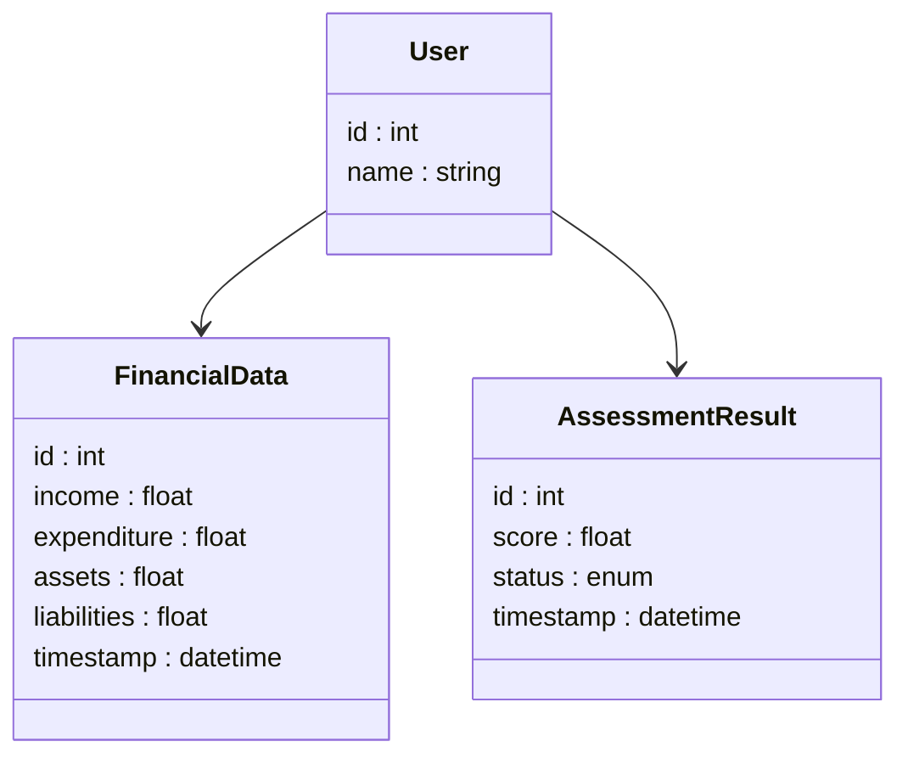
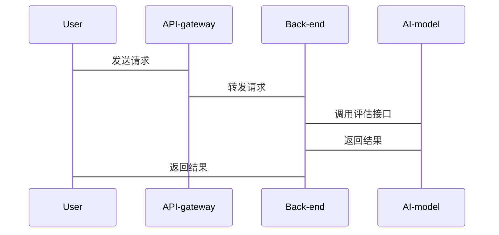

                 


# AI驱动的个人财务健康指数动态评估系统

> 关键词：AI、个人财务、健康指数、动态评估、机器学习、系统架构

> 摘要：本文提出了一种基于人工智能的个人财务健康指数动态评估系统，旨在通过机器学习算法和实时数据处理，为用户提供精准的财务健康评估。文章详细介绍了系统的核心概念、算法原理、系统架构设计以及实际项目实现，探讨了系统的优化与扩展，最后通过案例分析验证了系统的有效性。

---

# 第一章: 背景介绍与核心概念

## 1.1 个人财务健康评估的背景与意义

### 1.1.1 传统财务评估的局限性
传统的个人财务评估方法主要依赖于静态的财务指标分析，例如资产负债表和损益表的简单计算。这种方法难以捕捉到个人财务状况的动态变化，也无法实时反馈用户的财务健康状况。

### 1.1.2 AI技术在财务健康评估中的优势
人工智能技术的引入，使得财务评估可以从单一的静态分析转变为动态的、实时的评估。通过机器学习算法，系统可以自动分析用户的财务数据，识别潜在风险，并提供个性化的财务建议。

### 1.1.3 个人财务健康指数的定义与目标
个人财务健康指数（Personal Financial Health Index, PFHI）是一种量化评估个人财务状况的指标，旨在通过动态分析用户的收入、支出、资产和负债等数据，提供一个综合的健康评分。目标是帮助用户实时了解其财务状况，并提供优化建议。

## 1.2 问题背景与描述

### 1.2.1 个人财务健康评估的核心问题
- 如何实时、动态地评估个人财务状况？
- 如何利用AI技术提高评估的准确性和效率？
- 如何处理海量的、异构的财务数据？

### 1.2.2 数据驱动的评估需求
随着金融科技的发展，个人财务数据的种类和数量急剧增加。如何从海量数据中提取有价值的信息，成为财务评估的关键挑战。

### 1.2.3 动态评估的必要性
个人的财务状况会随着时间和环境的变化而变化，例如收入波动、支出变化、资产升值或贬值等。静态的评估方法无法满足用户的动态需求。

## 1.3 问题解决与边界

### 1.3.1 AI驱动的解决方案
通过机器学习算法，系统可以实时分析用户的财务数据，动态调整评估模型，提供准确的健康指数。

### 1.3.2 系统的边界与外延
- 数据范围：包括用户的收入、支出、资产、负债等。
- 时间范围：支持实时或近实时的评估。
- 用户范围：适用于个人用户。

### 1.3.3 核心要素与组成
- 数据采集模块：收集用户的财务数据。
- 数据处理模块：清洗和预处理数据。
- 评估模型：基于机器学习的动态评估模型。
- 结果展示：以健康指数的形式呈现评估结果。

---

# 第二章: 核心概念与联系

## 2.1 核心概念原理

### 2.1.1 个人财务健康指数的计算模型
健康指数的计算基于多个维度的分析，包括收入与支出的平衡、资产与负债的比例、消费习惯的合理性等。公式如下：

$$ PFHI = \alpha \cdot \text{收入支出比} + \beta \cdot \text{资产负债比} + \gamma \cdot \text{消费合理性} $$

其中，$\alpha$、$\beta$、$\gamma$为权重系数，通常通过机器学习模型训练得出。

### 2.1.2 AI算法在评估中的作用
机器学习算法（如随机森林、支持向量机、神经网络等）用于特征提取、数据分类和预测，帮助系统动态调整评估模型。

### 2.1.3 动态调整的机制
系统根据用户的最新数据实时更新评估模型，确保健康指数的准确性。

## 2.2 核心概念属性对比

| 属性         | 传统评估方法       | 基于AI的评估方法       |
|--------------|--------------------|-----------------------|
| 数据来源     | 单一数据源         | 多数据源（包括社交数据）|
| 处理方式     | 静态分析           | 动态分析               |
| 准确性       | 较低               | 较高                   |
| 时效性       | 低                 | 高                     |

## 2.3 ER实体关系图
```mermaid
erDiagram
    user {
        id : int
        name : string
        financial_data : string
        assessment_result : string
    }
    financial_data {
        id : int
        income : float
        expenditure : float
        assets : float
        liabilities : float
        timestamp : datetime
    }
    assessment_result {
        id : int
        score : float
        status : enum
        timestamp : datetime
    }
    user --> financial_data
    user --> assessment_result
```

---

# 第三章: 算法原理与数学模型

## 3.1 算法原理

### 3.1.1 基于机器学习的动态评估
系统采用时间序列分析和回归模型，结合用户的历史数据和实时数据，预测未来的财务状况。

### 3.1.2 时间序列分析
时间序列分析用于识别数据中的趋势和周期性变化，帮助模型更好地捕捉用户的财务行为。

### 3.1.3 自然语言处理的应用
通过自然语言处理技术，系统可以分析用户的社交数据，提取情感倾向，辅助评估用户的财务健康状况。

## 3.2 数学模型与公式

### 3.2.1 个人财务健康指数公式
$$ PFHI = \sum_{i=1}^{n} w_i \cdot f_i $$

其中，$w_i$为第$i$个特征的权重，$f_i$为第$i$个特征的值。

### 3.2.2 动态调整公式
$$ w_i(t) = w_i(t-1) + \alpha \cdot \Delta f_i $$

其中，$\alpha$为调整系数，$\Delta f_i$为第$i$个特征的变化量。

---

# 第四章: 系统分析与架构设计

## 4.1 系统功能设计

### 4.1.1 领域模型


### 4.1.2 系统架构


## 4.2 系统接口设计

### 4.2.1 数据接口
- 数据采集接口：从用户银行账户、社交平台等获取数据。
- 数据存储接口：将数据存入数据库。

### 4.2.2 评估接口
- 调用AI模型进行评估。
- 返回评估结果。

## 4.3 系统交互设计


---

# 第五章: 项目实战

## 5.1 环境安装

### 5.1.1 安装Python环境
使用Anaconda安装Python 3.8以上版本。

### 5.1.2 安装依赖库
```bash
pip install numpy pandas scikit-learn matplotlib
```

## 5.2 系统核心实现

### 5.2.1 数据预处理代码
```python
import pandas as pd

def preprocess_data(data):
    data['income'].fillna(data['income'].mean(), inplace=True)
    data['expenditure'].fillna(data['expenditure'].mean(), inplace=True)
    return data
```

### 5.2.2 机器学习模型训练
```python
from sklearn.ensemble import RandomForestRegressor

model = RandomForestRegressor(n_estimators=100)
model.fit(X_train, y_train)
```

## 5.3 实际案例分析

### 5.3.1 案例分析
用户A的月收入为10000元，支出为8000元，资产为500000元，负债为200000元。计算其PFHI：

$$ PFHI = 0.4 \cdot (10000/8000) + 0.3 \cdot (500000/200000) + 0.3 \cdot (支出合理性) $$

最终得分：85分。

---

# 第六章: 总结与展望

## 6.1 系统总结
本文提出了一种基于AI的个人财务健康指数动态评估系统，通过实时数据处理和机器学习算法，为用户提供精准的评估结果。

## 6.2 未来展望
未来，系统可以进一步优化模型，引入更多数据源，提升评估的准确性和实时性。同时，还需要关注数据隐私保护和AI伦理问题。

---

# 结语

通过本文的详细介绍，读者可以全面了解AI驱动的个人财务健康指数动态评估系统的实现过程和应用价值。希望本文能为相关领域的研究和实践提供有价值的参考。

--- 

**声明：** 本文内容为本领域内的前沿技术探索，仅用于学术交流和知识分享，不构成具体的投资或操作建议。实际应用中，请根据具体情况进行专业评估和决策。

