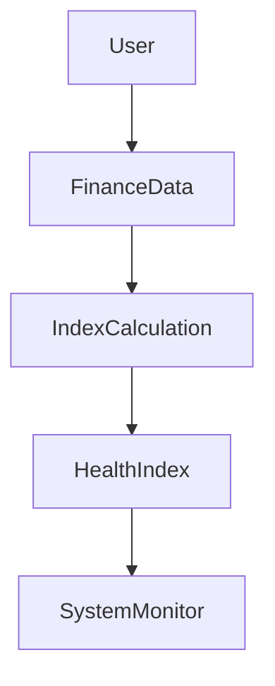
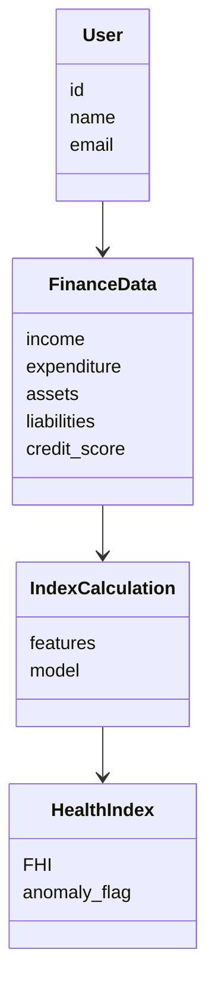
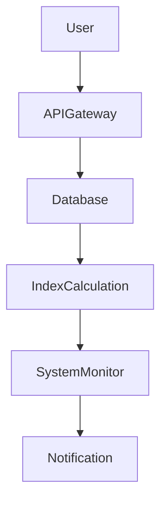
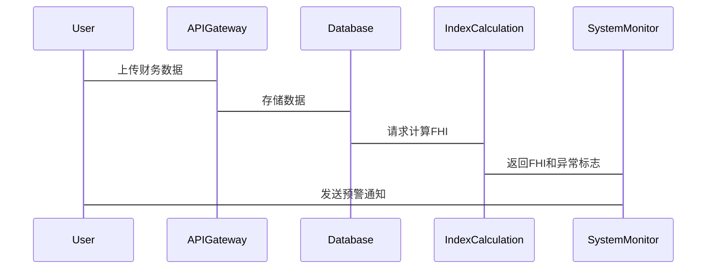

                 


# AI驱动的个人财务健康指数计算与监控系统

## 关键词：
- AI驱动
- 财务健康指数
- 监控系统
- 数据分析
- 机器学习

## 摘要：
本文探讨如何利用AI技术构建个人财务健康指数计算与监控系统。通过分析财务数据，结合机器学习算法，实现对个人财务状况的实时评估与异常检测，帮助用户优化财务管理。

---

# 第1章: 背景介绍

## 1.1 问题背景

### 1.1.1 个人财务健康的重要性
在现代生活中，个人财务健康直接关系到生活质量。合理的财务规划能够帮助个人避免债务危机，实现财富增值。然而，传统财务评估方法依赖人工计算，耗时且难以实时更新。

### 1.1.2 现有财务健康评估的局限性
传统评估方法存在以下问题：
1. **人工依赖**：需要手动整理财务数据，效率低下。
2. **静态评估**：无法实时更新，难以应对市场变化。
3. **缺乏深度分析**：难以识别隐藏的财务风险。

### 1.1.3 AI技术在财务健康评估中的优势
AI技术可以通过以下方式提升财务评估：
- **自动化数据处理**：实时收集并分析财务数据。
- **智能预测**：利用机器学习模型预测财务风险。
- **动态评估**：根据市场变化实时调整评估结果。

## 1.2 问题描述

### 1.2.1 财务健康指数的定义
财务健康指数（FHI）是衡量个人财务状况的综合指标，通常以0到1的分数表示，分数越高表示财务状况越好。

### 1.2.2 财务健康指数的计算维度
FHI的计算基于以下四个维度：
1. **资产与负债比率**：资产超过负债的比例。
2. **收入与支出平衡**：收入是否覆盖日常支出。
3. **投资回报率**：投资收益与本金的比例。
4. **信用评分**：个人信用记录的影响。

### 1.2.3 系统监控的需求与目标
系统需要实时监控用户的财务数据，及时发现异常情况。目标包括：
- 提供实时的FHI评估。
- 发出财务风险预警。
- 提供优化建议。

## 1.3 问题解决

### 1.3.1 AI技术在财务健康评估中的应用
AI技术可以通过以下方式实现财务评估：
- **数据预处理**：清理和标准化财务数据。
- **模型训练**：使用机器学习算法构建FHI模型。
- **实时监控**：持续更新FHI并检测异常。

### 1.3.2 财务健康指数计算的算法选择
选择适合的算法，如随机森林和XGBoost，通过特征工程优化模型性能。

### 1.3.3 系统监控的实现方案
通过设置阈值和触发条件，实现对异常情况的实时报警。

## 1.4 边界与外延

### 1.4.1 系统功能的边界
系统仅处理个人财务数据，不涉及企业财务。

### 1.4.2 系统监控的范围
监控用户的财务数据变化，不包括信用评分以外的外部数据。

### 1.4.3 财务健康指数的适用场景
适用于个人用户，帮助企业进行员工财务健康评估。

## 1.5 概念结构与核心要素

### 1.5.1 财务健康指数的核心要素
- **数据源**：收入、支出、资产、负债、信用评分。
- **模型**：随机森林、XGBoost。
- **评估指标**：FHI分数。

### 1.5.2 系统监控的核心功能
- **实时更新**：每天更新FHI。
- **异常检测**：识别重大财务变化。
- **预警机制**：通过邮件或短信通知用户。

### 1.5.3 AI算法的核心组件
- **特征工程**：数据清洗、特征选择。
- **模型训练**：监督学习、超参数调优。
- **模型评估**：准确率、召回率、F1分数。

---

# 第2章: 核心概念与联系

## 2.1 数据特征分析

### 2.1.1 财务数据的特征提取
- **收入**：月收入、年收入。
- **支出**：日常生活支出、投资支出。
- **资产**：银行存款、房产、股票。
- **负债**：贷款、信用卡欠款。
- **信用评分**：FICO评分。

### 2.1.2 数据预处理方法
1. 数据清洗：处理缺失值、异常值。
2. 特征标准化：归一化处理。
3. 特征选择：使用PCA降低维度。

### 2.1.3 数据分布与异常检测
使用箱线图识别异常值，应用Isolation Forest算法进行异常检测。

## 2.2 模型原理

### 2.2.1 财务健康指数计算模型
使用随机森林回归模型预测FHI：

$$ FHI = \text{ RandomForestRegressor}(\text{features}) $$

### 2.2.2 异常检测算法原理
Isolation Forest算法通过构建随机树隔离异常点：

$$ \text{Isolation Forest} = \text{ensemble of trees} $$

## 2.3 系统架构

### 2.3.1 系统整体架构
- **数据采集层**：收集用户财务数据。
- **数据处理层**：预处理和特征提取。
- **模型计算层**：计算FHI并检测异常。
- **用户界面层**：展示结果和预警信息。

### 2.3.2 数据流与功能模块
- 数据采集：API接口获取数据。
- 数据处理：清洗、转换。
- 模型计算：预测FHI、检测异常。
- 结果展示：用户界面显示FHI和预警。

### 2.3.3 系统交互流程
用户登录后，系统实时计算并展示FHI，当检测到异常时发送预警通知。

## 2.4 实体关系图



---

# 第3章: 算法原理讲解

## 3.1 指数计算模型

### 3.1.1 模型输入与输出
- **输入**：资产、负债、收入、支出、信用评分。
- **输出**：FHI分数。

### 3.1.2 模型训练过程
1. 数据预处理：清洗、标准化。
2. 特征选择：使用PCA降维。
3. 模型训练：随机森林回归。
4. 模型评估：MSE、R²。

### 3.1.3 模型评估指标
- �均方误差（MSE）：$$ MSE = \frac{1}{n}\sum_{i=1}^{n}(y_i - \hat{y_i})^2 $$
- R²系数：$$ R^2 = 1 - \frac{\sum (y_i - \hat{y_i})^2}{\sum (y_i - \bar{y})^2} $$

## 3.2 异常检测算法

### 3.2.1 算法原理
Isolation Forest通过随机划分数据，将异常点与其他点区分开。

### 3.2.2 算法实现步骤
1. 初始化随机树。
2. 对数据进行随机划分。
3. 隔离异常点。

### 3.2.3 异常检测模型

$$ \text{Isolation Forest} = \text{ensemble of trees} $$

---

# 第4章: 系统分析与架构设计方案

## 4.1 问题场景介绍

### 4.1.1 项目背景
随着金融科技的发展，个人财务健康评估需求日益增长。

### 4.1.2 项目介绍
开发一个基于AI的财务健康指数计算与监控系统。

## 4.2 系统功能设计

### 4.2.1 领域模型



### 4.2.2 系统架构设计



### 4.2.3 系统接口设计
- API接口：提供数据上传和结果查询功能。
- 接口协议：RESTful API，使用JSON格式。

### 4.2.4 系统交互流程



---

# 第5章: 项目实战

## 5.1 环境安装

### 5.1.1 安装Python和相关库
```bash
pip install numpy pandas scikit-learn matplotlib
```

## 5.2 核心代码实现

### 5.2.1 数据预处理代码
```python
import pandas as pd
import numpy as np

def preprocess_data(data):
    # 处理缺失值
    data = data.dropna()
    # 标准化
    from sklearn.preprocessing import StandardScaler
    scaler = StandardScaler()
    data_scaled = scaler.fit_transform(data)
    return data_scaled
```

### 5.2.2 模型训练代码
```python
from sklearn.ensemble import RandomForestRegressor
import joblib

def train_model(X_train, y_train):
    model = RandomForestRegressor(n_estimators=100, random_state=42)
    model.fit(X_train, y_train)
    joblib.dump(model, 'fhi_model.pkl')
    return model
```

### 5.2.3 异常检测代码
```python
from sklearn.ensemble import IsolationForest

def detect_anomalies(X):
    model = IsolationForest(n_estimators=100, random_state=42)
    model.fit(X)
    anomalies = model.predict(X)
    return anomalies
```

## 5.3 案例分析

### 5.3.1 数据分析
分析用户的财务数据，计算FHI并识别异常情况。

### 5.3.2 优化建议
根据FHI和异常检测结果，提供财务优化建议。

## 5.4 项目总结

### 5.4.1 项目成果
成功开发了一个实时计算FHI并监控财务健康的系统。

### 5.4.2 经验总结
- 数据清洗和特征工程是关键。
- 模型选择和调优影响性能。

---

# 第6章: 最佳实践

## 6.1 小结
本文详细介绍了AI驱动的个人财务健康指数计算与监控系统的开发过程，展示了如何利用机器学习技术提升财务管理效率。

## 6.2 注意事项
- 数据隐私保护至关重要。
- 模型需要定期更新以保持准确性。

## 6.3 拓展阅读
建议深入学习机器学习和金融数据分析相关知识，探索更多应用场景。

---

# 结语
通过AI技术，个人财务管理变得更加智能化和高效。希望本文能为读者在开发类似系统时提供有价值的参考和启发。

