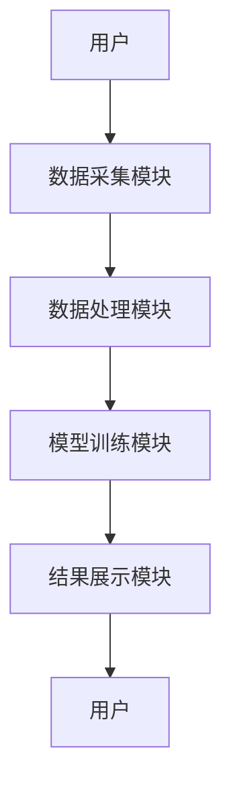

                 


# AI驱动的个人财务健康评估系统设计

> 关键词：AI驱动，个人财务健康，评估系统，机器学习，数据挖掘

> 摘要：本文系统性地探讨了AI技术在个人财务健康评估中的应用，通过理论分析与实践结合，提出了一种基于机器学习的财务健康评估模型，并详细阐述了系统设计、算法实现及实际应用案例。

---

## 第1章: 背景与问题描述

### 1.1 个人财务健康评估的背景
#### 1.1.1 当前个人财务管理的痛点
在当今社会，个人财务管理已成为一个不可忽视的重要课题。随着经济全球化和金融市场的复杂化，个人的财务健康状况直接影响其生活质量与未来发展。传统的财务管理方式依赖于人工记录与分析，存在效率低、准确性差、难以量化等问题。

#### 1.1.2 AI技术在财务管理中的应用潜力
人工智能（AI）技术的快速发展为财务管理带来了新的可能性。通过自然语言处理（NLP）、机器学习（ML）和深度学习（DL）等技术，可以实现财务数据的自动化分析、风险预警和个性化建议，从而显著提升财务管理的效率与精准度。

#### 1.1.3 个人财务健康评估的重要性
个人财务健康评估是衡量个人或家庭财务状况的重要指标。通过评估，可以发现潜在的财务问题，提前采取措施，避免因财务危机导致的生活困境或投资失败。

---

### 1.2 问题描述与目标
#### 1.2.1 个人财务健康评估的核心问题
- 数据分散：财务数据来源多样，难以统一采集与处理。
- 数据复杂：涉及收入、支出、资产、负债等多个维度，数据量大且关系复杂。
- 个性化需求：不同人群的财务状况差异大，需要个性化的评估模型。

#### 1.2.2 系统设计的目标与范围
- **目标**：构建一个基于AI的个人财务健康评估系统，实现数据的自动采集、分析与评估，并提供个性化的财务健康报告和改进建议。
- **范围**：涵盖收入、支出、资产、负债、信用评分等关键财务指标。

#### 1.2.3 用户需求分析与场景描述
- **目标用户**：个人用户、家庭用户、财务顾问。
- **核心需求**：快速获取财务健康状况、识别潜在风险、获得优化建议。
- **使用场景**：移动端应用、网页版、API接口调用。

---

## 第2章: 核心概念与系统架构

### 2.1 核心概念与原理
#### 2.1.1 数据源与数据特征
| 数据源 | 数据特征 | 数据类型 | 示例 |
|--------|-----------|-----------|------|
| 收入    | 稳定性    | 数值型    | 工资收入 |
| 支出    | 结构合理性 | 数值型    | 房贷支出 |
| 资产    | 完整性    | 数值型    | 房产价值 |
| 负债    | 偿债能力  | 数值型    | 信用卡欠款 |

#### 2.1.2 评估指标与评分体系
- **评估指标**：收入支出比、资产负债比、信用评分、净资产收益率。
- **评分体系**：基于机器学习模型输出的评分，分为优秀、良好、一般、较差、较差五个等级。

#### 2.1.3 AI算法在评估中的作用
AI算法通过分析历史数据，识别财务状况中的潜在问题，并预测未来可能的风险。

---

### 2.2 实体关系与系统架构
#### 2.2.1 ER实体关系图
```mermaid
erDiagram
    user [用户] {
        id : integer
        name : string
        email : string
    }
    financial_data [财务数据] {
        id : integer
        user_id : integer
        income : float
        expenditure : float
        assets : float
        liabilities : float
        timestamp : datetime
    }
    assessment_result [评估结果] {
        id : integer
        user_id : integer
        score : integer
        status : string
        timestamp : datetime
    }
    user --> financial_data : 提供
    user --> assessment_result : 获取
    financial_data --> assessment_result : 分析
```

#### 2.2.2 系统架构设计


---

## 第3章: AI算法原理与实现

### 3.1 算法选择与模型构建
#### 3.1.1 机器学习与深度学习算法对比
| 算法类型 | 优点 | 缺点 |
|----------|------|------|
| 机器学习 | 简单、可解释性强 | 表达能力有限 |
| 深度学习 | 表达能力强 | 黑箱问题、计算资源需求高 |

#### 3.1.2 神经网络模型设计
- **输入层**：财务数据特征。
- **隐藏层**：多层感知机（MLP）。
- **输出层**：财务健康评分。

#### 3.1.3 模型训练与优化
- **损失函数**：均方误差（MSE）。
- **优化算法**：Adam优化器。
- **评估指标**：准确率、召回率、F1分数。

### 3.2 算法流程与实现
#### 3.2.1 数据预处理流程
1. 数据清洗：处理缺失值、异常值。
2. 特征工程：提取关键特征，如收入支出比。
3. 数据标准化：归一化处理。

#### 3.2.2 模型训练流程
1. 数据分割：训练集、验证集、测试集。
2. 模型训练：使用训练数据拟合模型。
3. 模型评估：在验证集上评估性能。

#### 3.2.3 结果预测与评估
1. 预测结果：输出财务健康评分。
2. 模型优化：调整超参数，提升性能。

---

## 第4章: 系统分析与架构设计

### 4.1 系统功能设计
#### 4.1.1 数据采集模块
- 功能：从银行账户、支付宝、微信等平台获取数据。
- 技术：API接口调用。

#### 4.1.2 数据处理模块
- 功能：数据清洗、特征提取。
- 技术：Python的Pandas库。

#### 4.1.3 模型训练模块
- 功能：训练AI模型。
- 技术：TensorFlow、Keras。

#### 4.1.4 结果展示模块
- 功能：生成财务健康报告。
- 技术：前端开发（React、Vue）。

### 4.2 系统架构设计
#### 4.2.1 分层架构设计


#### 4.2.2 微服务架构设计


#### 4.2.3 数据流与交互设计


---

## 第5章: 项目实战与代码实现

### 5.1 环境搭建与数据准备
#### 5.1.1 开发环境安装
```bash
pip install numpy pandas scikit-learn tensorflow matplotlib
```

#### 5.1.2 数据集获取与预处理
```python
import pandas as pd
import numpy as np

# 数据加载
df = pd.read_csv('financial_data.csv')

# 数据清洗
df.dropna(inplace=True)
df['income_ratio'] = df['income'] / df['expenditure']

# 特征提取
X = df[['income_ratio', 'assets', ' liabilities']]
y = df['score']
```

### 5.2 核心代码实现
#### 5.2.1 数据处理代码
```python
from sklearn.model_selection import train_test_split
from sklearn.preprocessing import StandardScaler

X_train, X_test, y_train, y_test = train_test_split(X, y, test_size=0.2, random_state=42)

scaler = StandardScaler()
X_train = scaler.fit_transform(X_train)
X_test = scaler.transform(X_test)
```

#### 5.2.2 模型训练代码
```python
from tensorflow.keras.models import Sequential
from tensorflow.keras.layers import Dense

model = Sequential()
model.add(Dense(64, activation='relu', input_dim=X_train.shape[1]))
model.add(Dense(1, activation='sigmoid'))

model.compile(optimizer='adam', loss='binary_crossentropy', metrics=['accuracy'])
model.fit(X_train, y_train, epochs=10, batch_size=32, validation_data=(X_test, y_test))
```

#### 5.2.3 结果展示代码
```python
import matplotlib.pyplot as plt

y_pred = model.predict(X_test)
plt.scatter(y_test, y_pred)
plt.xlabel('True Values')
plt.ylabel('Predictions')
plt.show()
```

---

## 第6章: 系统测试与优化

### 6.1 系统测试与验证
- **单元测试**：测试各个模块的功能。
- **集成测试**：测试系统整体流程。
- **性能测试**：评估系统在高并发情况下的表现。

### 6.2 系统优化
- **模型优化**：尝试不同的网络结构，如添加Dropout层防止过拟合。
- **性能优化**：优化数据处理流程，减少I/O时间。

---

## 第7章: 最佳实践与总结

### 7.1 小结
本文通过理论分析与实践结合，设计了一个基于AI的个人财务健康评估系统，详细阐述了系统设计、算法实现与实际应用案例。

### 7.2 注意事项
- 数据隐私保护：确保用户数据的安全性。
- 模型可解释性：避免“黑箱”模型，提升用户信任度。

### 7.3 拓展阅读
- 《机器学习实战》
- 《深度学习》
- 《数据挖掘导论》

---

通过本文的系统设计与实现，读者可以全面了解AI技术在个人财务健康评估中的应用，同时为实际应用提供了参考与指导。

