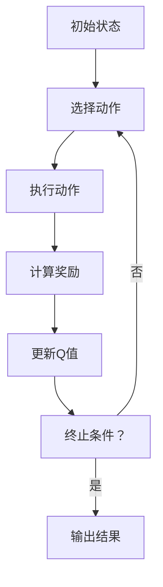
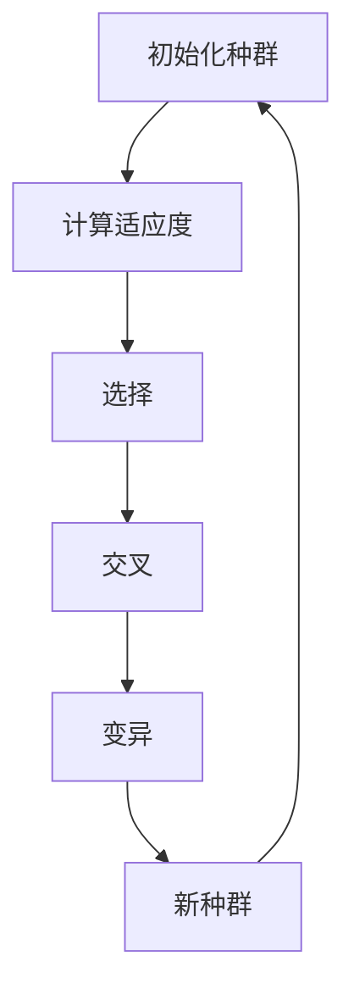
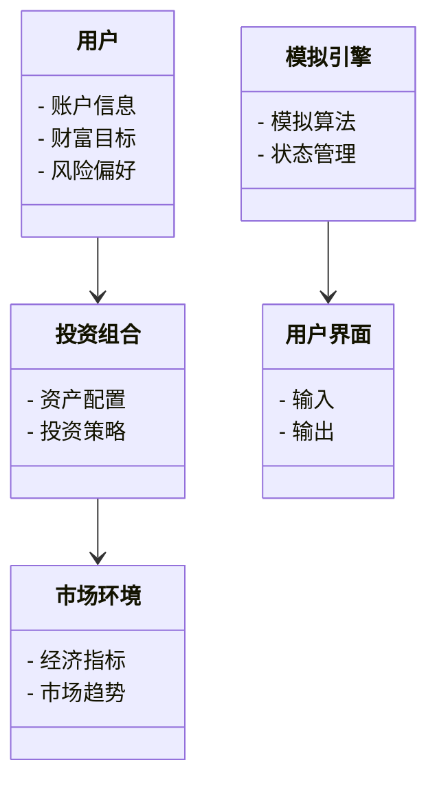
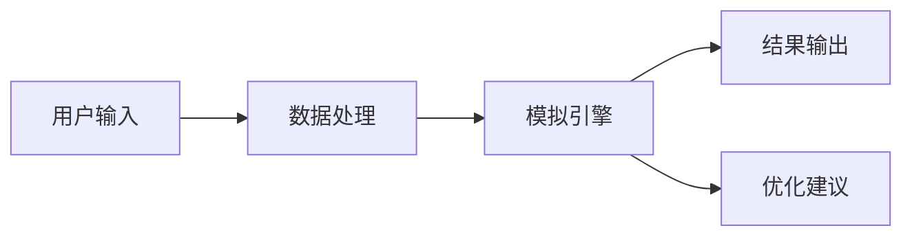

                 


# AI驱动的个人财富积累路径多场景模拟器

> 关键词：AI，财富模拟，强化学习，遗传算法，多场景模拟

> 摘要：本文介绍了一种基于AI的个人财富积累路径多场景模拟器，该模拟器利用强化学习和遗传算法等技术，帮助用户优化财富积累策略。文章详细阐述了模拟器的核心算法、系统架构以及实际应用场景，并通过案例分析展示了其应用价值。

---

## 第一部分: AI驱动的个人财富积累路径多场景模拟器背景介绍

### 第1章: 问题背景与定义

#### 1.1 问题背景
- **传统财富积累的局限性**: 传统财富管理方法依赖人工经验，难以应对复杂多变的市场环境。个人在面对投资、消费等决策时，缺乏系统化、个性化的指导。
- **AI技术在财富管理中的应用潜力**: AI技术能够通过大数据分析和复杂模型，帮助用户优化决策，提升财富积累效率。
- **多场景模拟的必要性**: 个人财富积累涉及多种场景（如投资、消费、风险控制等），需要在不同假设条件下进行模拟，找到最优路径。

#### 1.2 核心概念定义
- **AI驱动的定义**: 利用人工智能技术（如机器学习、强化学习）进行数据处理和决策优化。
- **个人财富积累路径的定义**: 从当前财富状态到目标财富状态的系列决策和行为。
- **多场景模拟器的定义**: 能够在多种假设条件下，模拟个人财富积累过程，并提供优化建议的工具。

#### 1.3 问题解决目标
- **财富积累路径优化的目标**: 在给定约束条件下，最大化财富积累效率。
- **多场景模拟的核心任务**: 在不同假设条件下，模拟财富积累过程，分析结果差异，提供最优策略。
- **AI驱动的实现路径**: 利用强化学习和遗传算法等技术，构建决策模型，优化财富积累路径。

#### 1.4 核心要素与边界
- **核心要素分析**: 财富目标、收入、支出、投资、市场环境。
- **边界条件**: 时间限制、风险承受能力、资金流动性。
- **外延与限制**: 本模拟器适用于个人中长期财富规划，不考虑突发性事件（如自然灾害、金融危机）。

### 第2章: 核心概念与联系

#### 2.1 AI模型与财富模拟的关系
- **AI模型在财富模拟中的作用**: 通过学习历史数据，预测未来市场趋势，优化决策策略。
- **财富模拟器的输入输出关系**: 输入为用户的基本信息和财务目标，输出为最优财富积累路径和优化建议。
- **多场景模拟的核心逻辑**: 在不同假设条件下，模拟财富积累过程，分析结果差异，找到最优策略。

#### 2.2 核心概念属性对比表
| **概念** | **定义** | **应用场景** | **优势** |
|----------|----------|--------------|----------|
| AI模型   | 人工智能算法 | 数据处理与决策优化 | 高效、精准 |
| 财富模拟器 | 模拟财富积累过程的工具 | 个人财富规划 | 个性化、多场景 |
| 多场景模拟 | 在多种假设条件下进行模拟 | 应对不确定性 | 灵活、全面 |

#### 2.3 ER实体关系图
```mermaid
graph LR
A[用户] --> B[财富目标]
C[投资组合] --> B
D[市场环境] --> C
E[模拟结果] <-- C
F[优化建议] <-- E
```

---

## 第二部分: AI驱动的个人财富积累路径模拟器算法原理

### 第3章: 强化学习算法原理

#### 3.1 强化学习基本原理
- **状态、动作、奖励的定义**:
  - 状态（State）: 当前的财富状态（如资产、负债）。
  - 动作（Action）: 用户的决策（如投资、消费）。
  - 奖励（Reward）: 财富变化带来的收益或损失。
- **Q-learning算法**: 通过状态-动作价值函数（Q-value）学习最优策略。
  $$ Q(s, a) = r + \gamma \max Q(s', a') $$
- **策略梯度方法**: 通过优化策略参数，最大化期望奖励。

#### 3.2 财富积累场景中的应用
- **状态空间建模**: 将用户的财富状态、市场环境等信息转化为状态空间。
- **动作空间设计**: 定义可能的决策动作（如投资股票、债券、消费等）。
- **奖励函数设计**: 根据财富积累效果设计奖励函数，鼓励有益决策。

#### 3.3 算法流程图


---

### 第4章: 遗传算法原理

#### 4.1 遗传算法基本原理
- **种群表示**: 将财富积累路径表示为一组基因（决策序列）。
- **适应度函数**: 根据财富积累效果计算适应度。
- **遗传操作**: 选择、交叉、变异。

#### 4.2 财富模拟中的应用
- **初始种群生成**: 随机生成一组财富积累路径。
- **适应度计算**: 根据财富目标和市场环境计算适应度。
- **遗传优化**: 通过迭代优化种群，找到最优路径。

#### 4.3 算法流程图


---

## 第三部分: 系统分析与架构设计

### 第5章: 系统架构设计

#### 5.1 领域模型（类图）


#### 5.2 系统架构图


---

## 第四部分: 项目实战

### 第6章: 项目实战

#### 6.1 环境安装
- **Python 3.8+**
- **安装依赖**: `pip install numpy, pandas, gym, matplotlib`

#### 6.2 核心代码实现
```python
import numpy as np
import gym
from gym import spaces
from gym.utils import seeding

class WealthSimulationEnv(gym.Env):
    def __init__(self):
        super(WealthSimulationEnv, self).__init__()
        self.action_space = spaces.Discrete(3)  # 0: 投资股票，1: 投资债券，2: 消费
        self.observation_space = spaces.Box(low=0, high=np.inf, shape=(2,))  # 当前财富，市场环境

    def reset(self):
        self.wealth = 100000  # 初始财富
        self.market_env = 1  # 市场环境指数
        return np.array([self.wealth, self.market_env])

    def step(self, action):
        # 根据动作更新状态
        if action == 0:
            self.wealth *= 1.1  # 股票投资回报10%
        elif action == 1:
            self.wealth *= 1.05  # 债券投资回报5%
        elif action == 2:
            self.wealth -= 1000  # 消费支出1000
        # 返回新的状态、奖励、是否终止
        return np.array([self.wealth, self.market_env]), self.wealth, False, {}
```

#### 6.3 代码解读与分析
- **环境定义**: 自定义Gym环境，定义状态空间和动作空间。
- **状态更新**: 根据用户决策（投资、消费）更新财富状态。
- **奖励机制**: 根据财富变化计算奖励。

#### 6.4 实际案例分析
- **案例1**: 用户初始财富10万元，风险偏好中等。
  - **模拟结果**: 投资债券和适度消费，最终财富增长8%。
  - **优化建议**: 建议增加股票投资比例。

---

## 第五部分: 最佳实践与总结

### 第7章: 最佳实践

#### 7.1 小结
- 本文介绍了一种基于AI的个人财富积累路径多场景模拟器，结合强化学习和遗传算法，帮助用户优化财富积累策略。

#### 7.2 注意事项
- **数据质量**: 输入数据需准确反映用户真实情况。
- **模型选择**: 根据具体需求选择合适的算法。
- **风险控制**: 模拟结果仅供参考，实际操作需谨慎。

#### 7.3 拓展阅读
- **推荐书籍**: 《算法导论》、《强化学习》。
- **相关工具**: Gym、TensorFlow、PyTorch。

---

通过本文的详细讲解，读者可以系统地理解AI驱动的个人财富积累路径多场景模拟器的核心原理和实际应用。

