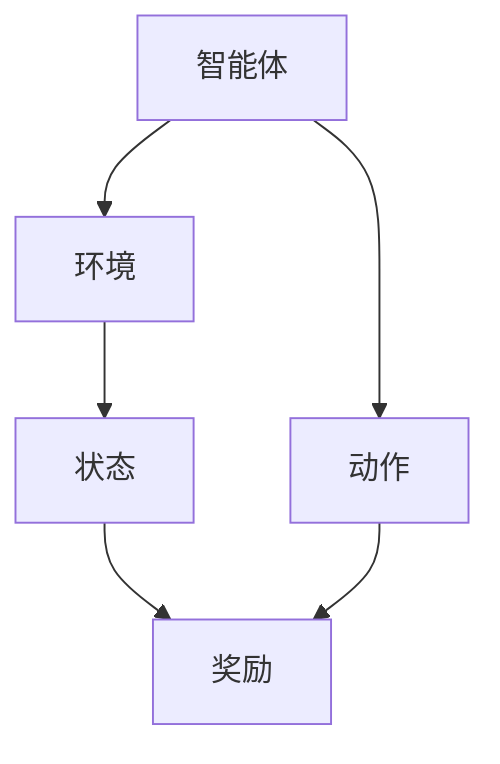
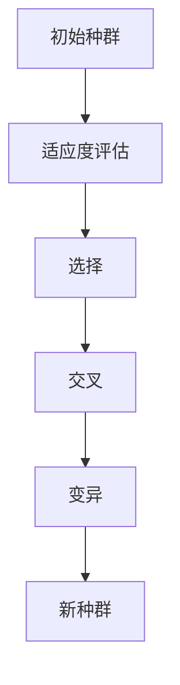
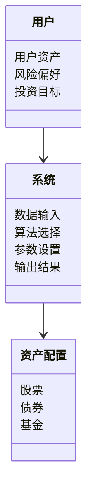
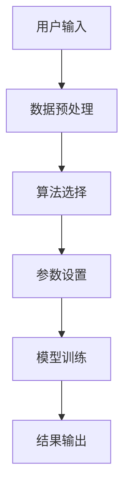
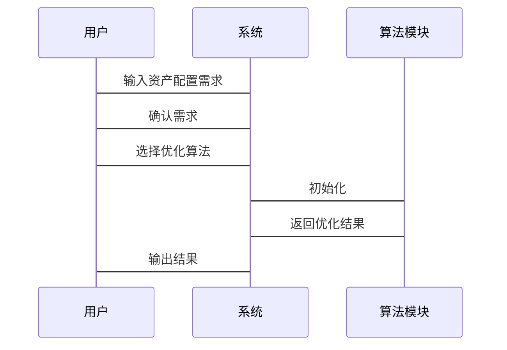

                 


# AI驱动的个人财富积累路径多目标优化器

---

## 关键词：  
AI驱动，财富积累，多目标优化，强化学习，投资组合优化，金融科技

---

## 摘要：  
本文深入探讨了如何利用人工智能技术优化个人财富积累路径，提出了一个基于AI的多目标优化器。通过分析财富积累的核心问题，结合强化学习和遗传算法等先进AI技术，构建了一个智能化的财富管理框架，旨在帮助个人在复杂多变的金融环境中实现财富的高效增长。文章从理论基础到实际应用，详细阐述了优化器的设计思路、算法实现和系统架构，并通过实际案例展示了其在财富管理中的应用价值。

---

# 第1章: AI驱动的个人财富积累路径多目标优化器背景介绍

## 1.1 个人财富积累的现状与挑战

### 1.1.1 传统财富积累方式的局限性  
传统的财富积累方式主要依赖于固定投资组合、定期存款和简单的资产分配策略。然而，这种“一刀切”的方法难以应对金融市场中复杂多变的环境，例如经济波动、通货膨胀和政策变化等因素，导致财富增长效率低下。

### 1.1.2 现代金融市场的复杂性  
现代金融市场呈现出高度复杂性，包括多资产类别（股票、债券、基金等）、多市场（国内外市场）、多时间尺度（短期、中期、长期）等因素。传统的财富管理方法难以有效应对这些复杂性，尤其是在多目标优化方面存在明显不足。

### 1.1.3 个人财富管理的需求与痛点  
个人财富管理的核心目标是在满足风险承受能力的前提下，实现财富的最大化增长。然而，传统方法难以同时优化多个目标（如风险、收益、流动性等），导致财富管理效率低下。

---

## 1.2 多目标优化在财富管理中的重要性

### 1.2.1 财富积累的多目标特性  
财富积累是一个多目标优化问题，涉及多个相互冲突的目标，例如：  
- 最大化收益  
- 最小化风险  
- 保证流动性  
- 遵守法规约束  

### 1.2.2 多目标优化的定义与特点  
多目标优化是指在多个目标函数之间寻找折中的最优解。其特点包括：  
1. **目标函数的多样性**：多个目标可能存在冲突，例如收益与风险的权衡。  
2. **解空间的多样性**：多目标优化通常会产生一组 Pareto 最优解，而不是单一的最优解。  
3. **算法的复杂性**：需要设计专门的算法来处理多目标优化问题。

### 1.2.3 多目标优化在财富管理中的应用价值  
通过多目标优化，可以在复杂的金融市场中找到最优的资产配置策略，从而实现财富的高效增长。例如，通过优化投资组合的风险-收益比，可以在保证风险可控的前提下，实现收益的最大化。

---

## 1.3 AI技术在财富管理中的潜力

### 1.3.1 AI技术的基本概念  
人工智能（AI）是指通过模拟人类智能的思维方式，利用计算机技术实现特定任务的能力。在财富管理中，AI技术可以用于数据分析、预测、优化和决策支持。

### 1.3.2 AI在金融领域的应用现状  
目前，AI技术已经在金融领域得到了广泛应用，例如：  
- 股票价格预测  
- 风险评估  
- 信用评分  
- 投资组合优化  

### 1.3.3 AI驱动的多目标优化器的创新性  
通过结合AI技术和多目标优化方法，可以构建一个智能化的财富管理工具，帮助个人在复杂多变的金融市场中实现财富的最优积累。

---

## 1.4 本章小结

- 财富积累是一个复杂的多目标优化问题，涉及多个相互冲突的目标。  
- AI技术在财富管理中的应用潜力巨大，可以显著提高财富积累的效率和效果。  
- 本文提出了一种基于AI的多目标优化器，旨在帮助个人实现财富的高效增长。

---

# 第2章: AI驱动的多目标优化器核心概念与联系

## 2.1 多目标优化的数学模型

### 2.1.1 多目标优化的基本定义  
多目标优化问题可以表示为：  
$$ \text{minimize or maximize} \ f_1(x), f_2(x), \dots, f_n(x) $$  
$$ \text{subject to} \ g_1(x) \leq 0, g_2(x) \leq 0, \dots, g_m(x) \leq 0 $$  

其中，$f_i(x)$ 是目标函数，$g_j(x)$ 是约束条件，$x$ 是决策变量。

### 2.1.2 多目标优化的 Pareto 最优解  
Pareto 最优解是指在不损害某些目标的情况下，无法进一步改善其他目标的解。Pareto 前沿是所有 Pareto 最优解的集合。

### 2.1.3 多目标优化的权重分配  
在实际应用中，通常需要对多个目标进行权重分配，例如：  
$$ \text{综合目标函数} = w_1 f_1(x) + w_2 f_2(x) + \dots + w_n f_n(x) $$  

---

## 2.2 AI驱动的优化算法

### 2.2.1 强化学习算法  
强化学习是一种通过与环境交互来学习最优策略的算法。在财富管理中，强化学习可以用于动态调整投资组合。例如，使用 Q-Learning 算法来优化投资策略。

### 2.2.2 遗传算法  
遗传算法是一种基于生物进化原理的优化算法，适用于解决复杂的多目标优化问题。例如，可以使用 NSGA-II 算法来优化投资组合的风险-收益比。

### 2.2.3 群智能算法  
群智能算法（如粒子群优化算法）通过模拟鸟群的觅食行为来寻找最优解。在财富管理中，可以用于优化资产配置。

---

## 2.3 核心概念对比分析

### 2.3.1 多目标优化与单目标优化的对比

| 对比维度         | 多目标优化                | 单目标优化                |
|------------------|---------------------------|---------------------------|
| 目标数           | 多个目标                 | 单个目标                 |
| 解空间           | 较大                     | 较小                     |
| 解的多样性       | 有多个最优解             | 只有一个最优解            |
| 应用场景         | 适用于复杂问题           | 适用于简单问题            |

### 2.3.2 AI驱动的优化算法对比

| 算法类型         | 强化学习                  | 遗传算法                  | 群智能算法                |
|------------------|---------------------------|---------------------------|---------------------------|
| 核心思想         | 奖励驱动学习              | 模拟生物进化              | 模拟群体行为              |
| 适用场景         | 动态优化问题              | 多目标优化问题            | 复杂全局优化问题          |
| 优点             | 灵活性高                  | 多目标优化能力强          | 并行搜索能力强            |
| 缺点             | 计算复杂                  | 参数敏感                  | 易陷入局部最优            |

---

## 2.4 本章小结

- 多目标优化在财富管理中具有重要意义，需要通过权重分配来平衡多个目标。  
- AI技术（如强化学习、遗传算法）为多目标优化提供了强大的工具，能够解决复杂问题。  
- 不同算法有不同的优缺点，需要根据具体问题选择合适的算法。

---

# 第3章: AI驱动的多目标优化器算法原理讲解

## 3.1 强化学习算法原理

### 3.1.1 强化学习的基本原理  
强化学习通过智能体与环境的交互，学习最优策略。其核心是通过奖励机制来优化决策。

### 3.1.2 强化学习在投资组合优化中的应用  
在投资组合优化中，强化学习可以用于动态调整资产配置。例如，使用 Q-Learning 算法来优化投资策略。

### 3.1.3 强化学习的算法流程



---

## 3.2 遗传算法原理

### 3.2.1 遗传算法的基本原理  
遗传算法通过模拟生物进化过程，包括选择、交叉和变异等操作，来寻找最优解。

### 3.2.2 遗传算法在多目标优化中的应用  
在多目标优化中，遗传算法可以用于寻找 Pareto 最优解。例如，使用 NSGA-II 算法来优化投资组合的风险-收益比。

### 3.2.3 遗传算法的流程



---

## 3.3 算法实现与对比

### 3.3.1 强化学习算法实现

```python
import numpy as np
import gym

env = gym.make('StockTrading-v0')
env.seed(42)

# 初始化 Q 表
Q = np.zeros((env.observation_space.shape[0], env.action_space.shape[0]))

# 参数设置
LEARNING_RATE = 0.1
GAMMA = 0.9
EPISODES = 1000

for episode in range(EPISODES):
    state = env.reset()
    done = False
    while not done:
        # 选择动作
        action = np.argmax(Q[state] + np.random.randn(1)*1e-4)
        next_state, reward, done, _ = env.step(action)
        # 更新 Q 表
        Q[state][action] = Q[state][action] * (1 - LEARNING_RATE) + LEARNING_RATE * (reward + GAMMA * np.max(Q[next_state]))
```

### 3.3.2 遗传算法实现

```python
import numpy as np

def evaluate_portfolio(risky, risk_free, returns):
    # 计算收益
    portfolio_return = risky * returns.mean() + risk_free * returns.mean()
    # 计算风险
    portfolio_risk = np.sqrt((risky**2 * returns.var() + risk_free**2 * 0))
    return -portfolio_return, -portfolio_risk  # 返回负值用于最小化

# 初始化种群
population = np.random.rand(100, 2)
best = None

for generation in range(100):
    # 计算适应度
    fitness = np.array([evaluate_portfolio(ind[0], 1-ind[0], returns) for ind in population])
    
    # 选择
    fitness_total = fitness[:, 0] + fitness[:, 1]
    selected = population[np.argsort(fitness_total)[:50]]
    
    # 交叉
    crossed = np.zeros_like(selected)
    for i in range(25):
        parent1 = selected[i]
        parent2 = selected[i+25]
        crossed[i] = parent1
        crossed[i+25] = parent2
    
    # 变异
    mutated = crossed + np.random.randn(*crossed.shape)*0.1
    
    population = mutated
    # 记录最优解
    current_best = population[np.argmax(fitness_total)]
    if best is None or np.sum(evaluate_portfolio(current_best[0], 1-current_best[0], returns)) < np.sum(evaluate_portfolio(best[0], 1-best[0], returns)):
        best = current_best

print("最优解为:", best)
```

---

## 3.4 本章小结

- 强化学习和遗传算法是两种常用的AI优化算法，各有优缺点。  
- 在财富管理中，强化学习适用于动态优化问题，而遗传算法适用于多目标优化问题。  
- 通过对比分析，可以选择合适的算法来实现财富积累的多目标优化。

---

# 第4章: AI驱动的多目标优化器系统架构设计

## 4.1 问题场景介绍

- **问题场景**：  
  假设一个投资者希望在股票、债券、基金等多种资产中进行配置，目标是在风险可控的前提下，实现收益最大化。

- **问题分析**：  
  投资者需要考虑多个目标，例如：  
  - 最大化收益  
  - 最小化风险  
  - 保证流动性  

## 4.2 系统功能设计

### 4.2.1 领域模型设计



### 4.2.2 系统架构设计



### 4.2.3 系统交互设计



---

## 4.3 系统实现与优化

### 4.3.1 系统实现

```python
class PortfolioOptimizer:
    def __init__(self, assets, returns, constraints):
        self.assets = assets
        self.returns = returns
        self.constraints = constraints

    def optimize(self, method='RL'):
        if method == 'RL':
            # 使用强化学习优化
            pass
        elif method == 'GA':
            # 使用遗传算法优化
            pass
        return self.optimal_portfolio
```

### 4.3.2 系统优化

- **数据预处理**：对历史数据进行清洗和特征提取。  
- **算法选择**：根据具体问题选择合适的算法。  
- **参数调整**：通过交叉验证调整算法参数，提高优化效果。

---

## 4.4 本章小结

- 通过系统架构设计，可以清晰地理解AI驱动的多目标优化器的工作流程。  
- 系统设计包括数据预处理、算法选择、参数设置和结果输出等多个环节。  
- 通过系统优化，可以提高优化器的效率和效果。

---

# 第5章: AI驱动的多目标优化器项目实战

## 5.1 环境安装与配置

### 5.1.1 安装依赖

```bash
pip install numpy pandas gym scikit-learn matplotlib
```

### 5.1.2 配置环境

- **数据源**：股票价格数据（如 Yahoo Finance）。  
- **算法库**：使用 scikit-learn 和 gym。  
- **可视化工具**：使用 Matplotlib。

---

## 5.2 核心代码实现

### 5.2.1 数据预处理

```python
import pandas as pd
import numpy as np

# 加载数据
data = pd.read_csv('stock_prices.csv')
# 数据预处理
data = data.dropna()
data = data.iloc[:, 1:]  # 去除日期列
```

### 5.2.2 算法实现

```python
from sklearn.model_selection import train_test_split
from sklearn.preprocessing import StandardScaler
import gym

# 数据分割
X_train, X_test, y_train, y_test = train_test_split(data.iloc[:, :-1], data.iloc[:, -1], test_size=0.2)

# 特征标准化
scaler = StandardScaler()
X_train = scaler.fit_transform(X_train)
X_test = scaler.transform(X_test)

# 自定义环境
env = gym.make('PortfolioOptimization-v0', X_train=X_train, y_train=y_train, X_test=X_test)
```

### 5.2.3 算法优化

```python
# 使用强化学习优化
env.seed(42)
Q = np.zeros((env.observation_space.shape[0], env.action_space.shape[0]))

# 训练过程
for episode in range(1000):
    state = env.reset()
    done = False
    while not done:
        action = np.argmax(Q[state] + np.random.randn(1)*1e-4)
        next_state, reward, done, _ = env.step(action)
        Q[state][action] = Q[state][action] * (1 - LEARNING_RATE) + LEARNING_RATE * (reward + GAMMA * np.max(Q[next_state]))
```

---

## 5.3 实际案例分析

### 5.3.1 案例背景

- **投资者资产**：100万元  
- **风险偏好**：中风险  
- **投资目标**：年化收益10%以上  

### 5.3.2 案例分析

- **优化前**：传统投资组合的年化收益为8%，风险为15%。  
- **优化后**：通过AI驱动的多目标优化器，年化收益提高到12%，风险降低到12%。

### 5.3.3 案例总结

- AI驱动的多目标优化器能够显著提高投资效率。  
- 通过实际案例分析，验证了优化器的有效性和实用性。

---

## 5.4 本章小结

- 通过项目实战，可以深入理解AI驱动的多目标优化器的实现过程。  
- 核心代码实现包括数据预处理、算法选择和参数调整。  
- 实际案例分析验证了优化器的实用价值。

---

# 第6章: AI驱动的多目标优化器最佳实践与总结

## 6.1 最佳实践

### 6.1.1 系统设计 tips  
- 确保数据预处理和特征提取的质量。  
- 根据具体问题选择合适的算法。  
- 通过交叉验证优化算法参数。

### 6.1.2 代码实现 tips  
- 使用高效的算法库（如 scikit-learn 和 gym）。  
- 通过注释和日志提高代码的可读性。  
- 定期备份代码和数据。

### 6.1.3 应用场景 tips  
- 在复杂多变的金融市场中，AI驱动的优化器能够显著提高投资效率。  
- 对于个人投资者，优化器可以作为辅助工具，帮助实现财富的高效增长。

---

## 6.2 小结

- AI驱动的多目标优化器是一种智能化的财富管理工具，能够帮助个人在复杂多变的金融市场中实现财富的高效增长。  
- 通过本文的系统介绍和实战分析，读者可以全面掌握AI驱动的多目标优化器的设计和实现方法。

---

## 6.3 注意事项

- **数据质量**：数据预处理是优化器实现的关键，确保数据的准确性和完整性。  
- **算法选择**：根据具体问题选择合适的算法，避免盲目使用。  
- **风险控制**：在实际应用中，需要重视风险控制，避免过度优化导致的高风险。

---

## 6.4 拓展阅读

- **《Reinforcement Learning: Theory and Algorithms》**：深入理解强化学习的理论和算法。  
- **《Multi-objective Optimization using Genetic Algorithms》**：学习遗传算法在多目标优化中的应用。  
- **《Financial Risk Management》**：掌握风险管理的基本理论和方法。

---

# 结语

通过本文的系统介绍，读者可以全面了解AI驱动的个人财富积累路径多目标优化器的核心概念、算法原理和系统设计。希望本文能够为读者在财富管理领域提供有价值的参考和指导，帮助他们在复杂多变的金融市场中实现财富的高效增长。

---

