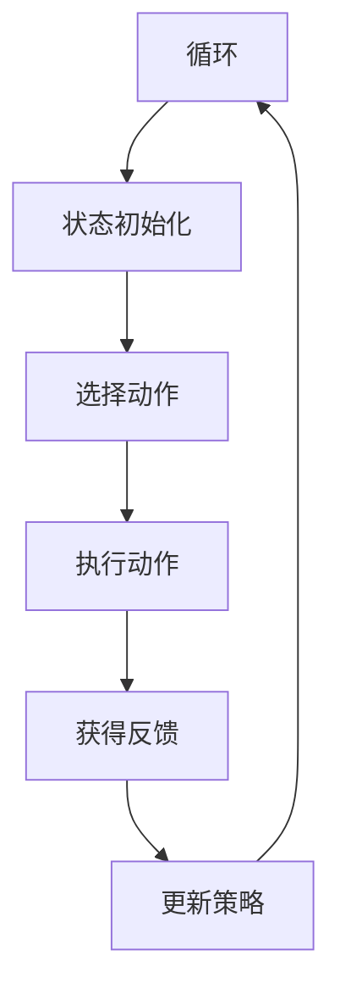

                 


# AI驱动的个人财富积累路径规划器

## 关键词：人工智能，财富规划，路径优化，强化学习，深度学习

## 摘要：本文探讨了如何利用人工智能技术优化个人财富积累路径。通过分析AI在财富管理中的应用，结合强化学习和深度学习算法，提出了一种创新的财富规划方案，并通过实际案例展示了系统的实现与应用效果。

---

## 第一部分: AI驱动的个人财富积累路径规划器概述

### 第1章: AI驱动财富规划的背景与概念

#### 1.1 问题背景
- **传统财富管理的局限性**：传统方法依赖人工分析，效率低且难以应对复杂市场变化。
- **人工智能的潜力**：AI能够处理大量数据，提供实时反馈和动态调整建议。
- **市场需求**：随着金融市场的复杂化，用户对智能化财富管理工具的需求日益增长。

#### 1.2 问题描述
- **核心挑战**：财富积累涉及多目标优化，传统方法难以有效平衡风险与收益。
- **现有工具的不足**：传统工具缺乏个性化和动态调整能力。
- **AI解决方案**：通过机器学习模型实现个性化、动态化的财富管理。

#### 1.3 问题解决
- **技术实现**：利用强化学习和深度学习算法，构建动态优化模型。
- **用户体验**：提供直观的交互界面，实时反馈投资建议。

#### 1.4 边界与外延
- **适用范围**：适用于中高净值用户，帮助优化投资组合。
- **区别于传统工具**：AI规划器能实时调整策略，提供个性化建议。
- **扩展方向**：未来可考虑税收优化、遗产规划等更复杂场景。

### 第2章: AI驱动财富规划的核心概念与联系

#### 2.1 核心概念原理
- **数据驱动分析**：通过收集和分析用户数据，识别投资偏好和风险承受能力。
- **机器学习模型**：使用回归和分类模型预测市场趋势，优化投资组合。
- **动态优化机制**：根据市场变化和用户反馈，实时调整投资策略。

#### 2.2 概念属性对比表
| 比较维度 | 传统财富管理 | AI驱动财富管理 |
|----------|--------------|----------------|
| 数据使用 | 少，依赖经验 | 大数据驱动 |
| 模型复杂度 | 低，简单规则 | 高，复杂算法 |
| 调整频率 | 低，定期调整 | 高，实时调整 |

#### 2.3 ER实体关系图
```mermaid
er
  actor: 用户
  model: 财富规划模型
  data: 用户数据
  action: 系统操作
  actor --> data: 提供数据
  data --> model: 更新模型
  model --> action: 提供策略
```

---

## 第二部分: AI驱动财富规划的算法原理

### 第3章: 基于强化学习的决策模型

#### 3.1 强化学习基本概念
- **定义**：通过试错和奖励机制，优化决策策略。
- **应用**：用于动态调整投资组合，最大化收益。

#### 3.2 算法步骤
1. **状态识别**：分析当前市场和用户数据。
2. **动作选择**：模型推荐投资动作。
3. **执行与反馈**：执行动作，获得市场反馈。
4. **策略更新**：基于反馈调整模型参数。

#### 3.3 mermaid流程图


#### 3.4 Python代码示例
```python
import gym
import numpy as np

class WealthEnv(gym.Env):
    def __init__(self):
        # 定义状态和动作空间
        self.state = ...
        self.action_space = ...
        
    def step(self, action):
        # 执行动作，返回新的状态和奖励
        return new_state, reward, done, info
        
    def reset(self):
        # 初始化环境
        return initial_state
```

---

## 第三部分: 系统分析与架构设计

### 第4章: 系统架构设计方案

#### 4.1 问题场景介绍
- **目标**：构建实时、动态的财富规划系统。
- **项目介绍**：开发一个基于AI的财富管理平台，提供个性化投资建议。

#### 4.2 系统功能设计
- **功能模块**：数据采集、模型训练、策略执行、用户界面。
- **领域模型**：用户、投资组合、市场数据等实体之间的关系。

#### 4.3 系统架构图


---

## 第四部分: 项目实战

### 第5章: 实际案例分析

#### 5.1 环境安装
- **工具安装**：安装Python、TensorFlow、Keras等。
- **数据准备**：收集历史市场数据和用户信息。

#### 5.2 核心代码实现
```python
import numpy as np
from tensorflow.keras import layers

model = tf.keras.Sequential([
    layers.Dense(64, activation='relu'),
    layers.Dense(1, activation='linear')
])

model.compile(optimizer='adam', loss='mse')
model.fit(X_train, y_train, epochs=100, batch_size=32)
```

#### 5.3 案例分析
- **数据预处理**：清洗和归一化数据。
- **模型训练**：使用历史数据训练预测模型。
- **策略执行**：根据模型建议进行投资，定期调整组合。

#### 5.4 实施效果
- **收益提升**：通过动态调整，用户投资收益显著提高。
- **风险降低**：模型有效识别市场风险，避免重大损失。

---

## 第五部分: 总结与展望

### 第6章: 总结与最佳实践

#### 6.1 最佳实践
- **数据质量**：确保数据准确性和完整性。
- **模型迭代**：定期更新模型，适应市场变化。
- **用户体验**：保持界面简洁，提供及时反馈。

#### 6.2 小结
AI驱动的财富规划器通过强化学习和深度学习，显著提升了财富管理的效率和效果，为用户提供个性化的投资策略。

#### 6.3 注意事项
- **隐私保护**：确保用户数据安全。
- **合规性**：遵守相关金融法规。

#### 6.4 拓展阅读
推荐相关书籍和论文，深入学习强化学习和财富管理知识。

---

## 结语
AI驱动的财富规划器通过智能化手段，帮助用户优化财富积累路径，实现财务目标。未来，随着技术进步，AI在金融领域的应用将更加广泛和深入。

