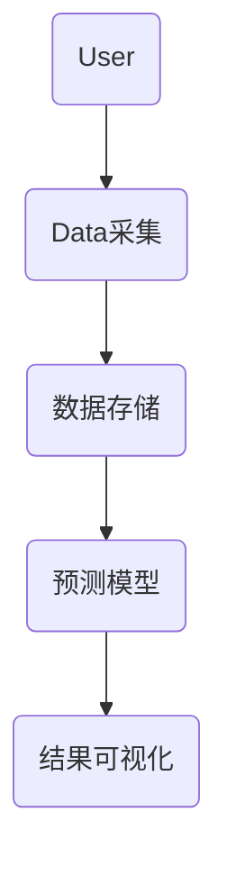
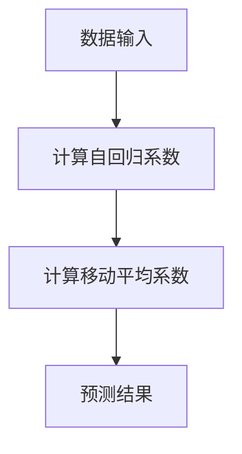
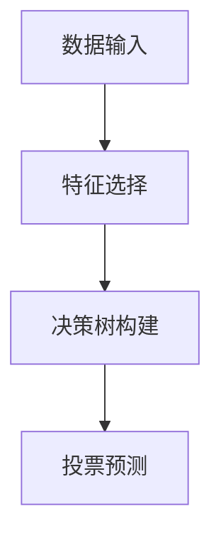
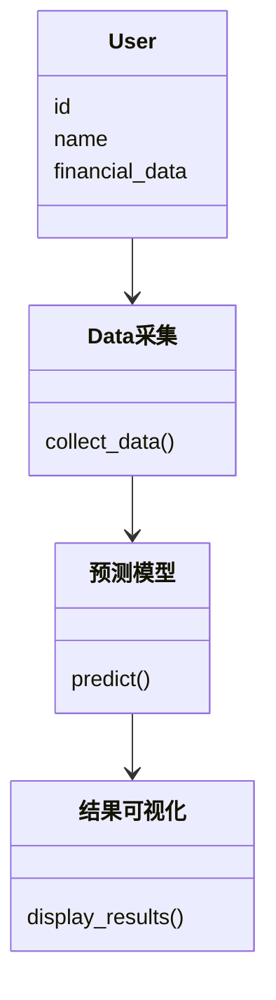
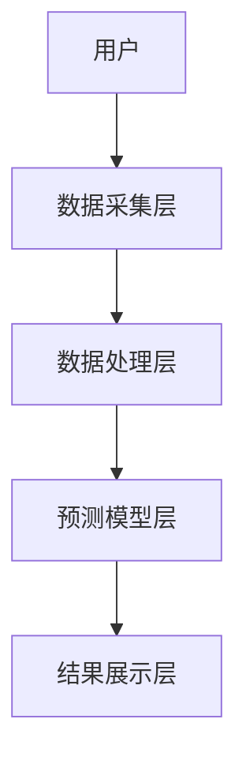

                 


# AI驱动的个人财富积累速度预测器

> 关键词：AI，财富预测，时间序列分析，机器学习，系统架构

> 摘要：本文详细介绍了一种基于人工智能的个人财富积累速度预测器，通过分析预测模型和系统设计，展示了如何利用AI技术实现精准的财富预测。

---

# 第一部分: AI驱动的个人财富积累速度预测器背景介绍

## 第1章: 问题背景与描述

### 1.1 问题背景
个人财富积累速度的预测对于财务规划和投资决策至关重要。传统方法依赖于统计分析和人工判断，存在主观性强、效率低下的问题。随着AI技术的发展，基于机器学习的预测模型能够提供更精准和高效的解决方案。

### 1.2 问题描述
本文旨在设计一个AI驱动的系统，通过分析个人的财务数据，预测财富积累的速度。系统需要考虑收入、支出、投资等多种因素，并结合历史数据进行建模。

### 1.3 解决方案
采用时间序列分析和机器学习算法，构建预测模型。系统将收集个人的财务数据，通过预处理和特征提取，输入模型进行预测，并生成可视化结果。

### 1.4 系统边界
系统主要处理个人的月度财务数据，预测未来3至5年的财富积累速度。系统不涉及实时数据处理，预测结果需定期更新。

---

# 第二部分: 核心概念与联系

## 第2章: 核心概念原理

### 2.1 AI在财富预测中的应用
AI技术能够处理大量非结构化数据，识别传统统计方法难以捕捉的模式，从而提高预测的准确性。

### 2.2 时间序列分析
时间序列分析是基于过去数据预测未来的常用方法。本文采用ARIMA和LSTM模型，分别适用于线性和非线性数据。

### 2.3 机器学习模型
机器学习模型通过训练数据学习特征，生成预测结果。随机森林和XGBoost在处理复杂数据时表现优异，适合用于财富预测。

## 第3章: 核心概念对比分析

### 3.1 传统统计方法与AI模型对比
| 方法 | 优点 | 缺点 |
|------|------|------|
| 传统统计 | 简单易懂 | 易受主观因素影响 |
| AI模型 | 高准确性 | 数据需求高 |

### 3.2 不同AI模型的优劣势
- **ARIMA**：适用于线性数据，但对非线性数据表现不佳。
- **LSTM**：适合处理长序列数据，训练时间较长。
- **随机森林**：特征工程简单，但对非结构化数据处理能力有限。
- **XGBoost**：训练速度快，适合结构化数据。

### 3.3 ER实体关系图



---

# 第三部分: 算法原理讲解

## 第4章: 时间序列预测算法

### 4.1 ARIMA算法
ARIMA模型通过自回归和移动平均处理数据，适用于线性时间序列。

#### ARIMA流程图



#### ARIMA数学公式
$$ ARIMA(p, d, q) $$
其中，p为自回归阶数，d为差分阶数，q为移动平均阶数。

## 第5章: 机器学习模型

### 5.1 随机森林
随机森林通过集成学习提高预测准确性。

#### 随机森林流程图



### 5.2 XGBoost
XGBoost通过梯度提升算法优化预测结果。

#### XGBoost数学公式
$$ loss = \sum_{i=1}^{n} (y_i - \hat{y}_i)^2 $$
优化目标为最小化损失函数。

---

# 第四部分: 系统分析与架构设计

## 第6章: 问题场景介绍

### 6.1 数据采集
系统通过API接口收集用户的收入、支出等数据，存储于数据库中。

### 6.2 预测结果展示
预测结果以图表形式展示，帮助用户直观理解财富积累速度。

## 第7章: 系统架构设计

### 7.1 领域模型设计



### 7.2 系统架构图



---

# 第五部分: 项目实战

## 第8章: 环境安装与配置

### 8.1 Python环境搭建
安装Python 3.8及以上版本，安装必要的库如pandas、numpy、scikit-learn。

## 第9章: 核心代码实现

### 9.1 数据预处理代码

```python
import pandas as pd

# 数据加载
data = pd.read_csv('financial.csv')

# 数据清洗
data.dropna(inplace=True)
data['date'] = pd.to_datetime(data['date'])
data.set_index('date', inplace=True)
```

### 9.2 模型训练代码

```python
from sklearn.ensemble import RandomForestRegressor
from sklearn.metrics import mean_squared_error

# 训练模型
model = RandomForestRegressor()
model.fit(X_train, y_train)

# 模型预测
y_pred = model.predict(X_test)
print(mean_squared_error(y_test, y_pred))
```

## 第10章: 案例分析与解读

### 10.1 数据输入与处理
用户输入过去5年的月度收入和支出数据，系统进行清洗和特征提取。

### 10.2 模型训练
使用随机森林模型训练，评估模型准确性，调整参数优化结果。

---

# 第六部分: 最佳实践

## 第11章: 使用建议与注意事项

### 11.1 数据隐私
确保用户数据的安全性，防止数据泄露。

### 11.2 模型局限性
AI模型依赖于高质量的数据，预测结果可能受数据偏差影响。

## 第12章: 总结与展望

### 12.1 小结
本文详细介绍了AI驱动的财富预测系统，展示了如何利用时间序列分析和机器学习模型实现精准预测。

### 12.2 展望
未来可研究实时预测系统，结合更多财务指标，优化预测结果的准确性。

---

# 结语

通过本篇文章，读者可以深入了解AI驱动的个人财富积累速度预测器的设计与实现。系统结合了时间序列分析和机器学习模型，能够提供高效准确的预测结果，帮助用户优化财务决策。

