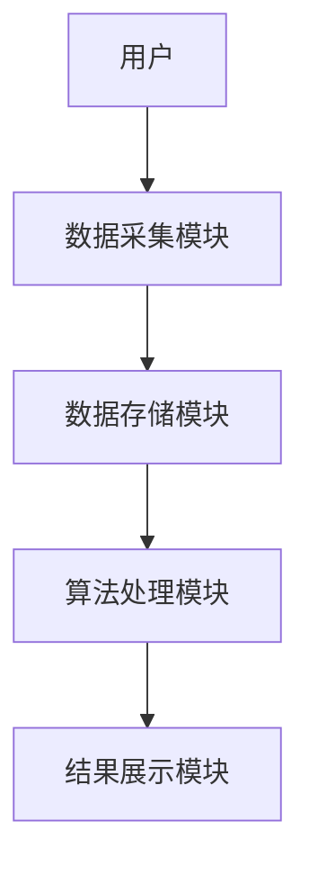
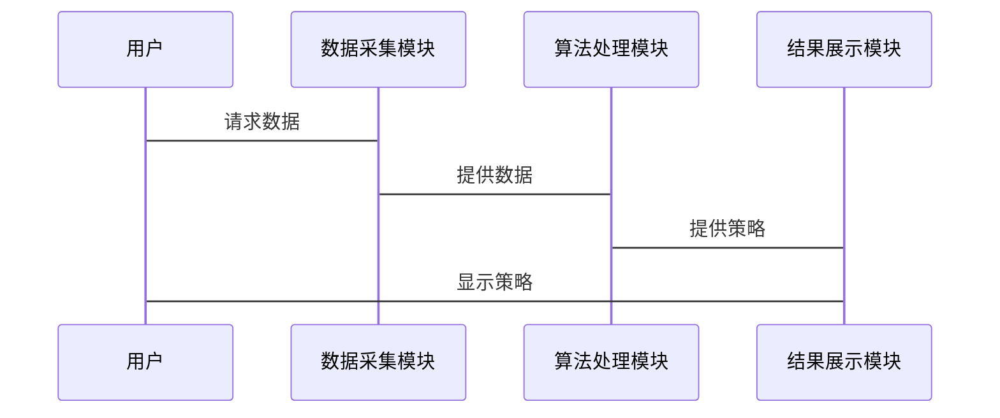

                 


# AI驱动的个人财富管理策略生成器

## 关键词：人工智能，财富管理，策略生成器，算法，系统架构

## 摘要：本文探讨如何利用人工智能技术生成个人财富管理策略，涵盖背景、核心概念、算法原理、系统设计及实战案例，旨在为读者提供全面的技术指导。

---

# 第一部分: AI驱动的个人财富管理策略生成器背景介绍

## 第1章: AI驱动的个人财富管理概述

### 1.1 个人财富管理的基本概念

#### 1.1.1 个人财富管理的定义

个人财富管理（Personal Wealth Management）是指帮助个人或家庭有效管理和增长其财务资源的过程，包括投资、储蓄、风险管理等。传统方法依赖人工分析，效率低下且难以应对复杂市场变化。

#### 1.1.2 个人财富管理的核心要素

- 资产配置：确定不同资产（股票、债券、房地产等）的投资比例。
- 风险管理：评估和控制潜在的财务风险。
- 投资策略：制定长期或短期的投资计划。
- 税务规划：优化税务负担，提高净收益。

#### 1.1.3 个人财富管理的常见模式

- 主动管理：由专业顾问提供定制化建议。
- 被动管理：遵循固定规则，如指数投资。
- 综合管理：结合主动和被动策略。

### 1.2 AI技术在财富管理中的应用

#### 1.2.1 AI技术的基本概念

人工智能（AI）通过机器学习、自然语言处理等技术，模拟人类学习和决策过程。在财富管理中，AI用于数据分析、预测市场趋势和优化投资组合。

#### 1.2.2 AI在财富管理中的优势

- **高效性**：AI能够快速处理大量数据，提供实时建议。
- **准确性**：通过复杂算法，AI能够发现人类难以察觉的市场模式。
- **个性化**：AI可以根据个人需求定制策略，提供精准建议。

#### 1.2.3 AI驱动的财富管理策略生成器的必要性

随着金融市场复杂化，传统方法难以满足需求。AI策略生成器通过自动化分析，帮助用户制定高效、个性化的财富管理方案。

### 1.3 本章小结

本章介绍了个人财富管理的基本概念和AI技术的应用优势，为后续内容奠定了基础。

---

# 第二部分: AI驱动的个人财富管理策略生成器核心概念

## 第2章: AI驱动的个人财富管理核心概念

### 2.1 AI与财富管理的结合

#### 2.1.1 AI在财富管理中的应用场景

- 风险评估：AI分析市场数据，预测投资风险。
- 资产配置：AI根据市场变化调整投资比例。
- 理财规划：AI为用户提供定制化理财建议。

#### 2.1.2 AI驱动的财富管理策略生成器的核心要素

- 数据源：包括市场数据、用户行为数据等。
- 算法模型：用于分析数据并生成策略。
- 用户交互界面：方便用户使用和理解建议。

### 2.2 数据驱动的财富管理

#### 2.2.1 数据在财富管理中的重要性

数据是AI模型的基础。通过分析历史数据，AI可以识别市场趋势和用户偏好。

#### 2.2.2 数据的采集与处理

- 数据采集：从金融市场、社交媒体等渠道获取数据。
- 数据清洗：去除噪声数据，确保数据质量。
- 数据预处理：将数据转换为模型可处理的形式。

### 2.3 算法驱动的财富管理策略生成

#### 2.3.1 算法的基本原理

AI模型通过学习历史数据，生成预测市场行为和优化投资组合的策略。

#### 2.3.2 算法在策略生成中的作用

- **预测市场趋势**：AI模型分析市场数据，预测未来走势。
- **优化投资组合**：根据风险承受能力，调整资产配置。
- **个性化建议**：根据用户需求，提供定制化建议。

### 2.4 本章小结

本章探讨了AI与财富管理的结合，强调数据和算法在策略生成中的作用。

---

# 第三部分: AI驱动的个人财富管理策略生成器算法原理

## 第3章: 算法原理与实现

### 3.1 算法的基本原理

#### 3.1.1 算法的输入与输出

- **输入**：市场数据、用户数据。
- **输出**：投资建议、风险评估。

#### 3.1.2 算法的核心步骤

1. 数据预处理：清洗和转换数据。
2. 模型训练：使用机器学习算法训练模型。
3. 模型优化：调整参数以提高准确性。
4. 策略生成：基于模型预测生成投资策略。

### 3.2 算法的实现细节

#### 3.2.1 数据预处理

- 数据清洗：处理缺失值、异常值。
- 数据标准化：将数据标准化，以便模型处理。

#### 3.2.2 模型训练

- 使用机器学习算法（如随机森林、神经网络）训练模型。
- 通过交叉验证选择最优模型。

#### 3.2.3 模型优化

- 调整模型参数（如学习率、正则化系数）。
- 使用网格搜索或贝叶斯优化选择最优参数。

### 3.3 算法的数学模型与公式

#### 3.3.1 损失函数的定义

损失函数衡量模型预测与实际值的差异：

$$ L = \frac{1}{n}\sum_{i=1}^{n}(y_i - \hat{y_i})^2 $$

其中，\( y_i \) 是实际值，\( \hat{y_i} \) 是预测值，\( n \) 是数据点数量。

#### 3.3.2 优化器的选择与实现

常用优化器包括梯度下降（Gradient Descent）和Adam优化器。Adam优化器结合了动量和自适应学习率：

$$ \theta_{t+1} = \theta_t - \eta \frac{g_t}{1-\beta_1^{t}} \cdot \frac{1}{1-\beta_2^{t}} $$

其中，\( \theta \) 是参数，\( \eta \) 是学习率，\( g_t \) 是梯度，\( \beta_1 \) 和 \( \beta_2 \) 是动量参数。

### 3.4 本章小结

本章详细讲解了AI驱动的财富管理策略生成器的算法原理，包括数据预处理、模型训练和优化。

---

# 第四部分: AI驱动的个人财富管理策略生成器系统分析与架构设计

## 第4章: 系统分析与架构设计

### 4.1 系统功能模块设计

#### 4.1.1 数据采集模块

- 从金融市场和用户行为中采集数据。
- 使用API接口获取实时数据。

#### 4.1.2 算法处理模块

- 数据预处理和模型训练。
- 生成投资策略并输出结果。

#### 4.1.3 结果展示模块

- 以可视化形式展示投资建议。
- 提供交互界面供用户查询和调整策略。

### 4.2 系统架构设计

#### 4.2.1 系统架构图



#### 4.2.2 系统功能设计

- 数据采集模块：负责数据的获取和存储。
- 算法处理模块：执行数据预处理、模型训练和优化。
- 结果展示模块：将结果以用户友好的形式展示。

#### 4.2.3 接口设计

- 数据接口：与数据源（如金融API）交互。
- 用户接口：提供给用户使用和查询功能。

#### 4.2.4 交互流程



### 4.3 本章小结

本章介绍了系统的整体架构，包括功能模块、接口设计和交互流程。

---

# 第五部分: 项目实战

## 第5章: 项目实战

### 5.1 环境安装

- **Python 3.8+**：安装Python解释器。
- **机器学习库**：安装scikit-learn、TensorFlow、PyTorch等。
- **数据处理库**：安装Pandas、NumPy等。
- **可视化库**：安装Matplotlib、Seaborn等。
- **Mermaid支持**：安装图形生成工具。

### 5.2 系统核心实现

#### 5.2.1 数据预处理

```python
import pandas as pd
import numpy as np

# 数据加载
data = pd.read_csv('financial_data.csv')

# 数据清洗
data.dropna()
data = data.drop_duplicates()

# 数据标准化
from sklearn.preprocessing import StandardScaler
scaler = StandardScaler()
data_scaled = scaler.fit_transform(data)
```

#### 5.2.2 模型训练

```python
from sklearn.ensemble import RandomForestRegressor
model = RandomForestRegressor(n_estimators=100, random_state=42)
model.fit(X_train, y_train)
```

#### 5.2.3 模型优化

```python
from sklearn.model_selection import GridSearchCV
param_grid = {
    'n_estimators': [100, 200],
    'max_depth': [None, 10, 20],
}
grid_search = GridSearchCV(model, param_grid, cv=5)
grid_search.fit(X_train, y_train)
best_model = grid_search.best_estimator_
```

#### 5.2.4 策略生成

```python
import pandas as pd
import numpy as np

# 数据加载
data = pd.read_csv('financial_data.csv')

# 数据清洗
data.dropna()
data = data.drop_duplicates()

# 数据标准化
from sklearn.preprocessing import StandardScaler
scaler = StandardScaler()
data_scaled = scaler.fit_transform(data)

# 模型训练
from sklearn.ensemble import RandomForestRegressor
model = RandomForestRegressor(n_estimators=100, random_state=42)
model.fit(X_train, y_train)

# 模型优化
from sklearn.model_selection import GridSearchCV
param_grid = {
    'n_estimators': [100, 200],
    'max_depth': [None, 10, 20],
}
grid_search = GridSearchCV(model, param_grid, cv=5)
grid_search.fit(X_train, y_train)
best_model = grid_search.best_estimator_

# 策略生成
# 假设我们有一个新的用户数据X_new
X_new = pd.DataFrame({'feature1': [value1], 'feature2': [value2], ...})
y_new = best_model.predict(X_new)
# 根据y_new生成投资策略
```

#### 5.2.5 策略展示

```python
import matplotlib.pyplot as plt

# 生成投资组合建议
portfolio = generate_portfolio(y_new)
# 可视化展示
plt.figure(figsize=(10,6))
plt.plot(portfolio, label='建议投资组合')
plt.xlabel('资产类型')
plt.ylabel('投资比例')
plt.legend()
plt.show()
```

### 5.3 实际案例分析

假设用户A有100万元，风险承受能力中等。系统会根据市场数据和用户需求生成如下策略：

- 股票：60%
- 债券：30%
- 现金：10%

### 5.4 项目小结

本章通过实际案例，详细讲解了AI驱动的财富管理策略生成器的实现过程，从环境搭建到代码实现，再到结果展示，帮助读者理解整个流程。

---

# 第六部分: 最佳实践、小结、注意事项、拓展阅读

## 第6章: 最佳实践与总结

### 6.1 最佳实践

- **数据质量**：确保数据来源可靠，处理干净。
- **模型选择**：根据具体需求选择合适的算法。
- **持续优化**：定期更新模型，适应市场变化。
- **用户教育**：提高用户对AI策略的理解和信任。

### 6.2 本章小结

本章总结了AI驱动的财富管理策略生成器的关键点，强调了数据、算法和用户教育的重要性。

### 6.3 注意事项

- **数据隐私**：确保用户数据的安全和隐私。
- **模型解释性**：选择可解释的模型，帮助用户理解建议。
- **市场波动**：AI模型需能适应市场的快速变化。

### 6.4 拓展阅读

- 《机器学习实战》：深入理解机器学习算法。
- 《金融数据分析与投资组合管理》：掌握金融数据分析方法。
- 《Python金融工程》：学习Python在金融领域的应用。

---

# 附录: 工具与资源

## 附录A: 开发工具安装指南

### A.1 Python安装与配置

#### A.1.1 安装Python

访问[Python官网](https://www.python.org/)，下载并安装适合的版本。

#### A.1.2 安装常用库

使用pip安装：

```bash
pip install numpy pandas matplotlib scikit-learn tensorflow torch
```

### A.2 数据源推荐

- [Yahoo Finance API](https://developer.yahoo.com/finance/)
- [Alpha Vantage](https://www.alphavantage.co/)
- [Quandl](https://www.quandl.com/)

---

## 附录B: 常用代码示例

### B.1 数据预处理代码

```python
import pandas as pd
import numpy as np

# 数据加载
data = pd.read_csv('financial_data.csv')

# 数据清洗
data.dropna(inplace=True)
data = data.drop_duplicates()

# 数据标准化
from sklearn.preprocessing import StandardScaler
scaler = StandardScaler()
data_scaled = scaler.fit_transform(data)
```

### B.2 算法实现代码

```python
from sklearn.ensemble import RandomForestRegressor
model = RandomForestRegressor(n_estimators=100, random_state=42)
model.fit(X_train, y_train)
```

### B.3 可视化代码

```python
import matplotlib.pyplot as plt

# 生成投资组合建议
portfolio = generate_portfolio(y_new)
# 可视化展示
plt.figure(figsize=(10,6))
plt.plot(portfolio, label='建议投资组合')
plt.xlabel('资产类型')
plt.ylabel('投资比例')
plt.legend()
plt.show()
```

---

## 附录C: 参考文献

1. 刘军, 《机器学习实战》, 人民邮电出版社.
2. 张成林, 《金融数据分析与投资组合管理》，机械工业出版社.
3. 王伟, 《Python金融工程》，电子工业出版社.

---

通过以上内容，您可以系统地了解和实现一个基于AI的个人财富管理策略生成器，从理论到实践，全面掌握其开发和应用。

