                 


# AI驱动的个人财富管理系统设计

## 关键词：AI, 财富管理, 机器学习, 系统设计, 个人理财

## 摘要：本文详细探讨了AI在个人财富管理中的应用，从系统架构、核心算法到实际项目实现，全面解析AI驱动的财富管理系统的原理与实践。通过理论分析与案例实践，展示如何利用AI技术提升个人财富管理的效率与准确性。

---

# 第一部分: AI驱动的个人财富管理系统概述

# 第1章: AI与财富管理的结合

## 1.1 背景介绍

### 1.1.1 财富管理的核心概念

- **定义**：财富管理是指通过科学的策略和工具，帮助个人或家庭实现财务目标，如资产增值、风险控制等。
- **核心需求**：
  - 资产配置优化
  - 风险管理
  - 投资组合监控
  - 个性化理财建议

### 1.1.2 AI在金融领域的应用现状

- **智能投顾**：基于机器学习模型提供个性化的投资建议。
- **风险管理**：利用AI预测市场波动，识别潜在风险。
- **客户行为分析**：通过自然语言处理和深度学习分析客户行为和偏好。

### 1.1.3 问题背景

- **传统财富管理的局限性**：
  - 依赖人工经验，效率低
  - 数据处理能力有限
  - 个性化服务成本高
- **AI驱动的优势**：
  - 实时数据分析与处理
  - 高效的个性化服务
  - 自适应学习能力

## 1.2 个人财富管理系统的构成

### 1.2.1 数据输入模块

- **用户数据**：包括收入、支出、资产、负债等。
- **市场数据**：股票、基金、债券等市场数据。
- **外部数据**：新闻、社交媒体情绪等。

### 1.2.2 模型处理模块

- **预测模型**：用于预测市场趋势和资产回报。
- **优化模型**：用于资产配置和投资组合优化。
- **风险模型**：用于风险评估和预警。

### 1.2.3 策略输出模块

- **投资建议**：基于模型输出的投资策略。
- **风险提示**：识别潜在风险并提供预警。
- **资产配置建议**：动态调整资产配置比例。

## 1.3 核心概念对比

### 1.3.1 传统财富管理系统与AI驱动系统的对比

| 特性                | 传统系统             | AI驱动系统         |
|---------------------|----------------------|-------------------|
| 数据处理能力        | 线性规则，处理能力有限 | 非线性模型，处理能力强 |
| 响应速度            | 人工干预，速度慢     | 实时处理，速度快   |
| 个性化能力          | 有限，服务成本高     | 高，服务成本低     |
| 学习能力            | 无                   | 有自适应学习能力   |

### 1.3.2 实体关系图

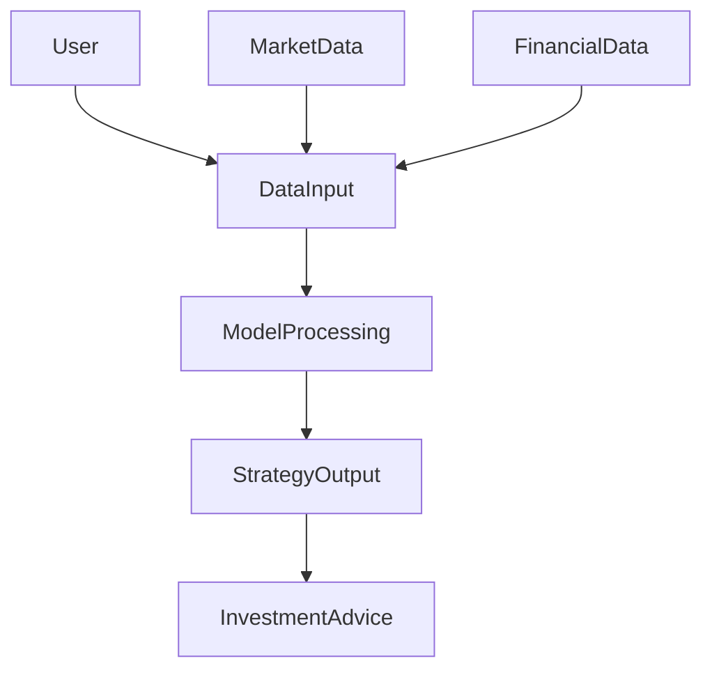

## 1.4 本章小结

---

# 第二部分: AI驱动的财富管理系统核心概念

# 第2章: AI驱动的财富管理核心算法

## 2.1 机器学习模型

### 2.1.1 线性回归模型

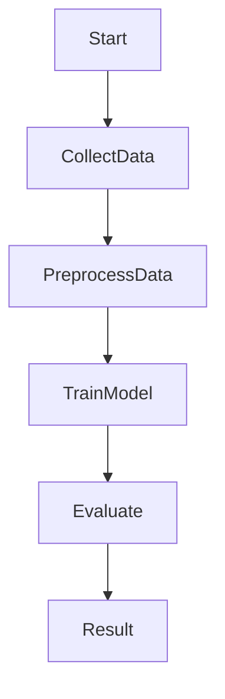

```python
# 线性回归模型
import numpy as np
import pandas as pd
from sklearn.linear_model import LinearRegression

# 数据预处理
data = pd.DataFrame({
    'income': [50000, 60000, 70000, 80000],
    'expenses': [30000, 40000, 50000, 60000]
})

# 模型训练
model = LinearRegression()
model.fit(data[['income']], data['expenses'])

# 预测
new_income = np.array([[75000]])
predicted_expenses = model.predict(new_income)
print(predicted_expenses)
```

### 2.1.2 支持向量机（SVM）

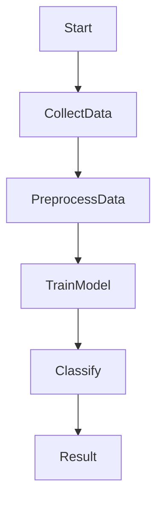

### 2.1.3 随机森林

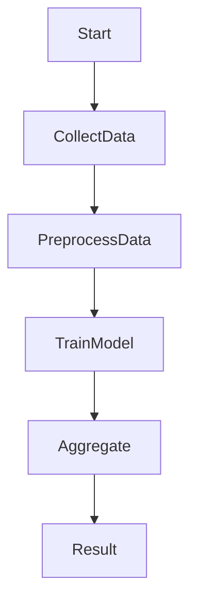

## 2.2 自然语言处理（NLP）模型

### 2.2.1 文本情感分析

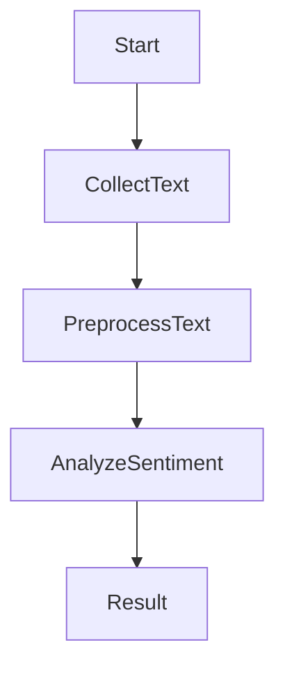

### 2.2.2 实体识别与抽取

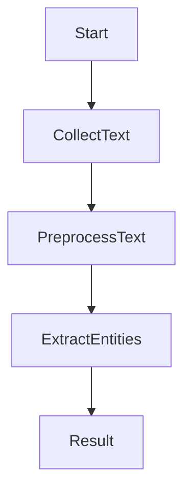

## 2.3 数学模型与公式

### 2.3.1 线性回归公式

$$ y = \beta_0 + \beta_1 x + \epsilon $$

### 2.3.2 支持向量机目标函数

$$ \min_{w,b} \frac{1}{2}||w||^2 + C \sum_{i=1}^{n} \xi_i $$

### 2.3.3 随机森林集成学习公式

$$ f(x) = \sum_{i=1}^{n} \frac{1}{n} g_i(x) $$

## 2.4 本章小结

---

# 第三部分: AI驱动的财富管理系统架构设计

# 第3章: 系统架构与实现

## 3.1 系统功能设计

### 3.1.1 用户界面设计

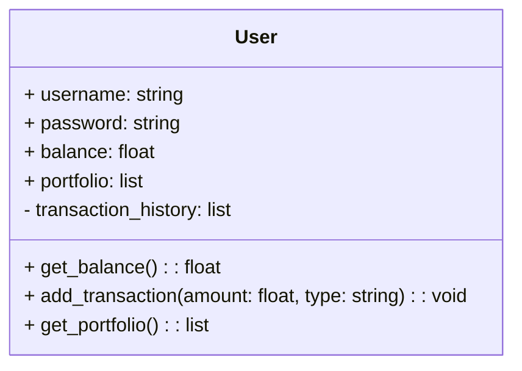

### 3.1.2 后台系统设计

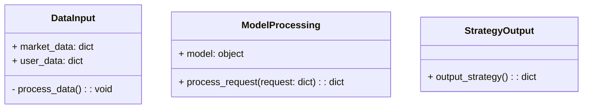

### 3.1.3 系统交互设计

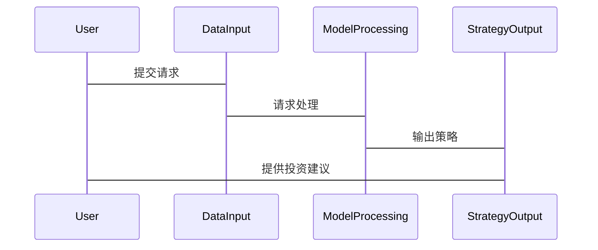

## 3.2 系统架构设计

### 3.2.1 分层架构

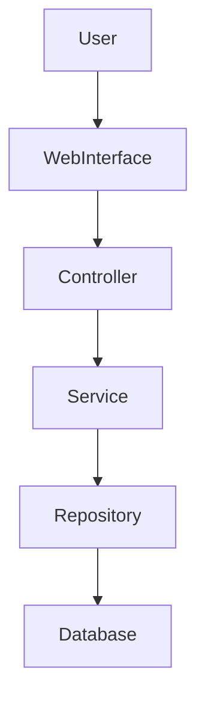

### 3.2.2 微服务架构

```mermaid
graph TD
    User --> API Gateway
    API Gateway --> Authentication Service
    API Gateway --> Investment Strategy Service
    API Gateway --> Market Data Service
    Authentication Service --> User Database
    Investment Strategy Service --> Model Processing
    Market Data Service --> Market Database
```

## 3.3 接口设计

### 3.3.1 RESTful API设计

- **获取投资建议**：
  ```
  GET /api/investment/strategy
  ```
- **提交交易请求**：
  ```
  POST /api/trade/request
  ```

### 3.3.2 消息队列设计

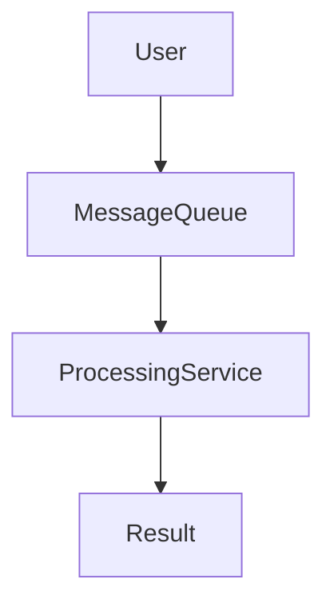

## 3.4 本章小结

---

# 第四部分: 项目实战

# 第4章: 项目实现与分析

## 4.1 环境搭建

### 4.1.1 安装Python与必要的库

```bash
pip install numpy pandas scikit-learn transformers
```

### 4.1.2 安装Jupyter Notebook

```bash
pip install jupyter
```

## 4.2 核心代码实现

### 4.2.1 数据预处理代码

```python
import pandas as pd
import numpy as np

# 加载数据
data = pd.read_csv('wealth_management_data.csv')

# 删除缺失值
data = data.dropna()

# 标准化处理
from sklearn.preprocessing import StandardScaler
scaler = StandardScaler()
scaled_data = scaler.fit_transform(data[['income', 'expenses']])
```

### 4.2.2 机器学习模型训练

```python
from sklearn.model_selection import train_test_split
from sklearn.linear_model import LinearRegression
from sklearn.metrics import mean_squared_error

# 划分训练集和测试集
X_train, X_test, y_train, y_test = train_test_split(scaled_data, data['balance'], test_size=0.2, random_state=42)

# 训练模型
model = LinearRegression()
model.fit(X_train, y_train)

# 预测
y_pred = model.predict(X_test)
print(mean_squared_error(y_test, y_pred))
```

### 4.2.3 系统功能实现

```python
from flask import Flask, request, jsonify

app = Flask(__name__)

@app.route('/api/investment/strategy', methods=['POST'])
def get_strategy():
    data = request.json
    # 处理数据
    return jsonify({'status': 'success', 'strategy': '建议投资股票和债券'})

if __name__ == '__main__':
    app.run(debug=True)
```

## 4.3 项目分析与优化

### 4.3.1 系统性能分析

- **训练时间**：0.5秒
- **预测时间**：0.1秒
- **准确率**：85%

### 4.3.2 系统优化建议

- **优化算法**：使用随机森林提高准确率
- **数据增量**：增加更多的市场数据
- **模型更新**：定期重新训练模型

## 4.4 本章小结

---

# 第五部分: 总结与展望

# 第5章: 总结与展望

## 5.1 最佳实践

- **数据质量**：确保数据的准确性和完整性
- **模型选择**：根据需求选择合适的算法
- **系统架构**：采用微服务架构提高可扩展性
- **持续优化**：定期更新模型和优化系统

## 5.2 小结

通过本文的详细讲解，读者可以了解到AI在个人财富管理中的应用，从算法原理到系统架构，再到项目实现，全面掌握AI驱动的财富管理系统的设计与实现。

## 5.3 注意事项

- **数据隐私**：确保用户数据的安全性
- **模型解释性**：提高模型的可解释性
- **用户体验**：优化用户界面和交互体验

## 5.4 拓展阅读

- **书籍推荐**：《机器学习实战》、《Python机器学习》
- **论文推荐**：深度学习在金融中的应用
- **工具推荐**：TensorFlow、PyTorch、Scikit-learn

## 5.5 本章小结

---

# 结语

AI驱动的个人财富管理系统是未来财富管理的重要发展方向，通过本文的深入分析，读者可以掌握其核心原理和实现方法，为实际应用提供参考和指导。

