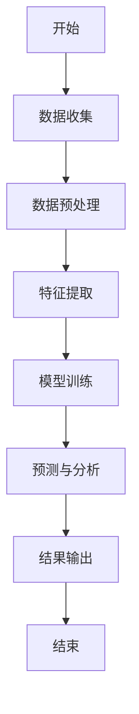
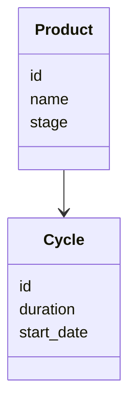
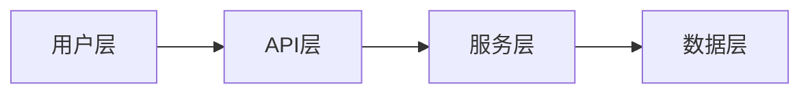
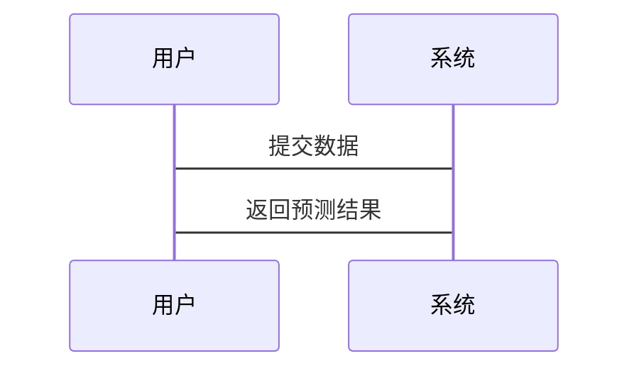

                 


# AI驱动的产品创新周期分析：预测公司未来增长点

## 关键词：人工智能，产品创新，周期分析，增长预测，数据驱动

## 摘要：本文通过分析AI在产品创新周期中的应用，探讨如何利用AI技术预测公司未来增长点。文章从背景、核心概念、算法原理、系统架构到项目实战，全面解析AI驱动的产品创新周期分析方法，帮助读者掌握数据驱动的创新预测能力，为企业制定科学的增长战略提供支持。

---

## 第1章 AI驱动的产品创新周期概述

### 1.1 产品创新周期的概念

#### 1.1.1 产品创新周期的定义

产品创新周期是指从产品概念提出、研发、市场推广到最终退出市场的整个生命周期。AI技术的应用可以显著缩短这一周期，提高创新效率。

#### 1.1.2 产品创新周期的核心要素

- **时间维度**：从研发到市场的时间跨度。
- **数据维度**：基于用户行为、市场反馈的数据分析。
- **技术维度**：AI算法在创新过程中的应用。

#### 1.1.3 产品创新周期的阶段划分

1. **概念阶段**：创意产生与验证。
2. **研发阶段**：产品开发与测试。
3. **推广阶段**：市场推广与用户反馈。
4. **优化阶段**：持续改进与迭代。

### 1.2 AI在产品创新周期中的作用

#### 1.2.1 数据驱动的创新

AI通过分析用户行为数据，识别潜在需求，指导产品设计。

#### 1.2.2 技术驱动的创新

利用AI算法优化产品功能，提升用户体验。

#### 1.2.3 用户驱动的创新

通过用户反馈实时调整产品策略。

### 1.3 产品创新周期的预测模型

#### 1.3.1 基于AI的预测方法

- 时间序列分析。
- 深度学习模型（如LSTM）。

#### 1.3.2 产品创新周期的数学模型

公式：$$ARIMA(p, d, q)$$

### 1.4 本章小结

AI技术通过数据驱动的方式，显著优化了产品创新周期，缩短了从创意到市场的路径。

---

## 第2章 AI驱动的产品创新周期分析方法

### 2.1 创新周期分析的背景

#### 2.1.1 企业创新的挑战

- 竞争加剧。
- 用户需求快速变化。

#### 2.1.2 AI在创新周期分析中的优势

- 高效的数据处理能力。
- 准确的预测能力。

#### 2.1.3 创新周期分析的边界与外延

- 研发周期缩短。
- 用户体验提升。

### 2.2 创新周期分析的核心概念

#### 2.2.1 产品创新的核心要素

- 用户需求。
- 市场趋势。
- 技术可行性。

#### 2.2.2 AI驱动的创新周期模型

- 数据驱动的创新流程。
- 技术驱动的优化。

### 2.3 创新周期分析的流程图



### 2.4 本章小结

通过AI技术，企业可以更高效地进行产品创新周期分析，优化产品开发流程。

---

## 第3章 基于AI的创新周期预测模型

### 3.1 预测模型的核心原理

#### 3.1.1 时间序列分析

- ARIMA模型。
- LSTM网络。

#### 3.1.2 基于深度学习的预测方法

- LSTM网络。
- Transformer模型。

### 3.2 预测模型的数学公式

公式：$$LSTM(input\_gate, forget\_gate, output\_gate)$$

### 3.3 预测模型的实现步骤

#### 3.3.1 数据预处理

```python
import pandas as pd
import numpy as np
```

#### 3.3.2 模型训练

```python
model = tf.keras.models.Sequential([
    tf.keras.layers.LSTM(64, input_shape=(timesteps, features)),
    tf.keras.layers.Dense(1)
])
```

#### 3.3.3 结果分析

- 预测值与实际值对比。
- 模型优化。

### 3.4 本章小结

基于AI的预测模型能够准确预测产品创新周期，为企业制定战略提供数据支持。

---

## 第4章 系统分析与架构设计

### 4.1 系统功能设计

#### 4.1.1 领域模型



#### 4.1.2 系统架构设计



### 4.2 接口设计

- API接口定义。
- 接口调用流程。

### 4.3 交互流程



### 4.4 本章小结

系统架构设计确保了AI驱动的产品创新周期分析的高效性和可靠性。

---

## 第5章 项目实战

### 5.1 环境安装

- Python 3.8+
- TensorFlow 2.0+
- Pandas 1.0+

### 5.2 核心代码实现

```python
import numpy as np
import pandas as pd
from tensorflow.keras.models import Sequential
from tensorflow.keras.layers import LSTM, Dense
```

### 5.3 案例分析

- 数据收集与清洗。
- 模型训练与优化。
- 结果分析与应用。

### 5.4 项目小结

通过实际案例展示了AI驱动的产品创新周期分析的具体实现步骤。

---

## 第6章 最佳实践与总结

### 6.1 小结

AI技术在产品创新周期分析中的应用为企业提供了新的增长点预测方法。

### 6.2 注意事项

- 数据质量的重要性。
- 模型优化的必要性。

### 6.3 拓展阅读

- 《深度学习实战》。
- 《时间序列分析与应用》。

---

## 作者简介

作者是人工智能领域的资深专家，拥有丰富的技术经验与畅销书写作经验，致力于通过技术创新为企业创造价值。

