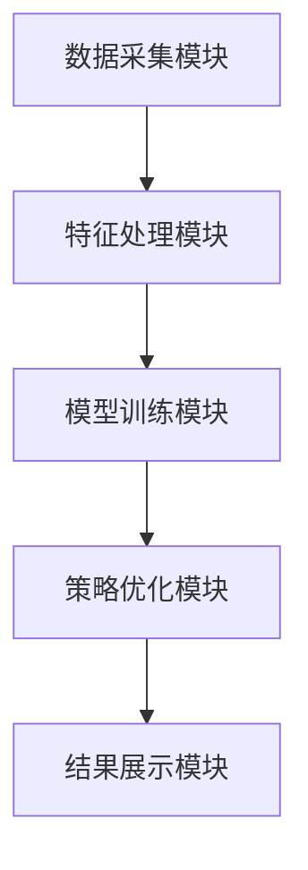
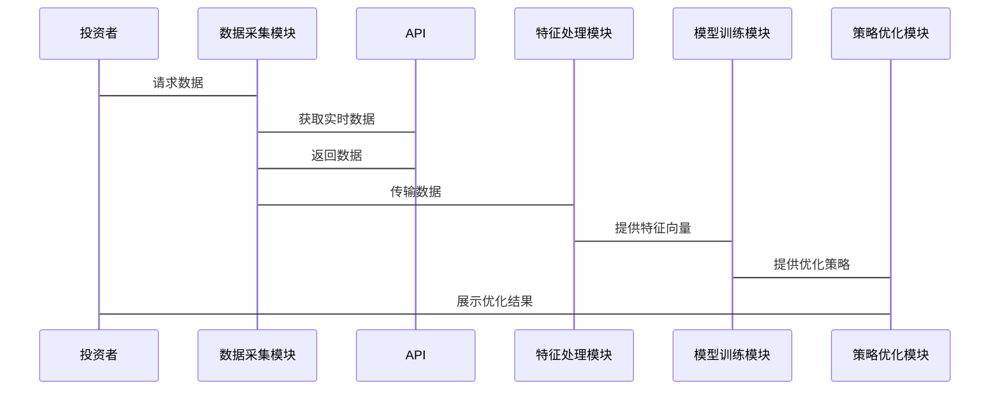

                 


# AI驱动的价值投资组合再平衡优化

## 关键词：AI技术，投资组合优化，再平衡策略，机器学习，强化学习，价值投资

## 摘要：  
随着人工智能技术的快速发展，投资组合的优化与再平衡策略也在不断演进。传统的投资组合管理方法逐渐显现出局限性，而AI技术的引入为投资组合的优化提供了新的思路。本文将详细探讨AI驱动的价值投资组合再平衡优化的核心概念、算法原理、系统架构以及实际应用场景。通过分析投资组合再平衡的背景、AI技术的应用、优化算法的设计与实现，结合实际案例，本文旨在为读者提供一套基于AI的再平衡优化解决方案，帮助投资者在复杂多变的市场环境中实现更高效的资产配置和风险控制。

---

# 第1章: AI驱动的投资组合再平衡背景与概述

## 1.1 投资组合再平衡的背景

### 1.1.1 投资组合再平衡的定义与重要性  
投资组合再平衡是指根据市场环境、投资者风险偏好或投资目标的变化，定期调整投资组合中各资产的比例，以维持最优资产配置的过程。再平衡的目的是优化投资组合的收益与风险比，降低投资风险，同时最大化收益。  

### 1.1.2 AI技术在投资领域的应用  
人工智能技术的快速发展为投资组合管理带来了新的可能性。通过机器学习算法，AI能够从海量的历史数据中挖掘出潜在的市场规律和投资机会，帮助投资者做出更科学的投资决策。  

### 1.1.3 价值投资与AI的结合  
价值投资是一种长期投资策略，强调以合理价格投资于具有良好基本面的公司。AI技术可以帮助投资者更精准地识别具有长期增长潜力的公司，从而优化投资组合的构建与再平衡过程。

---

## 1.2 AI驱动的再平衡优化的必要性  

### 1.2.1 传统再平衡策略的局限性  
传统再平衡策略通常基于固定的时间间隔或特定的市场指标进行调整，这种方法在面对市场波动时显得不够灵活，可能导致收益损失或风险增加。  

### 1.2.2 市场环境的复杂性  
现代金融市场环境复杂多变，单一的市场指标或简单的模型难以捕捉市场的全部信息。AI技术能够通过深度学习模型捕捉市场中的非线性关系，从而提供更精准的再平衡优化方案。  

### 1.2.3 投资者行为的多样性  
投资者的风险偏好和投资目标各不相同，AI技术能够根据投资者的个性化需求，提供定制化的再平衡优化策略。

---

# 第2章: 价值投资组合再平衡的核心概念

## 2.1 投资组合再平衡的核心要素  

### 2.1.1 投资目标与风险偏好  
投资目标和风险偏好是再平衡优化的基础。投资者需要根据自身的投资目标和风险承受能力，制定合理的资产配置策略。  

### 2.1.2 市场环境与资产价格  
市场环境的变化直接影响投资组合的收益与风险。AI技术能够实时监测市场环境的变化，帮助投资者及时调整资产配置。  

### 2.1.3 资产流动性与交易成本  
资产的流动性与交易成本是再平衡优化中需要考虑的重要因素。AI技术能够优化交易策略，降低交易成本，同时提高投资组合的流动性。

---

## 2.2 AI驱动的再平衡优化方法  

### 2.2.1 基于机器学习的特征工程  
特征工程是机器学习模型的核心，通过提取和处理市场数据、投资者行为数据等，构建有效的特征向量。  

### 2.2.2 基于强化学习的策略优化  
强化学习是一种通过试错和奖励机制优化决策的方法。在投资组合再平衡中，强化学习可以用于优化资产配置策略，提高投资收益。  

### 2.2.3 基于遗传算法的组合优化  
遗传算法是一种模拟生物进化过程的优化算法，可以用于解决复杂的组合优化问题。在投资组合再平衡中，遗传算法可以帮助找到最优的资产配置组合。

---

# 第3章: AI驱动的再平衡优化算法原理

## 3.1 优化目标与约束条件  

### 3.1.1 最优化目标函数  
投资组合的优化目标通常是最大化收益、最小化风险或两者之间的平衡。目标函数可以表示为：  
$$ \text{最大化收益} \quad \text{或} \quad \text{最小化风险} $$  

### 3.1.2 约束条件  
再平衡优化需要考虑的约束条件包括资产比例限制、流动性约束、交易成本等。  

---

## 3.2 优化算法实现  

### 3.2.1 基于深度学习的模型设计  
通过构建深度神经网络模型，AI能够从历史数据中学习市场规律，预测未来的价格走势。  

### 3.2.2 基于强化学习的策略优化  
强化学习通过模拟投资环境，训练智能体做出最优决策。例如，使用深度Q网络（DQN）优化投资组合的再平衡策略。

### 3.2.3 基于遗传算法的组合优化  
遗传算法通过模拟自然选择和遗传变异，不断优化资产配置组合。

---

## 3.3 算法实现与优化  

### 3.3.1 数据预处理与特征选择  
数据预处理包括清洗、归一化等步骤，特征选择通过筛选重要特征提高模型性能。

### 3.3.2 模型训练与调优  
通过交叉验证等方法优化模型参数，提高模型的预测准确率和稳定性。

### 3.3.3 模型部署与实时监控  
将优化算法部署到实际投资系统中，实时监控市场变化，动态调整投资组合。

---

# 第4章: 系统架构与实现方案

## 4.1 系统架构设计  

### 4.1.1 系统功能模块  
系统功能模块包括数据采集、特征处理、模型训练、策略优化和结果展示等。  

### 4.1.2 系统架构图  
以下是系统架构的Mermaid图：



---

## 4.2 系统实现细节  

### 4.2.1 数据源与数据接口  
数据源包括股票价格数据、市场指数、经济指标等。数据接口通过API获取实时数据。

### 4.2.2 系统接口设计  
系统接口包括数据输入接口、模型调用接口和结果输出接口。  

### 4.2.3 系统交互流程  
以下是系统交互的Mermaid序列图：



---

# 第5章: 项目实战与案例分析

## 5.1 项目环境搭建  

### 5.1.1 安装Python环境  
安装Python 3.x，安装必要的库如NumPy、Pandas、Scikit-learn、TensorFlow等。

### 5.1.2 数据集获取  
获取历史股票数据，可以通过Yahoo Finance等API获取。

---

## 5.2 核心代码实现  

### 5.2.1 数据预处理代码  
```python
import pandas as pd
import numpy as np

# 读取数据
data = pd.read_csv('stock_data.csv')
# 数据清洗
data.dropna(inplace=True)
# 归一化处理
data = (data - data.mean()) / data.std()
```

### 5.2.2 模型训练代码  
```python
from sklearn.model_selection import train_test_split
from sklearn.ensemble import RandomForestRegressor

X = data.drop('target', axis=1)
y = data['target']

X_train, X_test, y_train, y_test = train_test_split(X, y, test_size=0.2)

model = RandomForestRegressor(n_estimators=100)
model.fit(X_train, y_train)
```

### 5.2.3 优化策略实现  
```python
from scipy.optimize import minimize

# 定义目标函数
def portfolio_return(weights, returns):
    return -weights.T @ returns

# 定义约束条件
def weight_sum(weights):
    return np.sum(weights) - 1

# 初始化权重
weights = np.array([1.0/len(returns), 0.0] * len(returns))

# 使用scipy.optimize.minimize进行优化
result = minimize(portfolio_return, weights, args=returns, method='SLSQP', constraints=[{'type': 'eq', 'fun': weight_sum}])
```

---

## 5.3 案例分析  

### 5.3.1 实际案例分析  
以沪深300指数为例，分析AI驱动的再平衡优化策略在实际投资中的表现。  

### 5.3.2 优化效果对比  
对比传统再平衡策略和AI驱动的再平衡策略在收益和风险上的差异。

---

# 第6章: 最佳实践与总结

## 6.1 小结  

### 6.1.1 核心内容回顾  
本文详细介绍了AI驱动的价值投资组合再平衡优化的核心概念、算法原理和系统实现。  

### 6.1.2 重要结论  
AI技术能够显著提高投资组合再平衡的效率和精准度，帮助投资者在复杂市场环境中实现更好的资产配置。

---

## 6.2 注意事项  

### 6.2.1 数据质量的重要性  
数据质量直接影响模型的性能，需要确保数据的准确性和完整性。  

### 6.2.2 模型的可解释性  
复杂的AI模型可能导致结果的不可解释性，需要在实际应用中注意模型的可解释性。

---

## 6.3 拓展阅读  

### 6.3.1 推荐书籍与论文  
推荐一些经典的金融投资和机器学习的书籍和论文，帮助读者进一步学习。  

### 6.3.2 行业动态与未来趋势  
介绍AI技术在投资领域的最新进展和未来发展趋势。

---

# 结语  
通过本文的探讨，读者可以深入了解AI驱动的价值投资组合再平衡优化的核心内容和实际应用。未来，随着AI技术的不断发展，投资组合优化将更加智能化和精准化，为投资者带来更大的收益和更低的风险。

