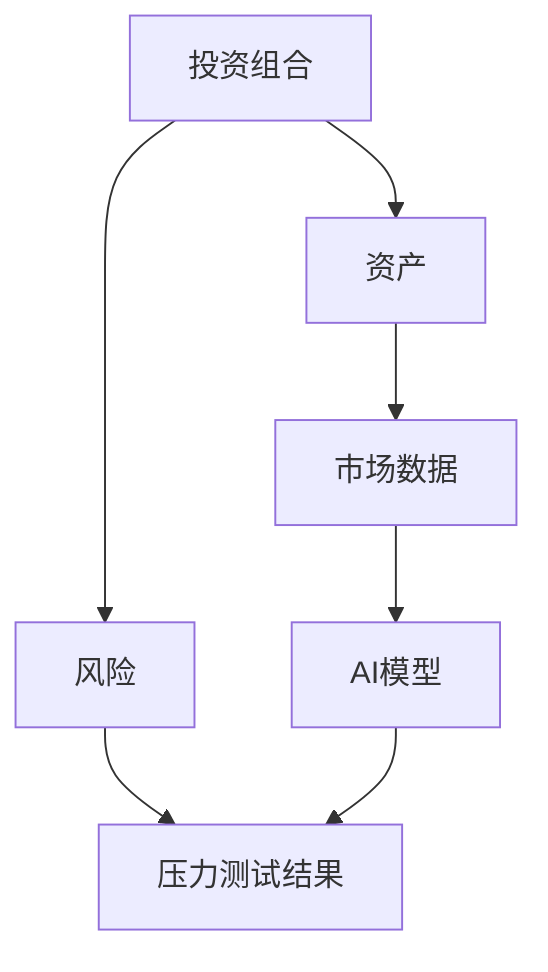

                 

# AI驱动的价值投资组合压力测试

> 关键词：AI驱动、价值投资组合、压力测试、金融风险、人工智能

> 摘要：随着人工智能技术的快速发展，其在金融领域的应用越来越广泛。本文将探讨如何利用AI驱动的方法进行价值投资组合的压力测试。通过分析传统压力测试的局限性，结合AI的优势，提出了一种基于机器学习和深度学习的新型压力测试方法，并详细阐述了其算法原理、数学模型和系统架构。本文还通过实际案例分析，展示了如何利用Python代码实现AI驱动的压力测试，为投资者提供更精准的风险评估和决策支持。

---

# 第1章: 价值投资组合压力测试的背景与意义

## 1.1 价值投资组合的基本概念

### 1.1.1 投资组合的定义与构成

投资组合是指将多种金融资产（如股票、债券、基金等）按照一定比例组合在一起，以达到分散风险、提高收益的目的。一个典型的投资组合通常包含以下几个部分：

- **资产配置**：决定每种资产在组合中的权重。
- **风险分散**：通过多样化投资降低特定资产的风险。
- **收益目标**：设定投资组合的预期收益。

### 1.1.2 价值投资的核心理念

价值投资是一种以基本面分析为基础的投资策略，强调以低于市场价的方式买入具有内在价值的资产。其核心理念包括：

- **长期投资**：关注企业的长期价值，而非短期市场波动。
- **安全边际**：买入价格低于内在价值，以降低风险。
- **分散投资**：通过投资多个资产降低特定风险。

### 1.1.3 压力测试的定义与作用

压力测试是一种评估投资组合在极端市场条件下表现的方法。其主要作用包括：

- **风险识别**：发现投资组合在极端情况下的潜在损失。
- **情景分析**：模拟不同市场环境下的投资组合表现。
- **决策支持**：为投资组合的调整和优化提供依据。

---

## 1.2 AI在金融领域的应用背景

### 1.2.1 人工智能在金融行业的应用现状

人工智能（AI）在金融领域的应用日益广泛，主要包括以下方面：

- **量化交易**：利用算法进行高频交易和市场数据分析。
- **风险管理**：通过AI技术评估和监控金融风险。
- **客户画像**：基于大数据分析客户行为，提供个性化服务。
- **智能投顾**：利用AI为投资者提供自动化投资建议。

### 1.2.2 传统压力测试方法的局限性

传统压力测试方法主要依赖于历史数据和假设情景，存在以下问题：

- **数据依赖性**：高度依赖历史数据，可能无法捕捉极端事件。
- **情景假设**：情景假设的主观性较强，可能导致结果偏差。
- **计算复杂性**：传统方法计算复杂，难以实时应用。

### 1.2.3 AI驱动压力测试的优势与潜力

AI技术的引入为压力测试带来了新的可能性：

- **数据驱动**：AI能够从海量数据中提取特征，提高模型的准确性。
- **非线性关系**：AI模型可以捕捉复杂的非线性关系，更好地反映市场动态。
- **实时性**：AI算法可以实时更新模型，适应市场变化。

---

## 1.3 本书的核心目标与内容框架

### 1.3.1 本书的研究目标

本书旨在探讨如何利用AI技术提升价值投资组合的压力测试能力，主要内容包括：

- 介绍AI在金融领域的应用背景。
- 探讨AI驱动压力测试的核心概念。
- 分析AI驱动压力测试的算法原理。
- 实现基于Python的AI驱动压力测试系统。
- 提供实际案例分析和最佳实践建议。

### 1.3.2 本书的主要内容框架

- 第1章：价值投资组合压力测试的背景与意义。
- 第2章：AI驱动压力测试的核心概念。
- 第3章：AI驱动压力测试的算法原理。
- 第4章：数学模型与公式。
- 第5章：系统架构与设计。
- 第6章：项目实战与实现。
- 第7章：总结与展望。

### 1.3.3 本书的读者群体

本书适合以下读者：

- 金融领域的从业者（如投资经理、风险分析师）。
- 对AI技术感兴趣的技术人员。
- 金融与计算机交叉领域的研究人员。

---

# 第2章: AI驱动压力测试的核心概念

## 2.1 价值投资组合压力测试的定义

### 2.1.1 投资组合压力测试的分类

压力测试可以分为以下几类：

- **历史模拟法**：基于历史数据模拟极端市场情况。
- **情景分析法**：假设特定情景进行测试。
- **蒙特卡洛模拟法**：通过随机抽样模拟市场变化。

### 2.1.2 价值投资组合的特殊性

价值投资组合具有以下特点：

- **长期视角**：注重企业的长期价值。
- **安全边际**：买入价格低于内在价值。
- **分散投资**：通过多样化降低风险。

### 2.1.3 压力测试的核心指标

压力测试的关键指标包括：

- **最大回撤**：投资组合在一定时间段内的最大亏损。
- **VaR（在险值）**：在给定置信水平下，投资组合的最大潜在损失。
- **CVaR（条件在险值）**：VaR的期望损失。

## 2.2 AI在压力测试中的应用原理

### 2.2.1 数据驱动的分析方法

AI技术通过以下步骤实现压力测试：

1. **数据收集**：获取历史市场数据和投资组合信息。
2. **特征提取**：提取影响投资组合收益和风险的关键特征。
3. **模型训练**：利用机器学习算法训练压力测试模型。
4. **结果分析**：输出压力测试结果并提供优化建议。

### 2.2.2 AI模型的特征提取能力

AI模型能够从大量数据中提取非线性特征，例如：

- **市场情绪**：通过自然语言处理技术分析新闻和社交媒体情绪。
- **技术指标**：利用技术分析指标预测市场走势。
- **宏观经济指标**：结合GDP、利率等宏观经济数据进行预测。

### 2.2.3 压力测试结果的可解释性

AI模型的可解释性是压力测试的重要因素。通过以下方法提高可解释性：

- **模型解释工具**：如SHAP值和LIME，用于解释模型的预测结果。
- **特征重要性分析**：识别对压力测试结果影响最大的特征。

## 2.3 核心概念与联系

### 2.3.1 核心概念原理

价值投资组合压力测试的核心原理是通过AI技术模拟极端市场情景，评估投资组合的潜在损失，并提出优化建议。

### 2.3.2 核心概念属性特征对比表格

| 概念         | 特征                           |
|--------------|--------------------------------|
| 投资组合     | 资产组合、风险分散             |
| 压力测试     | 极端情景模拟、结果量化         |
| AI模型       | 数据驱动、非线性关系           |

### 2.3.3 实体关系图（ER图）

---

## 总结

本章详细介绍了价值投资组合压力测试的背景与意义，探讨了AI在压力测试中的应用背景和核心概念。下一章将深入分析AI驱动压力测试的算法原理，包括机器学习和深度学习在压力测试中的应用。

---

接下来将按照目录大纲的结构，逐步展开各章节内容，涵盖算法原理、数学模型、系统架构、项目实战等部分。

