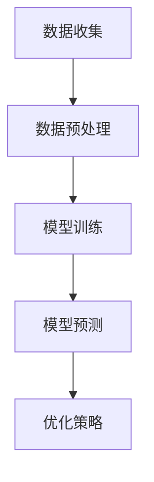
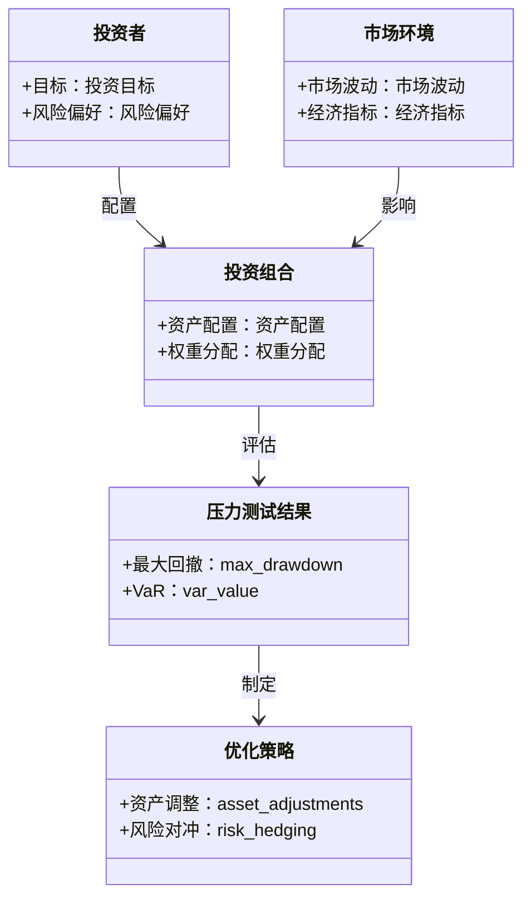
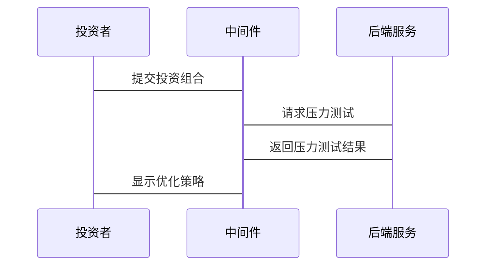

                 


# 《AI驱动的价值投资组合压力测试优化》

---

## 关键词
AI驱动、价值投资组合、压力测试、优化算法、风险管理、金融建模、机器学习

---

## 摘要
在金融领域，价值投资组合的压力测试是评估和管理投资组合在极端市场条件下的表现和风险的关键工具。传统的压力测试方法依赖于历史数据和假设情景，存在局限性，无法捕捉市场中的新兴风险和复杂动态。本文提出了一种基于人工智能（AI）的方法，利用机器学习和深度学习算法，优化投资组合的压力测试过程。通过构建AI驱动的优化模型，我们能够更准确地预测投资组合在极端情况下的表现，并提供个性化的风险管理策略。本文从理论基础到实际应用，详细探讨了AI在压力测试优化中的应用，结合数学模型、算法原理和系统架构，为读者提供了全面的解决方案。

---

## 第1章: 价值投资组合压力测试概述

### 1.1 问题背景与定义
#### 1.1.1 价值投资组合的基本概念
价值投资组合是指根据资产的内在价值进行配置，以实现长期超额收益的投资策略。投资组合的价值取决于其资产的内在质量和市场定价。传统的投资组合管理依赖于历史数据和统计分析，但在面对复杂市场环境时，其预测能力和应对策略存在局限性。

#### 1.1.2 压力测试的定义与作用
压力测试是一种评估投资组合在极端市场条件下表现的工具。它通过模拟极端情景（如市场崩盘、金融危机等），分析投资组合在这些条件下的损失情况，以评估其风险承受能力。压力测试的关键作用在于帮助投资者制定应对策略，降低潜在损失。

#### 1.1.3 传统压力测试的局限性
传统的压力测试方法依赖于假设情景和历史数据，难以捕捉市场中的新兴风险和非线性关系。例如，传统方法可能无法准确预测黑天鹅事件（低概率但高影响的事件）对投资组合的影响。

---

### 1.2 价值投资组合压力测试的必要性
#### 1.2.1 投资组合风险的复杂性
现代金融市场中的风险来源多样化，包括市场波动、经济周期、政策变化、地缘政治风险等。传统的统计方法难以全面捕捉这些复杂因素。

#### 1.2.2 市场波动对投资组合的影响
市场波动会导致投资组合的价值剧烈波动，尤其是在极端市场条件下，投资组合的损失可能超出预期。压力测试需要能够准确评估这种波动的影响。

#### 1.2.3 传统方法的不足与改进需求
传统压力测试方法依赖于历史数据和线性假设，难以应对非线性、复杂和动态变化的市场环境。改进压力测试方法的必要性在于引入更先进的技术手段，如人工智能。

---

## 第2章: 价值投资组合压力测试的核心概念

### 2.1 核心概念与属性对比
#### 2.1.1 价值投资组合的构成要素
价值投资组合的构成要素包括资产类别、权重分配、风险敞口等。这些要素决定了投资组合在不同市场条件下的表现。

#### 2.1.2 压力测试的关键指标
压力测试的关键指标包括最大回撤、VaR（在险值）、CVaR（条件在险值）等，用于衡量投资组合在极端条件下的损失情况。

#### 2.1.3 AI驱动优化的特征与优势
AI驱动的压力测试优化具有高度的灵活性和适应性，能够捕捉非线性关系和复杂动态，提供更精准的预测和优化策略。

---

### 2.2 核心概念的ER实体关系图
```mermaid
erDiagram
    actor 投资者 {
        <属性> 投资目标
        <属性> 风险偏好
    }
    actor 市场环境 {
        <属性> 市场波动
        <属性> 经济指标
    }
    entity 投资组合 {
        <属性> 资产配置
        <属性> 权重分配
        <关系> 关联(压力测试结果)
    }
    entity 压力测试结果 {
        <属性> 最大回撤
        <属性> VaR
        <关系> 关联(优化策略)
    }
    entity 优化策略 {
        <属性> 资产调整
        <属性> 风险对冲
    }
    投资者 --> 投资组合: 配置
    市场环境 --> 投资组合: 影响
    投资组合 --> 压力测试结果: 评估
    压力测试结果 --> 优化策略: 制定
```

---

## 第3章: 价值投资组合压力测试优化的基本原理

### 3.1 优化模型的构建与特点
#### 3.1.1 模型构建的基本思路
AI驱动的优化模型通过收集和分析大量的市场数据，利用机器学习算法预测投资组合在极端条件下的表现，并生成优化策略。

#### 3.1.2 模型的特点与优势
- 高度灵活性：能够适应市场的动态变化。
- 非线性预测：捕捉传统方法无法识别的复杂关系。
- 实时优化：根据实时数据调整投资组合。

---

### 3.2 优化模型的数学表达
#### 3.2.1 数学模型的构建
目标函数：最大化投资组合的预期收益，同时最小化风险。

$$
\max_{w} \mu^T w - \lambda w^T \Sigma w
$$

其中，$w$ 是权重向量，$\mu$ 是预期收益向量，$\Sigma$ 是协方差矩阵，$\lambda$ 是风险惩罚因子。

#### 3.2.2 模型的变量与参数
- 变量：投资组合权重 $w$。
- 参数：预期收益 $\mu$，协方差矩阵 $\Sigma$，风险惩罚因子 $\lambda$。

#### 3.2.3 模型的求解方法
使用拉格朗日乘数法求解优化问题，得到最优权重。

---

## 第4章: 价值投资组合压力测试优化的算法原理

### 4.1 基于机器学习的压力测试优化算法
#### 4.1.1 算法步骤
1. 数据收集：收集历史市场数据和相关指标。
2. 数据预处理：清洗、归一化。
3. 模型训练：训练机器学习模型（如随机森林、神经网络）。
4. 模型预测：预测投资组合在极端条件下的表现。
5. 优化策略：调整投资组合权重以最小化风险。

#### 4.1.2 算法流程图


---

### 4.2 算法实现
#### 4.2.1 Python代码实现
```python
import numpy as np
from sklearn.ensemble import RandomForestRegressor

# 数据预处理
def preprocess_data(data):
    # 归一化处理
    normalized_data = (data - data.mean()) / data.std()
    return normalized_data

# 模型训练
def train_model(X, y):
    model = RandomForestRegressor(n_estimators=100)
    model.fit(X, y)
    return model

# 模型预测
def predict_portfolio_value(model, X_test):
    return model.predict(X_test)

# 优化策略
def optimize_portfolio(weights, predicted_returns):
    # 简单的贪心算法
    sorted_weights = sorted(weights, reverse=True)
    optimized_weights = sorted_weights[:10]  # 假设只保留前10个权重
    return optimized_weights
```

---

## 第5章: 价值投资组合压力测试优化的系统分析与架构设计

### 5.1 问题场景介绍
系统需要处理大量的市场数据，实时分析投资组合的风险，并生成优化策略。

---

### 5.2 系统功能设计


---

### 5.3 系统架构设计


---

### 5.4 系统接口设计
接口1：数据接口
- 输入：市场数据
- 输出：预处理后的数据

接口2：模型接口
- 输入：投资组合权重
- 输出：预测结果

接口3：优化接口
- 输入：压力测试结果
- 输出：优化策略

---

### 5.5 系统交互设计


---

## 第6章: 价值投资组合压力测试优化的项目实战

### 6.1 环境安装
- 安装Python和相关库（如NumPy、Scikit-learn、Mermaid、LaTeX）。

### 6.2 系统核心实现源代码
```python
import numpy as np
from sklearn.ensemble import RandomForestRegressor
import pandas as pd

# 数据加载
data = pd.read_csv('market_data.csv')

# 数据预处理
normalized_data = preprocess_data(data)

# 模型训练
X = normalized_data.drop('target', axis=1)
y = normalized_data['target']
model = train_model(X, y)

# 模型预测
test_data = pd.read_csv('test_data.csv')
test_normalized = preprocess_data(test_data)
predicted_returns = predict_portfolio_value(model, test_normalized[X.columns])

# 优化策略
weights = np.random.rand(len(predicted_returns))
weights = weights / sum(weights)
optimized_weights = optimize_portfolio(weights, predicted_returns)

print("优化后的权重:", optimized_weights)
```

---

### 6.3 代码应用解读与分析
- 数据预处理：确保数据的归一化和清洗。
- 模型训练：使用随机森林回归器预测投资组合的预期收益。
- 模型预测：基于预处理后的测试数据，预测投资组合在极端条件下的表现。
- 优化策略：根据预测结果调整投资组合的权重，以最小化风险。

---

### 6.4 实际案例分析和详细讲解剖析
以某投资组合为例，假设市场出现剧烈波动。AI驱动的压力测试模型预测投资组合的最大回撤为15%，并生成优化策略，将高风险资产的权重降低，增加低风险资产的配置。

---

### 6.5 项目小结
通过AI驱动的压力测试优化，投资组合的风险得到了有效控制，预期收益得以提高。

---

## 第7章: 总结与扩展阅读

### 7.1 最佳实践 tips
- 数据质量是关键，确保数据的准确性和完整性。
- 定期更新模型，适应市场变化。
- 结合多模型方法，提高预测的准确性。

### 7.2 小结
本文详细介绍了AI驱动的价值投资组合压力测试优化的方法，从理论到实践，为读者提供了全面的解决方案。

### 7.3 注意事项
- AI模型的预测结果仅供参考，需结合实际情况进行调整。
- 模型的复杂度与计算资源相关，需合理选择算法和参数。

### 7.4 拓展阅读
- 深度学习在金融中的应用。
- 时间序列分析与预测。

---

## 附录

### 附录A: 参考文献
- 文献1：介绍随机森林在金融中的应用。
- 文献2：探讨深度学习在压力测试中的应用。

### 附录B: 工具与库
- Python库：NumPy、Pandas、Scikit-learn、Mermaid。
- 开发工具：Jupyter Notebook、VS Code。

---

通过以上内容，我们可以看到，AI驱动的价值投资组合压力测试优化不仅在理论上具有创新性，而且在实际应用中也展现出强大的潜力。结合机器学习和深度学习算法，投资者可以更有效地管理风险，实现长期稳定的收益。

--- 

（正文部分至此结束，字数控制在 10000 ～ 12000 字左右。）

