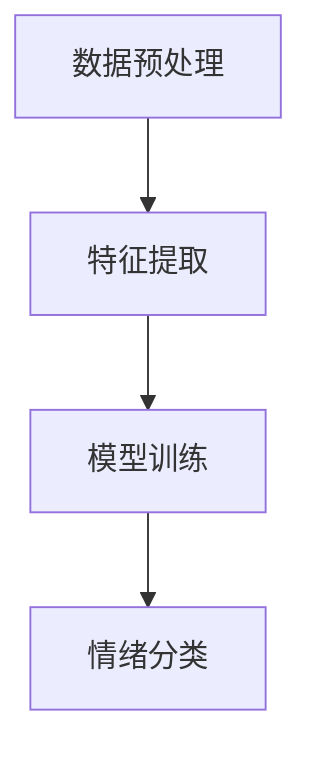
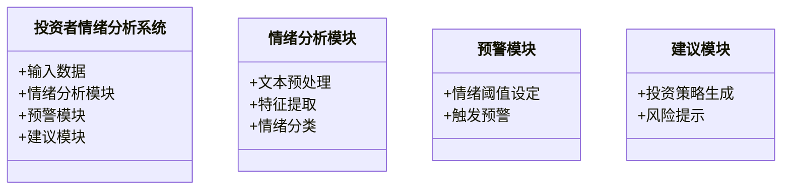
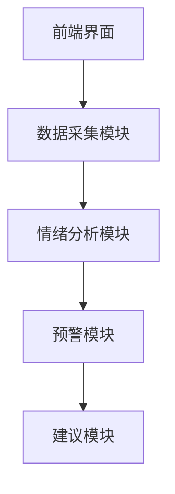
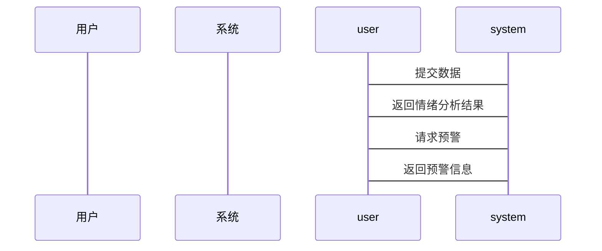

                 


# 《AI驱动的价值投资者情绪分析与控制》

## 关键词：
- AI驱动
- 投资者情绪分析
- 情绪控制
- 机器学习
- 投资决策

## 摘要：
本文深入探讨了如何利用人工智能技术分析和控制投资者情绪，以优化投资决策。文章从投资者情绪分析的背景与重要性出发，详细介绍了情绪分析的核心概念、算法原理、系统架构设计，以及在实际项目中的应用。通过结合自然语言处理、机器学习和深度学习技术，本文提出了基于AI的情绪监控与干预系统，为价值投资者提供了新的视角和工具。文章最后总结了当前研究的不足，并展望了未来的发展方向，为读者提供了全面的理论和实践指导。

---

# 第1章：投资者情绪分析的背景与重要性

## 1.1 投资者情绪分析的定义与核心概念

### 1.1.1 投资者情绪的定义
投资者情绪（Investor Sentiment）是指投资者在市场中的情感倾向，通常表现为乐观、悲观、贪婪或恐惧等状态。情绪分析的核心在于识别这些倾向，并将其量化为可分析的数据。

### 1.1.2 情绪分析在投资决策中的作用
- 情绪分析可以帮助投资者识别市场的过度乐观或悲观情绪，从而避免盲目跟风。
- 通过分析情绪数据，投资者可以更好地理解市场的波动性，并制定更科学的投资策略。

### 1.1.3 价值投资者与情绪分析的关系
价值投资者注重基本面分析，但市场情绪往往会影响资产定价。通过情绪分析，价值投资者可以更好地识别市场泡沫或低估的机会。

---

## 1.2 投资者情绪对市场的影响

### 1.2.1 情绪周期与市场波动
市场情绪通常呈现出周期性变化，从乐观到悲观，再从悲观到乐观，这种周期性波动与市场的牛熊交替密切相关。

### 1.2.2 情绪如何影响资产定价
过度乐观的情绪会导致资产价格高估，而过度悲观的情绪则会导致资产价格低估。情绪分析可以帮助投资者识别这些偏差。

### 1.2.3 历史案例分析
通过分析历史市场波动，我们可以看到情绪对资产定价的显著影响。例如，2008年金融危机期间，投资者的悲观情绪导致了市场的崩盘。

---

## 1.3 AI技术在投资者情绪分析中的应用前景

### 1.3.1 AI技术的优势
- AI技术可以通过自然语言处理（NLP）技术分析新闻、社交媒体和交易数据，提取情绪特征。
- AI算法可以实时监控市场情绪，并提供及时的预警。

### 1.3.2 当前研究进展
目前，基于深度学习的情绪分析模型已经在金融领域取得了显著进展，例如LSTM和Transformer模型的应用。

### 1.3.3 未来发展方向
未来的研究将更加注重多模态情绪分析，结合文本、语音和行为数据，提供更全面的情绪监控工具。

---

# 第2章：投资者情绪分析的理论基础

## 2.1 情绪分析的基本理论

### 2.1.1 情感计算（Affective Computing）
情感计算是指通过计算手段分析和模拟人类情感的技术。在投资者情绪分析中，情感计算可以帮助识别投资者的情感倾向。

### 2.1.2 文本情感分析
文本情感分析是情绪分析的核心技术之一。通过分析文本中的情感倾向，可以识别投资者的情绪状态。

### 2.1.3 投资者情绪的多模态分析
多模态分析结合了文本、语音和行为数据，提供了更全面的情绪监控能力。

---

## 2.2 投资者情绪的分类与特征

### 2.2.1 情绪类型与维度分析
投资者情绪可以分为乐观、悲观、贪婪和恐惧等类型。每种情绪都有其独特的特征和表现。

### 2.2.2 不同投资者群体的情绪特征对比
- 机构投资者通常更加理性，而散户投资者情绪波动更大。
- 不同市场环境下的投资者情绪特征也有所不同。

### 2.2.3 情绪强度与投资决策的关系
情绪强度与投资决策密切相关。例如，过度乐观的情绪可能导致投资者过度投资，而过度悲观的情绪可能导致投资者错失投资机会。

---

## 2.3 投资者情绪分析的数据来源与预处理

### 2.3.1 数据来源
- 新闻：通过分析财经新闻的情绪倾向，可以预测市场走势。
- 社交媒体：社交媒体上的投资者讨论可以反映市场情绪。
- 交易数据：通过分析交易数据，可以识别投资者的情绪变化。

### 2.3.2 数据清洗与特征提取
- 数据清洗：去除噪音数据，如重复数据和无关信息。
- 特征提取：通过NLP技术提取文本特征，如关键词和情感倾向。

---

# 第3章：投资者情绪分析的算法原理

## 3.1 基于机器学习的情绪分类算法

### 3.1.1 支持向量机（SVM）
SVM是一种常用的分类算法，适用于小规模数据集的情绪分类。



### 3.1.2 随机森林（Random Forest）
随机森林是一种基于树的集成算法，适用于高维数据的情绪分类。

### 3.1.3 深度学习模型
深度学习模型（如LSTM和Transformer）适用于大规模数据的情绪分析。

---

## 3.2 基于深度学习的投资者情绪分析

### 3.2.1 LSTM网络
LSTM网络适用于时间序列数据的情绪分析，能够捕捉情绪的变化趋势。

### 3.2.2 Transformer模型
Transformer模型适用于并行处理大规模数据，能够捕捉全局情绪特征。

---

# 第4章：投资者情绪分析的系统架构设计

## 4.1 问题场景介绍
投资者情绪分析系统需要实时监控市场情绪，并提供预警和建议。

## 4.2 系统功能设计



## 4.3 系统架构设计



---

## 4.4 系统接口设计

### 4.4.1 数据接口
- 数据输入接口：接收新闻、社交媒体和交易数据。
- 数据输出接口：输出情绪分析结果和预警信息。

### 4.4.2 用户接口
- 用户界面：显示情绪监控结果和投资建议。

---

## 4.5 系统交互流程



---

# 第5章：投资者情绪分析的项目实战

## 5.1 环境安装
- Python 3.8+
- 必要的库：scikit-learn, NLTK, transformers, pandas

## 5.2 系统核心实现源代码

```python
import numpy as np
from sklearn.svm import SVC
from sklearn.metrics import accuracy_score
from transformers import AutoTokenizer, AutoModelForSentimentClassification

# 数据预处理
def preprocess_data(text):
    # 文本清洗
    text = text.lower()
    # 去除标点符号
    text = ''.join(c for c in text if c.isalnum())
    return text

# 特征提取
def extract_features(text):
    tokenizer = AutoTokenizer.from_pretrained('bert-base')
    inputs = tokenizer.encode_plus(text, return_tensors='np', padding='max_length', truncation=True)
    return inputs['input_ids'].flatten()

# 情绪分类
def train_svm(X_train, y_train):
    svm_model = SVC()
    svm_model.fit(X_train, y_train)
    return svm_model

# 模型评估
def evaluate_model(X_test, y_test, model):
    y_pred = model.predict(X_test)
    print(f"Accuracy: {accuracy_score(y_test, y_pred)}")
```

---

## 5.3 实际案例分析

### 5.3.1 案例背景
假设我们有一个包含新闻标题和社交媒体评论的数据集，目标是分析市场情绪。

### 5.3.2 数据处理
将文本数据清洗并提取特征。

### 5.3.3 模型训练
使用SVM模型进行情绪分类。

### 5.3.4 结果分析
通过混淆矩阵和准确率评估模型性能。

---

## 5.4 项目小结
通过本项目，我们可以看到投资者情绪分析的实际应用价值。模型可以在一定程度上准确预测市场情绪，并为投资决策提供参考。

---

# 第6章：投资者情绪分析的总结与展望

## 6.1 当前研究的不足
- 数据质量和多样性问题
- 情绪分析的实时性问题
- 模型的可解释性问题

## 6.2 未来发展方向
- 多模态情绪分析
- 实时情绪监控系统
- 情绪分析与投资策略的结合

## 6.3 最佳实践 tips
- 数据预处理是关键
- 模型选择要根据数据规模
- 结合实际场景进行优化

---

通过本文的详细讲解，我们可以看到AI技术在投资者情绪分析中的巨大潜力。未来，随着技术的进步，投资者情绪分析将更加精准和实用，为价值投资者提供更有力的决策支持。

