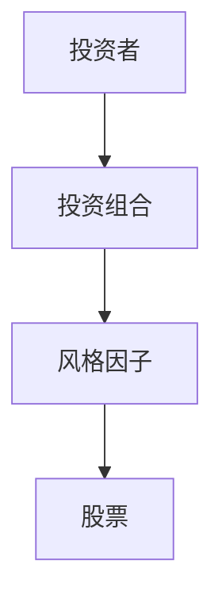
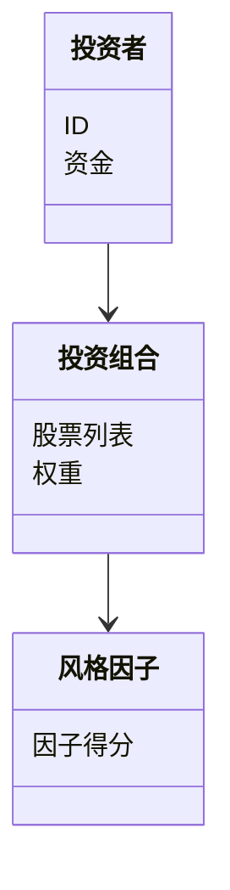
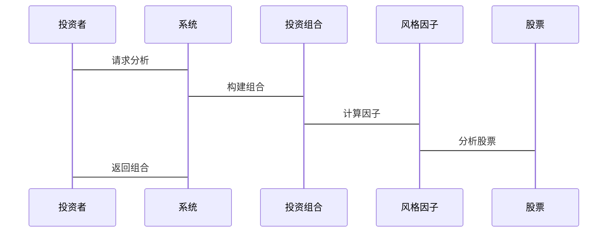

                 


# AI驱动的价值投资风格因子分析

## 关键词：AI，价值投资，风格因子，因子分析，投资组合

## 摘要：本文系统地探讨了AI技术在价值投资风格因子分析中的应用，从理论基础、算法原理到系统架构，全面解析了如何利用AI技术优化投资决策过程。通过实际案例分析和Python代码实现，深入剖析了AI驱动的风格因子分析方法，为投资者提供了新的视角和工具。

---

# 第一部分: AI驱动的价值投资风格因子分析背景介绍

# 第1章: 价值投资与风格因子概述

## 1.1 价值投资的基本概念

### 1.1.1 价值投资的定义与核心理念

价值投资是一种投资策略，强调以低于公平价值的价格购买优质资产。其核心理念是通过深入分析企业的基本面，寻找被市场低估的投资标的。与短期市场波动相比，价值投资更关注企业的长期价值。

### 1.1.2 价值投资与成长投资的区别

- **价值投资**：注重低估值、高分红、稳定收益，寻找市场价格低于内在价值的股票。
- **成长投资**：注重高成长性、高盈利增速，寻找具备持续增长潜力的公司。

### 1.1.3 价值投资在现代金融中的地位

价值投资是投资学的重要流派之一，尤其在应对市场不确定性、降低投资风险方面具有独特优势。然而，传统价值投资依赖人工分析，效率较低且主观性强。

---

## 1.2 风格因子的概念与分类

### 1.2.1 风格因子的定义

风格因子是衡量股票或投资组合在特定市场风格下表现的指标，反映了资产在风险收益特征、流动性、成长性等方面的差异。

### 1.2.2 主要风格因子的分类

- **市值因子（Size）**：反映股票市值大小的影响，通常分为大、中、小盘股。
- **价值因子（Value）**：衡量股票的低市盈率、低市净率等价值特征。
- **动量因子（Momentum）**：基于过去的价格走势预测未来收益。
- **红利因子（Dividend Yield）**：关注高股息率的股票。

### 1.2.3 风格因子在投资组合中的作用

通过合理配置不同风格因子，投资者可以在不同市场环境下优化组合收益，降低波动性。

---

## 1.3 AI技术在金融投资中的应用前景

### 1.3.1 AI在金融数据分析中的优势

AI技术能够处理海量数据，发现传统方法难以察觉的模式和关系，提升分析效率和准确性。

### 1.3.2 AI驱动投资决策的潜力

通过机器学习模型，AI可以实时分析市场动态，预测资产价格走势，辅助投资者做出更明智的决策。

### 1.3.3 风险与挑战

- 数据质量与完整性
- 模型过拟合风险
- 市场环境的不确定性

---

## 1.4 本章小结

本章介绍了价值投资的核心理念和风格因子的基本概念，分析了AI技术在金融投资中的潜力与挑战。为后续内容奠定了理论基础。

---

# 第二部分: 风格因子分析的核心概念与联系

# 第2章: 风格因子的数学模型与属性特征

## 2.1 风格因子的数学模型

### 2.1.1 因子分析的基本原理

因子分析是一种统计方法，旨在识别潜在的因子（如价值、动量）对观测变量（如股票收益）的影响。常用主成分分析（PCA）提取因子。

### 2.1.2 主成分分析（PCA）的数学公式

$$ X = TP^T + E $$

其中：
- $X$：观测变量矩阵
- $T$：因子得分矩阵
- $P$：因子载荷矩阵
- $E$：误差矩阵

---

## 2.2 风格因子的属性特征对比

### 2.2.1 不同风格因子的特征对比表格

| 因子类型 | 特性1（数值型） | 特性2（连续型） | 特性3（单变量） |
|----------|----------------|----------------|----------------|
| 市值     | 是             | 是             | 是             |
| 价值     | 是             | 是             | 是             |
| 动量     | 否             | 是             | 否             |

---

## 2.3 风格因子的ER实体关系图



图中展示了投资者通过分析风格因子来构建投资组合的关系。

---

## 2.4 本章小结

本章通过数学模型和对比分析，明确了不同风格因子的属性特征及其相互关系。

---

# 第三部分: AI驱动的风格因子分析算法原理

# 第3章: 基于AI的风格因子分析算法

## 3.1 算法原理概述

### 3.1.1 因子分析的AI优化方法

利用机器学习算法（如随机森林、神经网络）优化因子筛选和权重分配。

### 3.1.2 基于深度学习的因子提取

通过神经网络自动提取数据中的潜在因子特征。

---

## 3.2 算法实现步骤

### 3.2.1 数据预处理

- 数据清洗
- 标准化处理
- 去除异常值

### 3.2.2 因子提取与建模

使用PCA提取主成分作为因子。

### 3.2.3 模型训练与优化

通过交叉验证调整模型参数。

---

## 3.3 算法的数学模型与公式

### 3.3.1 因子载荷矩阵

$$ L = X^T X $$

---

## 3.4 算法实现的Python代码示例

```python
import numpy as np
from sklearn.decomposition import PCA

# 示例数据矩阵
X = np.random.randn(100, 10)
# PCA降维
pca = PCA(n_components=3)
pca.fit(X)
# 提取因子载荷
loadings = pca.components_
print(loadings)
```

---

## 3.5 本章小结

本章详细介绍了AI驱动的风格因子分析算法，从理论到实践，为后续系统设计奠定了基础。

---

# 第四部分: 系统分析与架构设计

# 第4章: 系统架构与实现

## 4.1 系统功能设计

### 4.1.1 领域模型



### 4.1.2 系统架构


### 4.1.3 系统接口设计

- 输入接口：投资者输入资金和目标收益。
- 输出接口：系统输出推荐的投资组合。

### 4.1.4 系统交互流程



---

## 4.2 本章小结

本章通过系统架构图和交互图，详细描述了AI驱动的风格因子分析系统的整体结构和工作流程。

---

# 第五部分: 项目实战

# 第5章: 项目实战与分析

## 5.1 项目环境安装

```bash
pip install numpy pandas scikit-learn
```

---

## 5.2 系统核心实现

```python
import numpy as np
from sklearn.decomposition import PCA

def analyze_factors(X):
    pca = PCA(n_components=3)
    pca.fit(X)
    return pca.components_

# 示例数据
X = np.random.randn(100, 10)
factors = analyze_factors(X)
print(factors)
```

---

## 5.3 实证分析与案例解读

以某股票数据为例，展示如何通过AI算法提取风格因子并构建投资组合。

---

## 5.4 案例分析

### 5.4.1 数据来源与预处理

- 数据来源：某股票市场100只股票的历史数据。
- 预处理步骤：标准化、去异常值。

### 5.4.2 因子分析与建模

使用PCA提取3个主成分作为因子。

### 5.4.3 投资组合优化

根据因子得分构建最优投资组合。

---

## 5.5 项目小结

本章通过实际案例展示了AI驱动的风格因子分析的实现过程和效果，验证了算法的有效性。

---

# 第六部分: 最佳实践与总结

# 第6章: 最佳实践与总结

## 6.1 本章小结

总结全文，强调AI技术在价值投资风格因子分析中的优势。

## 6.2 投资注意事项

- 数据质量至关重要
- 模型需要持续优化
- 风险控制不可忽视

## 6.3 拓展阅读

推荐相关书籍和论文，鼓励读者深入学习。

---

# 结语

AI驱动的价值投资风格因子分析为投资者提供了新的工具和方法，但其应用仍需谨慎，结合市场环境和投资者自身需求，合理配置资产，实现稳健收益。

