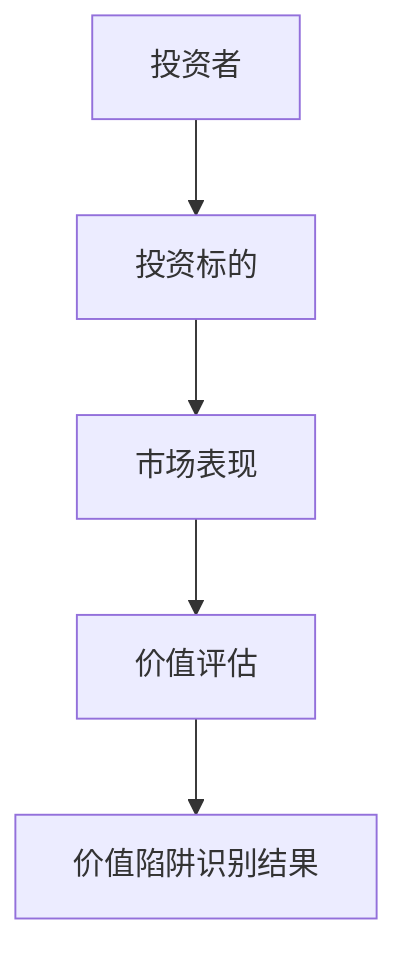
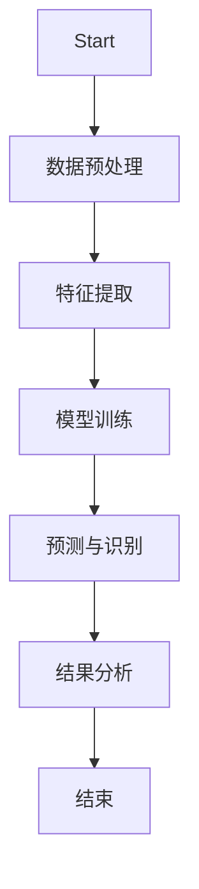
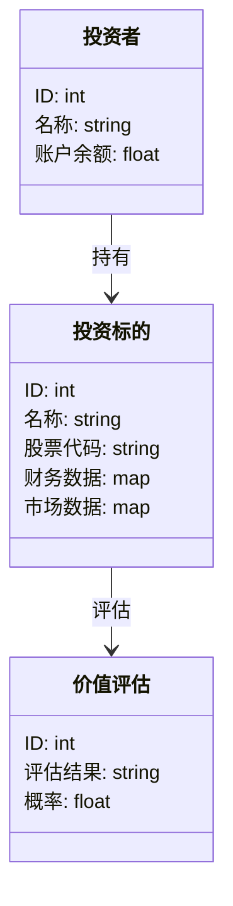
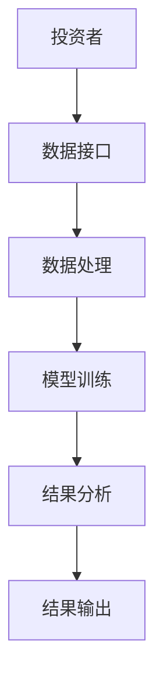

                 


# AI驱动的价值陷阱识别与规避

> 关键词：AI技术、价值陷阱、风险管理、机器学习、投资决策、市场分析

> 摘要：本文探讨了利用人工智能技术识别和规避价值陷阱的方法，通过分析价值陷阱的核心特征、算法原理、系统架构设计，结合实际案例，为投资者和数据科学家提供理论支持和实践指导。

---

# 第一部分: 价值陷阱识别的核心概念与背景

## 第1章: 价值陷阱的定义与背景

### 1.1 价值陷阱的定义与概念

#### 1.1.1 价值陷阱的定义
价值陷阱是指在金融市场中，某些资产或企业表面上看似乎具有较高的投资价值（如低市盈率、高分红率等），但实际上由于内在质量问题、管理不善、行业衰退等原因，其价值无法持续增长，甚至可能进一步下跌。这种现象容易误导投资者，导致其基于表面数据做出错误的投资决策。

#### 1.1.2 价值陷阱的核心特征
- **低估值陷阱**：资产的市场价格远低于其内在价值，但实际上可能是由于市场衰退或公司基本面恶化导致的。
- **高负债陷阱**：公司资产负债表看似健康，但实际上存在大量难以偿还的债务，尤其是在经济下行周期。
- **利润衰退陷阱**：公司短期内利润看似增长，但长期盈利能力持续下降，掩盖了潜在的风险。
- **行业困境陷阱**：行业整体低迷，尽管个别公司看似估值较低，但行业趋势难以逆转。

#### 1.1.3 价值陷阱的分类与场景
- **企业价值陷阱**：公司估值低于行业平均水平，但实际盈利能力持续下降。
- **资产价值陷阱**：资产账面价值较高，但市场流动性差，难以变现。
- **行业价值陷阱**：行业整体低迷，公司估值被低估，但行业复苏无望。

### 1.2 价值陷阱的识别必要性

#### 1.2.1 传统投资中的价值陷阱问题
传统投资方法依赖于市盈率、市净率等简单估值指标，容易忽视公司基本面的复杂性。例如，某些公司可能因为短期的利润波动导致估值下降，但长期来看可能面临结构性问题，如行业衰退或管理不善。

#### 1.2.2 AI技术在价值陷阱识别中的作用
AI技术通过深度学习、自然语言处理等方法，可以从海量数据中提取非结构化信息，发现传统估值指标无法捕捉的潜在风险。例如，通过分析公司新闻、社交媒体情绪、供应链数据等，识别潜在的价值陷阱。

#### 1.2.3 当前市场环境下的价值陷阱挑战
随着全球经济波动加剧，企业面临的风险更加复杂多样。例如，疫情期间某些零售企业的估值可能因暂时性关闭而被低估，但后续可能面临需求下降、供应链断裂等长期问题。

### 1.3 价值陷阱识别的边界与外延

#### 1.3.1 价值陷阱识别的边界条件
- 数据质量：需要高质量的财务数据和市场数据支持模型训练。
- 时间窗口：需要考虑不同时间窗口下的市场表现和公司基本面变化。
- 行业特性：不同行业面临的价值陷阱类型和表现形式不同。

#### 1.3.2 价值陷阱识别的适用场景
- 风险管理：帮助投资者识别潜在风险，避免重大损失。
- 投资决策：辅助投资者做出更明智的投资决策。
- 市场研究：为行业研究提供数据支持。

#### 1.3.3 价值陷阱识别的限制与不足
- 数据依赖性：模型依赖于历史数据，可能无法预测黑天鹅事件。
- 计算成本：处理海量数据需要较高的计算资源。
- 模型解释性：某些复杂模型的可解释性较差，可能影响决策者的信任。

---

## 第2章: 价值陷阱识别的核心概念与联系

### 2.1 核心概念原理

#### 2.1.1 数据驱动的特征提取
- **财务数据**：收入、利润、负债等。
- **市场数据**：股价、成交量、市场指数等。
- **文本数据**：公司公告、新闻报道、社交媒体情绪。

#### 2.1.2 模型驱动的特征识别
- **统计模型**：回归分析、聚类分析等。
- **机器学习模型**：支持向量机、随机森林、神经网络等。
- **自然语言处理模型**：文本挖掘、情感分析等。

#### 2.1.3 结合市场行为的特征分析
- **市场情绪**：通过社交媒体、新闻等数据，分析市场参与者的情绪。
- **交易行为**：分析投资者的交易行为，识别异常交易模式。
- **价格动因**：研究价格波动背后的因素，如行业新闻、政策变化等。

### 2.2 核心概念属性对比表

| **属性**       | **价值陷阱**              | **非价值陷阱**            |
|-----------------|---------------------------|---------------------------|
| 财务表现        | 利润下降、负债增加        | 利润稳定或增长            |
| 市场估值        | 市盈率低、市净率低        | 市盈率、市净率正常或较高   |
| 行业环境        | 行业衰退、竞争激烈       | 行业增长、竞争缓和        |
| 管理能力        | 管理不善、战略失误       | 管理高效、战略清晰        |

### 2.3 ER实体关系图



---

## 第3章: 价值陷阱识别的算法原理

### 3.1 算法选择与原理

#### 3.1.1 基于聚类分析的异常值识别
聚类分析可以帮助识别那些在财务指标或市场表现上与大多数公司显著不同的企业，这些异常值可能是潜在的价值陷阱。

#### 3.1.2 基于时间序列分析的市场波动检测
通过分析公司股价的历史波动，识别那些在市场波动加剧时表现异常的公司，这些公司可能面临潜在的风险。

#### 3.1.3 基于深度学习的特征提取与分类
深度学习模型（如LSTM）可以用于分析复杂的市场数据，提取隐藏的特征，并分类为价值陷阱或非价值陷阱。

### 3.2 算法流程图



### 3.3 算法实现代码

```python
def detect_value_traps(data):
    # 数据预处理
    processed_data = preprocess(data)
    
    # 特征提取
    features = extract_features(processed_data)
    
    # 模型训练
    model = train_model(features)
    
    # 预测与识别
    predictions = model.predict(features)
    
    # 结果分析
    analyze_results(predictions)
    
    return predictions
```

### 3.4 数学模型与公式

#### 3.4.1 聚类分析
聚类分析通过计算样本之间的距离，将相似的样本归为一类。常用的聚类算法包括K-means和DBSCAN。

#### 3.4.2 时间序列分析
时间序列分析可以使用ARIMA模型或LSTM网络，预测未来的价格走势，并识别异常值。

#### 3.4.3 分类模型
分类模型可以使用随机森林或神经网络，基于财务指标和市场表现进行分类。

---

## 第4章: 系统分析与架构设计

### 4.1 问题场景介绍

#### 4.1.1 问题场景
投资者需要识别价值陷阱，避免投资损失。传统的基于单一财务指标的估值方法容易误判，因此需要结合多源数据进行综合分析。

#### 4.1.2 项目介绍
本项目旨在构建一个基于AI的价值陷阱识别系统，帮助投资者做出更明智的投资决策。

### 4.2 系统功能设计

#### 4.2.1 领域模型


### 4.3 系统架构设计

#### 4.3.1 系统架构图


#### 4.3.2 接口与交互设计
- **输入接口**：接收投资者的查询请求，获取相关投资标的的财务数据和市场数据。
- **输出接口**：返回价值陷阱识别的结果，包括识别结果和概率。

---

## 第5章: 项目实战

### 5.1 环境安装

#### 5.1.1 系统需求
- Python 3.8+
- TensorFlow 2.0+
- Scikit-learn 0.20+
- Pandas 1.0+

### 5.2 核心实现代码

```python
import pandas as pd
from sklearn.ensemble import RandomForestClassifier

def preprocess(data):
    # 假设data是一个DataFrame
    # 删除缺失值
    data.dropna(inplace=True)
    # 标准化
    from sklearn.preprocessing import StandardScaler
    scaler = StandardScaler()
    data = pd.DataFrame(scaler.fit_transform(data), columns=data.columns)
    return data

def extract_features(data):
    # 假设data是预处理后的数据
    features = data[['市盈率', '市净率', '负债率', '净利润率']]
    return features

def train_model(features, labels):
    # 假设labels是目标变量
    model = RandomForestClassifier(n_estimators=100, random_state=42)
    model.fit(features, labels)
    return model

def predict_value_traps(model, features):
    # 预测结果
    predictions = model.predict(features)
    return predictions
```

### 5.3 案例分析

#### 5.3.1 案例背景
某零售企业疫情期间股价大幅下跌，市盈率和市净率均低于行业平均水平，但后续因需求恢复不及预期，业绩持续下滑。

#### 5.3.2 数据分析
通过分析该企业的财务数据和市场数据，发现其净利润率持续下降，负债率上升，且行业整体需求恢复缓慢，判断其为价值陷阱。

### 5.4 项目小结
通过AI技术，可以更准确地识别价值陷阱，帮助投资者避免潜在损失。

---

## 第6章: 最佳实践与小结

### 6.1 小结
本文详细介绍了AI驱动的价值陷阱识别方法，从核心概念到算法实现，再到系统架构设计，为投资者和数据科学家提供了理论支持和实践指导。

### 6.2 注意事项
- 数据质量是模型性能的关键，需确保数据来源可靠。
- 模型需要定期更新，以适应市场变化。
- 需要考虑法律和道德风险，避免误判导致的法律纠纷。

### 6.3 拓展阅读
- 《机器学习实战》
- 《Python机器学习》
- 《金融风险管理》

---

# 结语

AI技术为价值陷阱识别提供了新的思路和方法，但同时也带来了新的挑战。未来，随着技术的不断发展，价值陷阱识别将更加精准和高效，为投资者保驾护航。

--- 

以上是文章的详细大纲和内容，接下来我会按照这个大纲逐步完成整篇文章的撰写。

