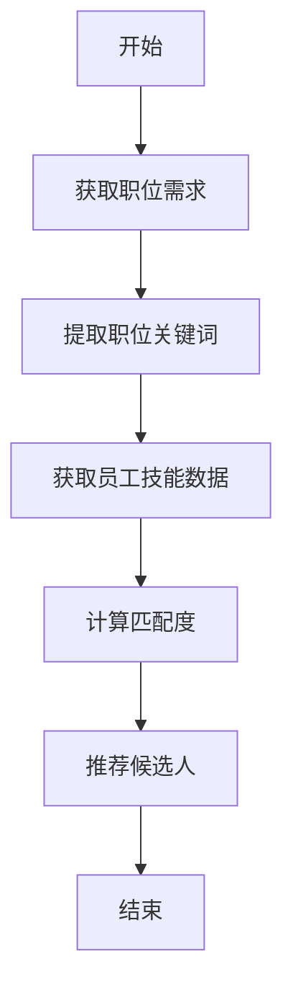
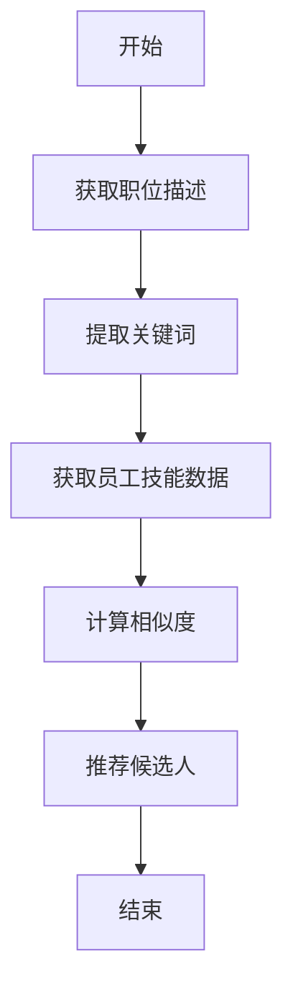
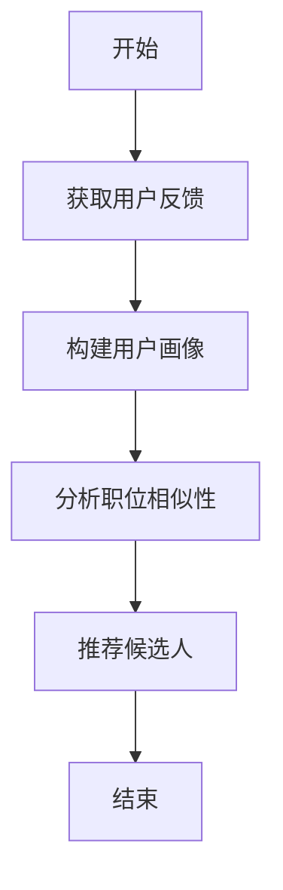
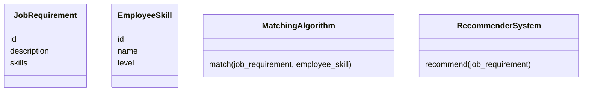
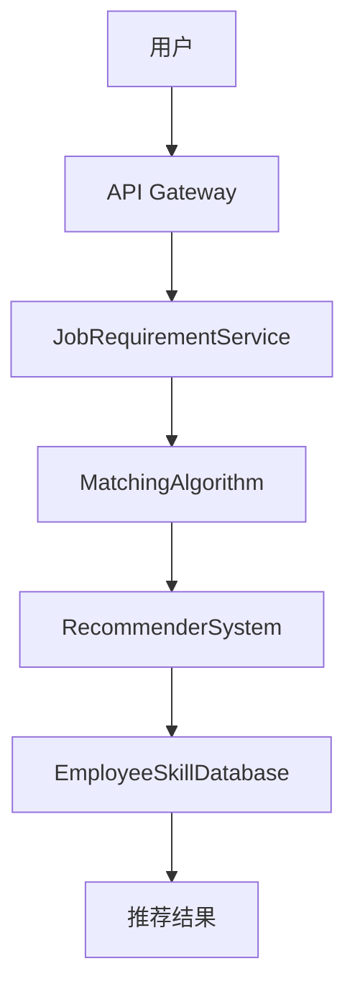
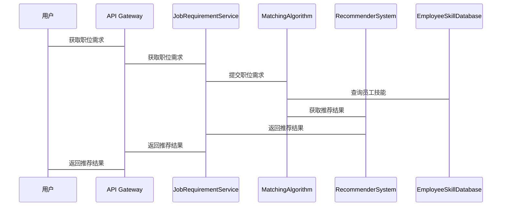

                 


# AI驱动的企业人才匹配系统：职位需求与员工技能智能匹配

## 关键词：AI驱动，人才匹配，职位需求，员工技能，智能匹配，推荐算法，系统架构

## 摘要：随着企业对高效人才匹配的需求不断增长，传统的招聘方式逐渐显现出效率低下、匹配不精准的问题。AI驱动的企业人才匹配系统通过智能化的职位需求分析和员工技能评估，实现了精准的人才推荐。本文详细探讨了该系统的背景、核心概念、算法原理、系统架构及实际应用，为读者提供了一个全面了解AI驱动人才匹配系统的技术视角。

---

# 第一部分: AI驱动的企业人才匹配系统概述

## 第1章: 问题背景与需求分析

### 1.1 传统企业人才匹配的痛点

#### 1.1.1 招聘效率低下的现状
在传统的人才招聘过程中，企业往往面临招聘信息分散、筛选效率低下的问题。企业HR需要花费大量时间浏览简历，难以快速找到符合要求的候选人。此外，传统招聘过程中，人岗匹配度不高，导致员工离职率高，企业用人成本上升。

#### 1.1.2 人岗匹配不精准的问题
传统招聘更多依赖于简历关键词匹配，这种方法难以全面评估候选人的实际能力和潜力。许多候选人虽然在简历上符合要求，但在实际工作中表现不佳，导致企业用人风险增加。

#### 1.1.3 企业用人成本高昂的挑战
传统招聘模式中，企业需要通过多个招聘渠道发布招聘信息，招聘过程漫长且成本高昂。尤其是在高端人才招聘中，企业往往需要投入大量资源，但效果却不尽如人意。

#### 1.1.4 人才流失与错配的后果
人岗错配不仅会导致员工工作效率低下，还会增加员工的流失率。员工在不适合的岗位上工作，容易产生职业倦怠，进而影响企业整体的绩效。

### 1.2 AI驱动人才匹配的解决方案

#### 1.2.1 智能化匹配的核心思想
AI驱动的人才匹配系统通过大数据分析和机器学习算法，能够精准地匹配职位需求与员工技能。系统可以实时分析职位要求和候选人能力，帮助企业在海量人才中快速找到最合适的候选人。

#### 1.2.2 数据驱动的人才评估方法
AI系统通过收集和分析大量的职位信息和员工数据，构建人才画像，实现对员工能力的全面评估。这种方法能够克服传统招聘中仅依赖简历信息的局限性。

#### 1.2.3 企业与员工双赢的匹配模式
AI驱动的人才匹配系统不仅能够提高企业的招聘效率，还能帮助员工找到更适合自己的岗位，实现企业和员工的双赢。员工在合适的岗位上能够充分发挥自己的潜力，从而提高工作满意度和忠诚度。

### 1.3 系统边界与功能外延

#### 1.3.1 系统功能边界
AI驱动的人才匹配系统主要聚焦于职位需求分析、员工技能评估、智能化匹配推荐等功能。系统不涉及企业内部的人力资源管理流程，如薪资计算、绩效考核等。

#### 1.3.2 功能模块的扩展性
系统的设计具有良好的扩展性，可以根据企业的具体需求增加更多的功能模块。例如，未来可以加入人才培养、职业发展规划等功能，进一步提升系统的价值。

#### 1.3.3 系统的适用范围与限制
该系统适用于各类企业，尤其是对技术人才需求较大的科技公司。然而，对于需要高度定制化匹配的小型企业，系统可能需要进行额外的配置和调整。

---

## 第2章: 核心概念与系统架构

### 2.1 职位需求与员工技能的匹配原理

#### 2.1.1 职位需求的分析模型
职位需求分析模型包括职位职责、任职资格、技能要求等多个维度。系统通过对职位描述的自然语言处理，提取关键信息，构建职位需求的向量表示。

#### 2.1.2 员工技能的评估体系
员工技能评估体系包括硬技能（如编程能力、项目经验）和软技能（如沟通能力、团队协作能力）。系统通过简历分析、在线测试等多种方式，对员工技能进行综合评估。

#### 2.1.3 匹配算法的设计思路
匹配算法的核心思想是将职位需求与员工技能进行多维度对比，计算匹配度。系统可以根据匹配度的高低，向企业推荐最合适的候选人。

### 2.2 核心概念对比分析

#### 2.2.1 职位需求与员工技能的属性对比
| 属性        | 职位需求          | 员工技能          |
|-------------|-------------------|-------------------|
| 类型        | 职位职责、技能要求 | 技能水平、经验     |
| 数据来源    | 招聘需求文档      | 简历、测试结果    |
| 分析方法    | 自然语言处理     | 统计分析、机器学习 |

#### 2.2.2 不同匹配算法的优劣势对比
| 算法类型     | 基于内容的推荐 | 协同过滤推荐 | 混合推荐 |
|-------------|----------------|--------------|---------|
| 优势         | 高度个性化推荐  | 群体智慧利用  | 高效准确 |
| 劣势         | 对冷启动问题敏感 | 计算复杂度高  | 实现难度大 |
| 适用场景     | 精准匹配         | 大规模推荐     | 综合推荐 |

#### 2.2.3 系统功能模块的对比分析
系统功能模块包括数据采集、数据处理、匹配算法、结果展示等。不同模块之间需要协同工作，确保系统的高效运行。

### 2.3 系统架构设计

#### 2.3.1 系统功能模块的划分
系统功能模块主要包括数据采集模块、数据处理模块、匹配算法模块和结果展示模块。每个模块都有明确的功能分工，确保系统的高效运行。

#### 2.3.2 系统架构的分层设计
系统架构采用分层设计，包括数据层、业务逻辑层和用户界面层。每一层都有清晰的职责划分，确保系统的可维护性和扩展性。

#### 2.3.3 系统核心算法的流程图
以下是系统核心算法的流程图：



---

# 第二部分: 算法原理与数学模型

## 第3章: 基于内容的推荐算法

### 3.1 算法原理

#### 3.1.1 基于内容的推荐模型
基于内容的推荐算法通过分析职位描述和员工技能的相似性，进行推荐。系统采用自然语言处理技术，提取职位和技能的关键特征，构建向量表示。

#### 3.1.2 职位需求与技能匹配的向量表示
职位需求和员工技能可以通过向量表示，计算它们之间的相似度。例如，使用TF-IDF方法提取关键词，构建向量表示。

#### 3.1.3 相似度计算公式
余弦相似度是一种常用的相似度计算方法。公式如下：

$$ \text{相似度} = \frac{\vec{A} \cdot \vec{B}}{|\vec{A}| \cdot |\vec{B}|} $$

其中，$\vec{A}$和$\vec{B}$分别是职位需求和员工技能的向量表示。

### 3.2 算法实现

#### 3.2.1 算法流程图
以下是基于内容的推荐算法的流程图：



#### 3.2.2 Python实现代码
以下是一个简单的Python实现示例：

```python
import numpy as np

def compute_similarity(job_description, employee_skill):
    # 提取关键词
    keywords = extract_keywords(job_description)
    skill_keywords = extract_keywords(employee_skill)
    
    # 计算向量表示
    vec_job = get_vector(keywords)
    vec_skill = get_vector(skill_keywords)
    
    # 计算相似度
    similarity = np.dot(vec_job, vec_skill) / (np.linalg.norm(vec_job) * np.linalg.norm(vec_skill))
    return similarity

def extract_keywords(text):
    # 自然语言处理，提取关键词
    pass

def get_vector(keywords):
    # 将关键词转换为向量
    pass
```

#### 3.2.3 代码功能解析
上述代码示例展示了如何通过自然语言处理提取关键词，并计算职位描述和员工技能的相似度。函数`compute_similarity`是核心算法，实现了基于内容的推荐逻辑。

---

## 第4章: 协同过滤推荐算法

### 4.1 算法原理

#### 4.1.1 基于用户的协同过滤
基于用户的协同过滤算法通过分析用户的相似性，推荐与目标用户相似的候选人。系统通过收集用户的反馈数据，构建用户画像。

#### 4.1.2 基于职位的协同过滤
基于职位的协同过滤算法通过分析职位之间的相似性，推荐与目标职位相似的候选人。系统通过分析历史招聘数据，构建职位网络。

#### 4.1.3 混合推荐模型的设计
混合推荐模型结合了基于内容的推荐和协同过滤推荐的优点，能够在大规模数据下实现高效的推荐。系统通过集成学习方法，优化推荐结果。

### 4.2 算法实现

#### 4.2.1 算法流程图
以下是协同过滤推荐算法的流程图：



#### 4.2.2 Python实现代码
以下是一个协同过滤推荐算法的实现示例：

```python
import numpy as np

def compute_similarity(user_profile, job_profile):
    # 计算用户和职位的相似度
    similarity = np.dot(user_profile, job_profile) / (np.linalg.norm(user_profile) * np.linalg.norm(job_profile))
    return similarity

def collaborative_filtering(user_data, job_data):
    # 计算用户相似性
    user_similarity = compute_similarity(user_data, user_data)
    # 推荐候选人
    recommendations = []
    for job in job_data:
        similarity = compute_similarity(user_profile, job)
        if similarity > threshold:
            recommendations.append(job)
    return recommendations
```

#### 4.2.3 代码功能解析
上述代码示例展示了如何通过协同过滤算法，计算用户和职位的相似度，并推荐候选人。函数`compute_similarity`是核心算法，实现了相似度计算逻辑。

---

## 第5章: 系统分析与架构设计方案

### 5.1 问题场景介绍
系统旨在解决企业招聘过程中的效率低下和匹配不精准的问题。通过AI技术，帮助企业快速找到合适的候选人，降低用人成本。

### 5.2 项目介绍
本项目旨在开发一个AI驱动的企业人才匹配系统，通过智能化的职位需求分析和员工技能评估，实现精准的人才推荐。

### 5.3 系统功能设计

#### 5.3.1 领域模型类图
以下是系统功能模块的类图：



### 5.4 系统架构设计

#### 5.4.1 系统架构图
以下是系统架构设计图：



#### 5.4.2 系统接口设计
系统提供RESTful API接口，支持以下功能：
- 获取职位需求
- 提交员工技能
- 获取推荐结果

#### 5.4.3 系统交互序列图
以下是系统交互序列图：



---

## 第6章: 项目实战

### 6.1 环境安装

#### 6.1.1 安装Python
安装Python 3.8或更高版本。

#### 6.1.2 安装依赖库
安装以下依赖库：
```bash
pip install numpy
pip install scikit-learn
pip install spacy
```

### 6.2 系统核心实现

#### 6.2.1 数据预处理
数据预处理包括清洗数据、提取关键词等步骤。以下是一个示例：

```python
import spacy

nlp = spacy.load("en_core_web_sm")

def extract_keywords(text):
    doc = nlp(text)
    keywords = []
    for token in doc:
        if token.is_stop:
            continue
        keywords.append(token.text)
    return keywords
```

#### 6.2.2 推荐算法实现
实现基于内容的推荐算法：

```python
def compute_similarity(job_description, employee_skill):
    keywords_job = extract_keywords(job_description)
    keywords_skill = extract_keywords(employee_skill)
    
    vec_job = get_vector(keywords_job)
    vec_skill = get_vector(keywords_skill)
    
    similarity = np.dot(vec_job, vec_skill) / (np.linalg.norm(vec_job) * np.linalg.norm(vec_skill))
    return similarity
```

#### 6.2.3 系统接口设计
系统接口采用RESTful API设计，使用Flask框架实现：

```python
from flask import Flask, request, jsonify

app = Flask(__name__)

@app.route('/api/match', methods=['POST'])
def match():
    job_description = request.json['job_description']
    employee_skill = request.json['employee_skill']
    similarity = compute_similarity(job_description, employee_skill)
    return jsonify({'similarity': similarity})

if __name__ == '__main__':
    app.run()
```

### 6.3 代码应用解读与分析
上述代码示例展示了如何实现一个简单的AI驱动人才匹配系统。系统通过自然语言处理提取关键词，计算职位描述和员工技能的相似度，并通过RESTful API提供推荐服务。

### 6.4 实际案例分析
以下是一个实际案例分析：

某科技公司需要招聘一名Python开发工程师。系统通过分析职位描述，提取关键词“Python”、“开发”、“编程”，并匹配员工技能数据库中具有相关技能的候选人。系统计算相似度，推荐最合适的候选人。

### 6.5 项目小结
通过本项目的实施，企业能够显著提高招聘效率，降低用人成本。系统实现了智能化的人才匹配，帮助企业快速找到合适的候选人。

---

## 第7章: 最佳实践与小结

### 7.1 最佳实践 tips
- 确保数据质量，清洗和预处理数据
- 使用多种算法进行推荐，提高匹配精度
- 定期更新系统，适应市场需求变化

### 7.2 小结
AI驱动的企业人才匹配系统通过智能化的职位需求分析和员工技能评估，实现了精准的人才推荐。系统能够显著提高企业的招聘效率，降低用人成本，是未来企业招聘的重要趋势。

### 7.3 注意事项
- 确保数据隐私和安全
- 定期更新算法模型，保持推荐精度
- 提供用户友好的交互界面

### 7.4 拓展阅读
- 《推荐系统实践》
- 《机器学习实战》
- 《自然语言处理入门》

---

# 结语
AI驱动的企业人才匹配系统是企业招聘的未来发展方向。通过智能化的职位需求分析和员工技能评估，系统能够帮助企业快速找到合适的候选人，实现企业和员工的双赢。随着技术的不断发展，AI驱动的人才匹配系统将更加智能化和个性化，为企业提供更高效的服务。

--- 

**作者简介：**  
本文作者是[您的姓名]，[您的职位]，[您的公司]。作为人工智能和企业技术领域的专家，作者在[领域]方面有着丰富的经验，并致力于通过技术手段推动企业效率的提升。

