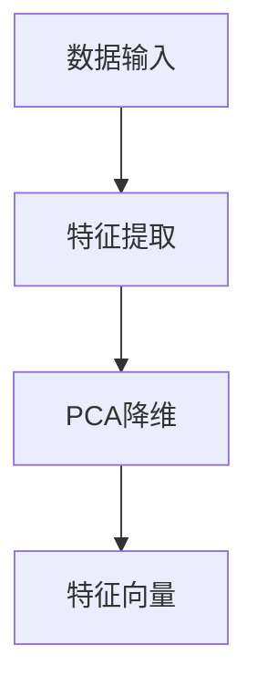
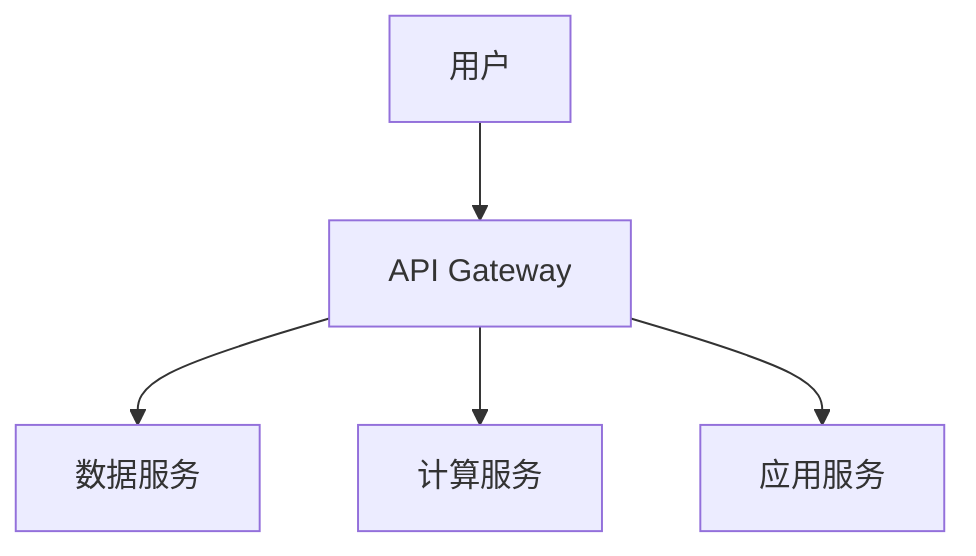

                 


# AI驱动的企业人才画像系统：全方位员工能力评估

---

## 关键词：
AI驱动，人才画像，员工能力评估，系统架构，算法原理，项目实战

---

## 摘要：
本文深入探讨了AI驱动的企业人才画像系统在员工能力评估中的应用。通过分析传统人才评估方法的局限性，提出了基于AI的多维度人才画像构建方法，并详细阐述了系统的算法原理、架构设计、项目实现及实际应用场景。文章从背景介绍、核心概念、算法实现、系统架构到项目实战，层层递进，为读者提供了一个全面的技术视角，帮助企业在数字化转型中更好地实现人才管理的智能化与高效化。

---

# 第一部分：AI驱动的人才画像系统背景与概念

## 第1章：企业人才画像系统概述

### 1.1 问题背景与需求分析
#### 1.1.1 传统企业人才评估的局限性
传统的员工能力评估主要依赖主观评价、绩效考核和少量的KPI指标，存在以下问题：
- **主观性**：评估结果受评估者主观因素影响较大，缺乏客观依据。
- **片面性**：仅关注部分指标，难以全面反映员工的综合能力。
- **低效性**：人工评估耗时且成本高，难以实现大规模应用。

#### 1.1.2 AI技术在人才评估中的优势
AI技术的引入为人才评估带来了革命性的变化：
- **数据驱动**：通过分析海量数据，提供更客观、全面的评估结果。
- **自动化与智能化**：AI能够快速处理大量数据，实现自动化评估和预测。
- **动态更新**：基于实时数据更新员工画像，保持评估结果的准确性。

#### 1.1.3 当前企业人才管理的痛点与挑战
- **数据孤岛**：企业内部数据分散，难以整合。
- **评估维度单一**：传统评估方法难以覆盖员工的多维度能力。
- **效率低下**：人工评估耗时长，难以满足企业快速发展的需求。

### 1.2 人才画像系统的核心概念
#### 1.2.1 人才画像的定义与内涵
人才画像是一种基于数据驱动的方法，通过分析员工的多维度数据（如工作表现、技能、性格特征等），构建一个全面反映员工能力的数字化模型。

#### 1.2.2 系统的目标与功能定位
- **目标**：帮助企业在招聘、培训、晋升等环节实现数据化、智能化决策。
- **功能定位**：提供员工能力评估、岗位匹配、潜力预测等功能。

#### 1.2.3 系统的边界与外延
- **边界**：聚焦于员工能力评估，不涉及员工的隐私保护和数据安全问题。
- **外延**：可扩展至企业组织优化、团队协作能力评估等领域。

---

## 第2章：人才画像系统的构建基础

### 2.1 数据来源与特征提取
#### 2.1.1 数据来源的多样性
人才画像的数据来源包括：
- **结构化数据**：绩效考核数据、考勤记录。
- **非结构化数据**：简历、面试记录、工作邮件。

#### 2.1.2 关键特征的提取方法
- **文本挖掘**：从简历和工作邮件中提取关键词。
- **行为分析**：基于员工的行为数据（如会议参与度）提取特征。

#### 2.1.3 数据预处理与清洗
- 数据清洗：处理缺失值、异常值。
- 数据标准化：对不同数据源进行统一处理。

### 2.2 画像构建的核心方法
#### 2.2.1 基于AI的画像构建原理
- **深度学习**：通过神经网络模型提取高维特征。
- **聚类分析**：将相似的员工分组，形成画像模板。

#### 2.2.2 多维度评估指标的设计
- **评估维度**：包括技能水平、团队协作能力、创新能力等。
- **指标权重**：根据岗位需求动态调整指标权重。

#### 2.2.3 画像的动态更新机制
- **实时更新**：基于最新的数据动态更新员工画像。
- **反馈机制**：根据评估结果调整画像模型。

---

## 第3章：人才画像系统的算法原理

### 3.1 特征提取与降维算法
#### 3.1.1 基于深度学习的特征提取
- **神经网络模型**：如Word2Vec、BERT，用于提取文本特征。
- **特征表示**：将文本特征映射到低维空间。

#### 3.1.2 主成分分析（PCA）的原理与应用
- **PCA原理**：通过线性变换将数据降维，同时保留主要信息。
- **应用**：用于处理高维数据，减少计算复杂度。

#### 3.1.3 算法流程图（Mermaid）


### 3.2 相似度计算与聚类分析
#### 3.2.1 基于余弦相似度的计算
- **公式**：$$\text{相似度} = \frac{\vec{A} \cdot \vec{B}}{|\vec{A}| |\vec{B}|}$$
- **应用**：用于衡量两个员工画像的相似程度。

#### 3.2.2 K-means聚类算法的实现
- **步骤**：
  1. 初始化聚类中心。
  2. 计算每个样本到聚类中心的距离。
  3. 更新聚类中心，直到收敛。

#### 3.2.3 聚类结果的可视化
- **可视化工具**：如t-SNE，用于将聚类结果映射到二维空间。

---

## 第4章：人才画像系统的系统架构与功能设计

### 4.1 系统整体架构
#### 4.1.1 分层架构设计
- **数据层**：负责数据的采集与存储。
- **计算层**：处理数据，生成特征向量。
- **应用层**：提供用户界面，展示评估结果。

#### 4.1.2 微服务架构的优势
- **模块化**：功能模块独立，便于扩展。
- **高可用性**：通过负载均衡实现服务冗余。

#### 4.1.3 系统架构图（Mermaid）


### 4.2 功能模块设计
#### 4.2.1 数据采集模块
- **功能**：从多种数据源采集员工数据。
- **技术**：使用ETL工具进行数据抽取。

#### 4.2.2 画像构建模块
- **功能**：基于算法生成员工画像。
- **技术**：采用深度学习模型进行特征提取。

#### 4.2.3 评估报告生成模块
- **功能**：生成个性化评估报告。
- **技术**：结合自然语言处理生成报告内容。

---

## 第5章：人才画像系统的项目实战

### 5.1 环境安装与配置
- **Python环境**：安装Python 3.8以上版本。
- **框架选择**：使用TensorFlow或PyTorch框架。

### 5.2 核心代码实现
#### 5.2.1 数据预处理代码
```python
import pandas as pd
import numpy as np

# 读取数据
data = pd.read_csv('employee_data.csv')

# 数据清洗
data.dropna(inplace=True)
data = pd.get_dummies(data)
```

#### 5.2.2 特征提取与降维代码
```python
from sklearn.decomposition import PCA

# 初始化PCA模型
pca = PCA(n_components=2)
principal_components = pca.fit_transform(data)
```

#### 5.2.3 聚类分析代码
```python
from sklearn.cluster import KMeans

# 初始化K-means模型
kmeans = KMeans(n_clusters=3, random_state=0)
clusters = kmeans.fit_predict(principal_components)
```

### 5.3 案例分析与实际应用
- **案例背景**：某IT公司希望通过人才画像系统优化招聘流程。
- **实施步骤**：
  1. 数据采集与清洗。
  2. 特征提取与建模。
  3. 生成评估报告。

---

## 第6章：总结与展望

### 6.1 小结
本文详细介绍了AI驱动的人才画像系统，从背景、核心概念到算法实现，再到系统架构与项目实战，为读者提供了一个全面的技术视角。

### 6.2 注意事项
- 数据隐私保护。
- 模型的可解释性。

### 6.3 拓展阅读
- 推荐阅读《机器学习实战》和《深度学习入门》。

---

通过本文的分析，企业可以更好地利用AI技术实现人才管理的智能化，为企业的可持续发展提供有力支持。

