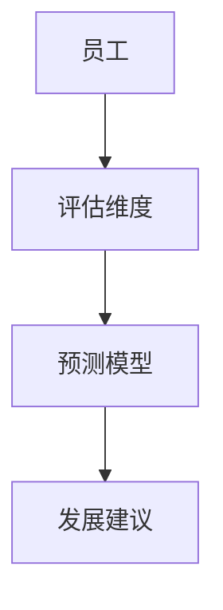
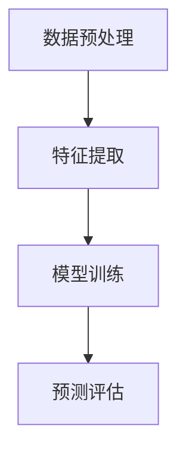
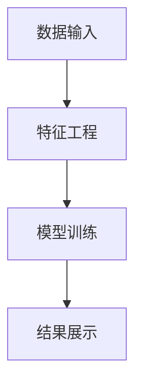
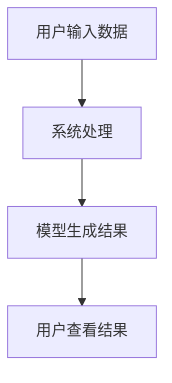

                 


# AI驱动的企业人才画像系统：多维度能力评估与发展预测

## 关键词：
- AI驱动
- 企业人才画像
- 多维度能力评估
- 发展预测
- 机器学习
- 人工智能
- 系统架构

## 摘要：
随着企业对人才管理需求的日益增长，传统的基于经验的人才评估方法已经难以满足现代企业的复杂需求。AI驱动的企业人才画像系统通过多维度的数据分析和预测模型，能够帮助企业更精准地评估员工能力，并预测其未来发展潜力。本文将从背景介绍、核心概念、算法原理、系统架构、项目实战等多个维度，深入探讨AI在企业人才管理中的应用，为企业构建智能化的人才画像系统提供理论支持和实践指导。

---

## 第一部分: 企业人才画像系统概述

### 第1章: 问题背景与核心概念

#### 1.1 问题背景
- **传统人才评估的局限性**：基于主观经验和单维度指标的评估方法难以全面反映员工的真实能力和潜力。
- **数据驱动管理的需求**：企业希望通过数据分析实现人才管理的客观性和科学性。
- **AI技术的应用潜力**：人工智能技术在数据处理、模式识别和预测分析方面的优势为人才画像系统提供了技术支持。

#### 1.2 核心概念与定义
- **人才画像**：通过多维度数据构建的员工能力模型，能够反映员工的知识、技能、潜力和发展路径。
- **多维度评估**：包括知识储备、技能水平、工作表现、发展潜力等多个维度。
- **发展预测**：基于历史数据和模型预测员工未来的职业发展轨迹。

#### 1.3 系统边界与外延
- **边界**：系统聚焦于员工能力评估和未来发展预测，不涉及薪酬管理和绩效考核。
- **外延**：未来可能扩展至人才招聘、团队优化和领导力培养等领域。

### 第2章: 核心概念与联系

#### 2.1 核心概念原理
- **数据采集**：通过企业系统（如HR系统、绩效系统）获取员工的历史数据。
- **特征提取**：从数据中提取关键特征，例如工作绩效、技能评分、学习曲线等。
- **模型训练**：基于机器学习算法构建预测模型，评估员工的潜力和发展方向。

#### 2.2 概念属性对比表
| 评估维度   | 特征描述               | 数据来源       | 示例指标                     |
|------------|------------------------|----------------|------------------------------|
| 知识储备   | 员工的知识深度与广度   | 学历、培训记录 | 专业技能认证、课程完成情况 |
| 技能水平   | 员工的技能熟练程度     | 考核成绩、项目表现 | 技能评估分数、项目完成质量   |
| 工作表现   | 员工的实际工作成果     | 绩效考核数据 | KPI达成率、任务完成速度     |
| 发展潜力   | 员工未来成长的可能性   | 学习曲线、创新表现 | 学习速度、创新贡献           |

#### 2.3 实体关系图


---

## 第二部分: 算法原理与数学模型

### 第3章: 算法原理讲解

#### 3.1 算法流程图


#### 3.2 代码实现
```python
import pandas as pd
from sklearn.model import LinearRegression

# 示例数据加载
data = pd.read_csv('employee_data.csv')

# 特征提取
features = data[['学历', '培训次数', '绩效评分']]
target = data['发展潜力']

# 模型训练
model = LinearRegression()
model.fit(features, target)

# 预测评估
predicted = model.predict(features)
```

#### 3.3 数学模型
- **线性回归模型**：
  $$ y = \beta_0 + \beta_1 x_1 + \beta_2 x_2 + ... + \beta_n x_n $$
  其中，$y$ 是目标变量（发展潜力），$x_i$ 是特征变量（如学历、绩效评分）。

- **评估指标**：
  $$ R^2 = 1 - \frac{\sum (y_i - \hat{y}_i)^2}{\sum (y_i - \bar{y})^2} $$
  其中，$R^2$ 是决定系数，用于衡量模型的拟合优度。

---

## 第三部分: 系统分析与架构设计方案

### 第4章: 系统分析与设计

#### 4.1 应用场景介绍
- **典型场景**：企业内部的人才培养、招聘决策、团队优化等。
- **目标用户**：企业HR部门、管理者、员工。

#### 4.2 系统功能设计
- **数据输入模块**：接收员工的历史数据。
- **特征工程模块**：提取和处理特征。
- **模型训练模块**：构建和优化预测模型。
- **结果展示模块**：输出评估结果和发展建议。

#### 4.3 系统架构图


#### 4.4 接口设计
- **输入接口**：API接口接收员工数据。
- **输出接口**：API返回评估结果。

#### 4.5 交互流程图


---

## 第四部分: 项目实战

### 第5章: 项目实战与案例分析

#### 5.1 环境安装
- **工具安装**：Python、Pandas、Scikit-learn。
- **数据准备**：获取员工数据集。

#### 5.2 核心代码实现
```python
import pandas as pd
from sklearn.metrics import mean_squared_error

# 数据加载与预处理
data = pd.read_csv('employee_data.csv')
data = data.dropna()

# 特征与目标分离
X = data.drop('发展潜力', axis=1)
y = data['发展潜力']

# 模型训练
from sklearn.model import LinearRegression
model = LinearRegression()
model.fit(X, y)

# 模型评估
predicted = model.predict(X)
print(mean_squared_error(y, predicted))
```

#### 5.3 案例分析
- **案例背景**：某公司希望通过AI系统预测员工的发展潜力。
- **数据分析**：基于学历、绩效评分、培训次数等多个维度，构建预测模型。
- **结果解读**：模型预测部分员工的潜力较高，适合重点培养。

#### 5.4 项目小结
- **成功经验**：数据质量对模型性能影响显著。
- **改进建议**：引入更多维度的数据（如创新能力）提升预测精度。

---

## 第五部分: 最佳实践与总结

### 第6章: 最佳实践与注意事项

#### 6.1 小结
- AI驱动的人才画像系统能够显著提升企业的人才管理效率。
- 数据质量和模型选择是系统成功的关键。

#### 6.2 注意事项
- **数据隐私**：确保员工数据的安全性。
- **模型解释性**：选择可解释性较强的模型，便于业务人员理解。
- **持续优化**：定期更新模型，适应业务变化。

#### 6.3 拓展阅读
- 推荐阅读《机器学习实战》、《数据驱动的决策》等书籍。

---

## 结语
AI驱动的企业人才画像系统通过多维度的数据分析和预测模型，为企业提供了科学、高效的人才管理工具。随着技术的不断发展，未来的系统将更加智能化和个性化，帮助企业更好地实现人才战略目标。

