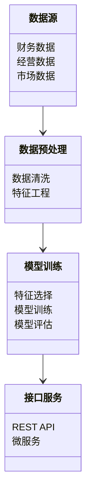
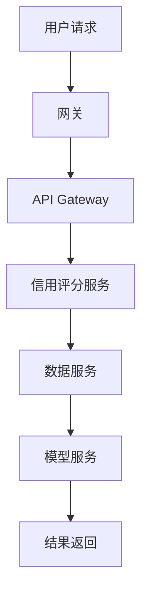
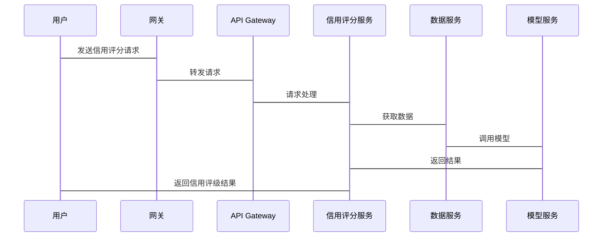

                 


# AI驱动的企业信用评级

## 关键词：AI, 企业信用评级, 机器学习, 风险评估, 数据分析

## 摘要：  
随着人工智能技术的快速发展，企业信用评级的传统方法正面临巨大变革。本文将深入探讨如何利用AI技术提升企业信用评级的效率和准确性，通过分析数据特征、选择合适的算法模型、设计合理的系统架构，以及提供实际项目实战，全面展示AI在信用评级中的应用。文章从背景介绍、核心概念、算法原理、系统架构到项目实战，层层展开，帮助读者全面理解AI驱动的企业信用评级。

---

# 第一部分: AI驱动的企业信用评级概述

## 第1章: 企业信用评级的背景与挑战

### 1.1 企业信用评级的基本概念  
企业信用评级是对企业财务状况、经营能力、偿债能力等多方面进行综合评估，以确定企业在信贷活动中的信用等级。信用评级结果直接影响企业的融资成本和市场信任度。传统的信用评级依赖人工经验判断，存在主观性强、效率低、覆盖面窄等问题。

### 1.2 AI在信用评级中的应用背景  
AI技术的快速发展为企业信用评级提供了新的解决方案。通过机器学习算法，可以从海量数据中提取有价值的信息，发现传统方法难以察觉的风险点。AI的引入使得信用评级更加客观、高效和精准。

### 1.3 企业信用评级的挑战与机遇  
#### 1.3.1 数据质量与获取的挑战  
企业信用评级需要依赖高质量的数据，包括财务数据、经营数据、市场数据等。然而，数据获取难、数据缺失、数据噪声等问题仍然存在。

#### 1.3.2 模型解释性与风险控制的难点  
AI模型虽然在预测能力上表现出色，但其黑箱特性使得模型的解释性较差，难以满足金融领域对风险控制的严格要求。

#### 1.3.3 AI技术带来的创新与效率提升  
AI技术通过自动化数据处理、智能特征提取和高效模型训练，显著提升了信用评级的效率和准确性。特别是在处理非结构化数据方面，AI展现了独特的优势。

---

# 第二部分: AI驱动信用评级的核心概念与技术

## 第2章: 信用评级中的数据特征分析

### 2.1 企业信用评级的关键数据特征  
#### 2.1.1 财务数据特征  
- 营业收入、净利润、资产负债率、流动比率等财务指标是评估企业信用的重要依据。

#### 2.1.2 经营数据特征  
- 市场占有率、品牌价值、研发投入、客户满意度等反映企业经营能力的指标。

#### 2.1.3 偿债能力与风险数据特征  
- 现金流、应收账款、应付账款、违约历史等与企业偿债能力相关的数据。

### 2.2 数据预处理与特征工程  
#### 2.2.1 数据清洗与缺失值处理  
- 对缺失数据进行插值处理或删除，确保数据完整性和准确性。

#### 2.2.2 特征选择与降维技术  
- 使用相关性分析、主成分分析（PCA）等方法优化特征集。

#### 2.2.3 数据标准化与归一化  
- 对不同量纲的特征进行标准化处理，如min-max归一化或z-score标准化。

### 2.3 数据特征的可视化分析  
#### 2.3.1 数据分布的可视化  
- 使用柱状图、折线图等展示特征分布情况。

#### 2.3.2 特征重要性分析的可视化  
- 使用特征重要性评分，绘制热力图或条形图。

#### 2.3.3 数据关联性的可视化  
- 使用散点图、相关性矩阵图展示特征之间的关联性。

---

## 第3章: AI驱动信用评级的核心算法原理

### 3.1 信用评级中的常用算法  
#### 3.1.1 线性回归模型  
- **原理**: 线性回归通过拟合一条直线来预测目标变量，适用于线性关系的场景。  
- **公式**: $$ y = wx + b $$  
- **流程图**:  
  ```mermaid
  graph TD
      A[特征输入] --> B[计算预测值]
      B --> C[计算误差]
      C --> D[更新权重]
      D --> E[迭代优化]
  ```

#### 3.1.2 逻辑回归模型  
- **原理**: 逻辑回归通过sigmoid函数将线性回归的结果映射到概率空间，用于分类问题。  
- **公式**: $$ P(y=1|x) = \frac{e^{wx+b}}{1+e^{wx+b}} $$  
- **流程图**:  
  ```mermaid
  graph TD
      A[特征输入] --> B[计算概率]
      B --> C[分类结果]
  ```

#### 3.1.3 随机森林模型  
- **原理**: 随机森林通过构建多棵决策树，并行投票机制进行分类或回归。  
- **流程图**:  
  ```mermaid
  graph TD
      A[特征输入] --> B[生成决策树]
      B --> C[投票预测]
  ```

#### 3.1.4 神经网络模型  
- **原理**: 神经网络通过多层感知机模拟人脑神经网络，具备强大的非线性拟合能力。  
- **公式**: $$ a^{(l+1)} = \sigma(w^{(l)}a^{(l)} + b^{(l)}) $$  
- **流程图**:  
  ```mermaid
  graph TD
      A[特征输入] --> B[输入层]
      B --> C[隐藏层]
      C --> D[输出层]
  ```

---

# 第三部分: 系统分析与架构设计方案

## 第4章: 系统分析与架构设计

### 4.1 问题场景介绍  
企业信用评级系统需要处理海量数据，支持多用户同时访问，并具备高可用性和扩展性。

### 4.2 系统功能设计  
#### 4.2.1 领域模型  


### 4.3 系统架构设计  


### 4.4 系统接口设计  
- **输入接口**: REST API接受企业的基础数据和财务数据。
- **输出接口**: 返回信用评级结果和相关分析报告。

### 4.5 系统交互设计  


---

# 第四部分: 项目实战

## 第5章: 项目实战与案例分析

### 5.1 环境安装  
- **Python环境**: 安装Python 3.8以上版本。
- **依赖库安装**: 使用pip安装numpy、pandas、scikit-learn、xgboost、keras等库。

### 5.2 核心代码实现  
#### 5.2.1 数据预处理代码  
```python
import pandas as pd
from sklearn.impute import SimpleImputer
from sklearn.preprocessing import StandardScaler

# 读取数据
data = pd.read_csv('企业信用数据.csv')

# 处理缺失值
imputer = SimpleImputer(strategy='mean')
data_imputed = imputer.fit_transform(data)

# 标准化处理
scaler = StandardScaler()
data_scaled = scaler.fit_transform(data_imputed)
```

#### 5.2.2 模型训练代码  
```python
from sklearn.ensemble import RandomForestClassifier
from sklearn.metrics import accuracy_score

# 初始化模型
model = RandomForestClassifier(n_estimators=100, max_depth=4)

# 训练模型
model.fit(X_train, y_train)

# 模型预测
y_pred = model.predict(X_test)

# 计算准确率
print("准确率:", accuracy_score(y_test, y_pred))
```

### 5.3 案例分析  
以某制造企业为例，通过数据清洗、特征提取和模型训练，最终得到该企业的信用评级为AA级。整个过程展示了AI在信用评级中的高效性和准确性。

### 5.4 项目总结  
本项目通过AI技术实现了企业信用评级的自动化和智能化，验证了AI在金融领域的巨大潜力。

---

# 第五部分: 最佳实践与拓展阅读

## 第6章: 最佳实践与注意事项

### 6.1 最佳实践  
- 数据预处理是关键，确保数据质量和完整性。
- 选择合适的算法模型，根据业务需求和数据特征进行调整。
- 模型部署后，定期监控和更新，确保模型的准确性和稳定性。

### 6.2 小结  
AI技术正在深刻改变企业信用评级的方式，通过数据驱动和智能算法，信用评级变得更加精准和高效。

### 6.3 注意事项  
- 数据隐私和安全问题必须重视。
- 模型的解释性是金融领域的重要需求，需选择适合的解释方法。
- 持续优化模型，结合实时数据进行动态调整。

### 6.4 拓展阅读  
- 《机器学习实战》
- 《Python机器学习》
- 《信用评分模型》

---

# 结语  
AI驱动的企业信用评级不仅提升了效率，还为企业的融资和风险管理提供了新的思路。随着技术的不断进步，AI在信用评级中的应用将更加广泛和深入。

