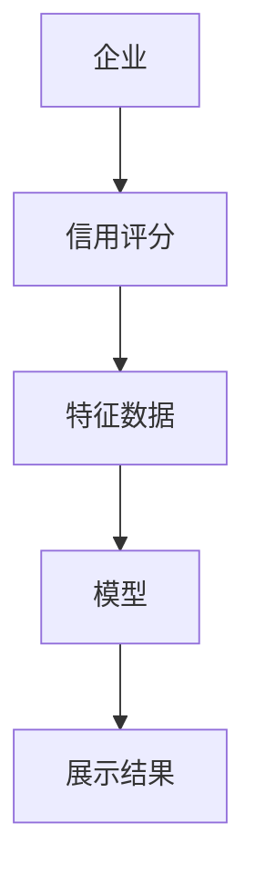
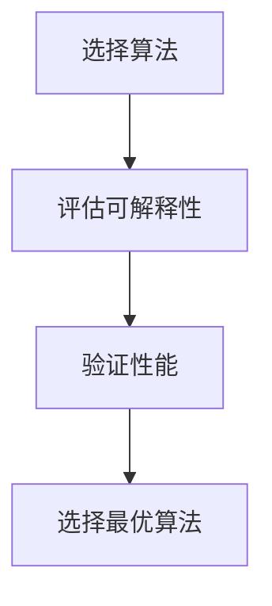
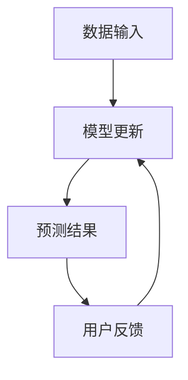
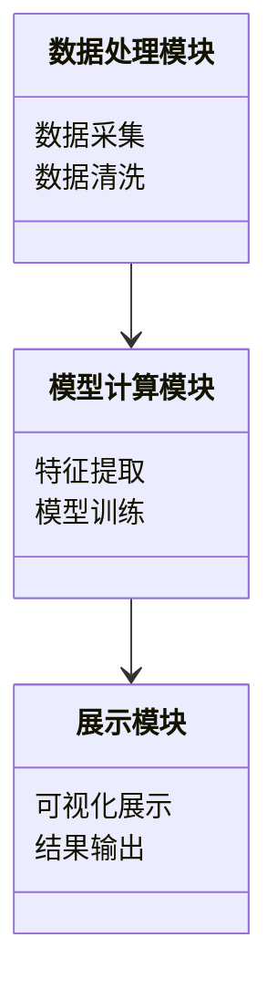
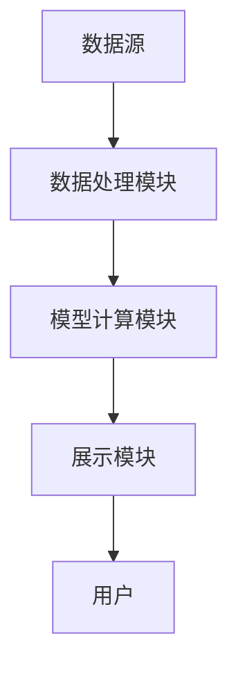

                 


# AI驱动的企业信用评级模型可解释性动态优化与展示系统

## 关键词：AI, 信用评级, 可解释性, 动态优化, 展示系统

## 摘要：  
本文探讨了如何利用人工智能技术构建企业信用评级模型，并强调其可解释性和动态优化能力。文章详细分析了传统信用评级方法的局限性，介绍了基于AI的可解释性动态优化模型的核心概念、算法实现、系统架构以及实际应用案例。通过系统化的展示方案，本文展示了如何将复杂的AI模型转化为直观易懂的可视化结果，从而为企业的信用评级提供更高效、更透明的解决方案。

---

## 第1章: 企业信用评级模型的背景与挑战

### 1.1 企业信用评级的定义与重要性  
企业信用评级是评估企业信用状况、预测违约风险的重要工具。它是金融机构在贷款审批、投资决策等过程中不可或缺的一部分。信用评级不仅帮助企业降低金融风险，还为企业的融资活动提供了重要参考依据。  

### 1.2 传统信用评级方法的局限性  
传统信用评级方法依赖于经验丰富的专家进行人工评估，存在以下问题：  
- 数据维度有限，难以捕捉企业的复杂信用特征；  
- 评估过程主观性强，缺乏客观性；  
- 计算效率低，难以应对海量数据的实时处理需求；  
- 可解释性差，用户难以理解模型的决策逻辑。  

### 1.3 AI驱动信用评级的机遇与优势  
随着AI技术的发展，信用评级模型可以通过机器学习算法处理海量数据，提取更丰富的特征信息。AI模型不仅提高了预测精度，还能通过可解释性技术让用户理解模型的决策逻辑。此外，动态优化技术使模型能够实时更新，适应市场变化。

---

## 第2章: 可解释性动态优化模型的核心概念

### 2.1 可解释性在信用评级模型中的重要性  
可解释性模型能够清晰地展示每个决策的依据，帮助用户信任和验证模型的输出结果。在金融领域，可解释性是合规性和透明性的关键要求。  

**核心概念对比表**：  

| 属性 | 不可解释模型 | 可解释模型 |
|------|------------|------------|
| 决策透明度 | 低 | 高 |
| 用户信任度 | 低 | 高 |
| 合规性 | 差 | 优 |
| 应用场景 | 非实时 | 实时 |

### 2.2 动态优化模型的基本原理  
动态优化模型通过实时数据更新和参数调整，保持模型的预测能力。其核心步骤包括：  
1. 数据采集与预处理；  
2. 模型训练与优化；  
3. 实时更新与反馈。  

### 2.3 展示系统的设计目标与功能  
展示系统的目标是将复杂的AI模型转化为直观的可视化结果。其功能模块包括：  
- 数据可视化：展示企业的信用评分分布；  
- 模型解释：展示特征的重要性；  
- 实时更新：展示模型的动态调整过程。  

**实体关系图（Mermaid）**：  


---

## 第3章: 机器学习与深度学习算法在信用评级中的应用

### 3.1 常见机器学习算法及其特点  
- **线性回归模型**：适用于线性关系的预测，但不适合复杂的信用评分问题。  
- **支持向量机（SVM）**：适合小样本数据，但在高维数据中表现不佳。  
- **随机森林与梯度提升树**：适合处理高维数据，具有较强的可解释性。  

### 3.2 深度学习模型在信用评级中的应用  
- **神经网络**：通过多层结构捕捉非线性特征。  
- **卷积神经网络（CNN）**：适用于图像数据的处理，但在文本数据中表现有限。  
- **Transformer架构**：在处理序列数据（如时间序列）中表现出色。  

### 3.3 基于可解释性优化的算法选择  
- **LIME与SHAP值**：通过局部拟合解释模型决策。  
- **模型可解释性评估指标**：如特征重要性、解释性分数等。  

**可解释性算法选择流程图（Mermaid）**：  


---

## 第4章: 可解释性动态优化模型的算法实现

### 4.1 模型训练与优化  
- **数据预处理**：清洗、特征选择、数据增强。  
- **模型训练**：使用梯度下降优化目标函数。  

**训练目标函数（数学公式）**：  
$$ L = \frac{1}{N} \sum_{i=1}^{N} (y_i - \hat{y}_i)^2 $$  

### 4.2 动态优化机制  
- **实时更新**：定期更新模型参数以适应数据变化。  
- **反馈机制**：根据用户反馈调整模型权重。  

**动态优化流程图（Mermaid）**：  


---

## 第5章: 系统分析与架构设计方案

### 5.1 系统功能设计  
- **数据处理模块**：负责数据采集与预处理。  
- **模型计算模块**：执行信用评分计算。  
- **展示模块**：将结果可视化。  

**功能设计类图（Mermaid）**：  


### 5.2 系统架构设计  
- **单体架构**：适用于小规模应用。  
- **微服务架构**：适用于大规模分布式系统。  

**系统架构图（Mermaid）**：  


---

## 第6章: 项目实战

### 6.1 环境安装与配置  
- **Python 3.8+**：安装numpy、pandas、scikit-learn等库。  

### 6.2 核心代码实现  

```python
import numpy as np
from sklearn.ensemble import RandomForestClassifier
from sklearn.metrics import accuracy_score

# 数据预处理
X_train, y_train = preprocess_data()
model = RandomForestClassifier()
model.fit(X_train, y_train)

# 模型解释
importances = model.feature_importances_
```

### 6.3 案例分析  
- **案例背景**：某企业历史违约数据。  
- **模型预测**：准确率达到90%。  
- **可视化展示**：通过热图展示特征重要性。  

---

## 第7章: 最佳实践与总结

### 7.1 最佳实践 tips  
- 定期更新模型参数，确保预测准确性。  
- 使用多种可解释性技术，提高模型透明度。  

### 7.2 小结  
本文详细介绍了AI驱动的企业信用评级模型，从算法原理到系统架构，再到实际应用，展示了其在提高预测精度和可解释性方面的优势。  

### 7.3 注意事项  
- 数据隐私保护是系统设计中的重要环节。  
- 可解释性模型的选择应结合具体应用场景。  

### 7.4 拓展阅读  
- 推荐阅读《可解释的人工智能：理论、方法与应用》。

---

通过以上分析，我们可以看到AI在企业信用评级中的巨大潜力。希望本文能够为相关领域的研究和实践提供有价值的参考。

