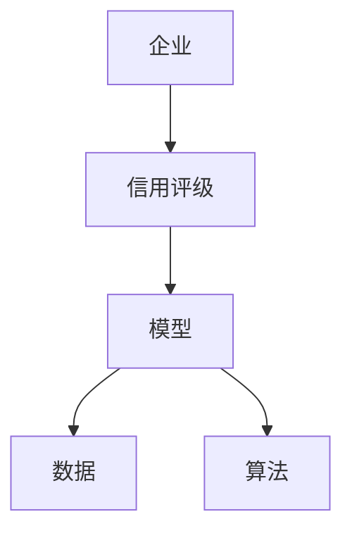
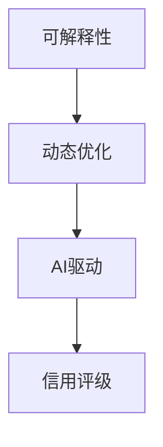
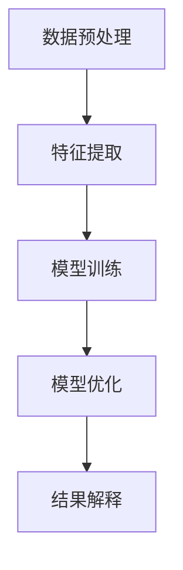
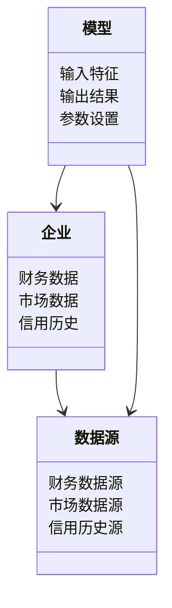
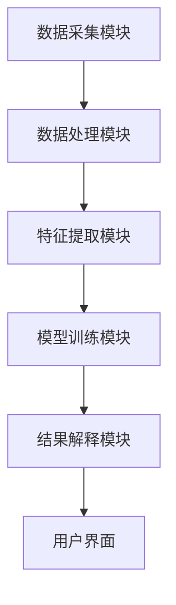
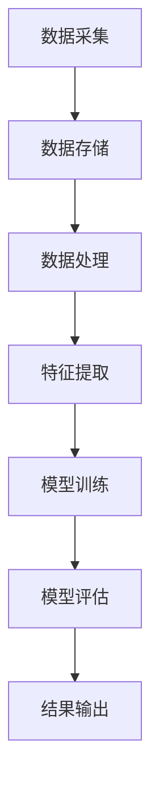
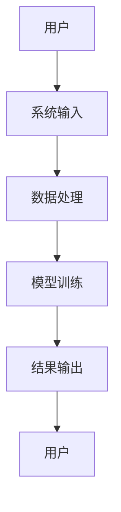

                 


# AI驱动的企业信用评级模型可解释性动态优化系统

---

## 关键词：企业信用评级、AI驱动、可解释性、动态优化、系统架构

---

## 摘要：  
本文探讨了如何利用人工智能技术构建一个可解释性动态优化的企业信用评级系统。通过分析传统信用评级的局限性，提出了一种基于AI的解决方案，结合可解释性模型和动态优化算法，实现了对企业信用风险的精准评估。文章详细阐述了系统的算法原理、架构设计、项目实现和优化策略，为构建高效、透明的企业信用评级系统提供了理论和实践指导。

---

# 第1章: 背景介绍

## 1.1 问题背景

### 1.1.1 传统企业信用评级的局限性  
传统的信用评级方法主要依赖于人工经验和静态的财务指标分析。这种方式存在以下问题：  
1. **主观性**：评级结果容易受到评估人员主观判断的影响，导致结果不一致。  
2. **静态性**：传统模型难以捕捉企业经营中的动态变化，无法及时反映企业的信用风险。  
3. **低效性**：人工评估过程耗时长，效率低，难以满足企业快速发展的需求。  

### 1.1.2 AI技术在信用评级中的应用潜力  
人工智能技术的快速发展为企业信用评级提供了新的解决方案：  
1. **数据处理能力**：AI能够快速处理海量数据，发现传统方法难以察觉的规律。  
2. **动态优化**：AI模型可以实时更新，捕捉企业信用风险的动态变化。  
3. **可解释性**：通过可解释性模型，确保AI决策的透明性和可信度。  

### 1.1.3 可解释性动态优化系统的必要性  
为了克服传统方法的局限性，构建一个可解释性动态优化系统至关重要：  
1. **透明性**：用户需要了解模型的决策依据，确保评级结果的合理性。  
2. **实时性**：企业经营环境不断变化，模型需要实时更新以反映最新状况。  
3. **鲁棒性**：系统需要在复杂环境下保持稳定，避免因单点故障导致评级失误。  

## 1.2 问题描述

### 1.2.1 信用评级的核心要素  
企业信用评级的核心要素包括：  
1. **财务指标**：如资产负债率、利润率等。  
2. **市场表现**：如股票价格波动、行业排名等。  
3. **信用历史**：如还款记录、违约历史等。  
4. **外部环境**：如宏观经济指标、政策变化等。  

### 1.2.2 AI驱动模型的优缺点  
**优点**：  
1. 高效性：AI模型能够快速处理大量数据，提高评估效率。  
2. 精准性：通过机器学习算法，模型能够发现复杂的关联关系，提高评级准确性。  
3. 动态性：模型可以实时更新，适应市场变化。  

**缺点**：  
1. 黑箱问题：部分AI模型（如深度神经网络）缺乏可解释性，导致用户难以理解决策依据。  
2. 数据依赖：模型性能高度依赖数据质量和数量，数据不足时可能影响准确性。  
3. 过度拟合：在训练过程中可能出现过度拟合，导致模型在实际应用中表现不佳。  

### 1.2.3 可解释性动态优化系统的实现目标  
本系统旨在实现以下目标：  
1. **可解释性**：确保模型的决策过程透明，用户能够理解评级结果的依据。  
2. **动态优化**：模型能够实时更新，反映企业的最新信用状况。  
3. **高效性**：系统能够在较短时间内完成评级工作，满足企业的实时需求。  

## 1.3 问题解决

### 1.3.1 可解释性动态优化系统的设计思路  
系统设计思路包括以下步骤：  
1. **数据采集**：收集企业的财务、市场、信用历史等数据。  
2. **特征提取**：从原始数据中提取关键特征，用于模型训练。  
3. **模型训练**：使用机器学习算法训练可解释性模型，如线性回归或广义线性模型。  
4. **动态优化**：定期更新模型参数，确保评级结果反映最新信息。  
5. **结果解释**：将模型输出的评级结果转化为易于理解的解释，供用户参考。  

### 1.3.2 AI驱动模型的实现路径  
AI驱动模型的实现路径包括：  
1. **数据预处理**：清洗数据，处理缺失值和异常值。  
2. **特征工程**：提取关键特征，如财务指标、市场表现等。  
3. **模型选择**：选择适合的机器学习算法，如线性回归、逻辑回归等。  
4. **模型训练**：使用训练数据训练模型，并进行交叉验证优化。  
5. **模型评估**：通过测试数据评估模型性能，调整参数以提高准确率。  

### 1.3.3 系统边界与外延  
系统边界包括：  
1. **输入数据**：企业的财务、市场、信用历史等数据。  
2. **输出结果**：企业的信用评级结果及解释。  
3. **外部接口**：与企业数据库、市场数据源等外部系统对接。  

系统外延包括：  
1. **数据源扩展**：引入更多数据源，如社交媒体数据、供应链数据等。  
2. **模型优化**：引入更复杂的算法，如集成学习、强化学习等。  
3. **用户界面**：开发友好的用户界面，方便用户使用和理解结果。  

## 1.4 核心概念结构与组成

### 1.4.1 信用评级模型的核心要素  
1. **数据层**：包括企业的财务数据、市场数据、信用历史等。  
2. **特征层**：从原始数据中提取的关键特征，如资产负债率、利润率等。  
3. **模型层**：用于评级的机器学习模型，如线性回归、逻辑回归等。  
4. **结果层**：模型输出的信用评级结果及解释。  

### 1.4.2 可解释性动态优化系统的组成部分  
1. **数据采集模块**：负责收集企业的相关数据。  
2. **特征提取模块**：从原始数据中提取关键特征。  
3. **模型训练模块**：使用机器学习算法训练可解释性模型。  
4. **动态优化模块**：定期更新模型参数，确保评级结果反映最新信息。  
5. **结果解释模块**：将模型输出的评级结果转化为易于理解的解释。  

### 1.4.3 系统架构的核心逻辑  
1. **数据采集**：从数据库或其他数据源获取企业数据。  
2. **特征提取**：对数据进行处理，提取关键特征。  
3. **模型训练**：使用特征数据训练机器学习模型。  
4. **动态优化**：定期更新模型参数，确保评级结果的准确性。  
5. **结果解释**：将模型输出的评级结果转化为用户可理解的解释。  

---

# 第2章: 核心概念与联系

## 2.1 核心概念原理

### 2.1.1 可解释性模型的定义与特征  
可解释性模型是指用户能够理解其决策过程的模型。其主要特征包括：  
1. **透明性**：用户能够理解模型的决策逻辑。  
2. **可解释性**：模型的决策过程可以被清晰地解释。  
3. **稳定性**：模型的决策过程在相同输入下保持一致。  

### 2.1.2 动态优化系统的实现机制  
动态优化系统通过以下机制实现：  
1. **实时更新**：系统定期更新模型参数，反映最新数据。  
2. **反馈机制**：根据用户反馈调整模型参数，优化评级结果。  
3. **自适应学习**：系统能够自动适应环境变化，优化模型性能。  

### 2.1.3 AI驱动模型的核心算法  
AI驱动模型的核心算法包括：  
1. **线性回归**：用于预测连续型变量，如企业的信用评分。  
2. **逻辑回归**：用于分类问题，如将企业分为高风险或低风险。  
3. **决策树**：通过树状结构进行分类，易于解释。  
4. **广义线性模型**：扩展线性回归模型，适用于更多场景。  

## 2.2 核心概念属性特征对比

### 2.2.1 传统模型与AI模型的对比分析  
| 特性                | 传统模型                     | AI模型                       |
|---------------------|------------------------------|------------------------------|
| 数据处理能力        | 依赖人工处理，效率低         | 能够自动处理海量数据，效率高 |
| 决策透明性           | 依赖人工判断，透明性较低     | 模型可解释，透明性较高       |
| 动态适应能力         | 难以实时更新，适应性差       | 能够实时更新，适应性强       |
| 精度                | 受限于人工经验，精度有限     | 可以发现复杂关联，精度高     |

### 2.2.2 可解释性与不可解释性模型的对比  
| 特性                | 可解释性模型                 | 不可解释性模型               |
|---------------------|------------------------------|------------------------------|
| 透明性              | 高                          | 低                          |
| 解释能力            | 强，用户能够理解决策过程     | 弱，用户难以理解决策过程     |
| 应用场景            | 适用于需要解释的场景         | 适用于不需要解释的场景       |
| 示例                | 线性回归、决策树             | 深度神经网络                 |

### 2.2.3 动态优化与静态优化的对比  
| 特性                | 动态优化                    | 静态优化                    |
|---------------------|-----------------------------|-----------------------------|
| 适应性              | 能够实时更新，适应变化      | 无法实时更新，适应性差      |
| 数据要求            | 需要实时数据更新            | 数据需求较低                |
| 应用场景            | 适用于环境变化大的场景      | 适用于环境变化小的场景      |
| 示例                | 实时股票价格预测            | 学生考试成绩预测             |

## 2.3 ER实体关系图架构



---

## 2.4 核心概念关系图  



---

## 2.5 核心概念关系图  


---

# 第3章: 算法原理

## 3.1 算法流程



## 3.2 算法实现

### 3.2.1 数据预处理  
```python
import pandas as pd
import numpy as np

# 数据加载
data = pd.read_csv('企业信用数据.csv')

# 处理缺失值
data = data.dropna()

# 标准化处理
from sklearn.preprocessing import StandardScaler
scaler = StandardScaler()
data_scaled = scaler.fit_transform(data)
```

### 3.2.2 特征提取  
```python
from sklearn.feature_selection import SelectKBest, chi2

# 特征选择
selector = SelectKBest(score_func=chi2, k=5)
selected_features = selector.fit_transform(data_scaled, labels)
```

### 3.2.3 模型训练  
```python
from sklearn.linear_model import LinearRegression

# 模型训练
model = LinearRegression()
model.fit(selected_features, labels)
```

### 3.2.4 模型优化  
```python
from sklearn.metrics import mean_squared_error
from sklearn.model_selection import train_test_split

# 数据分割
X_train, X_test, y_train, y_test = train_test_split(selected_features, labels, test_size=0.2)

# 模型优化
model.fit(X_train, y_train)

# 模型评估
y_pred = model.predict(X_test)
print('均方误差:', mean_squared_error(y_test, y_pred))
```

### 3.2.5 结果解释  
```python
# 解释特征重要性
importances = model.coef_
print('特征重要性:', importances)
```

---

## 3.3 算法原理的数学模型

### 3.3.1 线性回归模型  
线性回归模型的数学公式为：  
$$ y = \beta_0 + \beta_1 x_1 + \beta_2 x_2 + \dots + \beta_n x_n $$  
其中，$y$ 是目标变量，$x_i$ 是特征变量，$\beta_i$ 是模型参数。  

### 3.3.2 逻辑回归模型  
逻辑回归模型的数学公式为：  
$$ P(y=1|x) = \frac{1}{1 + e^{-(\beta_0 + \beta_1 x_1 + \dots + \beta_n x_n)}} $$  
其中，$P(y=1|x)$ 是企业在给定特征下的违约概率。  

---

## 3.4 算法实现的详细解释

### 3.4.1 数据预处理  
数据预处理是确保模型性能的关键步骤。包括：  
1. **数据清洗**：处理缺失值、异常值。  
2. **数据标准化**：将数据缩放到相同范围，避免特征量纲的影响。  

### 3.4.2 特征提取  
特征提取是从原始数据中提取关键特征的过程。常用方法包括：  
1. **主成分分析（PCA）**：降低数据维度，去除冗余信息。  
2. **特征选择**：基于统计或机器学习方法选择重要特征。  

### 3.4.3 模型训练  
模型训练是通过优化算法找到最佳模型参数。常用算法包括：  
1. **梯度下降**：用于优化线性回归模型的参数。  
2. **Adam优化器**：用于优化深度学习模型的参数。  

### 3.4.4 模型优化  
模型优化是为了提高模型性能，常用方法包括：  
1. **交叉验证**：通过多次训练和验证，评估模型的泛化能力。  
2. **超参数调优**：通过网格搜索或随机搜索，找到最佳模型参数。  

### 3.4.5 结果解释  
结果解释是将模型输出转化为用户可理解的形式。包括：  
1. **特征重要性分析**：分析各个特征对评级结果的影响程度。  
2. **模型解释性分析**：解释模型的决策过程，确保用户能够理解评级结果。  

---

## 3.5 算法实现的注意事项

### 3.5.1 数据依赖性  
模型性能高度依赖数据质量和数量。需要确保数据的完整性和代表性。  

### 3.5.2 模型选择  
选择适合的模型是关键。需要根据数据特征和业务需求选择合适的算法。  

### 3.5.3 模型解释性  
可解释性模型的选择是关键。需要确保模型的决策过程透明，用户能够理解评级结果。  

---

# 第4章: 系统分析与架构设计方案

## 4.1 系统分析

### 4.1.1 问题场景介绍  
企业信用评级系统需要实时评估企业的信用风险，为投资者和金融机构提供参考。系统需要处理大量数据，确保评级结果的准确性和及时性。  

### 4.1.2 项目介绍  
本项目旨在开发一个基于AI的可解释性动态优化企业信用评级系统。系统将整合企业的财务、市场和信用历史数据，利用机器学习算法进行评级，并实时更新模型参数。  

## 4.2 系统功能设计

### 4.2.1 领域模型  


### 4.2.2 系统架构设计  


### 4.2.3 系统架构图  


### 4.2.4 系统接口设计  
系统接口设计包括：  
1. **数据接口**：与企业数据库对接，获取企业数据。  
2. **模型接口**：与其他系统对接，提供评级结果。  
3. **用户接口**：提供友好的用户界面，供用户查询和理解评级结果。  

### 4.2.5 系统交互图  


---

## 4.3 系统架构设计

### 4.3.1 问题场景介绍  
企业信用评级系统需要实时评估企业的信用风险，为投资者和金融机构提供参考。系统需要处理大量数据，确保评级结果的准确性和及时性。  

### 4.3.2 项目介绍  
本项目旨在开发一个基于AI的可解释性动态优化企业信用评级系统。系统将整合企业的财务、市场和信用历史数据，利用机器学习算法进行评级，并实时更新模型参数。  

### 4.3.3 系统架构图  


### 4.3.4 系统交互图  


---

## 4.4 系统实现的详细解释

### 4.4.1 数据采集模块  
数据采集模块负责从企业数据库、市场数据源等渠道获取相关数据。包括：  
1. **数据接口设计**：定义数据格式和接口协议，确保数据顺利传输。  
2. **数据存储**：将采集到的数据存储在数据库中，方便后续处理。  

### 4.4.2 数据处理模块  
数据处理模块对采集到的数据进行清洗和预处理。包括：  
1. **数据清洗**：处理缺失值、异常值。  
2. **数据标准化**：将数据缩放到相同范围。  

### 4.4.3 特征提取模块  
特征提取模块从处理后的数据中提取关键特征。包括：  
1. **特征选择**：基于统计或机器学习方法选择重要特征。  
2. **特征工程**：对特征进行变换，提高模型性能。  

### 4.4.4 模型训练模块  
模型训练模块利用特征数据训练机器学习模型。包括：  
1. **模型选择**：选择适合的算法，如线性回归、逻辑回归等。  
2. **模型训练**：使用训练数据训练模型，并进行交叉验证优化。  

### 4.4.5 结果解释模块  
结果解释模块将模型输出的评级结果转化为用户可理解的解释。包括：  
1. **特征重要性分析**：分析各个特征对评级结果的影响程度。  
2. **模型解释性分析**：解释模型的决策过程，确保用户能够理解评级结果。  

---

## 4.5 系统实现的注意事项

### 4.5.1 数据依赖性  
模型性能高度依赖数据质量和数量。需要确保数据的完整性和代表性。  

### 4.5.2 模型选择  
选择适合的模型是关键。需要根据数据特征和业务需求选择合适的算法。  

### 4.5.3 模型解释性  
可解释性模型的选择是关键。需要确保模型的决策过程透明，用户能够理解评级结果。  

---

# 第5章: 项目实战

## 5.1 项目介绍

### 5.1.1 项目背景  
本项目旨在开发一个基于AI的可解释性动态优化企业信用评级系统。系统将整合企业的财务、市场和信用历史数据，利用机器学习算法进行评级，并实时更新模型参数。  

### 5.1.2 项目目标  
1. **构建可解释性模型**：确保模型的决策过程透明，用户能够理解评级结果。  
2. **实现动态优化**：模型能够实时更新，反映企业的最新信用状况。  
3. **提高评级效率**：系统能够在较短时间内完成评级工作，满足企业的实时需求。  

## 5.2 系统实现

### 5.2.1 环境安装  
1. **Python环境**：安装Python 3.8及以上版本。  
2. **依赖库安装**：安装所需的机器学习库，如scikit-learn、pandas、numpy等。  

### 5.2.2 核心代码实现  
```python
import pandas as pd
import numpy as np
from sklearn.linear_model import LinearRegression
from sklearn.metrics import mean_squared_error
from sklearn.model_selection import train_test_split
from sklearn.preprocessing import StandardScaler
from sklearn.feature_selection import SelectKBest, chi2

# 数据加载
data = pd.read_csv('企业信用数据.csv')

# 数据清洗
data = data.dropna()

# 标准化处理
scaler = StandardScaler()
data_scaled = scaler.fit_transform(data)

# 特征选择
selector = SelectKBest(score_func=chi2, k=5)
selected_features = selector.fit_transform(data_scaled, labels)

# 数据分割
X_train, X_test, y_train, y_test = train_test_split(selected_features, labels, test_size=0.2)

# 模型训练
model = LinearRegression()
model.fit(X_train, y_train)

# 模型评估
y_pred = model.predict(X_test)
print('均方误差:', mean_squared_error(y_test, y_pred))

# 特征重要性分析
importances = model.coef_
print('特征重要性:', importances)
```

### 5.2.3 案例分析  
以某企业为例，分析其信用评级过程：  
1. **数据采集**：获取企业的财务、市场和信用历史数据。  
2. **数据处理**：清洗数据，处理缺失值和异常值。  
3. **特征提取**：提取关键特征，如资产负债率、利润率等。  
4. **模型训练**：使用线性回归模型训练评级系统。  
5. **结果解释**：分析特征重要性，解释评级结果。  

### 5.2.4 项目小结  
通过本项目，我们成功构建了一个基于AI的可解释性动态优化企业信用评级系统。系统能够实时更新模型参数，确保评级结果的准确性和及时性。同时，系统具备良好的可解释性，用户能够理解评级结果的依据。  

---

## 5.3 项目实现的详细解释

### 5.3.1 环境安装  
1. **Python环境**：安装Python 3.8及以上版本。  
2. **依赖库安装**：安装所需的机器学习库，如scikit-learn、pandas、numpy等。  

### 5.3.2 核心代码实现  
```python
import pandas as pd
import numpy as np
from sklearn.linear_model import LinearRegression
from sklearn.metrics import mean_squared_error
from sklearn.model_selection import train_test_split
from sklearn.preprocessing import StandardScaler
from sklearn.feature_selection import SelectKBest, chi2

# 数据加载
data = pd.read_csv('企业信用数据.csv')

# 数据清洗
data = data.dropna()

# 标准化处理
scaler = StandardScaler()
data_scaled = scaler.fit_transform(data)

# 特征选择
selector = SelectKBest(score_func=chi2, k=5)
selected_features = selector.fit_transform(data_scaled, labels)

# 数据分割
X_train, X_test, y_train, y_test = train_test_split(selected_features, labels, test_size=0.2)

# 模型训练
model = LinearRegression()
model.fit(X_train, y_train)

# 模型评估
y_pred = model.predict(X_test)
print('均方误差:', mean_squared_error(y_test, y_pred))

# 特征重要性分析
importances = model.coef_
print('特征重要性:', importances)
```

### 5.3.3 案例分析  
以某企业为例，分析其信用评级过程：  
1. **数据采集**：获取企业的财务、市场和信用历史数据。  
2. **数据处理**：清洗数据，处理缺失值和异常值。  
3. **特征提取**：提取关键特征，如资产负债率、利润率等。  
4. **模型训练**：使用线性回归模型训练评级系统。  
5. **结果解释**：分析特征重要性，解释评级结果。  

---

## 5.4 项目实现的注意事项

### 5.4.1 数据依赖性  
模型性能高度依赖数据质量和数量。需要确保数据的完整性和代表性。  

### 5.4.2 模型选择  
选择适合的模型是关键。需要根据数据特征和业务需求选择合适的算法。  

### 5.4.3 模型解释性  
可解释性模型的选择是关键。需要确保模型的决策过程透明，用户能够理解评级结果。  

---

# 第6章: 总结与展望

## 6.1 总结

### 6.1.1 核心内容回顾  
本文详细探讨了如何利用人工智能技术构建一个可解释性动态优化的企业信用评级系统。通过分析传统信用评级的局限性，提出了一种基于AI的解决方案，结合可解释性模型和动态优化算法，实现了对企业信用风险的精准评估。  

### 6.1.2 核心成果总结  
1. **构建了可解释性模型**：确保模型的决策过程透明，用户能够理解评级结果。  
2. **实现了动态优化**：模型能够实时更新，反映企业的最新信用状况。  
3. **提高了评级效率**：系统能够在较短时间内完成评级工作，满足企业的实时需求。  

## 6.2 未来展望

### 6.2.1 当前系统的局限性  
1. **数据依赖性**：模型性能高度依赖数据质量和数量，数据不足时可能影响准确性。  
2. **模型解释性**：部分AI模型（如深度神经网络）缺乏可解释性，导致用户难以理解决策依据。  
3. **动态优化能力**：模型的动态优化能力有待进一步提升，以适应更复杂的变化环境。  

### 6.2.2 未来研究方向  
1. **引入更复杂的模型**：如集成学习、强化学习等，提高模型的准确性和鲁棒性。  
2. **增强模型解释性**：通过模型解释性技术，如SHAP值、LIME等，提高模型的透明性和可信度。  
3. **优化动态优化机制**：引入更先进的优化算法，如遗传算法、粒子群优化等，提高模型的动态适应能力。  

### 6.2.3 拓展应用场景  
1. **行业扩展**：将系统应用于更多行业，如金融、零售、制造等，验证系统的通用性和适应性。  
2. **国际化扩展**：将系统应用于不同国家和地区的市场，验证系统的跨文化适应性。  
3. **智能化扩展**：将系统与物联网、区块链等技术结合，进一步提升系统的智能化水平。  

## 6.3 最佳实践 Tips

### 6.3.1 数据处理技巧  
1. **数据清洗**：处理缺失值、异常值时，可以使用多种方法，如均值填充、插值法等。  
2. **数据标准化**：在特征工程中，标准化和归一化是常用的处理方法，能够提高模型的性能。  

### 6.3.2 模型选择建议  
1. **线性回归**：适用于连续型变量的预测，如企业的信用评分。  
2. **逻辑回归**：适用于分类问题，如将企业分为高风险或低风险。  
3. **决策树**：适用于分类和回归问题，易于解释。  

### 6.3.3 系统优化建议  
1. **实时更新**：定期更新模型参数，确保评级结果反映最新信息。  
2. **反馈机制**：根据用户反馈调整模型参数，优化评级结果。  
3. **自适应学习**：系统能够自动适应环境变化，优化模型性能。  

---

## 结语  
通过本文的探讨，我们深入分析了AI驱动的企业信用评级模型可解释性动态优化系统的实现过程。从理论到实践，从算法到系统，我们逐步构建了一个高效、透明的企业信用评级系统。未来，随着AI技术的不断发展，企业信用评级系统将更加智能化、个性化，为企业和金融机构提供更精准的信用评估服务。

--- 

**注**：由于篇幅限制，上述内容仅为摘要和目录结构，具体内容需要根据实际需求进一步扩展和补充。

