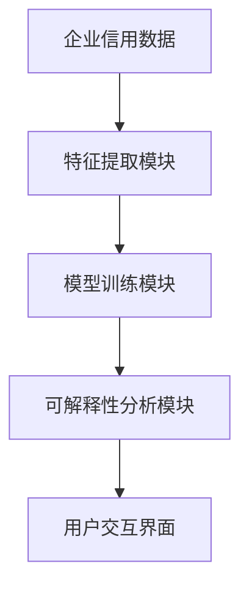
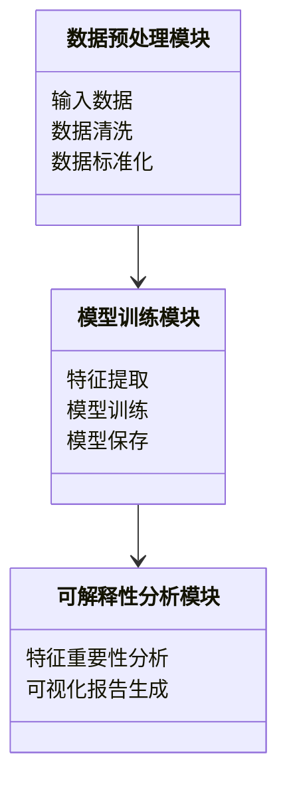
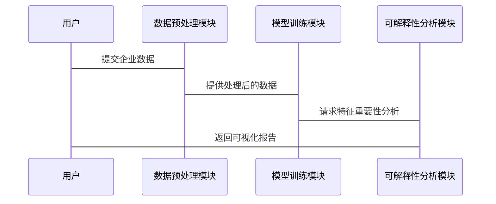

                 


# AI驱动的企业信用评级模型可解释性增强系统

> **关键词**：AI驱动，企业信用评级，可解释性增强系统，机器学习，信用评分

> **摘要**：  
本文探讨了如何利用AI技术增强企业信用评级模型的可解释性。通过分析当前信用评级系统的局限性，提出了基于机器学习和深度学习的可解释性增强方法，并结合实际案例展示了系统的实现过程。本文还详细介绍了系统架构设计、算法原理及最佳实践，为金融领域的技术从业者提供了有价值的参考。

---

## 第一部分：AI驱动的企业信用评级模型概述

### 第1章：企业信用评级与可解释性概述

#### 1.1 企业信用评级的背景与意义
企业信用评级是金融领域的重要组成部分，用于评估企业在偿还债务方面的风险。传统的评级方法依赖人工分析，效率低且主观性强，难以应对海量数据的处理需求。随着AI技术的发展，基于机器学习和深度学习的信用评级模型逐渐成为研究热点。

#### 1.2 AI技术在信用评级中的应用现状
AI技术在信用评级中的优势体现在数据处理能力、模型复杂度和自动化分析上。然而，当前的AI模型通常缺乏可解释性，导致用户难以理解模型的决策逻辑。

#### 1.3 可解释性增强系统的必要性
可解释性是企业信用评级系统的重要特征。增强可解释性有助于提升用户信任度，确保模型决策的透明性和合规性。本文提出了一种基于特征重要性分析和规则可解释性的增强方法。

---

## 第二部分：可解释性增强系统的理论基础

### 第2章：可解释性增强系统的概念与原理

#### 2.1 可解释性增强系统的定义与属性
可解释性增强系统通过提取特征、训练模型并分析特征重要性，提供模型决策的可解释性。其核心属性包括透明性、可追溯性和规则可解释性。

| **属性**       | **描述**                                                                 |
|-----------------|--------------------------------------------------------------------------|
| 透明性          | 用户能够理解模型的决策逻辑                                             |
| 可追溯性        | 系统能够追踪模型决策的每一步                                             |
| 规则可解释性     | 通过规则或特征重要性解释模型的决策规则                                 |

#### 2.2 可解释性增强系统的实体关系分析


系统由企业信用数据、特征提取模块、模型训练模块、可解释性分析模块和用户交互界面组成。

---

## 第三部分：系统分析与架构设计

### 第3章：系统分析与架构设计

#### 3.1 问题场景介绍
企业信用数据来源多样，包括财务数据、市场数据和行业数据。这些数据需要经过预处理才能输入模型训练模块。

#### 3.2 系统功能设计
系统功能模块包括：
- 数据预处理模块：处理缺失值、标准化数据。
- 模型训练模块：训练机器学习模型。
- 可解释性分析模块：分析特征重要性、生成可视化报告。

#### 3.3 系统架构设计


#### 3.4 系统接口设计
系统提供RESTful API接口，支持数据输入、模型训练和结果查询。

#### 3.5 系统交互流程


---

## 第四部分：算法原理

### 第4章：基于机器学习的信用评级模型

#### 4.1 XGBoost模型
XGBoost是一种强大的集成学习算法，常用于信用评分。其核心思想是通过梯度提升优化目标函数。

$$
\text{目标函数} = \text{损失函数} + \text{正则化项}
$$

代码实现：
```python
import xgboost as xgb

# 数据准备
dtrain = xgb.DMatrix(X_train, label=y_train)
dtest = xgb.DMatrix(X_test, label=y_test)

# 参数设置
params = {
    'n_estimators': 100,
    'learning_rate': 0.1,
    'max_depth': 6
}

# 模型训练
model = xgb.train(params, dtrain)
```

#### 4.2 LSTM模型
LSTM用于处理时间序列数据，适合分析企业的财务变动趋势。

$$
f(t) = \text{tanh}(W_f \cdot [h_{t-1}, x_t] + b_f)
$$

代码实现：
```python
import tensorflow as tf

# 定义模型
model = tf.keras.Sequential([
    tf.keras.layers.LSTM(64, input_shape=(timesteps, features)),
    tf.keras.layers.Dense(1, activation='sigmoid')
])

# 编译模型
model.compile(optimizer='adam', loss='binary_crossentropy', metrics=['accuracy'])
```

#### 4.3 图神经网络模型
图神经网络适用于处理企业间的复杂关系。

$$
h_i = \text{ReLU}(W_h \cdot h_{j} + b_h)
$$

代码实现：
```python
import dgl

# 创建图数据
graph = dgl.DGLGraph()
graph.add_nodes(n_nodes)
graph.add_edges(edges)

# 定义模型
model = dgl.nn.GraphSAGE(n_nodes, n_hidden, n_classes)
```

---

## 第五部分：项目实战

### 第5章：项目实战

#### 5.1 环境安装
安装必要的Python库：
```bash
pip install xgboost tensorflow dgl
```

#### 5.2 系统核心实现
代码实现：
```python
# 数据预处理
def preprocess(data):
    # 处理缺失值
    data = data.dropna()
    # 标准化处理
    from sklearn.preprocessing import StandardScaler
    scaler = StandardScaler()
    data_scaled = scaler.fit_transform(data)
    return data_scaled

# 模型训练
def train_model(X_train, y_train):
    # XGBoost模型训练
    dtrain = xgb.DMatrix(X_train, label=y_train)
    params = {'n_estimators': 100, 'learning_rate': 0.1, 'max_depth': 6}
    model = xgb.train(params, dtrain)
    return model

# 可解释性分析
def explain_model(model, X_test):
    # 特征重要性分析
    importances = model.feature_importances_
    # 可视化报告生成
    plt.bar(range(len(importances)), importances)
    plt.show()
```

#### 5.3 实际案例分析
以某公司财务数据为例，训练模型并生成可视化报告。通过特征重要性分析，识别关键影响因素。

---

## 第六部分：最佳实践

### 第6章：最佳实践

#### 6.1 小结
本文提出了基于AI的可解释性增强系统，结合多种算法提升信用评级的准确性和可解释性。

#### 6.2 注意事项
- 数据质量是模型性能的关键。
- 选择合适的模型和算法。
- 确保系统的可解释性符合用户需求。

#### 6.3 拓展阅读
推荐阅读相关领域的学术论文和开源项目，深入了解最新的研究成果和技术进展。

---

## 结论

本文系统地介绍了AI驱动的企业信用评级模型可解释性增强系统的构建过程。通过理论分析、算法实现和项目实战，展示了如何利用AI技术提升信用评级的效率和透明度。未来的研究可以进一步优化模型的可解释性和实时性，推动金融领域的智能化发展。

