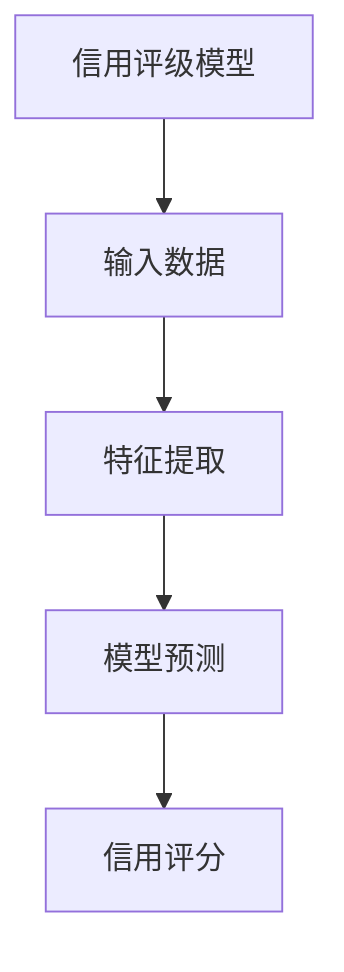
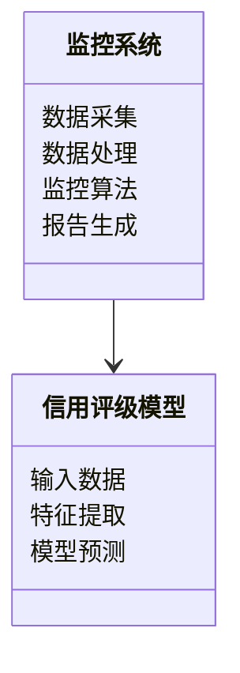
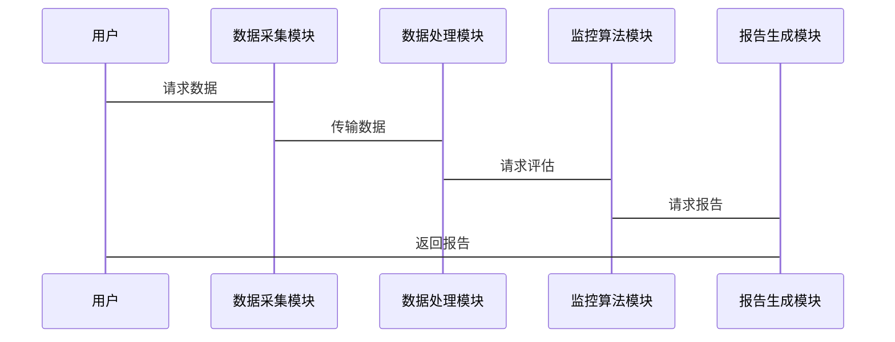

                 


# AI驱动的企业信用评级模型性能监控系统

**关键词：** AI, 信用评级, 模型监控, 性能评估, 系统架构, 项目实战

**摘要：**  
本文探讨了如何利用人工智能技术构建企业信用评级模型的性能监控系统。通过分析传统信用评级方法的局限性，结合AI技术的优势，提出了一种基于AI的监控系统架构。文章详细介绍了系统的背景、核心概念、算法原理、系统架构设计、项目实战以及最佳实践，旨在为企业信用评级模型的性能监控提供理论支持和实践指导。

---

# 第1章: 企业信用评级与AI驱动监控的背景介绍

## 1.1 问题背景与重要性

### 1.1.1 企业信用评级的传统方法与局限性
企业信用评级是评估企业信用状况的重要手段，传统的评级方法依赖于财务报表分析、行业经验以及人工判断。这些方法存在以下局限性：
- 数据量有限，难以捕捉企业动态风险。
- 人工判断主观性强，效率低下。
- 无法实时更新，难以应对市场变化。

### 1.1.2 AI技术在信用评级中的应用潜力
人工智能技术（如机器学习、深度学习）能够处理海量数据，发现传统方法难以察觉的模式和风险点。AI在信用评级中的应用包括：
- 自动化特征提取。
- 实时风险评估。
- 异常行为检测。

### 1.1.3 模型性能监控的必要性与挑战
信用评级模型的性能会受到数据漂移、模型老化等因素的影响，需要实时监控和优化。挑战包括：
- 数据量大且复杂。
- 监控指标多样，难以统一评估。
- 系统实时性要求高。

---

## 1.2 核心概念与问题描述

### 1.2.1 信用评级模型的基本原理
信用评级模型通过输入企业的财务、市场和运营数据，输出信用评分。常用的模型包括逻辑回归、随机森林和梯度提升树。

### 1.2.2 AI驱动监控的核心问题
AI监控系统需要实时评估模型性能，识别异常情况，并提供优化建议。核心问题包括：
- 性能指标的选择与计算。
- 异常检测算法的设计。
- 监控系统的可扩展性。

### 1.2.3 系统边界与外延
系统的边界包括输入数据的范围、监控的指标类型以及输出的报告形式。外延涉及与其他系统的集成，如数据源、业务系统等。

---

## 1.3 核心要素与概念结构

### 1.3.1 信用评级模型的关键要素
- 输入数据：财务数据、市场数据、运营数据。
- 模型算法：逻辑回归、随机森林。
- 输出结果：信用评分、风险等级。

### 1.3.2 AI监控系统的构成部分
- 数据采集模块：收集实时数据。
- 数据处理模块：清洗和预处理数据。
- 监控算法模块：评估模型性能，检测异常。
- 报告生成模块：输出监控结果和优化建议。

### 1.3.3 概念结构与核心要素组成
通过概念图展示各要素之间的关系，强调数据、模型和监控算法的协同作用。

---

## 1.4 对比分析与边界定义

### 1.4.1 传统监控与AI监控的对比
| 对比维度 | 传统监控 | AI监控 |
|----------|----------|--------|
| 数据处理 | 手工处理 | 自动化处理 |
| 监控频率 | 低频 | 实时 |
| 分析深度 | 浅层分析 | 深度分析 |

### 1.4.2 系统边界与监控范围的定义
- 数据范围：企业内部数据与外部市场数据。
- 监控指标：准确性、稳定性、可解释性。
- 输出形式：实时报警、详细报告。

### 1.4.3 核心概念的属性特征对比表格
| 概念 | 属性 | 描述 |
|------|------|------|
| 数据源 | 类型 | 财务、市场、运营 |
| 模型算法 | 类型 | 逻辑回归、随机森林 |
| 监控指标 | 类型 | 准确率、召回率 |

---

## 1.5 本章小结

---

# 第2章: AI驱动监控的核心概念与联系

## 2.1 核心概念原理

### 2.1.1 信用评级模型的性能指标
- 准确率：模型预测的准确程度。
- 召回率：识别为高风险企业的能力。
- F1分数：综合准确率和召回率。

### 2.1.2 AI监控系统的原理概述
AI监控系统通过实时数据流，利用机器学习算法评估模型性能，识别数据漂移和模型退化。

### 2.1.3 监控算法的数学模型
监控算法的数学模型可以表示为：
$$
\text{性能指标} = f(\text{输入数据}, \text{模型参数})
$$
其中，\( f \) 是监控算法的核心函数。

---

## 2.2 核心概念对比表格

### 2.2.1 传统监控与AI监控的对比分析
| 对比维度 | 传统监控 | AI监控 |
|----------|----------|--------|
| 监控频率 | 低频 | 实时 |
| 监控深度 | 浅层 | 深度 |

---

## 2.3 ER实体关系图



---

## 2.4 本章小结

---

# 第3章: 算法原理

## 3.1 数据预处理

### 3.1.1 数据清洗
- 处理缺失值。
- 删除异常值。

### 3.1.2 数据标准化
- 使用归一化方法处理特征。

---

## 3.2 异常检测算法

### 3.2.1 基于统计的方法
- 使用Z分数或孤立森林算法检测异常。

### 3.2.2 基于机器学习的方法
- 使用Isolation Forest算法。

---

## 3.3 模型评估

### 3.3.1 准确率计算
$$
\text{准确率} = \frac{\text{正确预测数}}{\text{总样本数}}
$$

---

## 3.4 代码实现

### 3.4.1 数据预处理代码
```python
import pandas as pd
from sklearn.preprocessing import StandardScaler

# 加载数据
data = pd.read_csv('credit_data.csv')

# 处理缺失值
data = data.dropna()

# 标准化处理
scaler = StandardScaler()
data_normalized = scaler.fit_transform(data)
```

---

## 3.5 本章小结

---

# 第4章: 系统分析与架构设计

## 4.1 问题场景介绍

### 4.1.1 信用评级模型的应用场景
- 企业贷款审批。
- 投资决策支持。

---

## 4.2 系统功能设计

### 4.2.1 领域模型设计


---

## 4.3 系统架构设计

### 4.3.1 分层架构


---

## 4.4 接口设计与交互序列图

### 4.4.1 接口设计
- 数据采集接口。
- 监控报告接口。

### 4.4.2 交互序列图


---

## 4.5 本章小结

---

# 第5章: 项目实战

## 5.1 环境安装

### 5.1.1 安装Python环境
```bash
pip install python3
```

---

## 5.2 核心代码实现

### 5.2.1 数据采集代码
```python
import requests

def fetch_data(api_url):
    response = requests.get(api_url)
    return response.json()
```

---

## 5.3 代码解读与分析

### 5.3.1 数据预处理
- 使用Pandas加载数据。
- 删除缺失值。

### 5.3.2 模型监控
- 使用Scikit-learn评估模型性能。

---

## 5.4 案例分析与详细解读

### 5.4.1 案例分析
分析一家企业的信用评分变化，发现数据漂移。

### 5.4.2 实践总结
监控系统能够及时发现模型性能下降，提供优化建议。

---

## 5.5 项目小结

---

# 第6章: 最佳实践与总结

## 6.1 最佳实践 tips

### 6.1.1 数据质量
确保数据来源可靠，特征丰富。

### 6.1.2 系统可扩展性
设计模块化架构，便于扩展。

---

## 6.2 小结

## 6.3 注意事项

### 6.3.1 数据隐私
确保数据处理符合隐私保护法规。

### 6.3.2 系统稳定性
设计容错机制，确保系统稳定运行。

---

## 6.4 拓展阅读

### 6.4.1 推荐书籍
- 《机器学习实战》
- 《深度学习》

### 6.4.2 在线资源
- TensorFlow文档
- PyTorch教程

---

## 6.5 本章小结

---

# 结束语

通过本文的详细讲解，读者可以全面了解AI驱动的企业信用评级模型性能监控系统的构建与实现。从背景介绍到项目实战，每一步都进行了深入分析，帮助企业提升信用评级的准确性和实时性。

