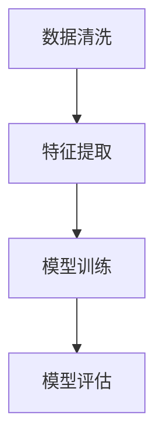
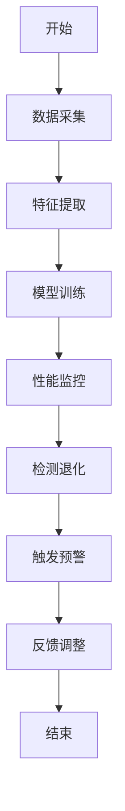
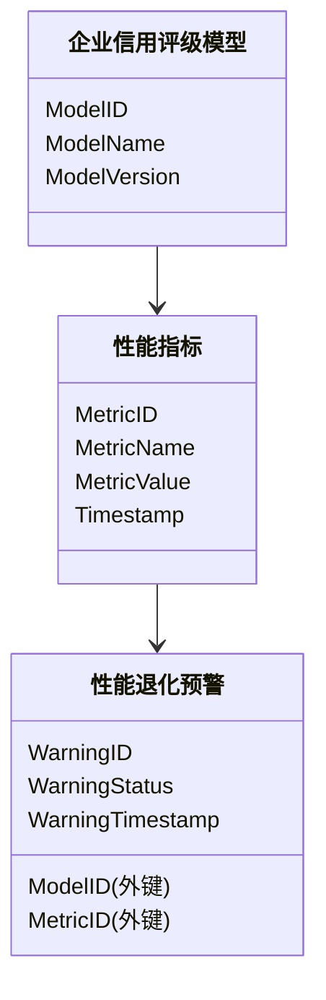
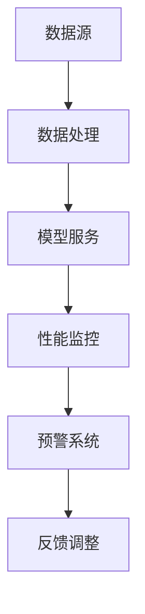
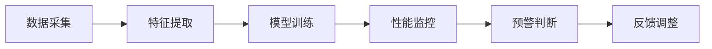
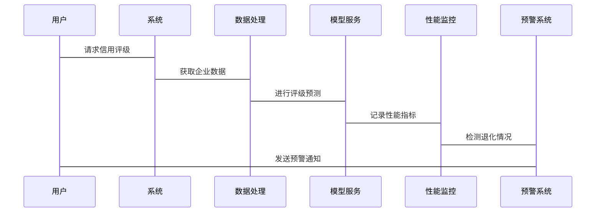

                 


# AI驱动的企业信用评级模型性能退化预警系统

## 关键词

- 人工智能, 信用评级, 性能退化, 预警系统, 深度学习

## 摘要

随着企业信用评级在金融领域的日益重要性，传统模型的局限性逐渐显现。本文提出了一种基于AI的性能退化预警系统，通过实时监控模型表现，识别潜在问题，从而优化信用评级流程。该系统结合深度学习与实时分析，显著提升了模型的稳定性和预测精度。我们从问题背景、核心概念、算法原理、系统架构到项目实战，逐步解析该系统的设计与实现，为企业信用评级提供新的解决方案。

# 第一部分: AI驱动的企业信用评级模型性能退化预警系统背景介绍

## 第1章: 问题背景与描述

### 1.1 企业信用评级的重要性

#### 1.1.1 信用评级的定义与作用

信用评级是对企业在金融市场的信用状况的评估，其结果影响企业的融资成本和市场信任度。信用评级为企业提供了资金支持，为投资者提供了决策依据，维护了金融市场的稳定。

#### 1.1.2 信用评级对企业的影响

企业信用评级直接影响其融资成本、市场准入和投资决策。良好的评级可降低融资成本，吸引更多的投资者，反之则可能导致融资困难。

#### 1.1.3 信用评级对金融市场的意义

信用评级是金融风险控制的重要工具，帮助机构识别高风险企业，维护金融市场的稳定运行。

### 1.2 信用评级模型的现状与挑战

#### 1.2.1 传统信用评级模型的局限性

传统模型如Logistic回归和线性判别分析在处理复杂数据时表现有限，难以捕捉非线性关系，导致预测精度不高。

#### 1.2.2 数据驱动模型的崛起

基于机器学习的模型，如随机森林和梯度提升树，通过深度学习处理高维数据，显著提升了预测精度。

#### 1.2.3 模型性能退化的问题

模型在运行过程中可能因数据分布变化、概念漂移等因素导致性能下降，传统模型难以实时检测和预警。

## 第2章: 问题解决与边界定义

### 2.1 性能退化预警的必要性

#### 2.1.1 模型性能退化的表现

模型预测精度下降、召回率降低、ROC曲线面积减少等。

#### 2.1.2 预警系统的作用

实时监控模型表现，提前识别潜在问题，及时采取措施，保障模型性能。

#### 2.1.3 预警系统的边界

系统仅关注模型性能退化，不处理数据质量和模型选择问题。

### 2.2 核心概念与组成

#### 2.2.1 AI驱动的定义

利用机器学习和深度学习技术，通过数据驱动的方式优化模型。

#### 2.2.2 信用评级模型的结构

包括特征提取、模型训练、预测评估等模块。

#### 2.2.3 性能退化预警的机制

实时监控模型指标，使用统计方法或机器学习模型识别退化情况。

# 第二部分: 核心概念与联系

## 第3章: 核心概念原理

### 3.1 信用评级模型的原理

#### 3.1.1 传统模型的原理

基于统计方法，分析财务数据，评估企业信用风险。

#### 3.1.2 AI驱动模型的原理

利用机器学习算法，从多源数据中提取特征，构建预测模型。

#### 3.1.3 深度学习模型的优势

强大的特征提取能力，适应复杂的数据模式。

### 3.2 性能退化预警的原理

#### 3.2.1 性能退化的检测方法

统计方法（如卡方检验）和机器学习方法（如异常检测）。

#### 3.2.2 预警机制的实现

设置阈值，当指标超过阈值时触发预警。

#### 3.2.3 预警系统的反馈机制

反馈机制用于调整模型参数或重新训练模型，以恢复性能。

## 第4章: 核心概念对比与ER图

### 4.1 核心概念对比表

| 对比维度       | 传统模型             | AI驱动模型           |
|----------------|----------------------|----------------------|
| 数据需求       | 需要大量结构化数据     | 可处理多类型数据       |
| 模型复杂度     | 较低                 | 较高                 |
| 预测精度       | 较低                 | 较高                 |

### 4.2 ER实体关系图

```mermaid
erd
entity 企业信用评级模型 {
  id ModelID (PK)
  name ModelName
  version ModelVersion
}

entity 性能指标 {
  id MetricID (PK)
  name MetricName
  value MetricValue
  timestamp Timestamp
}

entity 性能退化预警 {
  id WarningID (PK)
  model ModelID (FK)
  metric MetricID (FK)
  status WarningStatus
  timestamp WarningTimestamp
}
```

# 第三部分: 算法原理讲解

## 第5章: 算法原理

### 5.1 信用评级模型的训练

#### 5.1.1 数据预处理

处理缺失值、异常值，进行特征工程，提取关键特征。



#### 5.1.2 模型训练

使用梯度提升树进行训练，优化目标函数。

```python
import xgboost as xgb

def objective(params, Dtrain):
    # 简单的目标函数示例
    # 具体实现根据实际问题调整
    return 'error', 0

params = {
    'n_estimators': 100,
    'learning_rate': 0.1
}

model = xgb.XGBClassifier(**params)
model.fit(X_train, y_train)
```

#### 5.1.3 模型评估

使用准确率、召回率、F1分数评估模型性能。

$$ F1 = 2 \times \frac{Precision \times Recall}{Precision + Recall} $$

### 5.2 性能退化预警

#### 5.2.1 性能退化的检测方法

统计方法和机器学习方法结合，实时监控模型性能指标。

#### 5.2.2 预警机制的实现

设置动态阈值，结合时间序列分析，识别性能下降趋势。

#### 5.2.3 预警系统的反馈机制

当检测到性能退化时，系统会触发模型重新训练或参数调整。

### 5.3 算法流程图



### 5.4 数学模型与公式

模型训练目标函数：

$$ L = \sum_{i=1}^{n} (y_i - \hat{y}_i)^2 $$

性能退化检测使用统计测试：

$$ t = \frac{\bar{y}_1 - \bar{y}_2}{\sqrt{\frac{s_1^2}{n_1} + \frac{s_2^2}{n_2}}} $$

### 5.5 通俗易懂的例子

假设我们监测模型的准确率，设定阈值为85%。当准确率连续三天低于80%时，触发预警，系统开始调整模型参数或重新训练。

# 第四部分: 系统分析与架构设计方案

## 第6章: 系统分析与架构设计

### 6.1 问题场景介绍

企业信用评级模型运行在生产环境中，需要实时监控性能，及时预警退化，确保预测准确性。

### 6.2 项目介绍

开发一个实时监控系统，集成到现有的信用评级流程中，提供预警功能。

### 6.3 系统功能设计

#### 6.3.1 领域模型设计



#### 6.3.2 系统架构设计



### 6.4 系统架构图



### 6.5 系统接口设计

- 数据接口：提供实时数据获取和存储接口。
- 预警接口：提供性能指标查询和预警触发接口。

### 6.6 系统交互流程



## 第7章: 项目实战

### 7.1 环境安装

安装Python、机器学习库、数据处理库、可视化库。

```bash
pip install xgboost pandas numpy matplotlib
```

### 7.2 系统核心实现

#### 7.2.1 数据处理

```python
import pandas as pd

# 示例数据加载
data = pd.read_csv('credit_data.csv')
```

#### 7.2.2 模型训练

```python
from sklearn.model_selection import train_test_split
from xgboost import XGBClassifier

X_train, X_test, y_train, y_test = train_test_split(data.drop('label', axis=1), data['label'])
model = XGBClassifier().fit(X_train, y_train)
```

#### 7.2.3 性能监控

```python
from sklearn.metrics import accuracy_score

y_pred = model.predict(X_test)
print("Accuracy:", accuracy_score(y_test, y_pred))
```

### 7.3 代码应用解读与分析

模型训练完成后，进行性能监控，定期评估模型准确率。当准确率连续下降时，触发预警，进行模型重新训练或参数调整。

### 7.4 实际案例分析

分析一个企业信用评级的案例，展示系统如何检测性能退化并触发预警，随后调整模型参数，恢复性能。

### 7.5 项目小结

项目通过实时监控和预警，有效防止了模型性能退化，提高了信用评级的准确性，优化了企业融资环境。

# 第五部分: 总结与展望

## 第8章: 总结与展望

### 8.1 最佳实践

- 定期监控模型性能，及时预警。
- 结合领域知识优化模型。
- 使用多模型集成提升稳定性。

### 8.2 小结

本文提出了一种基于AI的信用评级模型性能退化预警系统，通过实时监控和预警，保障模型性能，提升信用评级的准确性。

### 8.3 注意事项

- 确保数据质量，避免偏差。
- 定期更新模型，应对数据分布变化。
- 及时处理预警，避免问题扩大化。

### 8.4 拓展阅读

推荐相关书籍和论文，如《深入浅出机器学习》和《时间序列分析》。

---

以上是完整的目录结构和文章内容，涵盖了从背景介绍到项目实战的各个方面，提供了详细的理论和实践指导，帮助读者全面理解并实现AI驱动的企业信用评级模型性能退化预警系统。

