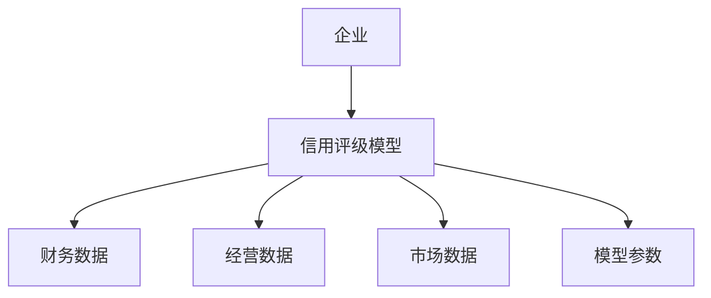
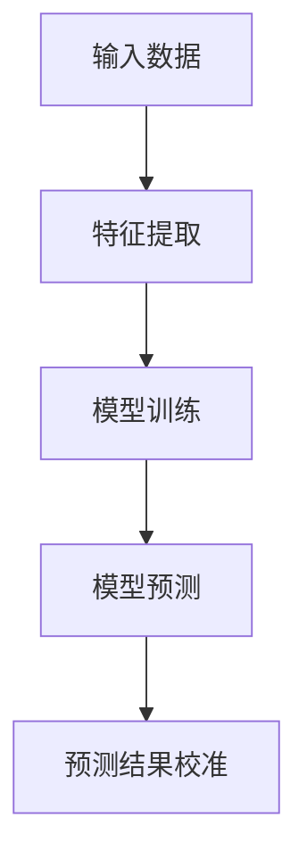
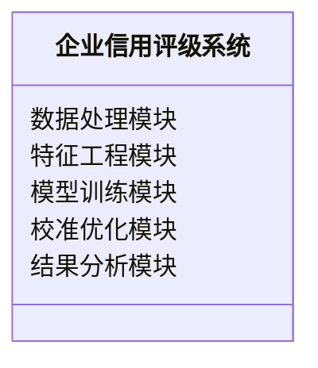
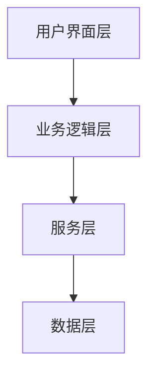

                 


# AI驱动的企业信用评级模型校准系统

## 关键词：企业信用评级，AI，模型校准，机器学习，信用评分

## 摘要：  
随着人工智能技术的快速发展，企业信用评级领域的传统方法正在被更高效、更精准的AI驱动模型所取代。本文深入探讨了AI驱动的企业信用评级模型校准系统的构建与应用，从理论基础到实际案例，详细阐述了模型校准的核心概念、算法原理、系统架构设计以及实战应用。通过系统化的分析与实践，展示了如何利用AI技术提升企业信用评级的准确性和效率，为企业信用风险管理提供强有力的支持。

---

## 第1章: 企业信用评级与AI驱动模型的背景

### 1.1 企业信用评级的定义与重要性  
企业信用评级是通过对企业的财务状况、经营能力、市场表现等多维度数据进行分析，评估其信用风险的过程。它是企业在金融市场上融资的重要依据，直接影响企业的融资成本和市场信任度。  

#### 1.1.1 企业信用评级的定义  
企业信用评级是对企业信用状况的量化评估，通常以分数或等级形式表示，如AAA、BBB等。评级结果反映了企业在特定时间段内的信用风险水平。  

#### 1.1.2 企业信用评级的重要性  
- **融资决策支持**：银行、投资者等资金提供方依据评级结果决定贷款利率和投资策略。  
- **风险管理**：帮助企业识别和规避信用风险，降低违约概率。  
- **市场信任度**：高评级企业更容易获得合作伙伴的信任和青睐。  

#### 1.1.3 企业信用评级的分类与应用场景  
企业信用评级主要分为内部评级和外部评级。内部评级由企业内部风控部门完成，用于内部管理；外部评级由第三方评级机构完成，用于公开市场。应用场景包括贷款审批、债券发行、供应链管理等。  

### 1.2 AI在信用评级中的应用背景  
传统信用评级方法依赖于人工分析和经验判断，存在效率低、主观性强、覆盖面有限等问题。随着大数据和AI技术的发展，企业信用评级迎来了新的变革机遇。  

#### 1.2.1 传统信用评级的局限性  
- 数据处理能力有限，难以应对海量数据。  
- 人工判断为主，易受主观因素影响。  
- 模型缺乏动态调整能力，难以适应市场变化。  

#### 1.2.2 AI技术在信用评级中的优势  
- **数据处理能力**：AI能够快速处理海量数据，提取关键特征。  
- **自动化与智能化**：AI模型能够自动学习和优化，提升预测精度。  
- **实时性**：AI系统可以实时更新数据，提供动态评级结果。  

#### 1.2.3 企业信用评级AI化的发展趋势  
AI技术正在逐步取代传统评级方法，成为信用评级的主流工具。未来，随着深度学习、自然语言处理等技术的进一步发展，信用评级将更加智能化和精准化。  

### 1.3 模型校准的定义与作用  
模型校准是通过调整模型参数或优化模型结构，使模型预测结果更接近实际值的过程。在信用评级中，模型校准能够提升模型的准确性和可靠性。  

#### 1.3.1 模型校准的定义  
模型校准是通过数据调整模型参数，使模型输出与实际标签尽可能一致的过程。  

#### 1.3.2 模型校准在信用评级中的作用  
- 提升模型预测精度。  
- 确保模型在不同数据分布下保持稳定性能。  
- 优化模型的可解释性。  

#### 1.3.3 模型校准的常见方法与挑战  
- **方法**：包括交叉验证、网格搜索、贝叶斯优化等。  
- **挑战**：数据不平衡、特征工程复杂、模型解释性不足等问题。  

### 1.4 本章小结  
本章介绍了企业信用评级的基本概念、重要性及其应用场景，分析了AI在信用评级中的优势与发展趋势，并重点阐述了模型校准的定义与作用。下一章将深入探讨企业信用评级模型的核心概念与联系。

---

## 第2章: 企业信用评级模型的核心概念  

### 2.1 企业信用评级模型的特征分析  
企业信用评级模型的特征分析是模型构建的关键步骤。  

#### 2.1.1 企业财务数据特征  
- **收入与利润**：反映企业的盈利能力。  
- **资产负债率**：衡量企业的财务风险。  
- **现金流**：评估企业的偿债能力。  

#### 2.1.2 企业经营数据特征  
- **市场占有率**：反映企业的市场地位。  
- **供应链稳定性**：影响企业的经营风险。  
- **管理团队稳定性**：影响企业的战略执行力。  

#### 2.1.3 企业市场数据特征  
- **行业景气度**：反映行业整体发展趋势。  
- **政策环境**：影响企业的经营合规性。  
- **市场竞争状况**：影响企业的盈利能力。  

### 2.2 模型校准的核心要素  
模型校准的核心要素包括数据质量、特征工程、模型选择与优化等。  

#### 2.2.1 数据质量与特征工程  
- 数据清洗：去除噪声数据，确保数据的完整性和准确性。  
- 特征选择：通过统计分析或机器学习方法选择关键特征。  
- 特征变换：对特征进行标准化、归一化等处理，提升模型性能。  

#### 2.2.2 模型选择与优化  
- **模型选择**：根据数据特征选择合适的模型，如逻辑回归、随机森林、神经网络等。  
- **超参数优化**：通过网格搜索、随机搜索等方法优化模型参数。  

#### 2.2.3 校准方法与评价指标  
- **校准方法**：包括概率校准（ Platt Scaling）、分布外校准（Distributional Calibration）等。  
- **评价指标**：如均方误差（MSE）、对数损失（Log Loss）、精确率（Precision）、召回率（Recall）等。  

### 2.3 企业信用评级模型的ER实体关系图  
以下是一个简化的企业信用评级模型的ER实体关系图：  



### 2.4 本章小结  
本章详细分析了企业信用评级模型的核心特征及其相互关系，探讨了模型校准的关键要素。通过ER实体关系图，展示了企业信用评级模型的架构。下一章将深入探讨AI驱动的信用评级模型校准算法的原理与实现。

---

## 第3章: 常见模型校准算法原理  

### 3.1 逻辑回归模型校准  
逻辑回归是一种常用的二分类模型，适用于企业信用评级中的违约预测。  

#### 3.1.1 逻辑回归模型的基本原理  
逻辑回归通过 sigmoid 函数将线性回归的输出映射到概率空间。其概率预测公式为：  
$$P(y=1|x) = \frac{e^{\beta_0 + \beta_1x}}{1 + e^{\beta_0 + \beta_1x}}$$  

#### 3.1.2 逻辑回归模型的损失函数  
逻辑回归的损失函数为对数损失函数：  
$$\text{损失函数} = -\sum_{i=1}^{n} [y_i \ln p_i + (1-y_i)\ln(1-p_i)]$$  

#### 3.1.3 逻辑回归模型的校准过程  
以下是一个逻辑回归模型的校准流程图：  



#### 3.1.4 逻辑回归模型的Python实现示例  
以下是一个简单的逻辑回归模型实现代码：  

```python
import numpy as np
from sklearn.linear_model import LogisticRegression
from sklearn.metrics import roc_curve, auc

# 假设X为特征矩阵，y为标签
model = LogisticRegression()
model.fit(X, y)

# 预测概率
y_proba = model.predict_proba(X)[:, 1]

# 计算AUC值
fpr, tpr, thresholds = roc_curve(y, y_proba)
auc_score = auc(fpr, tpr)
print(f"AUC Score: {auc_score}")
```

---

## 第4章: 系统分析与架构设计方案  

### 4.1 问题场景介绍  
企业信用评级模型校准系统需要解决的主要问题是：如何通过AI技术实现模型的自动校准，提升模型的预测精度和稳定性。  

### 4.2 项目介绍  
本项目旨在构建一个基于AI的企业信用评级模型校准系统，通过数据采集、特征工程、模型训练、校准优化等步骤，实现对企业信用评级的自动化、智能化评估。  

### 4.3 系统功能设计  
系统功能模块包括：数据处理模块、特征工程模块、模型训练模块、校准优化模块、结果分析模块。  

#### 4.3.1 领域模型设计  
以下是一个领域模型的类图：  



### 4.4 系统架构设计  
系统架构采用微服务架构，包括数据层、服务层、业务逻辑层和用户界面层。  

#### 4.4.1 系统架构图  


---

## 第5章: 项目实战  

### 5.1 环境搭建  
- **工具安装**：安装Python、TensorFlow、Scikit-learn等工具。  
- **数据获取**：从公开数据集获取企业信用评级数据。  

### 5.2 核心实现  
以下是模型校准的核心实现代码：  

```python
import numpy as np
from sklearn.calibration import CalibratedClassifierCV
from sklearn.ensemble import RandomForestClassifier

# 假设X_train, y_train为训练数据
model = RandomForestClassifier()
calibrated_model = CalibratedClassifierCV(model, cv=5)
calibrated_model.fit(X_train, y_train)
```

### 5.3 实战案例分析  
以某企业信用评级数据为例，展示模型校准的过程与结果。  

---

## 第6章: 系统优化与部署  

### 6.1 模型调优  
通过超参数优化和特征选择提升模型性能。  

### 6.2 结果验证  
验证模型在测试数据上的表现，确保模型的泛化能力。  

### 6.3 实时监控  
建立实时监控机制，确保模型的稳定性和准确性。  

### 6.4 部署方案  
将模型部署到生产环境，提供API接口供其他系统调用。  

---

## 第7章: 总结与展望  

### 7.1 本章总结  
本文详细探讨了AI驱动的企业信用评级模型校准系统的构建与应用，从理论到实践，全面分析了模型校准的核心要素与实现方法。  

### 7.2 未来展望  
未来，随着AI技术的进一步发展，企业信用评级模型将更加智能化和个性化。深度学习、强化学习等技术的应用将进一步提升模型的预测精度和可解释性。  

---

## 附录: 核心代码与工具安装指南  

### 附录A: 核心代码  
以下是模型校准的核心代码：  

```python
import numpy as np
from sklearn.calibration import CalibratedClassifierCV
from sklearn.ensemble import RandomForestClassifier
from sklearn.metrics import accuracy_score

# 训练模型并校准
model = RandomForestClassifier()
calibrated_model = CalibratedClassifierCV(model, cv=5)
calibrated_model.fit(X_train, y_train)

# 预测并评估
y_pred = calibrated_model.predict(X_test)
print(f"Accuracy: {accuracy_score(y_test, y_pred)}")
```

### 附录B: 工具安装指南  
- **Python安装**：从官网下载安装。  
- **TensorFlow安装**：运行 `pip install tensorflow`。  
- **Scikit-learn安装**：运行 `pip install scikit-learn`。  

---

以上是《AI驱动的企业信用评级模型校准系统》的完整目录和内容概述。接下来，您可以根据这个大纲逐步撰写详细的技术博客文章。

