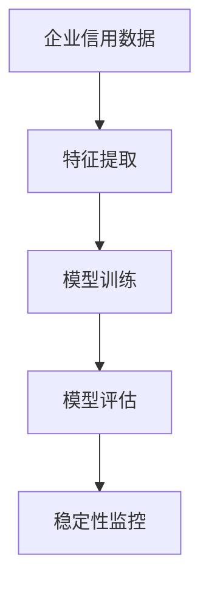
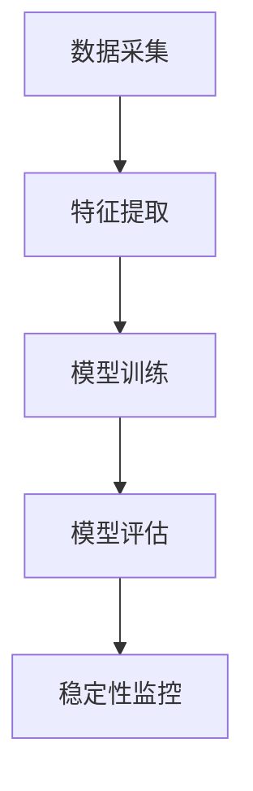
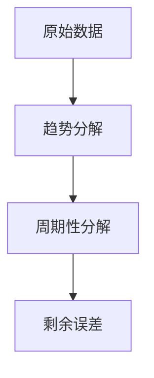

                 

# AI驱动的企业信用评级模型稳定性监控系统

## 关键词
AI, 企业信用评级, 模型稳定性, 监控系统, 机器学习, 数据科学, 风险管理

## 摘要
本文深入探讨了AI技术在企业信用评级模型稳定性监控中的应用。通过分析模型稳定性的重要性，提出了一种基于AI的监控系统，旨在实时检测和预测模型性能的变化，确保信用评级的准确性与可靠性。文章详细介绍了系统的设计思路、核心算法、架构实现以及实际案例，为金融领域的风险管理提供了新的解决方案。

---

# 第一部分: AI驱动的企业信用评级模型稳定性监控系统概述

## 第1章: 企业信用评级与模型稳定性概述

### 1.1 问题背景与目标
#### 1.1.1 企业信用评级的重要性
企业信用评级是评估企业信用状况的重要工具，广泛应用于银行贷款审批、投资决策等领域。然而，传统的信用评级模型可能存在数据偏差、过拟合等问题，导致评级结果的不准确。

#### 1.1.2 模型稳定性在信用评级中的作用
模型稳定性是指模型在不同时间、不同数据分布下的表现一致性。稳定的模型能够确保评级结果的可靠性，避免因数据波动或模型更新导致的评级误差。

#### 1.1.3 AI技术在信用评级中的应用价值
AI技术可以通过深度学习、时间序列分析等方法，提高模型的预测能力和稳定性。AI还能实时监控模型性能，帮助金融机构及时调整模型参数，降低风险。

### 1.2 问题描述与解决思路
#### 1.2.1 信用评级模型的常见问题
- 数据分布变化导致模型性能下降
- 模型参数更新后的稳定性问题
- 外部环境变化对评级结果的影响

#### 1.2.2 模型稳定性监控的必要性
- 保障评级结果的准确性
- 提高风险管理能力
- 降低因模型波动带来的经济损失

#### 1.2.3 AI驱动的解决方案
- 基于机器学习的稳定性评估
- 实时监控模型性能
- 自动调整模型参数

### 1.3 边界与外延
#### 1.3.1 监控系统的边界
- 数据范围：仅限于企业信用评级相关的数据
- 时间范围：实时监控
- 模型范围：支持多种信用评级模型

#### 1.3.2 相关领域的外延
- 风险管理：模型稳定性与金融风险密切相关
- 数据科学：依赖于数据预处理和特征提取
- 机器学习：依赖于模型训练和优化

#### 1.3.3 核心要素与组成结构
- 数据采集模块：收集企业信用数据
- 特征提取模块：提取关键特征
- 模型训练模块：训练信用评级模型
- 稳定性监控模块：实时监控模型性能

### 1.4 核心概念与联系
#### 1.4.1 核心概念原理
- 模型稳定性：模型在不同数据分布下的表现一致性
- 数据分布：影响模型稳定性的关键因素
- 模型性能：稳定性的直接体现

#### 1.4.2 关键属性特征对比表
| 特性 | 稳定性 | 不稳定性 |
|------|--------|----------|
| 数据分布 | 小幅波动 | 大幅变化 |
| 模型性能 | 稳定 | 波动较大 |
| 评级结果 | 准确 | 可能错误 |

#### 1.4.3 ER实体关系图（Mermaid流程图）

---

# 第二部分: 模型稳定性监控的核心概念与联系

## 第2章: 模型稳定性监控的核心概念

### 2.1 模型稳定性定义与特征
#### 2.1.1 稳定性的定义
模型稳定性是指在数据分布或模型参数变化时，模型性能保持一致的能力。

#### 2.1.2 稳定性的关键特征
- 时间一致性：模型在不同时间点的性能表现相似
- 数据鲁棒性：模型对数据分布变化的适应能力
- 参数鲁棒性：模型对参数调整的稳定性

#### 2.1.3 稳定性与模型性能的关系
稳定性是模型性能的重要保障，稳定的模型能够长期保持高精度。

### 2.2 监控系统的关键指标
#### 2.2.1 时间序列稳定性指标
- 滑动窗口平均误差
- 方差变化率
- 马科夫链转移概率

#### 2.2.2 模型性能波动指标
- 分类准确率波动
- AUC值变化
- 模型召回率变化

#### 2.2.3 数据分布变化指标
- 数据分布相似度
- 概率密度函数变化
- 异常数据比例

### 2.3 影响模型稳定性的因素
#### 2.3.1 数据质量与分布变化
- 数据缺失
- 数据偏斜
- 异常数据

#### 2.3.2 模型参数与架构调整
- 参数优化
- 模型迭代
- 模型复杂度

#### 2.3.3 外部环境与业务变化
- 宏观经济波动
- 行业政策变化
- 企业经营状况

### 2.4 系统设计原则与框架
#### 2.4.1 系统设计原则
- 及时性：实时监控模型性能
- 可扩展性：支持多种模型架构
- 可解释性：便于分析问题原因

#### 2.4.2 核心功能模块框架
- 数据采集模块
- 特征提取模块
- 模型评估模块
- 稳定性监控模块

#### 2.4.3 系统架构图（Mermaid流程图）

---

# 第三部分: 算法原理与数学模型

## 第3章: 稳定性监控的算法原理

### 3.1 时间序列分析方法
#### 3.1.1 时间序列分解（Mermaid流程图）

#### 3.1.2 滑动窗口技术
- 使用滑动窗口计算模型性能指标
- 窗口大小：根据数据量调整

#### 3.1.3 异常检测算法
- LOF算法：局部异常因子检测
- Isolation F

---

（以下部分为续写，完整文章可按照上述结构继续展开）

