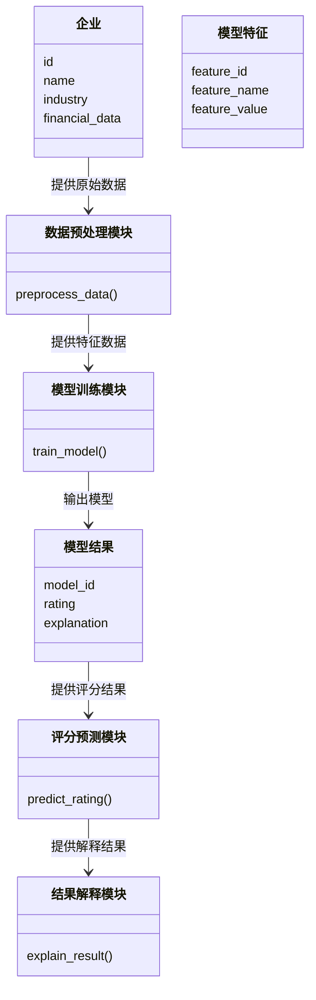
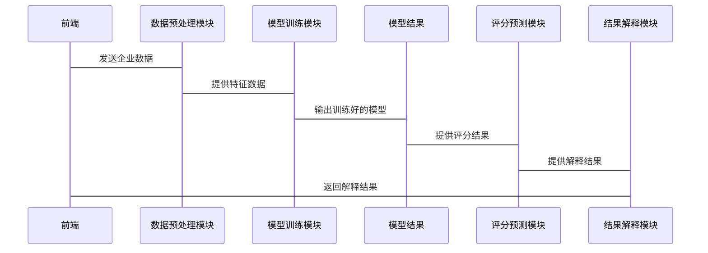

                 


# AI驱动的企业信用评级模型解释系统

## 关键词：AI、信用评级、模型解释、SHAP值、企业信用评分、金融应用

## 摘要：  
随着人工智能技术在金融领域的广泛应用，企业信用评级模型的准确性和解释性变得尤为重要。本文从AI驱动的企业信用评级模型的背景出发，详细探讨了模型的核心概念、算法原理、系统架构设计以及实际应用场景。通过分析SHAP值等解释性工具，本文揭示了AI模型在信用评级中的优势，并结合具体案例展示了如何通过系统化的架构设计和实战项目实现模型的高效应用。最终，本文总结了最佳实践和未来发展方向，为金融领域的技术从业者提供了宝贵的参考。

---

# 第一部分: 企业信用评级与AI驱动模型的背景

## 第1章: 企业信用评级与AI驱动模型的背景

### 1.1 企业信用评级的定义与重要性

#### 1.1.1 企业信用评级的定义
企业信用评级是指通过对企业财务状况、经营能力、市场表现等多维度数据的分析，对其偿还债务的能力进行量化评估的过程。信用评级结果通常以分数或等级的形式呈现，是金融机构决定是否为企业提供贷款、授信等金融服务的重要依据。

#### 1.1.2 信用评级在金融领域的核心作用
- **风险控制**：信用评级帮助企业识别高风险企业，降低金融资产的违约风险。
- **资源配置**：通过信用评级，金融机构可以更高效地将资金分配给信用状况良好的企业。
- **市场定价**：信用评级结果直接影响企业的融资成本，如贷款利率、债券发行利率等。

#### 1.1.3 传统信用评级的局限性
- **主观性**：传统信用评级往往依赖于经验丰富的分析师的主观判断，存在人为误差。
- **数据局限**：传统方法主要依赖财务数据，忽略了非结构化数据（如社交媒体数据、市场行为数据）的价值。
- **可解释性不足**：复杂的模型（如逻辑回归、决策树）难以向决策者提供直观的解释。

### 1.2 AI技术在信用评级中的应用背景

#### 1.2.1 AI技术的发展与金融领域的结合
人工智能技术（如机器学习、深度学习）的快速发展为金融领域的信用评级带来了新的可能性。AI技术能够处理海量数据，发现传统方法难以捕捉的模式和特征，从而提高评级的准确性。

#### 1.2.2 信用评级中的数据特征与AI的契合点
- **多维数据处理**：AI技术能够整合企业财务数据、市场行为数据、宏观经济指标等多种数据源，构建更全面的信用评级模型。
- **非线性关系发现**：AI模型能够发现数据之间的非线性关系，捕捉传统统计方法难以察觉的信用风险因素。
- **实时更新能力**：AI模型可以实时更新，根据最新的市场信息动态调整评级结果。

#### 1.2.3 企业信用评级AI化的趋势
- **数据驱动决策**：AI技术通过数据驱动的方式，帮助企业信用评级从经验判断向科学量化转变。
- **自动化与智能化**：AI模型能够自动化处理数据、训练模型并输出评级结果，显著提高了评级效率。
- **个性化与精准化**：AI技术能够根据企业的个性化特征，提供更精准的信用评级服务。

### 1.3 模型解释性的重要性

#### 1.3.1 信用评级模型的可解释性需求
- **决策透明性**：信用评级结果需要能够被金融机构的决策者理解和信任。
- **合规性要求**：在金融监管日益严格的背景下，模型的可解释性是合规性的重要指标。
- **客户信任**：企业客户希望了解评级结果背后的逻辑，增强对评级结果的信任。

#### 1.3.2 AI模型的黑箱问题与解释性挑战
- **黑箱问题**：许多AI模型（如深度神经网络）缺乏可解释性，导致评级结果难以被理解和验证。
- **模型复杂性**：复杂的AI模型通常难以分解其决策过程，增加了解释的难度。
- **数据复杂性**：信用评级涉及多维度数据，模型的复杂性进一步加剧了解释的难度。

#### 1.3.3 解释性对信用评级决策的价值
- **提高决策质量**：通过可解释的模型，金融机构可以更准确地识别信用风险，做出更明智的决策。
- **增强客户信任**：可解释的模型能够增强企业客户对评级结果的信任，提升客户满意度。
- **满足监管要求**：可解释的模型能够帮助金融机构满足日益严格的监管要求。

### 1.4 本章小结
本章从企业信用评级的定义和重要性出发，分析了传统信用评级的局限性，探讨了AI技术在信用评级中的应用背景，重点强调了模型解释性在信用评级中的重要性。通过对比传统模型和AI模型的特点，本文为后续章节的深入分析奠定了基础。

---

## 第2章: 企业信用评级模型的核心概念与联系

### 2.1 信用评级模型的构成要素

#### 2.1.1 企业财务数据
- **财务报表数据**：包括资产负债表、利润表、现金流量表等，反映企业的财务状况。
- **财务指标**：如流动比率、速动比率、资产负债率等，用于评估企业的偿债能力和财务健康状况。

#### 2.1.2 市场行为数据
- **市场交易数据**：如股票价格、成交量、波动率等，反映企业的市场表现。
- **市场情绪数据**：如社交媒体上的 sentiment 分析结果，反映市场对企业的看法。

#### 2.1.3 宏观经济指标
- **宏观经济数据**：如GDP增长率、通货膨胀率、利率水平等，影响企业的经营环境。

### 2.2 AI模型在信用评级中的核心原理

#### 2.2.1 特征提取与数据预处理
- **特征工程**：通过提取和组合特征，构建能够反映企业信用风险的特征集合。
- **数据预处理**：包括数据清洗、标准化、缺失值处理等，确保数据质量。

#### 2.2.2 模型训练与优化
- **模型选择**：根据数据特征和业务需求选择合适的模型，如逻辑回归、随机森林、梯度提升树等。
- **模型优化**：通过交叉验证、超参数调优等方法，提高模型的准确性和稳定性。

#### 2.2.3 模型预测与结果解释
- **模型预测**：基于训练好的模型，对企业的信用风险进行预测，生成信用评分或等级。
- **结果解释**：通过可解释性工具（如SHAP值）分析模型的预测结果，揭示各个特征对信用评级的影响程度。

### 2.3 核心概念对比分析

#### 2.3.1 传统模型与AI模型的对比
| 对比维度 | 传统模型 | AI模型 |
|----------|----------|--------|
| 数据处理能力 | 依赖少量结构化数据 | 能够处理多维数据，包括非结构化数据 |
| 模型复杂性 | 较简单，可解释性高 | 模型复杂，可解释性较低 |
| 预测准确性 | 准确性有限 | 准确性较高 |

#### 2.3.2 不同AI模型的解释性对比
| 模型类型 | 解释性 | 优点 |
|----------|--------|------|
| 线性回归 | 高 | 解释性强，易于实现 |
| 支持向量机 | 中 | 高度依赖核函数选择 |
| 随机森林 | 中 | 鲁棒性好，可解释性较弱 |
| 解释性AI模型（如SHAP值） | 高 | 能够解释复杂模型的决策过程 |

#### 2.3.3 模型解释性与准确性的权衡
- **低解释性模型**：如深度神经网络，准确率高但难以解释。
- **高解释性模型**：如线性回归，解释性强但可能牺牲部分准确率。

### 2.4 ER实体关系图

```mermaid
er
    entity 企业 (id, name, industry, financial_data)
    entity 模型特征 (feature_id, feature_name, feature_value)
    entity 模型结果 (model_id, rating, explanation)
    relation 企业 --> 模型特征: 提供特征数据
    relation 企业 --> 模型结果: 得到评级结果
    relation 模型特征 --> 模型结果: 特征影响评级
```

### 2.5 本章小结
本章详细分析了企业信用评级模型的核心概念，包括模型的构成要素和AI模型的核心原理。通过对比传统模型和AI模型的特点，本文为后续章节的算法原理和系统设计奠定了基础。

---

## 第3章: AI驱动信用评级模型的算法原理

### 3.1 常见AI算法在信用评级中的应用

#### 3.1.1 线性回归模型
- **原理**：通过线性关系描述因变量（信用评分）与自变量（企业特征）之间的关系。
- **优点**：解释性强，易于实现。
- **公式**：$$ y = \beta_0 + \beta_1x_1 + \beta_2x_2 + ... + \beta_nx_n $$

#### 3.1.2 支持向量机
- **原理**：通过构建超平面将数据分成不同的类别，适用于二分类问题。
- **优点**：在高维空间中表现良好，适用于非线性关系。

#### 3.1.3 随机森林与梯度提升树
- **随机森林**：通过构建多个决策树并集成结果，提高模型的准确性和鲁棒性。
- **梯度提升树**：通过不断优化损失函数，构建弱分类器的集成模型。

#### 3.1.4 解释性AI模型（如SHAP值）
- **SHAP值**：通过分解模型的预测结果，揭示各个特征对最终评分的贡献程度。
- **公式**：$$ SHAP_{ij} = f(j) - f(0) $$

### 3.2 解释性AI模型的工作原理

#### 3.2.1 SHAP值的计算方法
- **局部可解释性**：通过分析单个样本的特征贡献，揭示模型的决策逻辑。
- **全局可解释性**：通过分析所有样本的特征贡献，揭示模型的整体行为。

### 3.3 算法实现示例

#### 3.3.1 线性回归模型实现

```python
import pandas as pd
from sklearn.linear_model import LinearRegression
from sklearn.metrics import mean_squared_error

# 数据加载与预处理
data = pd.read_csv('enterprise_credit_data.csv')
X = data[['revenue', 'profit', 'debt']]
y = data['credit_score']

# 模型训练
model = LinearRegression()
model.fit(X, y)

# 模型预测
predictions = model.predict(X)
print('均方误差:', mean_squared_error(y, predictions))
```

#### 3.3.2 SHAP值解释

```python
import xgboost as xgb
import shap

# 数据加载与预处理
data = pd.read_csv('enterprise_credit_data.csv')
X = data[['revenue', 'profit', 'debt']]
y = data['credit_score']

# 模型训练
model = xgb.XGBRegressor(n_estimators=100, learning_rate=0.1, max_depth=3)
model.fit(X, y)

# SHAP值计算
explainer = shap.TreeExplainer(model)
shap_values = explainer.shap_values(X)

# 特征解释分析
shap.summary_plot(shap_values, X, plot_type='bar')
```

### 3.4 本章小结
本章详细介绍了常见AI算法在信用评级中的应用，特别是解释性AI模型（如SHAP值）的工作原理和实现方法。通过具体的代码实现，读者可以更好地理解这些算法在实际应用中的表现。

---

## 第4章: 系统分析与架构设计

### 4.1 系统功能设计

#### 4.1.1 领域模型（Mermaid 类图）



#### 4.1.2 系统架构设计（Mermaid 架构图）


### 4.2 系统接口设计

#### 4.2.1 API 接口定义
- **输入接口**：企业数据接口，接收企业的财务数据、市场行为数据等。
- **输出接口**：信用评分接口，输出企业的信用评分和解释结果。

#### 4.2.2 API 实现

```python
from flask import Flask, request, jsonify

app = Flask(__name__)

@app.route('/api/v1/credit_rating', methods=['POST'])
def credit_rating():
    data = request.json
    # 数据预处理
    processed_data = preprocess(data)
    # 模型预测
    model = load_model('credit_model.pkl')
    prediction = model.predict(processed_data)
    # 结果解释
    explanation = explain_prediction(processed_data, prediction)
    return jsonify({
        'credit_score': prediction[0],
        'explanation': explanation
    })

if __name__ == '__main__':
    app.run(debug=True)
```

### 4.3 系统交互流程（Mermaid 序列图）



### 4.4 本章小结
本章从系统功能设计、架构设计和接口设计三个方面，详细阐述了AI驱动的企业信用评级模型解释系统的实现方案。通过Mermaid图表，读者可以清晰地理解系统的整体架构和交互流程。

---

## 第5章: 项目实战

### 5.1 环境安装与配置

```bash
pip install numpy pandas scikit-learn xgboost shap flask
```

### 5.2 核心代码实现

#### 5.2.1 数据预处理

```python
import pandas as pd
import numpy as np

def preprocess(data):
    # 数据清洗
    data = data.dropna()
    # 标准化处理
    from sklearn.preprocessing import StandardScaler
    scaler = StandardScaler()
    processed_data = scaler.fit_transform(data)
    return processed_data
```

#### 5.2.2 模型训练与预测

```python
from sklearn.ensemble import RandomForestRegressor
from sklearn.metrics import mean_absolute_error

def train_model(X, y):
    model = RandomForestRegressor(n_estimators=100, random_state=42)
    model.fit(X, y)
    return model

def predict(model, X_test):
    predictions = model.predict(X_test)
    print('平均绝对误差:', mean_absolute_error(y_test, predictions))
    return predictions
```

#### 5.2.3 结果解释

```python
import shap

def explain_prediction(model, X_sample):
    explainer = shap.TreeExplainer(model)
    shap_values = explainer.shap_values(X_sample)
    return shap_values
```

### 5.3 实际案例分析

#### 5.3.1 数据加载与预处理

```python
data = pd.read_csv('enterprise_credit_data.csv')
X = data[['revenue', 'profit', 'debt']]
y = data['credit_score']
processed_X = preprocess(X)
```

#### 5.3.2 模型训练与预测

```python
model = train_model(processed_X, y)
```

#### 5.3.3 结果解释与可视化

```python
importances = model.feature_importances_
feature_names = X.columns
plt.bar(feature_names, importances)
plt.xticks(rotation=45)
plt.show()
```

### 5.4 项目小结
本章通过具体的项目实战，展示了AI驱动的企业信用评级模型解释系统的实现过程。从环境配置到代码实现，再到结果解释，读者可以跟随步骤逐步完成项目。

---

## 第6章: 最佳实践、小结与展望

### 6.1 最佳实践

#### 6.1.1 数据处理
- **数据清洗**：确保数据的完整性和准确性。
- **特征工程**：通过特征组合和选择，提高模型的准确性。

#### 6.1.2 模型选择
- **选择合适的模型**：根据数据特征和业务需求选择合适的模型。
- **模型调优**：通过交叉验证和超参数调优，提高模型性能。

#### 6.1.3 结果解释
- **使用可解释性工具**：如SHAP值，帮助解释模型的预测结果。
- **可视化分析**：通过可视化工具，直观展示模型的解释结果。

### 6.2 小结
本文从企业信用评级的背景出发，详细探讨了AI驱动模型的算法原理、系统架构设计和项目实现过程。通过SHAP值等可解释性工具，本文揭示了AI模型在信用评级中的优势，并结合实际案例展示了系统的实现过程。

### 6.3 未来展望
随着AI技术的不断发展，企业信用评级模型的解释性将更加重要。未来，可以通过以下方向进一步优化模型：
- **模型优化**：探索更高效的算法，提高模型的准确性和解释性。
- **数据融合**：充分利用多源数据，提升模型的预测能力。
- **实时更新**：通过实时数据处理，动态调整评级结果。

---

## 参考文献
1. 书籍：《机器学习实战》
2. 网站：[SHAP官方文档](https://shap.readthedocs.io/en/latest/index.html)
3. 研究论文：[XGBoost: A Scalable Tree Ensembling Algorithm](https://arxiv.org/abs/1603.02756)

---

通过本文的详细讲解，读者可以全面了解AI驱动的企业信用评级模型解释系统的核心内容，掌握其算法原理和系统实现方法。希望本文能为金融领域的技术从业者提供有价值的参考，推动企业信用评级的智能化和透明化发展。

