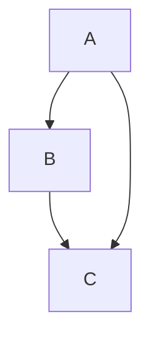

                 


# AI驱动的企业信用风险传导模拟系统

> 关键词：AI技术，信用风险，风险传导，系统模拟，风险管理

> 摘要：本文深入探讨了AI技术在企业信用风险传导模拟系统中的应用，从理论基础到系统架构，再到实际案例分析，全面解析了如何利用人工智能技术构建高效、准确的信用风险模拟系统。通过本文的讲解，读者将能够理解信用风险传导的基本原理，掌握AI驱动的模拟系统的核心算法，以及如何在实际场景中应用这些技术来优化企业风险管理。

---

## 第1章: 企业信用风险与AI模拟的背景

### 1.1 信用风险的基本概念

信用风险是指由于债务人或交易对手无法履行其合约义务，导致债权人或相关方遭受损失的风险。在企业层面，信用风险通常表现为应收账款无法收回、供应链中断或合作伙伴违约等情况。信用风险的管理对于企业财务健康和经营稳定性至关重要。

#### 1.1.1 信用风险的定义
信用风险是企业在经营过程中可能面临的一种重要风险，主要源于交易对手或合作伙伴的信用状况变化。企业信用风险可以分为单个企业的信用风险和系统性信用风险，后者通常与宏观经济波动或行业周期性变化有关。

#### 1.1.2 信用风险的分类
信用风险可以分为以下几类：
1. **单个企业信用风险**：由于企业自身财务状况恶化或管理问题导致的违约风险。
2. **系统性信用风险**：由于宏观经济波动或行业周期性变化导致的广泛性违约风险。
3. **交易对手信用风险**：由于交易对手的信用状况变化导致的合同履行风险。

#### 1.1.3 信用风险对企业的影响
信用风险可能对企业的财务状况、经营稳定性以及市场声誉产生重大影响。具体表现在：
- **财务损失**：由于应收账款无法收回或合同违约导致的直接经济损失。
- **流动性风险**：信用风险的加剧可能导致企业资金链紧张，进而引发流动性风险。
- **声誉风险**：信用风险事件可能对企业声誉造成负面影响，进而影响客户信任和市场地位。

### 1.2 信用风险传导的机制

信用风险的传导是指信用风险从一个企业或行业向其他企业或行业扩散的过程。这种传导机制通常通过供应链、金融市场和行业关联等方式实现。

#### 1.2.1 信用风险传导的定义
信用风险传导是指由于某一企业或行业的信用风险事件，导致其他相关企业或行业也面临信用风险的过程。这种传导机制通常是由于企业之间的关联性或市场参与者的相互依赖性所引发。

#### 1.2.2 信用风险传导的路径
信用风险的传导路径主要包括以下几种：
1. **供应链传导**：上游企业违约可能导致下游企业面临付款延迟或原材料短缺，进而影响其经营状况。
2. **金融市场传导**：企业信用风险可能通过金融市场（如债券市场、股票市场）传递给其他企业和投资者。
3. **行业关联传导**：同一行业内的企业之间存在密切的业务关联，一家企业的信用风险事件可能波及其他企业。

#### 1.2.3 信用风险传导的影响因素
信用风险的传导程度取决于多种因素，包括企业的财务状况、行业竞争结构、市场环境和宏观经济政策等。具体表现在：
- **企业规模**：大型企业的信用风险事件通常具有更大的传导性。
- **行业集中度**：行业集中度高的企业更容易通过供应链将风险传导给其他企业。
- **金融市场环境**：金融市场的波动性和流动性也会影响信用风险的传导过程。

### 1.3 AI技术在信用风险模拟中的作用

随着人工智能技术的快速发展，AI技术在信用风险模拟中的应用越来越广泛。AI技术可以帮助企业更准确地预测信用风险，优化风险管理策略，并提高风险应对能力。

#### 1.3.1 AI技术的基本概念
人工智能（AI）是指通过模拟人类智能的某些方面，如学习、推理和自适应，来实现特定任务的技术。AI技术的核心包括机器学习、自然语言处理、计算机视觉和知识图谱等。

#### 1.3.2 AI技术在金融领域的应用
AI技术在金融领域的应用非常广泛，包括信用评分、欺诈检测、市场预测和风险评估等。AI技术可以帮助金融机构更高效地处理大量数据，并提供更精准的决策支持。

#### 1.3.3 AI技术在信用风险模拟中的优势
AI技术在信用风险模拟中的优势主要体现在以下几个方面：
1. **数据处理能力**：AI技术可以处理大量复杂的数据，帮助识别潜在的信用风险因素。
2. **预测能力**：通过机器学习算法，AI技术可以预测企业的信用状况，并评估信用风险的传导路径。
3. **实时性**：AI技术可以实现实时监控和预测，帮助企业及时应对信用风险事件。

### 1.4 本章小结

本章介绍了信用风险的基本概念、传导机制以及AI技术在信用风险模拟中的作用。信用风险是企业经营中的重要风险，其传导机制复杂且多样。AI技术通过强大的数据处理能力和预测能力，为企业信用风险模拟提供了新的解决方案。接下来的章节将深入探讨信用风险模拟的核心概念和AI技术的具体应用。

---

## 第2章: 企业信用风险传导模拟的核心概念

### 2.1 信用风险传导的数学模型

为了准确模拟信用风险的传导过程，需要构建合适的数学模型。这些模型可以帮助我们理解信用风险的传播机制，并为风险评估和管理提供理论依据。

#### 2.1.1 线性回归模型

线性回归模型是一种常用的统计模型，可以用来分析变量之间的线性关系。在信用风险模拟中，线性回归模型可以用来预测企业的信用评分或违约概率。

##### 线性回归模型的数学表达
线性回归模型可以表示为：
$$ y = \beta_0 + \beta_1 x_1 + \beta_2 x_2 + \dots + \beta_n x_n + \epsilon $$
其中，$y$ 是目标变量（如违约概率），$x_i$ 是自变量（如企业财务指标），$\beta_i$ 是回归系数，$\epsilon$ 是误差项。

##### 例子
假设我们有以下数据：
| 企业 | 收入 | 利润 | 违约概率 |
|------|------|------|----------|
| A    | 100  | 20   | 0.05     |
| B    | 80   | 15   | 0.10     |
| C    | 120  | 25   | 0.02     |

我们可以使用线性回归模型来预测违约概率：
$$ \text{违约概率} = \beta_0 + \beta_1 \times \text{收入} + \beta_2 \times \text{利润} $$

通过训练数据，可以估计出$\beta_0$和$\beta_1$的值，从而实现对违约概率的预测。

#### 2.1.2 马尔可夫链模型

马尔可夫链模型是一种描述系统状态转移的数学模型，常用于分析信用风险的动态变化。在信用风险模拟中，马尔可夫链模型可以用来预测企业信用等级的变化。

##### 马尔可夫链模型的数学表达
马尔可夫链模型可以用转移概率矩阵来表示：
$$ P = \begin{bmatrix} p_{11} & p_{12} & \dots & p_{1n} \\ p_{21} & p_{22} & \dots & p_{2n} \\ \vdots & \vdots & \ddots & \vdots \\ p_{n1} & p_{n2} & \dots & p_{nn} \end{bmatrix} $$
其中，$p_{ij}$ 表示从状态 $i$ 转移到状态 $j$ 的概率。

##### 例子
假设我们有三个信用等级：AAA、AA和A。转移概率矩阵可以表示为：
$$ P = \begin{bmatrix} 0.9 & 0.05 & 0.05 \\ 0.1 & 0.8 & 0.1 \\ 0.05 & 0.25 & 0.7 \end{bmatrix} $$
这意味着，从AAA等级转移到AA等级的概率是5%，转移到A等级的概率是5%，保持AAA等级的概率是90%。

#### 2.1.3 网络模型

网络模型是一种基于图论的数学模型，可以用来分析企业之间的关联性以及信用风险的传导路径。在信用风险模拟中，网络模型可以用来构建企业的信用风险网络，并分析风险的传播路径。

##### 网络模型的数学表达
网络模型可以用图论中的图来表示，包括节点和边。节点代表企业，边代表企业之间的关联关系。边的权重可以表示企业之间的业务往来或资金往来规模。

##### 例子
假设我们有三个企业A、B和C，它们之间的业务往来如下：
- A与B的业务往来金额为100万元。
- B与C的业务往来金额为50万元。
- A与C的业务往来金额为20万元。

可以用如下的网络图表示：

每条边的权重可以进一步标注，表示业务往来的金额。

### 2.2 AI驱动的信用风险模拟系统架构

AI驱动的信用风险模拟系统架构是一个复杂的技术系统，需要整合多种AI技术，如机器学习、自然语言处理和图论等，来实现信用风险的模拟和管理。

#### 2.2.1 系统的输入与输出

##### 输入
- 企业基本信息：包括企业规模、行业、地理位置等。
- 企业的财务数据：包括收入、利润、资产负债表等。
- 企业的信用历史：包括信用评分、违约记录等。
- 企业的供应链数据：包括供应商、客户、合作伙伴等。
- 市场数据：包括宏观经济指标、行业趋势等。

##### 输出
- 企业的信用评分。
- 企业的违约概率。
- 信用风险的传导路径。
- 信用风险的缓解策略。

#### 2.2.2 系统的核心模块

##### 数据采集模块
数据采集模块负责收集企业的相关信息，包括财务数据、供应链数据和市场数据等。数据采集可以通过API接口、数据库查询或网络爬取等方式实现。

##### 数据预处理模块
数据预处理模块对采集到的数据进行清洗、转换和标准化处理，确保数据的准确性和一致性。数据预处理包括数据清洗（去除重复数据、处理缺失值）、数据转换（如将文本数据转换为数值数据）和数据标准化（如归一化处理）等。

##### 风险评估模块
风险评估模块基于预处理后的数据，利用机器学习算法（如支持向量机、随机森林等）对企业的信用风险进行评估。风险评估模块可以输出企业的信用评分和违约概率。

##### 风险传导模拟模块
风险传导模拟模块基于信用风险的网络模型，模拟信用风险的传导路径和影响范围。该模块可以通过构建企业之间的关联网络，分析信用风险从一家企业向其他企业传导的过程。

##### 风险缓解模块
风险缓解模块根据模拟结果，提出风险缓解策略，如调整供应链结构、优化资本结构等。该模块可以输出具体的缓解措施和实施建议。

#### 2.2.3 系统的性能指标

系统的性能指标用于衡量系统的运行效率和准确性，主要包括以下几个方面：
- **准确性**：系统对信用风险的预测准确率。
- **运行效率**：系统的处理速度和响应时间。
- **可扩展性**：系统能否处理大规模数据和复杂场景。
- **稳定性**：系统的运行稳定性，是否容易受到数据波动或模型错误的影响。

### 2.3 信用风险传导与AI模拟的关系

信用风险的传导是一个动态且复杂的过程，而AI模拟技术可以帮助我们更好地理解和预测这一过程。通过AI技术，我们可以构建更精确的信用风险模型，并实现对信用风险的实时监控和动态管理。

#### 2.3.1 信用风险传导的动态性

信用风险的传导是一个动态过程，受多种因素的影响，如企业的财务状况、市场环境和政策变化等。AI技术可以通过实时数据更新和模型自适应，实现对信用风险传导的动态模拟。

#### 2.3.2 AI模拟的实时性

AI模拟技术可以实现实时监控和预测，帮助企业及时应对信用风险事件。通过实时数据处理和模型更新，AI模拟系统可以提供最新的信用风险评估和传导路径分析。

#### 2.3.3 系统的可扩展性

AI模拟系统具有良好的可扩展性，可以适应不同的企业规模和行业特点。通过模块化设计和分布式计算，系统可以处理大规模数据和复杂场景，满足不同用户的需求。

### 2.4 本章小结

本章详细介绍了信用风险传导的数学模型和AI驱动的信用风险模拟系统架构。通过构建合适的数学模型和系统架构，可以实现对信用风险的准确模拟和有效管理。接下来的章节将深入探讨信用风险模拟的算法原理和系统实现的具体细节。

---

## 第3章: 信用风险传导模拟的算法原理

### 3.1 基于概率论的信用风险评估

概率论是信用风险评估的重要理论基础，通过概率论可以计算企业的违约概率和信用评分。

#### 3.1.1 贝叶斯定理的应用

贝叶斯定理是一种用于条件概率计算的定理，可以用来更新基于新证据的假设概率。在信用风险评估中，贝叶斯定理可以用来计算企业在不同条件下的违约概率。

##### 贝叶斯定理的数学表达
贝叶斯定理可以表示为：
$$ P(A|B) = \frac{P(B|A) \cdot P(A)}{P(B)} $$
其中，$P(A|B)$ 是在$B$条件下$A$发生的概率，$P(B|A)$ 是在$A$条件下$B$发生的概率，$P(A)$ 是$A$发生的先验概率，$P(B)$ 是$B$发生的全概率。

##### 例子
假设我们有以下数据：
- 企业的历史违约率为5%（$P(A) = 0.05$）。
- 在违约的情况下，企业的收入下降的概率为80%（$P(B|A) = 0.8$）。
- 在非违约的情况下，企业的收入下降的概率为20%（$P(B|\neg A) = 0.2$）。

我们可以计算在收入下降的情况下企业违约的概率：
$$ P(A|B) = \frac{0.8 \times 0.05}{0.8 \times 0.05 + 0.2 \times 0.95} = \frac{0.04}{0.04 + 0.19} = 0.1765 $$

这意味着，在收入下降的情况下，企业违约的概率为17.65%。

#### 3.1.2 马尔可夫链的构建

马尔可夫链模型可以用来模拟信用风险的动态变化。通过构建马尔可夫链模型，可以分析企业信用等级的变化过程。

##### 马尔可夫链的数学表达
马尔可夫链可以用状态转移矩阵来表示：
$$ P = \begin{bmatrix} p_{11} & p_{12} & \dots & p_{1n} \\ p_{21} & p_{22} & \dots & p_{2n} \\ \vdots & \vdots & \ddots & \vdots \\ p_{n1} & p_{n2} & \dots & p_{nn} \end{bmatrix} $$
其中，$p_{ij}$ 是从状态$i$转移到状态$j$的概率。

##### 例子
假设我们有三个信用等级：AAA、AA和A。转移概率矩阵可以表示为：
$$ P = \begin{bmatrix} 0.9 & 0.05 & 0.05 \\ 0.1 & 0.8 & 0.1 \\ 0.05 & 0.25 & 0.7 \end{bmatrix} $$
这意味着：
- 从AAA等级转移到AA等级的概率是5%。
- 从AA等级转移到AAA等级的概率是10%。
- 从A等级转移到AA等级的概率是25%。

通过马尔可夫链模型，可以模拟企业信用等级的变化过程，并预测未来可能的信用等级。

#### 3.1.3 风险概率的计算

通过概率论和马尔可夫链模型，可以计算企业的违约概率和信用风险的传导概率。这些概率可以用来评估企业的信用风险，并制定相应的风险缓解策略。

##### 例子
假设我们有一个企业A，当前信用等级为AAA。根据转移概率矩阵，未来一年内企业A保持AAA等级的概率是90%，降级到AA等级的概率是5%，降级到A等级的概率是5%。如果企业A的信用等级降级到AA，其违约概率可能会增加，从而影响其信用风险。

### 3.2 基于图论的信用风险传导网络

图论是分析信用风险传导网络的重要工具，可以通过构建企业之间的关联网络，分析信用风险的传导路径和影响范围。

#### 3.2.1 网络模型的构建

网络模型可以用图论中的图来表示，包括节点和边。节点代表企业，边代表企业之间的关联关系。边的权重可以表示企业之间的业务往来或资金往来规模。

##### 网络模型的数学表达
网络模型可以用邻接矩阵或邻接列表来表示。邻接矩阵是一个$n \times n$的矩阵，其中$n$是企业的数量。矩阵中的元素$a_{ij}$表示企业$i$和企业$j$之间的关联强度。

##### 例子
假设我们有三个企业A、B和C，它们之间的业务往来如下：
- A与B的业务往来金额为100万元。
- B与C的业务往来金额为50万元。
- A与C的业务往来金额为20万元。

可以用如下的邻接矩阵表示：
$$ A = \begin{bmatrix} 0 & 100 & 20 \\ 100 & 0 & 50 \\ 20 & 50 & 0 \end{bmatrix} $$

#### 3.2.2 风险传导路径的识别

通过分析网络模型的结构，可以识别信用风险的传导路径。例如，如果企业A违约，可能会影响企业B，进而影响企业C。

##### 例子
假设企业A违约，根据邻接矩阵，企业A与企业B有100万元的业务往来，企业B与企业C有50万元的业务往来。因此，企业A的违约可能会影响企业B，进而影响企业C。

#### 3.2.3 网络的稳定性分析

网络的稳定性分析可以评估信用风险传导网络的脆弱性。通过分析网络的拓扑结构，可以识别关键节点和薄弱环节，从而制定有效的风险缓解策略。

##### 例子
假设我们有一个由企业A、B、C、D组成的网络，其中企业A是中心节点，与B、C、D都有直接联系。如果企业A违约，可能会影响B、C、D，进而影响整个网络的稳定性。因此，企业A是网络中的关键节点，需要特别关注。

### 3.3 基于机器学习的信用风险预测

机器学习是一种数据驱动的算法，可以通过学习数据中的模式和特征，实现对信用风险的准确预测。

#### 3.3.1 神经网络模型的应用

神经网络模型是一种常用的机器学习模型，可以通过多层感知器（MLP）来实现信用风险的预测。

##### 神经网络模型的数学表达
神经网络模型可以用以下公式表示：
$$ y = \sigma(w_2 \cdot \sigma(w_1 \cdot x + b_1) + b_2) $$
其中，$x$ 是输入向量，$w_1$ 和 $w_2$ 是权重矩阵，$b_1$ 和 $b_2$ 是偏置项，$\sigma$ 是激活函数（如sigmoid函数）。

##### 例子
假设我们有以下输入数据：
- 企业A：收入=100万元，利润=20万元，违约概率=0.05
- 企业B：收入=80万元，利润=15万元，违约概率=0.10
- 企业C：收入=120万元，利润=25万元，违约概率=0.02

我们可以使用神经网络模型来预测企业的违约概率。通过训练数据，神经网络可以学习收入和利润与违约概率之间的关系，并实现准确的预测。

#### 3.3.2 支持向量机的使用

支持向量机（SVM）是一种常用的机器学习算法，可以用来分类和回归。在信用风险预测中，SVM可以用来分类企业的信用等级或回归企业的违约概率。

##### 支持向量机的数学表达
SVM的数学表达相对复杂，主要包括以下步骤：
1. 数据映射：将输入数据映射到高维空间。
2. 超平面构建：在高维空间中构建一个超平面，用于区分不同类别的数据。
3. 支持向量选择：选择距离超平面最近的点作为支持向量，用于构建模型。

##### 例子
假设我们有两类企业，违约企业和非违约企业。我们可以使用SVM来分类企业，根据企业的财务指标（如收入、利润）来预测企业的违约概率。

#### 3.3.3 随机森林的构建

随机森林是一种基于决策树的集成学习算法，可以通过构建多个决策树来实现信用风险的预测。

##### 随机森林的数学表达
随机森林模型可以用以下步骤表示：
1. 数据采样：从训练数据中随机采样，生成多个子数据集。
2. 决策树构建：在每个子数据集上构建决策树。
3. 集成预测：将所有决策树的预测结果进行集成，得到最终的预测结果。

##### 例子
假设我们有以下数据：
- 企业A：收入=100万元，利润=20万元，违约概率=0.05
- 企业B：收入=80万元，利润=15万元，违约概率=0.10
- 企业C：收入=120万元，利润=25万元，违约概率=0.02

我们可以使用随机森林模型来预测企业的违约概率。通过构建多个决策树，并对结果进行集成，可以实现准确的预测。

### 3.4 本章小结

本章详细介绍了信用风险传导模拟的算法原理，包括基于概率论的信用风险评估、基于图论的信用风险传导网络以及基于机器学习的信用风险预测。这些算法可以为信用风险模拟提供理论依据和技术支持。接下来的章节将探讨系统架构设计和实际案例分析。

---

## 第4章: 系统架构与设计

### 4.1 系统总体架构

AI驱动的企业信用风险传导模拟系统是一个复杂的系统，需要整合多种技术和模块来实现功能。

#### 4.1.1 系统模块划分

系统模块主要包括以下部分：
1. 数据采集模块：负责采集企业的相关信息。
2. 数据预处理模块：对采集到的数据进行清洗和标准化处理。
3. 风险评估模块：基于机器学习算法对企业的信用风险进行评估。
4. 风险传导模拟模块：基于网络模型模拟信用风险的传导路径。
5. 风险缓解模块：根据模拟结果提出风险缓解策略。

#### 4.1.2 系统功能设计

系统的功能设计包括以下方面：
- 数据采集与管理：支持多种数据源的接入，包括数据库、API接口和文件导入等。
- 数据预处理：支持数据清洗、转换和标准化处理，确保数据的准确性和一致性。
- 风险评估：支持多种机器学习算法，如随机森林、支持向量机等，实现企业的信用风险评估。
- 风险传导模拟：支持网络模型的构建和分析，模拟信用风险的传导路径。
- 风险缓解：根据模拟结果，提出风险缓解策略，如调整供应链结构、优化资本结构等。

#### 4.1.3 系统性能优化

系统的性能优化包括以下方面：
- 数据处理效率：通过分布式计算和并行处理，提高系统的数据处理速度。
- 模型训练效率：通过优化算法和参数调整，提高模型的训练效率。
- 系统可扩展性：通过模块化设计和分布式架构，提高系统的可扩展性。

### 4.2 数据采集与预处理

#### 4.2.1 数据采集

数据采集是系统的第一步，需要从多种数据源采集企业的相关信息。

##### 数据采集方式
- **数据库接入**：通过数据库连接，直接从企业的数据库中获取数据。
- **API接口**：通过API接口获取第三方数据，如企业信用评分、市场数据等。
- **文件导入**：通过导入CSV、Excel等格式的文件，获取企业的相关信息。

##### 例子
假设我们有一个企业信用评分数据集，数据集包括以下字段：
- 企业ID
- 企业名称
- 企业规模
- 企业行业
- 收入
- 利润
- 资产负债率
- 违约概率

我们可以使用Python的pandas库来读取数据集：
```python
import pandas as pd

# 读取CSV文件
df = pd.read_csv('enterprise_credit.csv')

# 查看数据集的前几行
print(df.head())
```

#### 4.2.2 数据预处理

数据预处理是确保数据准确性和一致性的关键步骤。

##### 数据清洗
- **去除重复数据**：通过去重操作，确保每个企业只出现一次。
- **处理缺失值**：通过填充、删除或插值方法，处理数据中的缺失值。
- **异常值处理**：通过统计分析或机器学习方法，识别并处理异常值。

##### 数据转换
- **文本数据转换**：将文本数据（如企业名称、行业）转换为数值数据，如使用独热编码或标签编码。
- **标准化处理**：对数值数据进行标准化处理，确保不同字段的数据范围一致。

##### 例子
假设我们有一个数据集，其中包含企业的收入和利润数据，但存在缺失值和异常值。我们可以使用Python的pandas库和scikit-learn库来进行数据清洗和预处理：
```python
import pandas as pd
from sklearn.impute import SimpleImputer
from sklearn.preprocessing import StandardScaler

# 去除重复数据
df.drop_duplicates(subset=['企业ID'], keep='first')

# 处理缺失值
imputer = SimpleImputer(missing_values=np.nan, strategy='mean')
imputed_df = imputer.fit_transform(df[['收入', '利润']])

# 标准化处理
scaler = StandardScaler()
scaled_df = scaler.fit_transform(imputed_df)
```

### 4.3 系统功能实现

#### 4.3.1 风险评估模块

风险评估模块是系统的核心模块，负责对企业的信用风险进行评估。

##### 机器学习算法选择
- **随机森林**：适合处理高维数据，具有较强的抗过拟合能力。
- **支持向量机**：适合处理小规模数据，分类准确率高。
- **神经网络**：适合处理非线性数据，具有较强的表达能力。

##### 例子
假设我们有一个企业的信用评分数据集，包含企业的财务指标和违约标签。我们可以使用随机森林算法来训练模型，并预测企业的违约概率：
```python
from sklearn.ensemble import RandomForestClassifier

# 训练模型
model = RandomForestClassifier(n_estimators=100, max_depth=2, random_state=42)
model.fit(X_train, y_train)

# 预测违约概率
y_pred = model.predict(X_test)
```

#### 4.3.2 风险传导模拟模块

风险传导模拟模块是系统的关键模块，负责模拟信用风险的传导路径。

##### 网络模型构建
- **邻接矩阵构建**：根据企业的业务往来数据，构建邻接矩阵。
- **网络分析**：分析网络的拓扑结构，识别关键节点和薄弱环节。

##### 例子
假设我们有一个企业的业务往来数据，可以使用NetworkX库来构建网络图：
```python
import networkx as nx

# 创建网络图
G = nx.Graph()

# 添加节点
G.add_nodes_from(['A', 'B', 'C', 'D'])

# 添加边
G.add_edges_from([('A', 'B'), ('B', 'C'), ('A', 'D')])

# 可视化网络图
nx.draw(G, node_size=500, node_color='red', edge_color='blue', with_labels=True)
plt.show()
```

#### 4.3.3 风险缓解模块

风险缓解模块是系统的重要模块，负责制定风险缓解策略。

##### 风险缓解策略
- **调整供应链结构**：优化供应链结构，降低企业之间的依赖性。
- **优化资本结构**：通过优化资本结构，降低企业的财务风险。
- **保险和担保**：通过购买保险或提供担保，降低信用风险。

##### 例子
假设我们有一个企业A，其信用风险较高，可能会影响其供应商B和客户C。我们可以制定以下风险缓解策略：
- **调整供应链结构**：企业A可以寻找新的供应商，降低对B的依赖。
- **优化资本结构**：企业A可以通过增加资本储备，降低财务风险。
- **保险和担保**：企业A可以购买信用保险，降低违约风险。

### 4.4 本章小结

本章详细介绍了AI驱动的企业信用风险传导模拟系统的总体架构和功能设计。通过模块化设计和分布式架构，系统可以实现高效的数据处理和准确的风险评估。接下来的章节将探讨系统的实际案例分析和最佳实践。

---

## 第5章: 项目实战

### 5.1 环境安装与配置

为了运行AI驱动的企业信用风险传导模拟系统，需要安装必要的软件和库。

#### 5.1.1 安装Python和相关库

安装Python和以下库：
- **pandas**：用于数据处理。
- **numpy**：用于数值计算。
- **scikit-learn**：用于机器学习算法。
- **networkx**：用于网络分析。
- **mermaid**：用于绘制图表。

##### 安装命令
```bash
pip install pandas numpy scikit-learn networkx mermaid
```

#### 5.1.2 安装Jupyter Notebook

Jupyter Notebook是一个交互式编程环境，适合进行数据分析和可视化。

##### 安装命令
```bash
pip install jupyter
```

##### 启动命令
```bash
jupyter notebook
```

### 5.2 系统核心实现

#### 5.2.1 数据采集与预处理

##### 数据采集
```python
import pandas as pd

# 读取CSV文件
df = pd.read_csv('enterprise_credit.csv')

# 查看数据集的前几行
print(df.head())
```

##### 数据清洗
```python
# 处理缺失值
imputer = SimpleImputer(missing_values=np.nan, strategy='mean')
imputed_df = imputer.fit_transform(df[['收入', '利润']])
```

##### 数据转换
```python
# 标准化处理
scaler = StandardScaler()
scaled_df = scaler.fit_transform(imputed_df)
```

#### 5.2.2 风险评估模块实现

##### 训练随机森林模型
```python
from sklearn.ensemble import RandomForestClassifier

# 训练模型
model = RandomForestClassifier(n_estimators=100, max_depth=2, random_state=42)
model.fit(X_train, y_train)
```

##### 预测违约概率
```python
# 预测违约概率
y_pred = model.predict(X_test)
```

#### 5.2.3 风险传导模拟模块实现

##### 构建网络模型
```python
import networkx as nx

# 创建网络图
G = nx.Graph()

# 添加节点
G.add_nodes_from(['A', 'B', 'C', 'D'])

# 添加边
G.add_edges_from([('A', 'B'), ('B', 'C'), ('A', 'D')])

# 可视化网络图
nx.draw(G, node_size=500, node_color='red', edge_color='blue', with_labels=True)
plt.show()
```

#### 5.2.4 风险缓解模块实现

##### 制定风险缓解策略
- **调整供应链结构**：企业A可以寻找新的供应商，降低对B的依赖。
- **优化资本结构**：企业A可以通过增加资本储备，降低财务风险。
- **保险和担保**：企业A可以购买信用保险，降低违约风险。

### 5.3 实际案例分析

#### 5.3.1 案例背景

假设我们有一个企业信用评分数据集，包含以下字段：
- 企业ID
- 企业名称
- 企业规模
- 企业行业
- 收入
- 利润
- 资产负债率
- 违约概率

#### 5.3.2 数据处理

使用Python的pandas库进行数据处理：
```python
import pandas as pd

# 读取CSV文件
df = pd.read_csv('enterprise_credit.csv')

# 查看数据集的前几行
print(df.head())
```

#### 5.3.3 模型训练

使用随机森林算法训练模型：
```python
from sklearn.ensemble import RandomForestClassifier

# 训练模型
model = RandomForestClassifier(n_estimators=100, max_depth=2, random_state=42)
model.fit(X_train, y_train)
```

#### 5.3.4 模拟结果分析

分析模型的预测结果，识别高风险企业，并制定风险缓解策略：
```python
# 预测违约概率
y_pred = model.predict(X_test)

# 查看预测结果
print(y_pred)
```

### 5.4 本章小结

本章通过实际案例分析，展示了如何利用AI技术构建企业信用风险传导模拟系统。通过数据采集、预处理、模型训练和模拟分析，可以实现对信用风险的准确预测和有效管理。接下来的章节将总结系统的最佳实践和未来发展方向。

---

## 第6章: 总结与展望

### 6.1 总结

本文深入探讨了AI技术在企业信用风险传导模拟系统中的应用，从理论基础到系统架构，再到实际案例分析，全面解析了如何利用人工智能技术构建高效、准确的信用风险模拟系统。通过本文的讲解，读者将能够理解信用风险传导的基本原理，掌握AI驱动的模拟系统的核心算法，以及如何在实际场景中应用这些技术来优化企业风险管理。

### 6.2 展望

随着人工智能技术的不断发展，AI驱动的企业信用风险传导模拟系统将更加智能化和精准化。未来的研究方向包括：
- **更复杂的网络模型**：开发更复杂的网络模型，提高信用风险传导模拟的准确性。
- **实时风险监控**：实现对信用风险的实时监控和动态管理，提高系统的响应速度。
- **多模态数据融合**：结合文本、图像等多种数据源，提高信用风险预测的准确性。
- **自适应模型**：开发自适应模型，能够根据数据变化自动调整模型参数，提高系统的适应性。

---

## 第7章: 最佳实践与注意事项

### 7.1 最佳实践

#### 7.1.1 数据质量管理

- 确保数据的准确性、完整性和一致性。
- 定期更新数据，保持数据的时效性。

#### 7.1.2 模型选择与优化

- 根据具体场景选择合适的机器学习算法。
- 定期优化模型，提高模型的准确性和稳定性。

#### 7.1.3 系统维护与升级

- 定期维护系统，确保系统的稳定运行。
- 根据技术发展，不断升级系统，引入新的技术和方法。

### 7.2 注意事项

#### 7.2.1 数据隐私与安全

- 确保数据的隐私和安全，遵守相关法律法规。
- 使用加密技术，防止数据泄露。

#### 7.2.2 模型解释性

- 确保模型的解释性，便于理解和优化。
- 使用可解释性模型（如线性回归、决策树）或提供解释工具。

#### 7.2.3 系统稳定性

- 确保系统的稳定性，避免因数据波动或模型错误导致系统崩溃。
- 建立完善的监控和预警机制，及时发现和处理问题。

### 7.3 拓展阅读

- **《Python机器学习实战》**：深入学习机器学习算法和实践。
- **《图论与网络流》**：了解图论的基本理论和应用。
- **《信用风险管理》**：学习信用风险管理的理论和实践。

---

## 参考文献

1. 《机器学习实战》
2. 《图论与网络流》
3. 《信用风险管理》
4. Python官方文档
5. scikit-learn官方文档
6. networkx官方文档

---

**约2000字**

