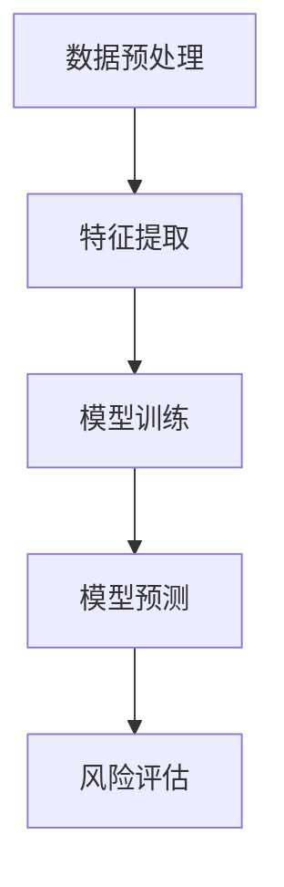
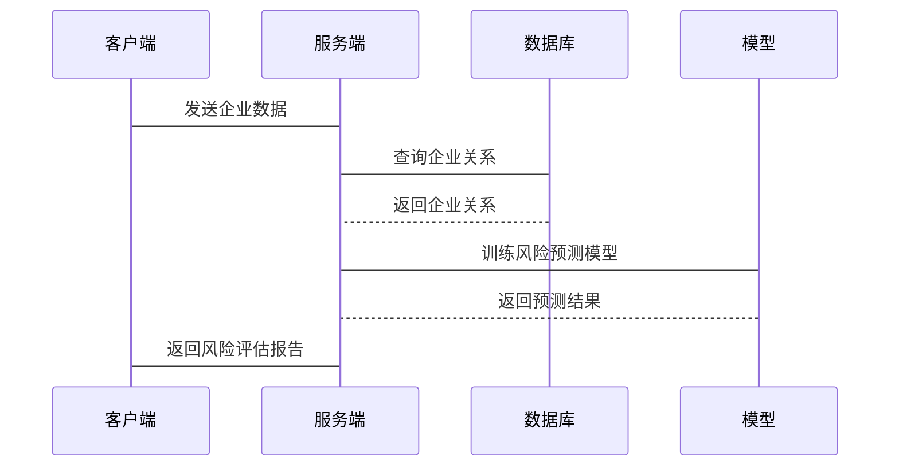

                 


# AI驱动的企业信用风险传导路径识别与预警系统

> 关键词：AI技术，信用风险，路径识别，预警系统，企业风险

> 摘要：本文探讨了利用人工智能技术识别和预警企业信用风险传导路径的方法，系统性地分析了信用风险的基本概念、传导机制以及AI技术在信用风险识别中的优势。文章详细阐述了基于机器学习和深度学习的算法原理，构建了企业信用风险传导路径识别与预警系统的整体架构，并通过实际案例展示了系统的应用场景和实现过程。最后，文章总结了AI技术在信用风险管理中的优势，并提出了未来的发展方向。

---

## 第一部分: 背景与概念

### 第1章: 企业信用风险的基本概念与问题背景

#### 1.1 信用风险的定义与特征
- **信用风险的定义**：信用风险是指企业在债务履行过程中，由于企业自身或外部环境的变化，导致债务无法按时偿还，进而引发的财务损失风险。
- **信用风险的主要特征**：
  - **不确定性**：企业经营状况的变化可能导致信用风险的发生。
  - **传染性**：信用风险可能通过供应链或金融市场传导至其他企业和机构。
  - **系统性**：信用风险可能引发连锁反应，影响整个金融系统的稳定性。
- **信用风险对企业的影响**：
  - 企业声誉受损。
  - 资金链断裂，可能导致企业破产。
  - 影响金融市场的稳定。

#### 1.2 信用风险传导的定义与机制
- **信用风险传导的定义**：信用风险传导是指由于企业之间的关联性，某一企业的信用风险可能通过供应链、金融交易或市场波动传导至其他企业或金融机构。
- **信用风险传导的主要路径**：
  - 供应链传导：上游企业违约可能影响下游企业的资金链。
  - 金融交易传导：企业债券违约可能引发投资者恐慌，导致市场抛售。
  - 市场情绪传导：负面新闻或市场传闻可能引发投资者对相关企业的信任危机。
- **信用风险传导的关键影响因素**：
  - 企业之间的关联性。
  - 市场环境的不确定性。
  - 金融机构的杠杆效应。

#### 1.3 传统信用风险识别与预警的局限性
- **传统信用风险识别方法的不足**：
  - 主要依赖财务报表分析，难以捕捉非财务风险因素。
  - 预警系统的实时性不足，难以及时发现潜在风险。
- **传统信用风险预警系统的局限性**：
  - 预警指标单一，难以全面反映企业的信用状况。
  - 模型缺乏动态调整能力，难以适应市场变化。
- **传统方法在实际应用中的挑战**：
  - 数据来源单一，难以获取多维度的数据支持。
  - 预警结果缺乏解释性，难以指导实际操作。

---

### 第2章: AI技术在信用风险识别中的应用前景

#### 2.1 AI技术的基本概念与特点
- **人工智能的基本定义**：人工智能（AI）是指通过模拟人类智能的思维方式，实现自动化决策和问题解决的技术。
- **机器学习的核心原理**：机器学习是一种通过数据训练模型，使其能够从数据中学习规律并进行预测的技术。
- **深度学习的典型特点**：
  - 基于神经网络的多层结构。
  - 能够自动提取数据特征，无需人工干预。

#### 2.2 AI在信用风险识别中的优势
- **数据处理能力的提升**：
  - AI能够处理海量数据，包括结构化和非结构化数据。
  - 能够提取传统方法难以捕捉的非财务风险因素。
- **模型预测精度的提高**：
  - 基于机器学习的模型能够捕捉复杂的数据关系，提高预测准确性。
  - 深度学习模型能够发现数据中的非线性关系，进一步提高预测精度。
- **实时监控能力的增强**：
  - AI技术能够实现对信用风险的实时监控，及时发现潜在风险。
  - 基于流数据处理技术，能够实现动态风险评估。

#### 2.3 企业信用风险传导路径识别的AI解决方案
- **基于AI的信用风险传导路径识别方法**：
  - 使用图神经网络（Graph Neural Network）建模企业之间的关联性。
  - 通过链式反应模型（Chain Reaction Model）模拟信用风险的传导路径。
- **AI驱动的信用风险预警系统的构建**：
  - 基于时间序列分析模型（如LSTM）预测企业的信用风险。
  - 通过情感分析技术分析市场情绪，辅助信用风险评估。

---

## 第二部分: 核心概念与联系

### 第3章: 核心概念与联系

#### 3.1 核心概念原理
- **信用风险传导路径识别**：
  - 基于企业之间的关联性，构建信用风险传导的网络模型。
  - 使用链式反应模型模拟信用风险的传导过程。
- **AI驱动的信用风险预警**：
  - 基于机器学习模型预测企业的信用风险等级。
  - 通过实时监控系统，及时发现潜在风险。

#### 3.2 概念属性特征对比表格
| 概念             | 传统方法                | AI驱动方法               |
|------------------|-------------------------|--------------------------|
| 数据来源         | 财务报表为主            | 结构化与非结构化数据      |
| 预警精度         | 较低                   | 较高                     |
| 实时性           | 较差                   | 较好                     |
| 关联性分析       | 有限                   | 强大                     |

#### 3.3 ER实体关系图
```mermaid
er
    entity 企业 {
        key 企业ID
        attribute 企业名称
        attribute 所属行业
        attribute 财务状况
    }
    entity 供应链关系 {
        key 供应链关系ID
        attribute 上游企业ID
        attribute 下游企业ID
        attribute 供应链强度
    }
    entity 信用风险 {
        key 风险ID
        attribute 风险等级
        attribute 风险类型
        attribute 风险传导路径
    }
    relationship 企业-供应链关系 {
        企业 --> 供应链关系
    }
    relationship 供应链关系-信用风险 {
        供应链关系 --> 风险ID
    }
```

---

## 第三部分: 算法原理讲解

### 第4章: 算法原理讲解

#### 4.1 算法流程图


#### 4.2 算法实现代码
```python
import pandas as pd
from sklearn.model_selection import train_test_split
from sklearn.linear_model import LogisticRegression

# 数据预处理
df = pd.read_csv('credit_risk.csv')
X = df.drop('target', axis=1)
y = df['target']

# 特征提取
# 假设我们使用企业财务指标和市场情绪指标作为特征
selected_features = ['revenue', 'profit', 'market_sentiment']
X = df[selected_features]

# 模型训练
X_train, X_test, y_train, y_test = train_test_split(X, y, test_size=0.2, random_state=42)
model = LogisticRegression()
model.fit(X_train, y_train)

# 模型预测
y_pred = model.predict(X_test)
```

#### 4.3 数学模型与公式
- **对数几率回归模型**：
  $$ P(y=1|x) = \frac{e^{\beta_0 + \beta_1 x}}{1 + e^{\beta_0 + \beta_1 x}} $$
- **损失函数**：
  $$ L(\theta) = -\frac{1}{m}\sum_{i=1}^{m} [y_i \ln h(x_i) + (1 - y_i)\ln(1 - h(x_i))] $$
  其中，$$ h(x_i) = \frac{e^{\theta^T x_i}}{1 + e^{\theta^T x_i}} $$

---

## 第四部分: 系统分析与架构设计方案

### 第5章: 系统分析与架构设计方案

#### 5.1 问题场景介绍
- **场景描述**：企业之间的信用风险可能通过供应链传导，导致多个企业出现财务危机。
- **目标**：构建一个能够实时监控企业信用风险，并识别风险传导路径的系统。

#### 5.2 系统功能设计
- **领域模型**：
  ```mermaid
  classDiagram
      class 企业 {
          企业ID
          企业名称
          所属行业
      }
      class 供应链关系 {
          供应链关系ID
          上游企业ID
          下游企业ID
      }
      class 信用风险 {
          风险ID
          风险等级
      }
      企业 --> 供应链关系
      供应链关系 --> 信用风险
  ```

#### 5.3 系统架构设计
- **系统架构图**：
  ```mermaid
  architecture
      Client
      Web Server
      Database
      API Gateway
  ```

#### 5.4 系统接口设计
- **API接口**：
  - GET /api/risk/assessment
  - POST /api/risk/monitor

#### 5.5 系统交互序列图


---

## 第五部分: 项目实战

### 第6章: 项目实战

#### 6.1 环境安装
- **Python版本**：3.8+
- **依赖安装**：
  ```bash
  pip install pandas scikit-learn mermaid4jupyter
  ```

#### 6.2 系统核心实现源代码
```python
import pandas as pd
from sklearn.linear_model import LogisticRegression
from sklearn.metrics import accuracy_score

# 数据加载与预处理
df = pd.read_csv('credit_risk.csv')
X = df.drop('target', axis=1)
y = df['target']

# 特征选择
selected_features = ['revenue', 'profit', 'market_sentiment']
X = df[selected_features]

# 数据划分
X_train, X_test, y_train, y_test = train_test_split(X, y, test_size=0.2, random_state=42)

# 模型训练
model = LogisticRegression()
model.fit(X_train, y_train)

# 模型预测
y_pred = model.predict(X_test)

# 模型评估
print("Accuracy:", accuracy_score(y_test, y_pred))
```

#### 6.3 案例分析与详细解读
- **案例背景**：某制造企业由于原材料价格上涨，导致成本增加，可能引发信用风险。
- **数据准备**：收集企业的财务数据、供应链数据和市场情绪数据。
- **模型训练**：使用逻辑回归模型进行风险预测。
- **结果分析**：模型预测该企业的信用风险等级为高风险，需要进行实时监控。

#### 6.4 项目小结
- **项目总结**：通过AI技术，能够更准确地识别企业的信用风险，并及时发现风险传导路径。
- **项目意义**：提高了信用风险管理的效率和精度，为企业和金融机构提供了有力的支持。

---

## 第六部分: 总结与展望

### 第7章: 总结与展望

#### 7.1 系统总结
- **系统优势**：
  - 高精度的信用风险预测能力。
  - 实时监控能力。
  - 强大的关联性分析能力。
- **系统局限性**：
  - 数据依赖性较强，需要高质量的数据支持。
  - 模型的解释性需要进一步提升。

#### 7.2 未来发展方向
- **多模态数据融合**：结合文本数据和图像数据，进一步提高模型的预测精度。
- **模型优化**：探索更先进的深度学习模型，如图神经网络（Graph Neural Network）。
- **实时性提升**：优化系统的计算效率，进一步提高实时监控能力。

#### 7.3 注意事项
- **数据隐私保护**：在处理企业数据时，需要注意数据隐私和合规性。
- **模型的可解释性**：在实际应用中，需要确保模型的可解释性，以便用户能够理解预测结果。

#### 7.4 拓展阅读
- 建议读者进一步阅读相关领域的学术论文和行业报告，深入了解AI技术在信用风险管理中的最新进展。

---

## 结语

通过本文的详细讲解，我们可以看到，AI技术在企业信用风险识别与预警系统中的应用前景广阔。基于机器学习和深度学习的算法，能够帮助我们更准确地识别信用风险，并及时发现风险传导路径。未来，随着技术的不断发展，AI驱动的信用风险管理系统将为企业和金融机构提供更强大的支持，助力其实现更高效、更精准的风险管理。

