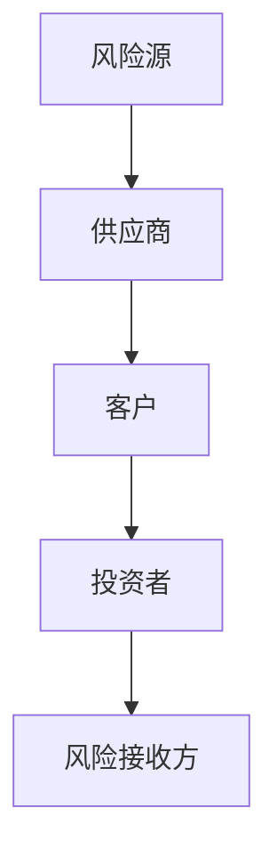
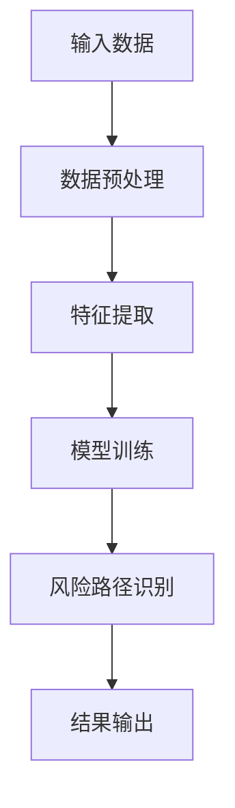
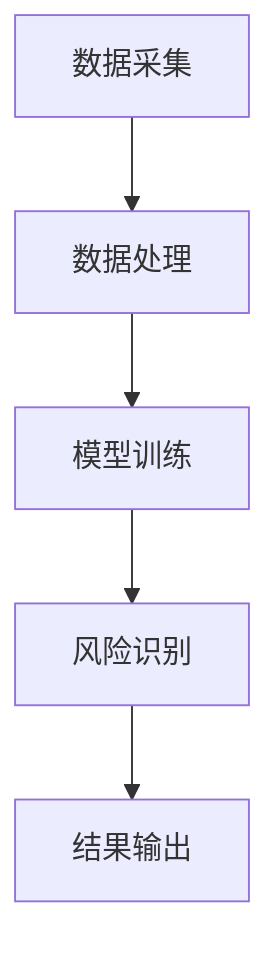
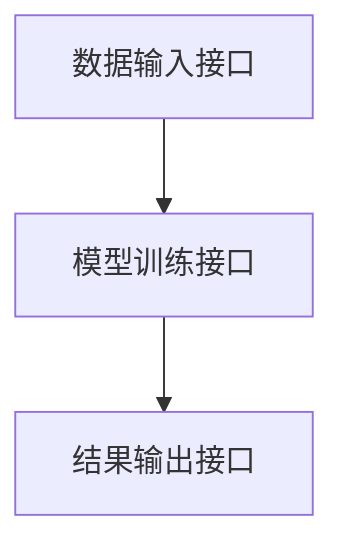
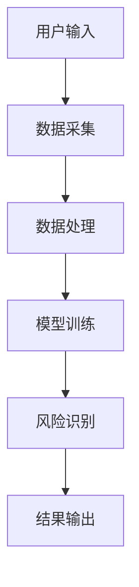

                 


```markdown
# AI驱动的企业信用风险传导路径识别系统

> 关键词：企业信用风险，AI驱动，信用风险传导，路径识别，风险管理，人工智能

> 摘要：本文将介绍如何利用人工智能技术驱动企业信用风险的传导路径识别。通过系统性地分析信用风险传导的核心概念、算法原理、系统设计和项目实现，本文旨在为企业提供一种高效、准确的信用风险管理解决方案。

---

## 第1章: 企业信用风险传导路径识别的背景与意义

### 1.1 企业信用风险的基本概念

#### 1.1.1 信用风险的定义与特征
信用风险是指由于债务人或交易对手方无法履行其合同义务，导致债权人或利益相关方遭受损失的可能性。信用风险具有隐蔽性、动态性和系统性等特点。

#### 1.1.2 信用风险的分类与表现形式
信用风险可以分为系统性风险和非系统性风险。系统性风险是由整个经济体系的波动引起的，而非系统性风险则是由单个企业或行业内部因素引起的。信用风险的表现形式包括违约风险、流动性风险和转移风险等。

#### 1.1.3 信用风险对企业的影响
信用风险可能导致企业面临直接的经济损失，如违约损失、诉讼费用等，同时也会影响企业的声誉和市场信心，进而影响企业的生存与发展。

### 1.2 信用风险传导路径的定义与特点

#### 1.2.1 信用风险传导路径的定义
信用风险传导路径是指信用风险在不同主体之间传播的过程和机制。例如，一家企业的违约可能影响其供应商、客户和投资者的利益，从而形成连锁反应。

#### 1.2.2 信用风险传导路径的核心要素
信用风险传导路径的核心要素包括：风险源、传导媒介、传导方式和风险接收方。其中，风险源是引发信用风险的主体，传导媒介是风险传播的通道，传导方式是风险传播的路径和机制，风险接收方是最终承受风险的主体。

#### 1.2.3 信用风险传导路径的分类
信用风险传导路径可以分为直接传导和间接传导。直接传导是指风险直接从风险源传递到风险接收方；间接传导则是指风险通过多个中间环节传递到风险接收方。

### 1.3 AI驱动信用风险传导路径识别的必要性

#### 1.3.1 传统信用风险识别的局限性
传统的信用风险识别方法通常依赖于人工分析和经验判断，存在效率低、成本高、覆盖面窄等问题。特别是在面对复杂的企业网络关系和多维度风险因素时，传统方法往往难以准确识别风险传导路径。

#### 1.3.2 AI技术在信用风险识别中的优势
AI技术可以通过大数据分析、机器学习和自然语言处理等手段，快速识别和分析大量数据，发现传统方法难以察觉的风险传导路径。同时，AI技术还可以实时更新和优化模型，提高信用风险识别的准确性和及时性。

#### 1.3.3 企业信用风险传导路径识别的创新点
通过AI技术，企业可以实现对信用风险传导路径的自动化识别和预测，从而提前采取风险防范措施，降低信用风险对企业的影响。

## 1.4 本章小结
本章介绍了企业信用风险的基本概念、传导路径的定义与特点，以及AI技术在信用风险识别中的必要性和创新点。通过分析，我们可以看出，利用AI技术识别信用风险传导路径，是提升企业信用风险管理能力的重要手段。

---

## 第2章: AI驱动信用风险传导路径识别的核心概念与联系

### 2.1 核心概念原理

#### 2.1.1 信用风险传导路径的数学模型
信用风险传导路径的数学模型可以表示为一个有向图，其中节点表示企业，边表示企业之间的信用关系。通过分析图的结构和权重，可以识别信用风险的主要传导路径。

#### 2.1.2 AI算法在信用风险识别中的应用
常用的AI算法包括支持向量机（SVM）、随机森林（Random Forest）和神经网络（Neural Network）等。这些算法可以通过对企业信用数据的训练，识别出信用风险的关键特征和传导路径。

#### 2.1.3 信用风险传导路径识别的流程图


### 2.2 核心概念属性特征对比表格

| **属性**        | **传统信用风险识别** | **AI驱动信用风险识别** |
|------------------|-----------------------|--------------------------|
| 数据来源         | 主要依赖财务报表       | 多源数据（财务、行为、文本等） |
| 分析方法         | 统计分析为主           | 机器学习、深度学习等     |
| 处理效率         | 低效                   | 高效                     |
| 精准度           | 较低                   | 较高                     |
| 适应性           | 较差                   | 较强                     |

### 2.3 ER实体关系图架构

```mermaid
erd
A[企业] -[N:1] B[信用风险]
A -[N:1] C[传导路径]
C -[N:1] D[风险接收方]
```

### 2.4 本章小结
本章通过数学模型、算法应用和流程图，详细阐述了AI驱动信用风险传导路径识别的核心概念与联系。通过对传统方法和AI方法的对比分析，我们可以看到AI技术在信用风险管理中的优势。

---

## 第3章: AI驱动信用风险传导路径识别的算法原理

### 3.1 算法原理概述

#### 3.1.1 信用风险传导路径识别的基本原理
通过构建企业信用关系网络，利用图论和机器学习算法，识别网络中的关键节点和高风险路径。

#### 3.1.2 AI算法在信用风险识别中的应用
常用的AI算法包括图嵌入（Graph Embedding）、聚类分析（Clustering）和分类算法（Classification）等。这些算法可以帮助我们识别信用风险的主要传导路径。

#### 3.1.3 算法选择的依据与原则
算法选择的依据包括数据特征、计算效率和识别精度等因素。在实际应用中，需要根据具体问题选择合适的算法。

### 3.2 算法流程图



### 3.3 算法数学模型与公式

#### 3.3.1 信用风险传导路径的数学模型
信用风险传导路径的数学模型可以表示为一个加权图，其中权重表示企业之间的信用关联强度。

$$ w_{ij} = \frac{|E_{ij}|}{\sum_{k} |E_{ik}|} $$

其中，$w_{ij}$表示企业$i$和企业$j$之间的信用关联权重，$E_{ij}$表示企业$i$和$j$之间的信用交易金额，$\sum_{k} |E_{ik}|$表示企业$i$的总信用交易金额。

#### 3.3.2 关键算法公式
在图嵌入算法中，节点表示为向量，通过优化目标函数计算节点向量。

$$ L = \sum_{i,j} w_{ij}(x_i - x_j)^2 $$

其中，$L$表示目标函数，$w_{ij}$表示边权重，$x_i$和$x_j$表示节点$i$和$j$的向量表示。

### 3.4 本章小结
本章详细介绍了AI驱动信用风险传导路径识别的算法原理，包括算法选择、流程图和数学模型等内容。通过对算法的深入分析，我们可以更好地理解信用风险识别的核心技术。

---

## 第4章: 系统分析与架构设计方案

### 4.1 问题场景介绍

#### 4.1.1 信用风险传导路径识别的典型场景
企业A由于供应链问题出现违约，导致其供应商企业B和客户企业C也面临信用风险，进而影响整个产业链的稳定性。

#### 4.1.2 系统需要解决的主要问题
如何快速识别企业之间的信用关联，预测风险传导路径，并采取有效的风险控制措施。

#### 4.1.3 系统的目标与预期效果
系统的目标是通过AI技术，实时监控企业信用关系网络，识别信用风险的主要传导路径，并提供风险预警和控制建议。

### 4.2 系统功能设计

#### 4.2.1 系统功能模块划分
系统功能模块包括数据采集、数据处理、模型训练、风险识别和结果输出。

#### 4.2.2 功能模块的详细描述
- 数据采集模块：从企业数据库中获取企业的信用数据。
- 数据处理模块：对数据进行清洗和预处理。
- 模型训练模块：利用机器学习算法训练信用风险识别模型。
- 风险识别模块：识别信用风险的主要传导路径。
- 结果输出模块：输出风险识别结果和控制建议。

#### 4.2.3 功能模块之间的交互关系


### 4.3 系统架构设计

#### 4.3.1 系统架构的总体设计
系统架构采用微服务架构，包括前端、后端和数据库三部分。

#### 4.3.2 系统架构的详细设计
- 前端：负责用户界面的展示和交互。
- 后端：负责业务逻辑的处理和模型训练。
- 数据库：负责存储企业信用数据和模型参数。

#### 4.3.3 系统架构的优化与改进
通过引入缓存机制和分布式计算，提高系统的运行效率和处理能力。

### 4.4 系统接口设计

#### 4.4.1 系统接口的定义与描述
系统接口包括数据输入接口、模型训练接口和结果输出接口。

#### 4.4.2 接口之间的交互关系


#### 4.4.3 接口设计的注意事项
接口设计需要考虑数据格式、通信协议和安全性等因素。

### 4.5 系统交互流程图



### 4.6 本章小结
本章通过系统分析与架构设计，详细介绍了AI驱动信用风险传导路径识别系统的实现方案，包括功能模块划分、架构设计和接口设计等内容。

---

## 第5章: 项目实战——AI驱动信用风险传导路径识别系统实现

### 5.1 项目环境安装与配置

#### 5.1.1 系统运行环境
系统运行环境包括Python 3.8及以上版本、Jupyter Notebook和相关Python库（如NumPy、Pandas、Scikit-learn等）。

### 5.2 系统核心实现源代码

#### 5.2.1 数据采集与处理代码
```python
import pandas as pd

# 数据采集
df = pd.read_csv('enterprise_credit_data.csv')

# 数据清洗
df.dropna(inplace=True)
df = df[ df['credit_score'] > 600 ]
```

#### 5.2.2 模型训练代码
```python
from sklearn.model

