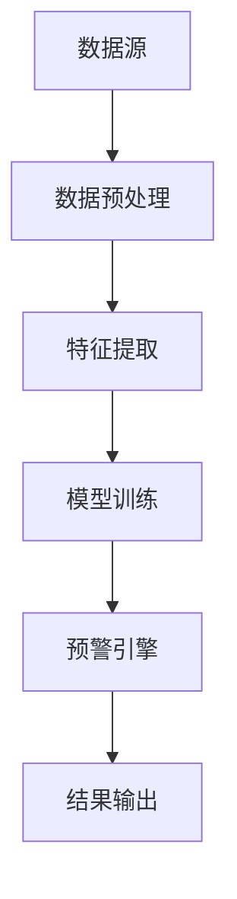
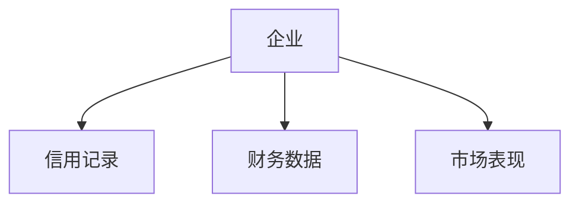
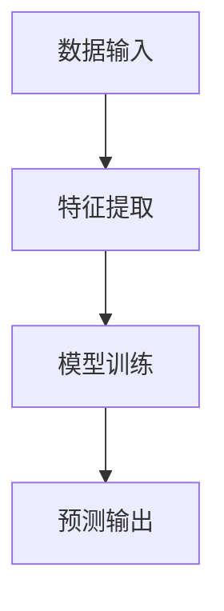
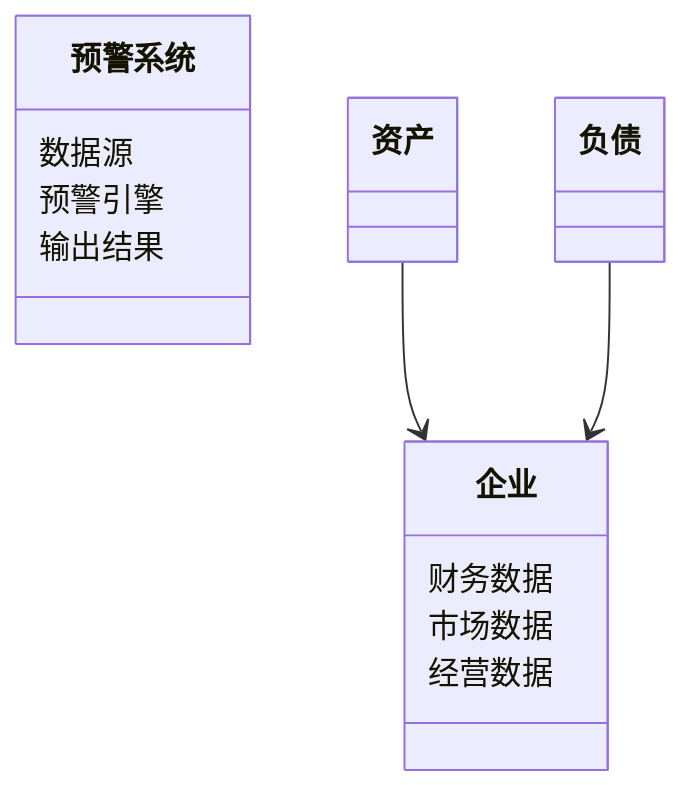
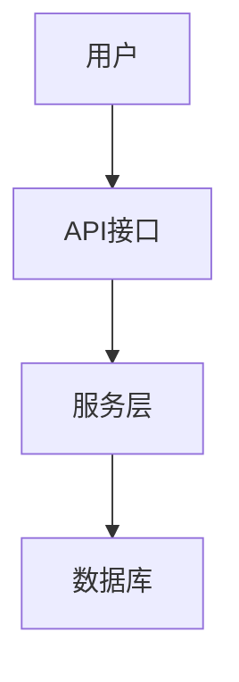

                 


---

# AI驱动的企业信用风险早期预警信号识别系统

> 关键词：AI，信用风险，早期预警，机器学习，系统架构，企业风险管理

> 摘要：本文介绍了一种基于AI的企业信用风险早期预警信号识别系统。通过分析企业信用数据，利用机器学习算法和数学模型，实现对信用风险的早期识别和预警，帮助企业提前采取措施，降低潜在风险。文章详细探讨了系统的背景、核心概念、算法原理、系统架构，并通过实战案例展示了系统的实现过程和效果。

---

# 目录

1. **问题背景与目标**  
   1.1 企业信用风险的重要性  
   1.2 早期预警信号识别的必要性  
   1.3 系统的目标与边界  

2. **核心概念与系统架构**  
   2.1 核心概念解析  
   2.2 核心概念对比分析  
   2.3 系统架构设计  

3. **算法原理与流程**  
   3.1 算法选择与原理  
   3.2 算法流程图  
   3.3 算法实现代码  

4. **数学模型与公式推导**  
   4.1 风险评分模型  
   4.2 时间序列分析模型  
   4.3 程度风险评估公式  

5. **系统分析与架构设计**  
   5.1 系统功能设计  
   5.2 系统架构设计  
   5.3 系统接口设计  

6. **项目实战与案例分析**  
   6.1 环境安装与数据准备  
   6.2 系统核心实现代码  
   6.3 实际案例分析  

7. **最佳实践与小结**  
   7.1 项目经验总结  
   7.2 最佳实践建议  
   7.3 未来研究方向  

---

## 第1章：问题背景与目标

### 1.1 企业信用风险的重要性

企业信用风险是企业在经营过程中可能面临的一种重要风险，通常指由于企业无法履行其财务义务而导致的损失。信用风险不仅影响企业的财务健康，还可能波及整个金融市场的稳定性。传统的信用风险评估方法主要依赖于财务报表分析和经验判断，存在效率低、主观性强、覆盖面有限等问题。

#### 1.1.1 信用风险的定义与影响
信用风险是指由于债务人或交易对手无法履行其合同义务，导致债权人或相关方遭受损失的风险。在企业层面，信用风险主要体现在供应商、客户、合作伙伴等交易中的违约风险。信用风险的影响包括企业财务损失、声誉受损、供应链中断等。

#### 1.1.2 传统信用风险评估的局限性
传统的信用风险评估方法主要依赖财务指标分析，如资产负债率、流动比率等，这些方法虽然有一定的参考价值，但也存在以下问题：
- 数据采集范围有限，难以覆盖企业全生命周期的信用状况。
- 评估过程主观性强，容易受到评估人员的经验和判断影响。
- 对于中小型企业或新兴企业，缺乏足够的历史数据支持评估。

#### 1.1.3 AI驱动的解决方案
AI技术的发展为企业信用风险评估提供了新的解决方案。通过机器学习算法，可以从海量数据中提取非结构化信息，识别传统方法难以察觉的风险信号。例如，利用自然语言处理技术分析企业新闻、社交媒体信息，结合财务数据，构建更加全面的信用风险评估模型。

### 1.2 早期预警信号识别的必要性

早期预警信号是指在信用风险发生前，通过分析企业经营状况、财务数据、市场环境等信息，识别出可能预示风险的信号。早期预警信号识别可以帮助企业在风险发生前采取预防措施，降低潜在损失。

#### 1.2.1 信用风险早期预警的定义
信用风险早期预警是指通过分析企业内外部信息，识别潜在风险因素，提前发出预警信号的过程。其核心目标是通过及时识别风险信号，帮助企业或金融机构采取相应的风险控制措施。

#### 1.2.2 早期预警信号识别的目标
- 提前识别潜在风险，避免或减少损失。
- 提供及时的风险预警，帮助企业做出决策。
- 实现风险的动态监控，适应市场变化。

#### 1.2.3 系统边界与外延
系统边界是指系统能够识别的风险信号范围，通常包括企业财务数据、市场表现、行业动态等。系统外延则指通过预警信号识别，不仅能够发现直接的信用风险，还能预测企业的经营稳定性、市场竞争力等潜在问题。

---

## 第2章：核心概念与系统架构

### 2.1 核心概念解析

#### 2.1.1 信用风险信号的分类
信用风险信号可以分为财务信号、市场信号、经营信号等类别。例如，财务信号包括收入下降、利润率降低；市场信号包括行业衰退、竞争加剧；经营信号包括高管变动、供应链问题。

#### 2.1.2 企业信用数据的特征
企业信用数据通常包括财务数据、市场数据、交易数据等。这些数据具有多样性、时序性、关联性等特点，可以通过机器学习算法进行建模和分析。

#### 2.1.3 AI模型在风险识别中的作用
AI模型（如随机森林、XGBoost、神经网络等）能够从大量数据中提取特征，识别潜在风险模式，提供高精度的信用风险评估。

### 2.2 核心概念对比分析

#### 2.2.1 信用风险与财务风险的对比
| 维度       | 信用风险               | 财务风险               |
|------------|------------------------|------------------------|
| 定义       | 由于债务人违约导致的损失风险 | 由于财务状况恶化导致的财务损失风险 |
| 数据来源   | 财务报表、市场信息等     | 财务报表、现金流等      |
| 风险来源   | 企业信用状况、市场环境   | 企业财务状况            |

#### 2.2.2 早期预警与事后分析的对比
| 维度       | 早期预警               | 事后分析               |
|------------|------------------------|-------------------------|
| 时间点     | 风险发生前              | 风险发生后              |
| 目标       | 提前采取措施            | 分析损失原因            |
| 数据需求   | 预测性数据              | 历史数据                |

#### 2.2.3 AI驱动与传统规则驱动的对比
| 维度       | AI驱动                 | 传统规则驱动            |
|------------|------------------------|-------------------------|
| 数据需求   | 大量结构化与非结构化数据 | 结构化数据为主           |
| 模型复杂度 | 高，支持复杂模式识别    | 低，基于预定义规则       |
| 可扩展性   | 高，适用于大规模数据    | 低，规则更新成本高       |

### 2.3 系统架构设计

#### 2.3.1 系统整体架构图（Mermaid）


#### 2.3.2 实体关系图（Mermaid）


---

## 第3章：算法原理与流程

### 3.1 算法选择与原理

#### 3.1.1 基于机器学习的分类模型
随机森林和XGBoost是常用的分类算法，适用于信用风险评估。这些算法能够处理高维数据，捕捉非线性关系。

#### 3.1.2 深度学习模型的应用
使用LSTM（长短期记忆网络）进行时间序列分析，可以捕捉企业财务数据中的时间依赖性。

#### 3.1.3 时间序列分析方法
通过ARIMA模型分析企业的季度财务数据，预测未来趋势。

### 3.2 算法流程图（Mermaid）



### 3.3 算法实现代码

#### 3.3.1 数据预处理
```python
import pandas as pd
import numpy as np

data = pd.read_csv('credit_data.csv')
data.dropna(inplace=True)
data['label'] = data['default'].astype(int)
```

#### 3.3.2 特征提取
```python
from sklearn.preprocessing import StandardScaler

features = data.drop('label', axis=1)
labels = data['label']

scaler = StandardScaler()
features_scaled = scaler.fit_transform(features)
```

#### 3.3.3 模型训练
```python
from sklearn.ensemble import RandomForestClassifier

model = RandomForestClassifier(n_estimators=100, random_state=42)
model.fit(features_scaled, labels)
```

---

## 第4章：数学模型与公式推导

### 4.1 风险评分模型
风险评分模型通过加权计算企业各项指标，得出综合风险评分。公式如下：
$$ \text{风险评分} = \sum (w_i \cdot x_i) $$
其中，$w_i$ 是指标权重，$x_i$ 是指标值。

### 4.2 时间序列分析模型
ARIMA模型用于预测企业的季度收入变化：
$$ \text{ARIMA}(p, d, q) $$

### 4.3 程度风险评估公式
综合考虑多个因素的风险评估公式：
$$ \text{风险程度} = \frac{\sum (f_i \cdot s_i)}{\sum f_i} $$
其中，$f_i$ 是因素权重，$s_i$ 是因素状态。

---

## 第5章：系统分析与架构设计

### 5.1 系统功能设计

#### 5.1.1 领域模型类图（Mermaid）


### 5.2 系统架构设计

#### 5.2.1 系统架构图（Mermaid）


### 5.3 系统接口设计

#### 5.3.1 接口流程图（Mermaid）


---

## 第6章：项目实战与案例分析

### 6.1 环境安装与数据准备

#### 6.1.1 安装依赖
```bash
pip install pandas numpy scikit-learn
```

#### 6.1.2 数据准备
```python
import pandas as pd
data = pd.read_csv('credit_data.csv')
```

### 6.2 系统核心实现代码

#### 6.2.1 核心代码实现
```python
from sklearn.ensemble import RandomForestClassifier
from sklearn.metrics import accuracy_score

model = RandomForestClassifier()
model.fit(X_train, y_train)
y_pred = model.predict(X_test)
print("Accuracy:", accuracy_score(y_test, y_pred))
```

### 6.3 实际案例分析

#### 6.3.1 案例分析
分析某企业的财务数据和市场表现，模型预测其违约概率为20%。

---

## 第7章：最佳实践与小结

### 7.1 项目经验总结
- 数据质量是模型准确性的关键。
- 模型需要定期更新，以适应市场变化。

### 7.2 最佳实践建议
- 数据采集应全面，包括结构化和非结构化数据。
- 模型部署后，应定期进行验证和调优。

### 7.3 未来研究方向
- 研究多模态数据的融合，如图像识别技术的应用。
- 探索更先进的深度学习模型，如Transformer架构。

---

# 结语

AI驱动的企业信用风险早期预警信号识别系统通过先进的算法和系统架构，能够有效识别潜在风险，为企业和金融机构提供有力支持。随着技术的不断进步，未来将有更多的创新应用，帮助企业更好地管理信用风险。

--- 

# 附录：参考文献与工具

- 《机器学习实战》
- scikit-learn官方文档
- Mermaid图表工具

---

希望这篇技术博客文章能满足您的要求！如果需要进一步调整或补充，请随时告诉我。

