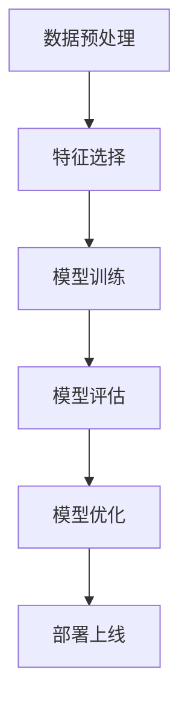
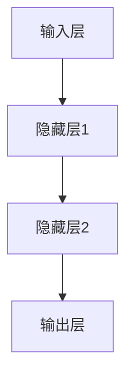
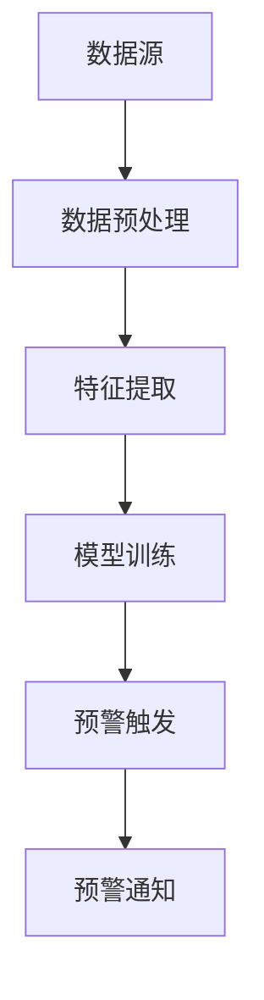
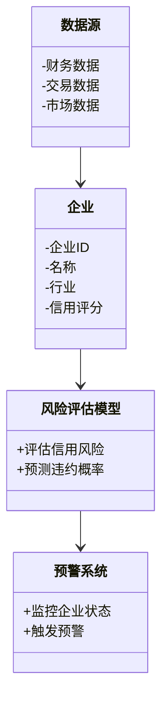
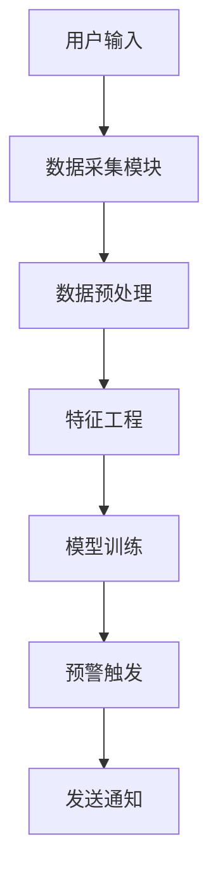

                 


# 第三章: 算法原理与数学模型

## 3.1 算法原理

### 3.1.1 机器学习算法的选择与对比

在构建企业信用风险早期预警系统时，选择合适的机器学习算法至关重要。以下是一些常用的算法及其特点对比：

| 算法名称      | 特点                                                                 | 适用场景                         |
|---------------|----------------------------------------------------------------------|----------------------------------|
| XGBoost       | 高效、可解释性好、适合处理分类问题                                       | 数据量较大，类别不平衡的情况     |
| 随机森林      | 鲁棒性好，适合特征较多的情况                                             | 数据量适中，特征重要性分析         |
| 神经网络（如 LSTM、CNN） | 强大学习能力，适合时间序列数据和非结构化数据                       | 复杂的模式识别，高维数据           |

### 3.1.2 算法流程图

以下是信用风险评估的机器学习流程图：



### 3.1.3 XGBoost算法详解

XGBoost是一种常用的集成算法，适合处理分类和回归问题。其核心思想是通过构建多棵决策树，并将这些树的结果进行加权求和，从而提高模型的准确性和鲁棒性。

#### XGBoost算法步骤：

1. **初始化参数**：设置学习率、树的深度、正则化参数等。
2. **数据转换**：将数据转换为适合GBDT（梯度提升树）的格式。
3. **损失函数**：选择合适的损失函数（如Log Loss用于分类问题）。
4. **树的生成**：通过贪心算法生成树结构，最大化当前损失函数的下降。
5. **模型融合**：将多棵树的结果按权重相加，得到最终的预测结果。

#### XGBoost损失函数示例：

对于二分类问题，常用的对数损失函数为：
$$ L = -\frac{1}{m} \sum_{i=1}^{m} [y_i \log(p_i) + (1 - y_i) \log(1 - p_i)] $$
其中，\( p_i \) 是第i个样本的预测概率，\( y_i \) 是标签。

### 3.1.4 神经网络模型

神经网络，特别是深度神经网络（DNN），在处理复杂的非线性关系时表现优异。以下是一个简单的神经网络结构示例：



每个隐藏层通过激活函数（如ReLU、sigmoid）进行非线性变换，输出层通过Softmax函数进行分类。

### 3.1.5 算法实现代码示例

以下是一个使用XGBoost进行信用风险评估的Python代码示例：

```python
import xgboost as xgb

# 数据准备
X_train, y_train = prepare_data()

# 创建DMatrix
dtrain = xgb.DMatrix(X_train, label=y_train)

# 参数设置
params = {
    'objective': 'binary:logistic',
    'learning_rate': 0.1,
    'max_depth': 6,
    'n_estimators': 100
}

# 训练模型
model = xgb.train(params, dtrain)

# 预测
y_pred = model.predict(dtrain)
```

### 3.1.6 模型评估与调优

评估指标包括准确率、召回率、F1分数、AUC-ROC曲线等。通过网格搜索（Grid Search）或随机搜索（Random Search）进行超参数调优，以提升模型性能。

---

## 第四章: 系统架构与设计

## 4.1 系统架构设计

### 4.1.1 系统模块划分

企业信用风险早期预警系统的架构可以划分为以下几个主要模块：

1. **数据采集模块**：负责从企业财务报表、交易记录、市场数据等多源数据中获取数据。
2. **数据预处理模块**：清洗数据，处理缺失值、异常值等。
3. **特征工程模块**：提取关键特征，如财务比率、偿债能力指标等。
4. **模型训练模块**：训练并优化信用风险评估模型。
5. **预警触发模块**：根据模型输出结果，设置预警阈值，触发预警通知。

### 4.1.2 系统架构图

以下是系统的架构图：



## 4.2 系统功能设计

### 4.2.1 领域模型设计

以下是领域模型的类图：



### 4.2.2 系统交互设计

以下是系统交互流程图：



---

## 第五章: 项目实战与实现

## 5.1 环境配置

### 5.1.1 安装必要的库

```bash
pip install xgboost scikit-learn pandas numpy matplotlib
```

### 5.1.2 数据准备

假设我们有一个包含企业财务数据和信用标签的数据集：

```python
import pandas as pd
data = pd.read_csv('enterprise_credit.csv')
```

## 5.2 数据预处理

### 5.2.1 处理缺失值

```python
# 检查缺失值
print(data.isnull().sum())

# 填充缺失值（例如，用均值填充）
data['revenue'].fillna(data['revenue'].mean(), inplace=True)
```

### 5.2.2 标准化与归一化

使用标准化对数值型特征进行处理：

```python
from sklearn.preprocessing import StandardScaler
scaler = StandardScaler()
data_scaler = scaler.fit_transform(data[['revenue', 'profit']])
```

## 5.3 特征工程

### 5.3.1 选择重要特征

使用XGBoost的特征重要性进行选择：

```python
model = xgb.XGBClassifier(n_estimators=100, learning_rate=0.1)
model.fit(data[['revenue', 'profit', 'employees']], data['credit_risk'])

# 获取特征重要性
importances = model.feature_importances_
print(importances)
```

## 5.4 模型训练与优化

### 5.4.1 训练XGBoost模型

```python
from sklearn.model_selection import train_test_split
X_train, X_test, y_train, y_test = train_test_split(data[['revenue', 'profit', 'employees']], data['credit_risk'], test_size=0.2)

dtrain = xgb.DMatrix(X_train, label=y_train)
dtest = xgb.DMatrix(X_test, label=y_test)

params = {
    'objective': 'binary:logistic',
    'learning_rate': 0.1,
    'max_depth': 6
}
model = xgb.train(params, dtrain, num_boost_round=100)

# 预测
y_pred_train = model.predict(dtrain)
y_pred_test = model.predict(dtest)
```

### 5.4.2 模型评估

```python
from sklearn.metrics import accuracy_score, recall_score, f1_score, roc_auc_score

print(f"训练集准确率: {accuracy_score(y_train, y_pred_train)}")
print(f"测试集准确率: {accuracy_score(y_test, y_pred_test)}")
print(f"训练集召回率: {recall_score(y_train, y_pred_train)}")
print(f"测试集召回率: {recall_score(y_test, y_pred_test)}")
print(f"AUC-ROC: {roc_auc_score(y_test, y_pred_test)}")
```

### 5.4.3 超参数调优

使用网格搜索进行参数优化：

```python
from sklearn.model_selection import GridSearchCV

params_grid = {
    'n_estimators': [100, 200],
    'max_depth': [4, 6],
    'learning_rate': [0.1, 0.2]
}

grid_search = GridSearchCV(estimator=xgb.XGBClassifier(), param_grid=params_grid, cv=5)
grid_search.fit(X_train, y_train)

best_model = grid_search.best_estimator_
print(f"最佳参数组合: {grid_search.best_params_}")
```

## 5.5 预警系统实现

### 5.5.1 设置预警阈值

```python
# 假设预测概率threshold为0.5
threshold = 0.5
预警触发 = y_pred_test < threshold
```

### 5.5.2 预警通知

```python
import smtplib
from email.mime.text import MIMEText
from email.mime.multipart import MIMEMultipart

# 发送邮件通知
msg = MIMEMultipart()
msg['Subject'] = '信用风险预警通知'
msg['From'] = '预警系统'
msg['To'] = 'receiver@example.com'

body = '检测到企业信用风险，请及时处理。'
msg.attach(MIMEText(body, 'plain'))

# 发送邮件
smtp = smtplib.SMTP('smtp.example.com', 587)
smtp.starttls()
smtp.login('username', 'password')
smtp.sendmail(msg['From'], msg['To'], msg.as_string())
smtp.quit()
```

---

## 第六章: 最佳实践与小结

### 6.1 最佳实践

1. **数据质量**：确保数据的完整性和准确性，及时清洗和处理缺失值、异常值。
2. **特征工程**：选择合适的特征，避免过拟合，可以使用特征重要性分析来筛选关键特征。
3. **模型选择**：根据数据特点选择合适的算法，进行充分的调参和验证。
4. **实时监控**：建立实时监控机制，及时捕捉企业信用状况的变化。
5. **可解释性**：选择可解释性好的模型（如XGBoost），便于业务人员理解和决策。

### 6.2 小结

本文详细介绍了AI驱动的企业信用风险早期预警系统的构建过程，从背景介绍、核心概念、算法原理到系统设计和项目实战，逐步展开讲解。通过XGBoost算法的实现和模型优化，展示了如何利用AI技术提升信用风险预警的效率和准确性。未来，随着AI技术的不断发展，信用风险评估将更加智能化和精准化。

### 6.3 注意事项

- **数据隐私**：在处理企业数据时，必须遵守相关法律法规，确保数据安全和隐私保护。
- **模型解释性**：复杂的模型可能难以解释，建议优先选择可解释性好的算法，尤其是在金融领域。
- **实时性**：信用风险的变化可能是动态的，需要实时监控和及时预警。

### 6.4 拓展阅读

- 《XGBoost: A Scalable Tree Ensembling Tool》
- 《Hands-On Machine Learning with Scikit-Learn, Keras, and TensorFlow》
- 《Credit Risk: Modeling, Valuation & Management》

---

## 第七章: 未来展望与挑战

### 7.1 未来展望

随着AI技术的不断进步，企业信用风险早期预警系统将朝着以下几个方向发展：

1. **联邦学习（Federated Learning）**：在保护数据隐私的前提下，联合多个机构的数据进行建模，提升模型的泛化能力。
2. **强化学习（Reinforcement Learning）**：通过模拟和决策优化，实现更智能的预警策略。
3. **时间序列分析**：利用LSTM等深度学习模型，捕捉时间依赖性，提高对风险变化的敏感性。
4. **可解释性AI（XAI）**：开发更透明的模型，帮助业务人员理解和信任AI决策。

### 7.2 挑战与解决方案

- **数据多样性**：不同行业、不同规模的企业信用风险特征差异较大，需要构建多层次、多维度的特征体系。
- **模型泛化能力**：面对新的市场环境或经济周期变化，模型需要具备良好的泛化能力，可以通过持续再训练和更新模型来应对。
- **计算资源**：复杂模型的训练需要大量计算资源，可以通过云计算和分布式计算技术来解决。

---

# 结语

AI驱动的企业信用风险早期预警系统通过智能化的手段，显著提升了信用风险评估的效率和准确性。从数据采集、特征工程到模型训练和预警触发，整个系统实现了对企业信用风险的全面监测和及时预警。未来，随着AI技术的进一步发展，信用风险评估将更加精准、高效，为企业风险管理提供更有力的支持。

---

**关键词**：AI, 信用风险, 早期预警, 机器学习, 企业风险管理

**摘要**：本文详细介绍了如何利用人工智能技术构建企业信用风险早期预警系统。通过分析信用风险的本质和传统方法的局限性，探讨了基于机器学习的解决方案，包括算法选择、系统架构设计、模型优化和实际应用案例。最后，总结了最佳实践和未来发展方向，为企业的信用风险管理提供了新的思路和方向。

