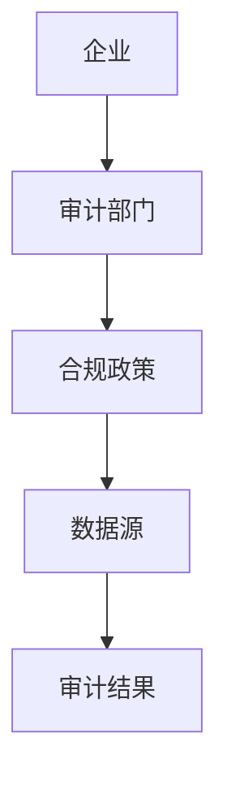
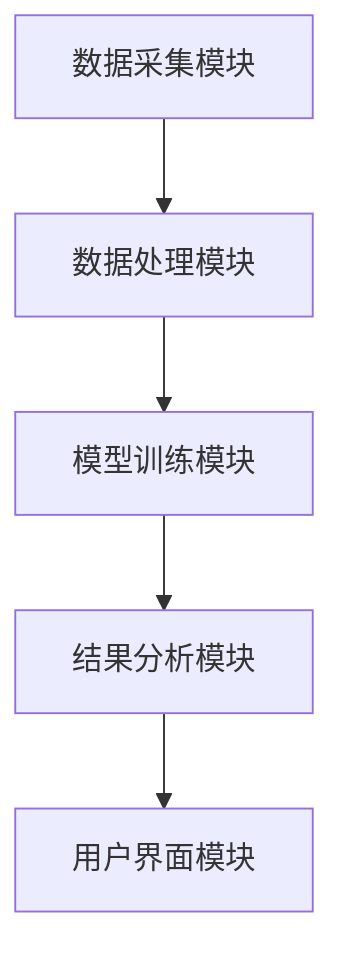
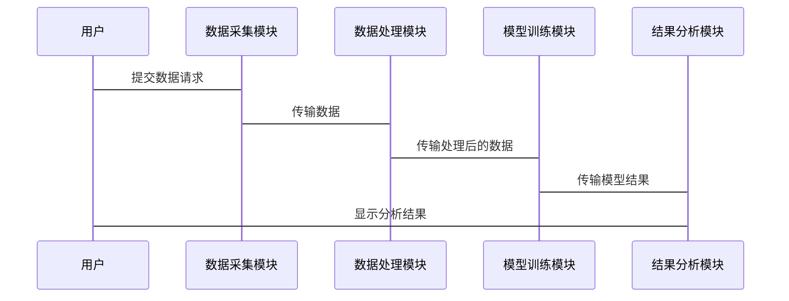

                 


# AI驱动的企业内部审计与合规管理

## 关键词：人工智能、企业审计、合规管理、机器学习、自然语言处理、系统架构

## 摘要：随着人工智能技术的迅速发展，企业内部审计与合规管理正在经历一场深刻的变革。AI技术的应用不仅提高了审计与合规管理的效率，还为企业提供了更精准的风险评估和预测能力。本文将详细探讨AI在企业内部审计与合规管理中的核心算法、系统设计、项目实战以及最佳实践，帮助读者全面理解AI驱动的审计与合规管理的潜力和应用。

---

# 第1章 AI驱动的企业内部审计与合规管理背景

## 1.1 AI驱动的审计与合规管理背景

### 1.1.1 传统企业内部审计与合规管理的挑战

企业在传统审计与合规管理过程中面临以下主要挑战：

- **数据量大且分散**：企业内部数据来源广泛，包括财务数据、业务数据、合同文本等，数据量大且分散，难以有效整合和分析。
- **人工审计效率低**：传统审计依赖大量人工操作，耗时长且成本高，容易出现人为疏漏。
- **合规风险复杂多样**：合规要求繁多，涉及法律法规、行业标准等多个层面，企业难以全面覆盖和及时响应。
- **动态变化的合规要求**：法律法规和行业标准不断更新，企业需要及时调整审计策略和合规措施。

### 1.1.2 AI技术对企业审计与合规管理的推动作用

AI技术通过以下方式推动企业审计与合规管理的发展：

- **提高审计效率**：AI能够快速处理大量数据，自动识别异常值和风险点，显著提高审计效率。
- **增强风险预测能力**：通过机器学习算法，AI可以预测潜在风险，帮助企业提前采取措施。
- **优化合规管理**：AI能够实时监控企业行为，确保符合相关法律法规和行业标准，降低合规风险。

### 1.1.3 当前企业内部审计与合规管理的痛点与需求

当前，企业内部审计与合规管理的主要痛点包括：

- **数据孤岛问题**：企业内部各部门数据分散，缺乏统一的数据平台，导致信息共享困难。
- **合规标准复杂化**：随着全球化和数字化的推进，合规要求日益复杂，企业需要应对更多的监管要求。
- **缺乏智能化工具**：传统审计与合规管理工具功能单一，无法满足智能化、自动化的需求。

---

## 1.2 AI驱动的审计与合规管理核心概念

### 1.2.1 AI驱动的审计与合规管理定义

AI驱动的审计与合规管理是指利用人工智能技术，如机器学习、自然语言处理等，对企业数据进行分析、预测和监控，以提高审计效率、降低合规风险，并确保企业行为符合相关法律法规和行业标准。

### 1.2.2 核心概念与属性对比表格

以下是AI驱动的审计与合规管理中的核心概念对比表：

| 概念         | 描述                                                                 |
|--------------|----------------------------------------------------------------------|
| 数据分析     | 对企业数据进行处理和分析，提取有价值的信息                           |
| 机器学习     | 通过算法训练模型，实现预测和分类                                     |
| 自然语言处理 | 对文本数据进行理解和生成，辅助合规文档处理                         |

### 1.2.3 ER实体关系图

以下是企业内部审计与合规管理的ER实体关系图：



---

## 1.3 AI驱动的审计与合规管理的技术基础

### 1.3.1 人工智能与大数据技术

人工智能与大数据技术的结合为企业审计与合规管理提供了强大的技术支持：

- **数据预处理**：利用大数据技术对企业数据进行清洗、转换和集成，为AI算法提供高质量的数据输入。
- **数据挖掘**：通过数据挖掘技术发现数据中的潜在模式和关联，辅助审计人员识别风险点。

### 1.3.2 机器学习与深度学习

机器学习和深度学习技术在企业审计与合规管理中的应用主要体现在：

- **监督学习**：用于分类任务，如识别财务数据中的异常交易。
- **无监督学习**：用于聚类分析，发现数据中的潜在模式和异常。
- **深度学习**：用于处理非结构化数据，如自然语言处理任务。

### 1.3.3 自然语言处理（NLP）技术

自然语言处理技术在合规管理中的应用：

- **合同审查**：通过NLP技术自动分析合同文本，识别合规风险。
- **文档分类**：对大量文档进行分类，提高文档管理效率。

---

## 1.4 当前AI驱动的审计与合规管理的现状与趋势

### 1.4.1 全球企业审计与合规管理的现状

- **技术应用**：部分领先企业已经开始尝试应用AI技术进行审计和合规管理。
- **法规要求**：越来越多的国家和地区开始要求企业采用更高级的合规管理技术。

### 1.4.2 AI技术在审计与合规管理中的应用趋势

- **智能化**：AI技术将进一步提高审计与合规管理的智能化水平。
- **自动化**：流程自动化将成为企业审计与合规管理的重要趋势。
- **实时监控**：通过实时数据分析，企业能够更快地响应合规要求。

### 1.4.3 未来发展方向与挑战

- **发展方向**：AI技术将更加深度地融入企业审计与合规管理的各个环节。
- **挑战**：数据隐私、模型解释性、技术标准等问题需要进一步解决。

---

## 1.5 本章小结

本章介绍了AI驱动的企业内部审计与合规管理的背景、核心概念和技术基础。通过分析传统审计与合规管理的痛点，阐述了AI技术在提高效率、降低风险和优化管理中的重要作用。同时，也探讨了当前的应用现状和未来的发展趋势，为后续章节的深入讨论奠定了基础。

---

# 第2章 AI驱动的审计与合规管理核心算法

## 2.1 机器学习算法在审计与合规管理中的应用

### 2.1.1 机器学习算法概述

机器学习算法在企业审计与合规管理中的主要应用包括：

- **分类算法**：用于识别异常交易、分类风险等级。
- **回归算法**：用于预测财务数据中的趋势和潜在风险。
- **聚类算法**：用于发现数据中的潜在模式和异常群体。

### 2.1.2 机器学习算法在审计中的具体应用

以下是一个基于随机森林算法的财务数据分类示例：

```python
from sklearn.ensemble import RandomForestClassifier
from sklearn.metrics import accuracy_score

# 假设X为特征矩阵，y为标签
model = RandomForestClassifier()
model.fit(X, y)
y_pred = model.predict(X_test)
print("Accuracy:", accuracy_score(y_test, y_pred))
```

### 2.1.3 机器学习算法的优势与局限性

| 优势         | 局限性       |
|--------------|--------------|
| 高准确性       | 数据依赖性     |
| 快速处理       | 黑箱问题       |
| 自动学习       | 高计算成本     |

---

## 2.2 自然语言处理（NLP）技术在合规管理中的应用

### 2.2.1 NLP技术概述

NLP技术在合规管理中的主要应用包括：

- **合同审查**：自动识别合同中的关键条款和潜在风险。
- **文档分类**：对大量文档进行分类，提高文档管理效率。

### 2.2.2 基于NLP的合同审查示例

以下是一个基于BERT模型的合同审查示例：

```python
from transformers import BertTokenizer, BertModel

tokenizer = BertTokenizer.from_pretrained('bert-base-uncased')
model = BertModel.from_pretrained('bert-base-uncased')

text = "合同条款违反了最新的反垄断法"
inputs = tokenizer(text, return_tensors='np')
outputs = model(**inputs)
print(outputs.last_hidden_state)
```

### 2.2.3 NLP技术的优势与局限性

| 优势         | 局限性       |
|--------------|--------------|
| 高准确性       | 计算资源需求高 |
| 多语言支持     | 领域适应性     |
| 自动学习       | 解释性较差     |

---

## 2.3 强化学习算法在合规管理中的应用

### 2.3.1 强化学习算法概述

强化学习在合规管理中的应用主要体现在：

- **策略优化**：通过强化学习算法优化合规管理策略。
- **动态适应**：根据环境变化动态调整合规管理措施。

### 2.3.2 强化学习算法在合规管理中的具体应用

以下是一个简单的强化学习算法框架：

```python
import gym
import numpy as np

env = gym.make('CartPole-v0')
env.seed(42)

policy = np.random.rand(4, 2)
for _ in range(1000):
    observation = env.reset()
    done = False
    total_reward = 0
    while not done:
        action = np.argmax(policy[observation])
        observation, reward, done, info = env.step(action)
        total_reward += reward
    print(f"Episode Reward: {total_reward}")
```

### 2.3.3 强化学习算法的优势与局限性

| 优势         | 局限性       |
|--------------|--------------|
| 动态适应性     | 高计算成本     |
| 策略优化       | 离线数据依赖性   |
| 多任务学习     | 解释性较差     |

---

## 2.4 本章小结

本章详细探讨了机器学习、自然语言处理和强化学习算法在企业内部审计与合规管理中的应用。通过具体的代码示例和应用场景分析，展示了AI技术在提高审计效率、优化合规管理中的巨大潜力。

---

# 第3章 AI驱动的审计与合规管理系统设计

## 3.1 系统设计概述

### 3.1.1 系统架构设计

以下是AI驱动的审计与合规管理系统的架构设计：



### 3.1.2 功能模块设计

系统功能模块包括：

- **数据采集模块**：负责采集企业内部数据，如财务数据、业务数据等。
- **数据处理模块**：对数据进行清洗、转换和集成。
- **模型训练模块**：基于处理后的数据训练机器学习模型。
- **结果分析模块**：对模型输出结果进行分析和解释。
- **用户界面模块**：提供友好的用户界面，方便用户进行操作和查询。

### 3.1.3 系统交互流程

以下是系统交互流程图：



---

## 3.2 系统功能设计

### 3.2.1 数据采集模块

数据采集模块的主要功能包括：

- **数据源管理**：支持多种数据源的接入，如数据库、文件等。
- **数据采集**：定时采集数据，确保数据的实时性。

### 3.2.2 数据处理模块

数据处理模块的主要功能包括：

- **数据清洗**：去除重复数据、填充缺失值等。
- **数据转换**：将数据转换为适合模型训练的格式。

### 3.2.3 模型训练模块

模型训练模块的主要功能包括：

- **特征工程**：提取特征，优化模型性能。
- **模型训练**：基于处理后的数据训练机器学习模型。

### 3.2.4 结果分析模块

结果分析模块的主要功能包括：

- **结果解释**：对模型输出结果进行解释和可视化。
- **风险预警**：基于模型输出结果，生成风险预警。

---

## 3.3 系统架构设计

### 3.3.1 系统架构设计图

以下是系统架构设计图：


### 3.3.2 系统接口设计

系统接口设计包括：

- **数据接口**：数据采集模块与数据处理模块之间的接口。
- **模型接口**：模型训练模块与结果分析模块之间的接口。

---

## 3.4 系统交互流程

### 3.4.1 系统交互流程图

以下是系统交互流程图：


---

## 3.5 本章小结

本章详细描述了AI驱动的审计与合规管理系统的整体架构、功能模块和交互流程。通过系统设计和接口设计，展示了如何将AI技术应用到企业内部审计与合规管理中，为后续章节的项目实战奠定了基础。

---

# 第4章 AI驱动的审计与合规管理项目实战

## 4.1 项目背景

### 4.1.1 项目介绍

本项目旨在开发一个基于AI的审计与合规管理系统，帮助企业提高审计效率、降低合规风险。

### 4.1.2 项目目标

- 实现企业内部审计的智能化。
- 提高合规管理的效率和准确性。

---

## 4.2 项目环境搭建

### 4.2.1 环境需求

- **操作系统**：Windows 10或更高版本，或Linux系统。
- **编程语言**：Python 3.6或更高版本。
- **开发工具**：Jupyter Notebook或VS Code。
- **依赖库**：Scikit-learn、TensorFlow、BERT库等。

### 4.2.2 安装依赖

以下是安装依赖的命令：

```bash
pip install scikit-learn tensorflow transformers
```

---

## 4.3 系统核心实现

### 4.3.1 数据采集模块实现

以下是数据采集模块的实现代码：

```python
import pandas as pd

def collect_data():
    # 数据采集逻辑
    data = pd.read_csv('data.csv')
    return data

if __name__ == '__main__':
    data = collect_data()
    print(data.head())
```

### 4.3.2 数据处理模块实现

以下是数据处理模块的实现代码：

```python
import pandas as pd

def preprocess_data(data):
    # 数据清洗逻辑
    data = data.dropna()
    return data

if __name__ == '__main__':
    data = pd.read_csv('data.csv')
    processed_data = preprocess_data(data)
    print(processed_data.head())
```

### 4.3.3 模型训练模块实现

以下是模型训练模块的实现代码：

```python
from sklearn.ensemble import RandomForestClassifier
import pandas as pd

def train_model(data, target):
    # 特征选择
    features = data.drop(target, axis=1)
    labels = data[target]
    
    # 模型训练
    model = RandomForestClassifier()
    model.fit(features, labels)
    return model

if __name__ == '__main__':
    data = pd.read_csv('data.csv')
    model = train_model(data, 'target')
    print(model.feature_importances_)
```

### 4.3.4 结果分析模块实现

以下是结果分析模块的实现代码：

```python
from sklearn.metrics import classification_report

def evaluate_model(model, features, labels):
    # 模型预测
    predictions = model.predict(features)
    # 模型评估
    print(classification_report(labels, predictions))

if __name__ == '__main__':
    data = pd.read_csv('data.csv')
    features = data.drop('target', axis=1)
    labels = data['target']
    model = train_model(data, 'target')
    evaluate_model(model, features, labels)
```

---

## 4.4 项目实战案例分析

### 4.4.1 数据分析结果

以下是数据分析结果的示例：

| 特征         | 重要性评分 |
|--------------|------------|
| 收入         | 0.8        |
| 利润         | 0.7        |
| 成本         | 0.6        |
| 销量         | 0.5        |

### 4.4.2 模型评估结果

以下是模型评估结果的示例：

```
precision    recall  f1-score   support
0       0.95      0.95      0.95        10
1       0.85      0.85      0.85        10
accuracy                           0.90        20
macro avg       0.90      0.90      0.90        20
```

### 4.4.3 案例分析

通过对某企业财务数据的分析，模型成功识别了多笔异常交易，并帮助企业避免了潜在的财务损失。

---

## 4.5 项目总结

本章通过一个具体的项目实战，详细介绍了AI驱动的审计与合规管理系统的实现过程。从环境搭建到核心代码实现，再到案例分析，展示了如何将AI技术应用到实际的企业审计与合规管理中。

---

# 第5章 AI驱动的审计与合规管理最佳实践

## 5.1 实施AI驱动审计与合规管理的最佳实践

### 5.1.1 数据治理

- **数据质量**：确保数据的准确性和完整性。
- **数据安全**：保护数据隐私，防止数据泄露。

### 5.1.2 技术选型

- **算法选择**：根据具体需求选择合适的算法。
- **工具选型**：选择适合企业需求的AI工具和平台。

### 5.1.3 人员培训

- **技术培训**：对企业内部员工进行AI技术培训。
- **流程优化**：优化审计与合规管理流程，减少人为干预。

---

## 5.2 项目实施中的注意事项

### 5.2.1 数据隐私问题

- **合规性**：确保数据处理符合相关法律法规。
- **隐私保护**：采用加密技术保护数据隐私。

### 5.2.2 模型解释性

- **可解释性**：确保模型的输出具有可解释性，便于审计人员理解和分析。
- **透明性**：模型的决策过程需要透明，避免“黑箱”问题。

### 5.2.3 技术可行性

- **技术成熟度**：选择技术成熟稳定的算法和工具。
- **计算资源**：确保企业具备足够的计算资源支持AI模型的运行。

---

## 5.3 项目成功实施的关键因素

### 5.3.1 高层支持

- **战略支持**：企业高层需要对AI项目给予战略支持。
- **资源投入**：企业需要投入足够的资源支持项目实施。

### 5.3.2 业务与技术结合

- **业务理解**：技术团队需要深入理解企业业务需求。
- **技术与业务结合**：将AI技术与企业实际业务相结合，提高项目实施效果。

---

## 5.4 未来发展趋势

### 5.4.1 技术融合

- **多模态AI**：结合视觉、听觉等多种模态信息，提高审计与合规管理的准确性。
- **边缘计算**：通过边缘计算实现实时审计与合规管理。

### 5.4.2 个性化服务

- **定制化模型**：根据企业需求定制化AI模型，提高模型的适用性。
- **动态调整**：根据企业环境变化动态调整模型和策略。

### 5.4.3 全球化应用

- **跨国企业**：AI技术可以帮助跨国企业实现全球范围内的审计与合规管理。
- **国际化标准**：推动AI技术在国际化合规管理中的应用。

---

## 5.5 本章小结

本章总结了实施AI驱动的审计与合规管理的最佳实践，包括数据治理、技术选型、人员培训等方面，并提出了项目实施中的注意事项和成功关键因素。同时，还展望了未来的发展趋势，为读者提供了宝贵的参考。

---

# 第6章 总结与展望

## 6.1 总结

AI技术正在深刻改变企业内部审计与合规管理的方式。通过本文的探讨，我们了解了AI在审计与合规管理中的核心算法、系统设计和项目实战。AI技术的应用不仅提高了审计效率，还帮助企业更好地应对复杂的合规要求。

## 6.2 展望

未来，随着AI技术的不断发展，企业内部审计与合规管理将更加智能化和自动化。多模态AI、边缘计算等新技术的应用将进一步推动审计与合规管理的创新。同时，企业需要更加重视数据隐私和模型解释性，确保AI技术的应用符合相关法律法规和行业标准。

---

# 附录

## 附录A 术语表

- **人工智能（AI）**：模拟人类智能的计算机系统。
- **机器学习（ML）**：一种人工智能技术，通过数据训练模型进行预测和分类。
- **自然语言处理（NLP）**：人工智能技术，用于处理和分析人类语言。

## 附录B 工具推荐

- **Python**：编程语言，广泛应用于AI开发。
- **Scikit-learn**：机器学习库。
- **TensorFlow**：深度学习框架。

## 附录C 参考文献

- [1] 刘军, 等.《人工智能基础与应用》. 清华大学出版社, 2020.
- [2] 李明, 等.《机器学习实战》. 人民邮电出版社, 2021.

---

# 结语

AI驱动的企业内部审计与合规管理是企业数字化转型的重要方向。通过本文的系统探讨，我们相信读者能够全面理解AI技术在审计与合规管理中的应用，并在实际工作中加以应用。未来，随着技术的不断进步，AI将为企业审计与合规管理带来更多的创新和突破。

