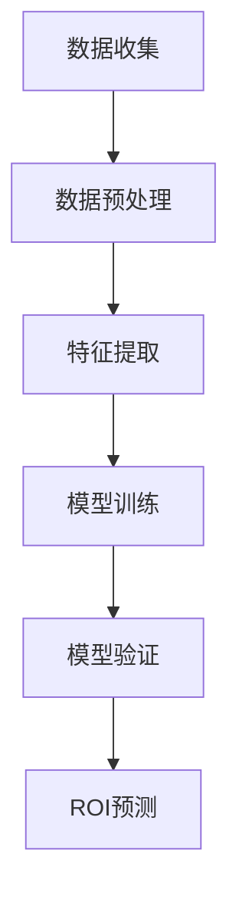

                 


# AI驱动的企业创新ROI评估：量化创新投资回报

> 关键词：AI，创新，ROI，投资回报率，企业创新，创新评估，创新投入

> 摘要：本文探讨如何利用AI技术量化企业创新投资回报率（ROI），分析AI驱动创新的关键因素，构建创新 ROI 评估模型，并通过实际案例展示其应用。通过系统化的分析和实际案例，本文旨在为企业提供AI驱动创新 ROI 评估的理论框架和实践方法，帮助企业在数字化转型中提升创新效率和投资回报。

---

## 第1章: 企业创新与AI驱动的创新评估概述

### 1.1 企业创新的基本概念

#### 1.1.1 创新在企业中的定义与类型
创新是企业通过引入新的产品、服务、流程或商业模式，以实现竞争优势和增长的过程。常见的创新类型包括：
- **产品创新**：开发新产品或改进现有产品。
- **服务创新**：优化服务流程或推出新服务。
- **流程创新**：优化企业内部运营流程。
- **商业模式创新**：改变收入来源或业务模式。

#### 1.1.2 创新在企业中的重要性
创新是企业保持竞争优势的核心动力。通过创新，企业可以：
- 提高效率
- 降低成本
- 满足客户需求
- 拓展市场

#### 1.1.3 创新 ROI 的定义与核心要素
创新 ROI 是指创新带来的净收益与创新投入的比值。其核心要素包括：
- **创新投入**：研发费用、人力成本、技术采购等。
- **创新产出**：新产品的销售收入、服务收入增长、效率提升等。
- **时间因素**：创新的周期和评估的时间窗口。

### 1.2 AI技术在企业创新中的应用

#### 1.2.1 AI技术的基本概念
人工智能（AI）是模拟人类认知过程的技术，涵盖机器学习、自然语言处理、计算机视觉等领域。AI能够处理大量数据，识别模式，优化决策。

#### 1.2.2 AI在企业创新中的应用场景
- **产品开发**：AI用于设计优化、需求预测和产品推荐。
- **服务优化**：AI用于客户行为分析和个性化服务设计。
- **流程改进**：AI用于自动化和优化企业内部流程。

#### 1.2.3 AI驱动创新的优势与挑战
优势：
- 提高创新效率
- 提供数据驱动的决策支持
- 实现精准预测和优化

挑战：
- 数据质量要求高
- 技术复杂性和成本
- 人才短缺

### 1.3 创新 ROI 评估的必要性

#### 1.3.1 传统 ROI 评估的局限性
传统 ROI 评估往往基于财务数据，难以量化创新的间接价值，如品牌价值和长期影响。

#### 1.3.2 AI驱动的 ROI 评估的价值
AI能够通过数据分析，量化创新的投入与产出，提供更精准的 ROI 评估。

#### 1.3.3 企业创新 ROI 评估的边界与外延
评估边界：
- 确定创新项目的时间范围
- 选择合适的评估指标

外延：
- 考虑创新的间接影响，如员工士气和企业声誉

---

## 第2章: AI驱动的创新 ROI 评估模型

### 2.1 创新 ROI 评估的核心概念与联系

#### 2.1.1 创新 ROI 的计算公式
$$ ROI = \frac{净收益}{投入} \times 100\% $$

其中：
- 净收益 = 产出 - 投入
- 投入 = 研发成本 + 人力成本 + 技术采购成本

#### 2.1.2 创新 ROI 的影响因素
- 市场需求
- 技术可行性
- 竞争环境
- 企业战略

#### 2.1.3 创新 ROI 的计算步骤
1. 确定创新项目的投入和产出
2. 计算净收益
3. 计算 ROI
4. 分析 ROI 的影响因素

### 2.2 AI驱动创新 ROI 评估的核心算法

#### 2.2.1 基于机器学习的 ROI 评估算法
1. 数据收集：收集创新项目的投入和产出数据
2. 数据预处理：清洗和特征提取
3. 模型训练：使用回归算法预测 ROI
4. 模型验证：评估模型的准确性和稳定性

#### 2.2.2 基于深度学习的 ROI 评估算法
1. 数据输入：输入创新项目的多维数据
2. 模型构建：构建神经网络模型
3. 模型训练：使用反向传播优化模型
4. 模型预测：预测 ROI 并输出结果

#### 2.2.3 创新 ROI 评估的算法流程图


### 2.3 创新 ROI 评估的系统架构

#### 2.3.1 系统功能设计
- 数据输入模块：接收创新项目的投入和产出数据
- 数据处理模块：清洗和转换数据
- 模型计算模块：计算 ROI 并生成报告
- 结果展示模块：以图表形式展示 ROI 评估结果

#### 2.3.2 系统架构图


#### 2.3.3 系统接口设计
- 数据接口：与企业数据库对接
- 用户接口：供企业用户输入数据和查看报告
- 输出接口：生成 ROI 评估报告

---

## 第3章: AI驱动创新 ROI 评估的算法实现

### 3.1 创新 ROI 评估的算法实现

#### 3.1.1 数据预处理
```python
import pandas as pd
data = pd.read_csv('创新数据.csv')
# 清洗数据
data = data.dropna()
# 标准化处理
from sklearn.preprocessing import StandardScaler
scaler = StandardScaler()
data_scaled = scaler.fit_transform(data)
```

#### 3.1.2 模型训练
```python
from sklearn.linear_model import LinearRegression
model = LinearRegression()
model.fit(data_scaled, target)
```

#### 3.1.3 模型验证
```python
from sklearn.metrics import r2_score
预测 ROI = model.predict(new_data)
r2_score(实际 ROI, 预测 ROI)
```

### 3.2 算法实现的注意事项

#### 3.2.1 数据质量问题
- 数据完整性：确保数据无缺失
- 数据一致性：保证数据格式统一
- 数据准确性：检查数据是否准确

#### 3.2.2 模型选择
- 线性回归：适用于简单线性关系
- 支持向量回归：适用于复杂非线性关系
- 神经网络：适用于多维数据关系

#### 3.2.3 模型优化
- 调整超参数：优化模型性能
- 增加数据量：提升模型泛化能力
- 交叉验证：评估模型稳定性

---

## 第4章: 企业创新 ROI 评估的项目实战

### 4.1 项目背景介绍

#### 4.1.1 项目目标
通过AI技术评估某企业的创新 ROI，优化创新投入。

#### 4.1.2 数据来源
- 企业内部数据：研发投入、销售收入
- 第三方数据：市场数据、竞争对手数据

### 4.2 项目核心代码实现

#### 4.2.1 数据预处理
```python
import pandas as pd
data = pd.read_csv('创新数据.csv')
data = data.dropna()
```

#### 4.2.2 模型训练
```python
from sklearn.linear_model import LinearRegression
model = LinearRegression()
model.fit(data[['投入1', '投入2']], data['ROI'])
```

#### 4.2.3 模型验证
```python
预测 ROI = model.predict(new_data)
r2 = r2_score(实际 ROI, 预测 ROI)
print(f"R² score: {r2}")
```

### 4.3 实际案例分析

#### 4.3.1 案例背景
某科技公司开发了一款新产品，投入100万元，销售收入增长200万元。

#### 4.3.2 案例分析
计算 ROI：
$$ ROI = \frac{200 - 100}{100} \times 100\% = 100\% $$

#### 4.3.3 分析结果
- ROI 为100%，说明创新项目具有较高的回报率。

### 4.4 项目小结

---

## 第5章: 总结与展望

### 5.1 总结
本文详细介绍了AI驱动的企业创新 ROI 评估的方法和实现过程，展示了如何通过AI技术量化创新的回报率，帮助企业做出更明智的投资决策。

### 5.2 展望
未来，随着AI技术的不断发展，创新 ROI 评估将更加精准和智能化。企业可以进一步优化模型，结合更多数据源，提升评估的准确性和实用性。

---

## 附录

### 附录A: 相关工具与库
- Python：数据处理和建模
- Pandas：数据处理
- Scikit-learn：机器学习模型
- Mermaid：图表绘制

### 附录B: 参考文献
1. Smith, J. (2020). AI驱动的企业创新. 《人工智能与企业创新》.
2. Johnson, R. (2019). ROI 评估方法. 《投资回报率评估指南》.

---

## 关键词标签
#AI, #创新, #ROI, #投资回报率, #企业创新, #创新评估, #创新投入

