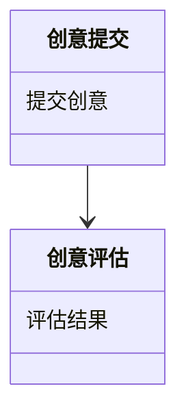
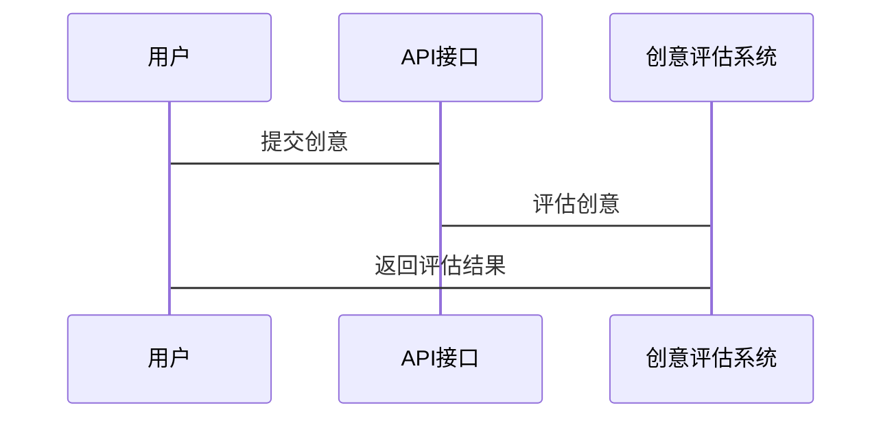

                 


# AI驱动的企业创新孵化器：从创意到商业化

> 关键词：AI, 企业创新, 孵化器, 创意商业化, 技术驱动

> 摘要：本文深入探讨了人工智能（AI）在企业创新中的应用，从背景介绍、核心概念、算法原理到系统架构设计、项目实战，全面分析了AI如何助力企业将创意转化为商业化产品。文章旨在为企业创新者和IT技术从业者提供理论与实践相结合的指导，帮助他们理解并利用AI技术推动企业创新。

---

# 第1章: AI与企业创新的背景介绍

## 1.1 AI技术的定义与核心概念

### 1.1.1 人工智能的基本概念
人工智能（Artificial Intelligence, AI）是模拟人类智能的计算机系统，涵盖学习、推理、问题解决和自然语言处理等能力。AI的核心目标是通过技术手段增强或替代人类的某些认知任务。

### 1.1.2 企业创新的内涵与外延
企业创新是指企业在产品、服务、商业模式或运营方式上的突破性改进。创新是企业保持竞争力的关键，而AI技术为创新提供了新的工具和方法。

### 1.1.3 AI与企业创新的结合点
AI技术通过数据分析、模式识别和智能决策支持，帮助企业发现新的创新机会，优化创新过程，并加速创新成果的商业化。

## 1.2 AI驱动企业创新的背景与趋势

### 1.2.1 当前企业创新面临的挑战
- 市场竞争加剧，创新周期缩短。
- 数据量激增，传统方法难以高效处理。
- 创新资源分散，难以形成合力。

### 1.2.2 AI技术对企业创新的推动作用
- 提高数据分析效率，发现潜在创新机会。
- 智能化工具辅助创新团队快速原型设计和测试。
- 优化资源配置，降低创新成本。

### 1.2.3 全球AI驱动创新的现状与趋势
全球范围内，越来越多的企业开始采用AI技术来推动创新。预计未来几年，AI将在创新的各个环节发挥更大的作用。

## 1.3 AI驱动企业创新的核心要素

### 1.3.1 数据驱动的创新模式
数据是AI驱动创新的基础，通过分析海量数据，发现市场趋势和用户需求。

### 1.3.2 智能化创新工具的应用
AI工具（如生成式AI、智能决策系统）帮助创新团队快速迭代和优化创意。

### 1.3.3 创新生态系统构建
构建包括内部团队、外部合作伙伴和创新网络的生态系统，促进跨领域协作。

## 1.4 本章小结
本章介绍了AI技术的基本概念，分析了企业创新面临的挑战，探讨了AI在创新中的作用，并总结了AI驱动创新的核心要素。

---

# 第2章: AI驱动企业创新的核心概念与联系

## 2.1 AI驱动创新的核心原理

### 2.1.1 数据分析与模式识别
通过机器学习算法分析数据，识别潜在的市场机会和用户需求。

### 2.1.2 自然语言处理与知识图谱
利用NLP技术分析文本数据，构建知识图谱以支持创新决策。

### 2.1.3 智能化决策支持系统
基于AI模型提供实时决策支持，优化创新过程。

## 2.2 核心概念对比分析

### 2.2.1 AI技术与传统IT技术的对比
| 属性 | AI技术 | 传统IT技术 |
|------|--------|------------|
| 核心目标 | 数据分析与模式识别 | 系统开发与维护 |
| 学习能力 | 具备自适应能力 | 无自适应能力 |
| 应用场景 | 创新、决策支持 | 事务处理、信息管理 |

### 2.2.2 创新驱动与效率驱动的对比
| 属性 | 创新驱动 | 效率驱动 |
|------|----------|-----------|
| 目标 | 开发新产品 | 提高现有流程效率 |
| 技术依赖 | 高度依赖AI | 依赖传统技术 |
| 风险 | 高 | 中等 |

### 2.2.3 企业创新与个人创新的对比
| 属性 | 企业创新 | 个人创新 |
|------|----------|-----------|
| 规模 | 大 | 小 |
| 资源 | 丰富 | 有限 |
| 影响 | 高 | 中等 |

## 2.3 创新生态系统中的ER实体关系图

```mermaid
er
actor: 用户
|------|------|
| 创新需求 | 提交 |
|------|------|
| 创意评估 | 评估结果 |
|------|------|
| 创意实现 | 实现结果 |
|------|------|
| 商业化 | 商业化结果 |
```

## 2.4 本章小结
本章通过对比分析，明确了AI驱动创新的核心原理和不同概念之间的联系，并通过ER图展示了创新生态系统的结构。

---

# 第3章: AI驱动企业创新的算法原理

## 3.1 常见AI算法概述

### 3.1.1 机器学习算法
机器学习算法是AI的核心，常用算法包括：
- 线性回归（Linear Regression）
- 支持向量机（SVM）
- 随机森林（Random Forest）
- 神经网络（Neural Networks）

#### 3.1.1.1 线性回归
线性回归用于预测连续型变量，公式如下：
$$ y = \beta_0 + \beta_1x_1 + \beta_2x_2 + \dots + \beta_nx_n $$

#### 3.1.1.2 神经网络
神经网络由多个层组成，通过非线性激活函数进行特征提取，公式如下：
$$ a^{(l+1)} = \sigma(w^{(l)}a^{(l)} + b^{(l)}) $$

### 3.1.2 自然语言处理（NLP）
NLP算法用于文本分析，常用模型包括：
- 词袋模型（Bag of Words）
- 词嵌入（Word Embedding）
- Transformer模型

#### 3.1.2.1 Transformer模型
Transformer模型通过自注意力机制捕捉文本中的关系，公式如下：
$$ \text{Attention}(Q, K, V) = \text{softmax}\left(\frac{QK^T}{\sqrt{d_k}}\right)V $$

### 3.1.3 深度学习算法
深度学习通过多层神经网络提取数据特征，常用模型包括：
- 卷积神经网络（CNN）
- 循环神经网络（RNN）
- 图神经网络（Graph Neural Network）

---

## 3.2 算法实现与案例分析

### 3.2.1 环境搭建
- 安装Python和必要的库（如TensorFlow、Keras）。
- 配置开发环境（Jupyter Notebook或VS Code）。

### 3.2.2 核心代码实现

#### 3.2.2.1 线性回归实现
```python
import numpy as np
from sklearn.linear_model import LinearRegression

# 生成数据
X = np.array([1, 2, 3, 4, 5]).reshape(-1, 1)
y = np.array([2, 4, 5, 4, 6])

# 训练模型
model = LinearRegression()
model.fit(X, y)

# 预测
print(model.predict(X))
```

#### 3.2.2.2 Transformer模型实现（简化版）
```python
import torch
import torch.nn as nn

class Transformer(nn.Module):
    def __init__(self, input_dim, hidden_dim):
        super(Transformer, self).__init__()
        self.embedding = nn.Linear(input_dim, hidden_dim)
        self.transformer_layer = nn.TransformerEncoderLayer(d_model=hidden_dim, nhead=2)
        self.output_layer = nn.Linear(hidden_dim, 1)

    def forward(self, x):
        x = self.embedding(x)
        x = self.transformer_layer(x)
        x = self.output_layer(x)
        return x

# 创建实例
model = Transformer(input_dim=50, hidden_dim=100)
```

### 3.2.3 算法案例分析
以数据分析为例，利用线性回归模型预测市场需求。通过数据清洗、特征工程和模型训练，最终得到预测结果，并分析模型的准确性和适用性。

---

## 3.3 算法优缺点分析

### 3.3.1 机器学习算法
- 优点：易于实现，适合小规模数据。
- 缺点：对高维数据处理能力有限。

### 3.3.2 深度学习算法
- 优点：适合处理复杂数据，模型表达能力强。
- 缺点：需要大量数据和计算资源。

---

## 3.4 本章小结
本章详细讲解了AI驱动创新中常用的算法，通过代码实现和案例分析，帮助读者理解算法的原理和应用。

---

# 第4章: AI驱动企业创新的系统架构设计

## 4.1 系统功能设计

### 4.1.1 领域模型


### 4.1.2 系统架构


### 4.1.3 接口设计
API接口定义：
- 提交创意：`POST /api/innovation.submit`
- 查询评估结果：`GET /api/innovationassessment`

### 4.1.4 交互设计


---

## 4.2 系统架构设计方案

### 4.2.1 模块划分
- 用户界面模块
- 创意评估模块
- 数据分析模块
- 商业化支持模块

### 4.2.2 架构优化
- 使用微服务架构，提高系统的可扩展性。
- 引入容器化技术（如Docker），便于部署和维护。

---

## 4.3 本章小结
本章通过系统架构设计，展示了如何利用AI技术构建企业创新孵化器的系统，并详细讲解了各个模块的功能和交互方式。

---

# 第5章: 项目实战：从创意到商业化

## 5.1 环境搭建与工具安装

### 5.1.1 安装Python和相关库
```bash
pip install numpy pandas scikit-learn tensorflow
```

### 5.1.2 安装开发工具
- 安装Jupyter Notebook或VS Code。

---

## 5.2 系统核心实现

### 5.2.1 创意提交与评估模块
```python
import pandas as pd
from sklearn.model

