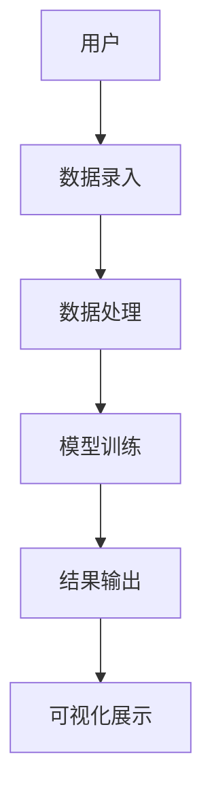

                 


# AI驱动的企业创新文化培养与管理

> 关键词：AI，创新文化，企业管理，算法原理，系统架构，项目实战

> 摘要：本文深入探讨了AI技术在企业创新文化培养与管理中的应用，结合实际案例和算法原理，分析了如何通过AI技术优化企业创新流程，提升创新效率，构建可持续发展的创新文化体系。文章从理论到实践，系统地阐述了AI驱动的企业创新文化的构建方法，为企业管理者和技术人员提供了实用的指导和参考。

---

## 目录大纲

### 第一部分：AI驱动的企业创新文化概述

#### 第1章：AI驱动的企业创新文化概述
- **1.1 企业创新文化的核心概念**
  - 什么是企业创新文化
  - 创新文化的重要性
  - AI如何驱动企业创新文化
- **1.2 AI在企业管理中的应用背景**
  - 传统企业管理的局限性
  - AI技术对企业管理的革新
  - AI驱动创新文化的潜力
- **1.3 企业创新文化的构建要素**
  - 企业文化的核心要素
  - AI在创新文化构建中的作用
  - 创新文化的实现路径
- **1.4 本章小结**

### 第二部分：AI驱动的企业创新文化核心要素

#### 第2章：AI与企业创新文化的核心要素
- **2.1 创新文化的核心要素**
  - 企业愿景与使命
  - 企业价值观
  - 企业创新机制
- **2.2 AI在创新文化中的核心作用**
  - 数据驱动的决策
  - AI赋能的创新工具
  - AI驱动的团队协作
- **2.3 AI与企业创新文化的关联性分析**
  - AI对企业创新文化的促进作用
  - 企业创新文化对AI发展的反哺作用
  - AI与企业创新文化的协同发展
- **2.4 本章小结**

### 第三部分：AI驱动的企业创新文化算法原理

#### 第3章：AI驱动创新文化的算法原理
- **3.1 创新文化构建的算法模型**
  - 模型概述
  - 模型输入与输出
  - 模型训练过程
- **3.2 创新文化评估的数学模型**
  - 模型构建
  - 模型参数
  - 模型优化
- **3.3 AI驱动创新文化的算法实现**
  - 算法流程图（使用mermaid）
  - 算法实现代码
  - 算法原理的数学模型和公式
- **3.4 本章小结**

### 第四部分：AI驱动的企业创新文化系统架构

#### 第4章：AI驱动创新文化的系统架构
- **4.1 系统功能设计**
  - 领域模型类图（使用mermaid）
  - 系统功能模块划分
  - 功能模块交互设计
- **4.2 系统架构设计**
  - 系统架构图（使用mermaid）
  - 系统分层设计
  - 系统组件之间的关系
- **4.3 系统接口设计**
  - 接口定义
  - 接口实现
  - 接口调用流程
- **4.4 系统交互设计**
  - 交互流程图（使用mermaid）
  - 用户角色与权限分配
  - 交互过程中的异常处理
- **4.5 本章小结**

### 第五部分：AI驱动的企业创新文化项目实战

#### 第5章：AI驱动创新文化的项目实战
- **5.1 项目背景与目标**
  - 项目背景介绍
  - 项目目标设定
  - 项目范围界定
- **5.2 环境安装与配置**
  - 开发环境搭建
  - 依赖库安装
  - 数据集准备
- **5.3 核心代码实现**
  - 关键算法实现
  - 数据处理代码
  - 模型训练代码
  - 模型部署代码
- **5.4 项目案例分析**
  - 案例背景介绍
  - 数据分析与处理
  - 模型训练与评估
  - 结果展示与解读
- **5.5 项目总结与优化**
  - 项目成果总结
  - 项目中的问题与不足
  - 优化建议与改进方向
- **5.6 本章小结**

### 第六部分：AI驱动的企业创新文化最佳实践与总结

#### 第6章：AI驱动创新文化的最佳实践
- **6.1 创新文化培养的实践策略**
  - 数据驱动的决策优化
  - AI赋能的创新工具应用
  - 创新团队协作机制
- **6.2 管理创新文化的实践技巧**
  - 创新文化的传播与推广
  - 创新文化的评估与反馈
  - 创新文化的持续改进
- **6.3 项目实施中的注意事项**
  - 数据隐私与安全问题
  - 算法的可解释性与透明性
  - 技术与文化的深度融合
- **6.4 本章小结**

#### 第7章：总结与展望
- **7.1 全文总结**
  - 主要内容回顾
  - 核心观点总结
  - 创新点总结
- **7.2 未来展望**
  - AI技术的未来发展
  - 创新文化的新趋势
  - 结合AI的创新管理新方向
- **7.3 致谢**
  - 对参与人员的感谢
  - 对资料来源的引用说明
- **7.4 附录**
  - 附录A：相关术语解释
  - 附录B：参考文献列表
  - 附录C：代码仓库链接

---

### 附录：技术细节与代码示例

#### 附录A：AI驱动创新文化的算法实现代码
```python
def preprocess_data(data):
    # 数据预处理逻辑
    return processed_data

def train_model(data):
    # 模型训练逻辑
    return model

def evaluate_model(model, test_data):
    # 模型评估逻辑
    return evaluation_result

# 示例代码调用
if __name__ == "__main__":
    data = load_data()
    processed_data = preprocess_data(data)
    model = train_model(processed_data)
    result = evaluate_model(model, data)
    print("模型训练完成，评估结果为：", result)
```

#### 附录B：系统架构图（mermaid）


---

通过以上目录大纲，文章内容将从理论到实践，系统地阐述AI驱动的企业创新文化的构建方法，为企业管理者和技术人员提供全面的指导和参考。

