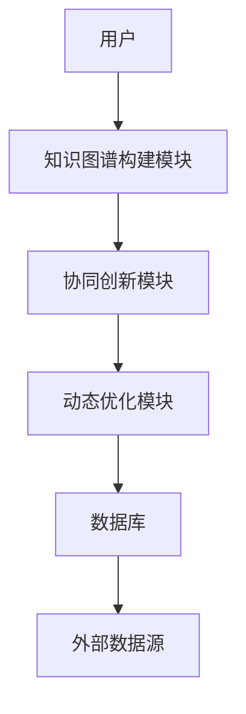
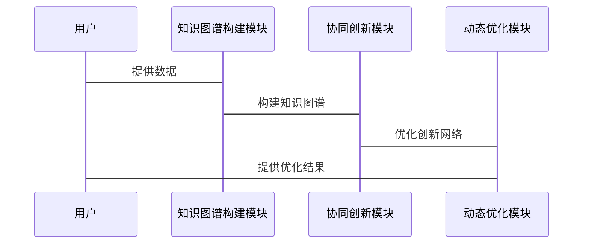

                 


# AI驱动的企业创新生态系统分析：内外部创新网络

## 关键词
- AI驱动
- 企业创新生态系统
- 内外部创新网络
- 协同创新
- 知识图谱
- 机器学习
- 网络分析

## 摘要
AI驱动的企业创新生态系统通过内外部创新网络的协同作用，利用人工智能技术构建知识图谱、优化协作机制和动态预测模型，实现企业创新过程的智能化和高效化。本文从企业创新生态系统的概念出发，详细分析了内外部创新网络的结构与特征，构建了基于AI的创新生态系统模型，并通过实际案例展示了AI在创新生态系统中的应用。文章最后总结了AI驱动的企业创新生态系统的核心要点，并提出了未来的发展方向。

---

# 第1章: AI驱动的企业创新生态系统概述

## 1.1 企业创新生态系统的基本概念
### 1.1.1 企业创新生态系统的定义
企业创新生态系统是一个由企业内部员工、外部合作伙伴（如供应商、客户、研发机构等）以及创新网络中的其他参与者共同构成的复杂系统，旨在通过协同创新实现技术突破和商业价值的最大化。

### 1.1.2 创新生态系统的核心要素
- **内部创新网络**：包括企业内部的研发团队、职能部门、技术平台等。
- **外部创新网络**：包括供应商、客户、合作伙伴、第三方研发机构等。
- **协同机制**：包括信息共享、知识转移、资源共享等。

### 1.1.3 AI在企业创新生态系统中的作用
AI技术通过数据挖掘、机器学习和自然语言处理等手段，帮助企业识别潜在的创新机会、优化协作流程、预测创新趋势。

---

## 1.2 内外部创新网络的定义与区别
### 1.2.1 内部创新网络的构成
- **组织结构**：包括研发部门、技术团队、项目管理团队等。
- **协作机制**：包括内部会议、项目管理流程、知识共享平台等。
- **创新资源**：包括内部技术资源、数据资源、人力资源等。

### 1.2.2 外部创新网络的构成
- **合作伙伴**：包括供应商、客户、第三方研发机构等。
- **创新平台**：包括行业论坛、技术交流会、开放创新平台等。
- **外部资源**：包括外部技术资源、市场数据、专家资源等。

### 1.2.3 内外部创新网络的协同机制
- **信息共享**：通过知识共享平台实现内部与外部信息的互联互通。
- **资源共享**：通过合作项目实现资源的共享与优化配置。
- **协同创新**：通过联合研发、技术交流等方式实现内外部创新网络的协同。

---

## 1.3 企业创新生态系统的核心特征
### 1.3.1 网络化特征
企业创新生态系统是一个典型的网络化系统，内部和外部的参与者通过网络进行协作和互动。

### 1.3.2 开放性特征
企业创新生态系统具有高度的开放性，能够吸引外部资源和合作伙伴参与创新过程。

### 1.3.3 动态性特征
企业创新生态系统是一个动态变化的系统，随着市场环境和技术发展的变化而不断调整。

---

# 第2章: 内外部创新网络的结构与特征

## 2.1 内部创新网络的结构与特征
### 2.1.1 内部创新网络的构成要素
- **研发团队**：包括软件开发团队、数据科学家团队等。
- **技术平台**：包括企业内部的技术研发平台、数据处理平台等。
- **协作工具**：包括项目管理工具、知识共享平台等。

### 2.1.2 内部创新网络的协作机制
- **项目管理**：通过敏捷开发等方式实现内部团队的协作。
- **知识共享**：通过内部文档库、知识管理系统实现知识共享。
- **资源分配**：通过内部资源分配机制实现资源的优化配置。

### 2.1.3 内部创新网络的动态演变
- **技术创新**：内部团队不断推出新技术和新产品。
- **组织调整**：根据市场需求和技术发展趋势调整组织结构。
- **文化演变**：企业内部创新文化的不断优化和提升。

---

## 2.2 外部创新网络的结构与特征
### 2.2.1 外部创新网络的构成要素
- **供应商网络**：包括技术供应商、设备供应商等。
- **客户网络**：包括企业客户、终端用户等。
- **合作伙伴网络**：包括第三方研发机构、技术咨询公司等。

### 2.2.2 外部创新网络的协作机制
- **技术合作**：通过技术合作项目实现技术创新。
- **数据共享**：通过数据共享平台实现数据资源的共享。
- **市场反馈**：通过市场反馈机制优化产品和服务。

### 2.2.3 外部创新网络的动态演变
- **市场需求变化**：外部市场的需求变化推动创新网络的调整。
- **技术发展趋势**：新技术的出现推动创新网络的优化和升级。
- **合作伙伴关系**：合作伙伴关系的变化影响创新网络的结构和功能。

---

## 2.3 内外部创新网络的协同机制
### 2.3.1 协同创新的定义与特征
协同创新是指内部和外部创新网络通过合作实现技术创新和商业价值提升的过程。

### 2.3.2 协同创新的实现路径
- **信息共享**：通过知识共享平台实现信息的互联互通。
- **资源整合**：通过资源整合实现资源的优化配置。
- **协同研发**：通过联合研发项目实现技术创新。

### 2.3.3 协同创新的典型案例
- **案例1**：某企业与第三方研发机构合作开发人工智能算法。
- **案例2**：某企业与供应商合作优化生产流程。

---

# 第3章: AI驱动的创新生态系统模型

## 3.1 创新生态系统模型的构建方法
### 3.1.1 数据采集与处理
- **数据源**：包括内部数据（如研发数据、项目数据）和外部数据（如市场数据、行业数据）。
- **数据清洗**：通过数据清洗技术去除噪声数据，确保数据质量。
- **数据集成**：通过数据集成技术实现多源数据的整合。

### 3.1.2 数据分析与建模
- **网络分析**：通过图论方法分析创新网络的结构特征。
- **机器学习**：通过机器学习算法预测创新趋势和协同创新机会。
- **自然语言处理**：通过自然语言处理技术分析文本数据，提取关键词和主题。

### 3.1.3 模型验证与优化
- **模型验证**：通过实际案例验证模型的准确性和有效性。
- **模型优化**：通过参数调整和算法优化提升模型性能。

---

## 3.2 创新生态系统模型的核心算法
### 3.2.1 基于图论的网络分析算法
- **节点度数计算**：计算网络中每个节点的度数，识别关键节点。
- **网络聚类分析**：通过聚类算法识别网络中的社区结构。
- **网络中心性分析**：通过中心性分析识别网络中的关键节点。

### 3.2.2 基于机器学习的预测算法
- **协同创新预测**：通过机器学习算法预测潜在的协同创新机会。
- **创新趋势预测**：通过时间序列分析预测创新趋势。

### 3.2.3 基于自然语言处理的文本挖掘算法
- **关键词提取**：通过文本挖掘技术提取创新领域的关键词。
- **主题建模**：通过主题建模技术分析创新领域的主题分布。

---

## 3.3 创新生态系统模型的数学公式
### 3.3.1 网络分析的数学模型
$$
\text{节点度数} = \sum_{i=1}^{n} a_{ij}
$$
其中，$a_{ij}$ 表示节点 $i$ 和节点 $j$ 之间的边是否存在。

### 3.3.2 机器学习模型的数学公式
$$
y = f(x) + \epsilon
$$
其中，$y$ 表示预测目标，$x$ 表示输入特征，$f(x)$ 表示模型函数，$\epsilon$ 表示噪声。

### 3.3.3 文本挖掘模型的数学公式
$$
P(\text{主题}|w) = \frac{\text{主题中词 }w\text{ 的次数}}{\text{所有词中 }w\text{ 的总次数}}
$$
其中，$P(\text{主题}|w)$ 表示在给定词 $w$ 的情况下，主题出现的概率。

---

# 第4章: AI驱动的创新生态系统应用

## 4.1 创新生态系统中的知识图谱构建
### 4.1.1 知识图谱的定义与构建方法
- **知识图谱**：一种以图结构形式表示知识的数据库，包含实体和关系。
- **构建方法**：包括数据采集、数据清洗、数据整合和知识抽取。

### 4.1.2 知识图谱的AI驱动构建技术
- **自然语言处理**：通过自然语言处理技术从文本中提取实体和关系。
- **机器学习**：通过机器学习算法自动识别实体和关系。

### 4.1.3 知识图谱在创新生态系统中的应用
- **知识检索**：通过知识图谱实现快速的知识检索和查询。
- **关系推理**：通过知识图谱进行关系推理，发现潜在的协同创新机会。

---

## 4.2 创新生态系统中的协同创新
### 4.2.1 协同创新的定义与特征
- **协同创新**：指多个创新主体通过合作实现技术创新和商业价值提升的过程。
- **特征**：跨组织、跨领域、高度协作。

### 4.2.2 协同创新的实现路径
- **合作研发**：通过合作研发项目实现技术创新。
- **知识共享**：通过知识共享平台实现知识的互联互通。
- **资源整合**：通过资源整合实现资源的优化配置。

---

## 4.3 创新生态系统中的动态优化
### 4.3.1 动态优化的定义与特征
- **动态优化**：指根据市场环境和技术发展的变化，实时优化创新网络的结构和功能。
- **特征**：实时性、动态性、适应性。

### 4.3.2 动态优化的实现方法
- **实时监控**：通过实时监控技术实现创新网络的动态监控。
- **智能调整**：通过机器学习算法实现创新网络的智能调整。
- **反馈优化**：通过反馈机制优化创新网络的结构和功能。

---

# 第5章: 系统架构与设计

## 5.1 创新生态系统系统的功能模块
### 5.1.1 知识图谱构建模块
- **功能**：从多源数据中提取知识，构建知识图谱。
- **输入**：多源数据，包括文本数据、结构化数据等。
- **输出**：知识图谱，包括实体和关系。

### 5.1.2 协同创新模块
- **功能**：识别潜在的协同创新机会，优化协作流程。
- **输入**：创新网络数据、知识图谱。
- **输出**：协同创新机会列表、协作计划。

### 5.1.3 动态优化模块
- **功能**：实时监控创新网络的动态变化，优化创新网络的结构和功能。
- **输入**：实时数据流、创新网络数据。
- **输出**：优化后的创新网络结构、协作策略。

---

## 5.2 创新生态系统系统的架构设计
### 5.2.1 系统架构图


### 5.2.2 系统交互流程


---

## 5.3 系统接口设计
### 5.3.1 知识图谱构建模块接口
- **输入接口**：接收多源数据，包括文本数据、结构化数据等。
- **输出接口**：输出知识图谱，包括实体和关系。

### 5.3.2 协同创新模块接口
- **输入接口**：接收创新网络数据、知识图谱。
- **输出接口**：输出协同创新机会列表、协作计划。

### 5.3.3 动态优化模块接口
- **输入接口**：接收实时数据流、创新网络数据。
- **输出接口**：输出优化后的创新网络结构、协作策略。

---

# 第6章: 项目实战

## 6.1 环境安装
### 6.1.1 系统要求
- 操作系统：Linux/Windows/MacOS
- 内存：8GB以上
- 处理器：支持多线程的CPU

### 6.1.2 软件安装
- Python 3.8以上
- TensorFlow 2.0以上
- NLTK库
- NetworkX库

---

## 6.2 系统核心实现源代码
### 6.2.1 知识图谱构建模块代码
```python
import networkx as nx
from sklearn.feature_extraction.text import TfidfVectorizer
from sklearn.decomposition import NMF

# 示例代码：从文本数据中提取关键词
def extract_keywords(text):
    vectorizer = TfidfVectorizer()
    tfidf = vectorizer.fit_transform([text])
    feature_names = vectorizer.get_feature_names_out()
    return feature_names

# 示例代码：构建知识图谱
def build_knowledge_graph(texts):
    graph = nx.Graph()
    for text in texts:
        keywords = extract_keywords(text)
        for keyword in keywords:
            graph.add_node(keyword)
            for neighbor in keywords[1:]:
                graph.add_edge(keyword, neighbor)
    return graph
```

### 6.2.2 协同创新模块代码
```python
import numpy as np
from sklearn.manifold import TSNE

# 示例代码：协同创新机会预测
def predict_collaboration Opportunities(matrix):
    model = TSNE(n_components=2, random_state=42)
    transformed = model.fit_transform(matrix)
    return transformed
```

---

## 6.3 案例分析与经验总结
### 6.3.1 案例分析
- **案例1**：某企业通过知识图谱构建模块识别潜在的技术合作伙伴。
- **案例2**：某企业通过协同创新模块优化内部协作流程。

### 6.3.2 经验总结
- **数据质量**：高质量的数据是构建创新生态系统的核心。
- **算法选择**：选择合适的算法和技术是实现创新生态系统的关键。
- **系统优化**：系统的动态优化是实现创新生态系统的重要保障。

---

# 第7章: 总结与展望

## 7.1 总结
AI驱动的企业创新生态系统通过内外部创新网络的协同作用，利用人工智能技术构建知识图谱、优化协作流程和动态预测模型，实现企业创新过程的智能化和高效化。

## 7.2 未来展望
随着人工智能技术的不断发展，未来的企业创新生态系统将更加智能化和个性化。通过深度学习、强化学习等技术，企业创新生态系统将具备更强的自适应能力和创新能力。

---

## 7.3 最佳实践 Tips
- **数据驱动**：始终以数据为中心，确保数据的高质量和高价值。
- **技术驱动**：选择合适的人工智能技术，提升创新生态系统的智能化水平。
- **协作驱动**：加强内外部创新网络的协作，实现协同创新。

---

通过本文的详细分析和实际案例，读者可以全面了解AI驱动的企业创新生态系统的核心原理和实现方法。未来，随着人工智能技术的不断进步，企业创新生态系统将为企业创造更大的价值。

