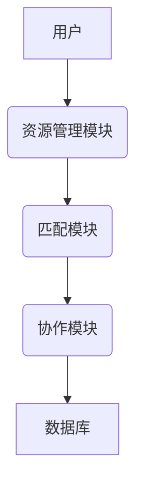
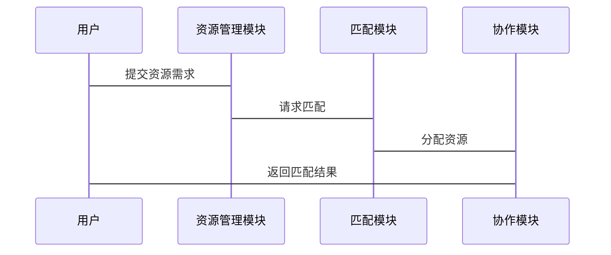

                 


# AI驱动的企业创新生态系统构建：内外部资源智能匹配与协作平台

---

## 关键词：AI、企业创新、生态系统、资源匹配、协作平台

---

## 摘要：  
随着人工智能技术的快速发展，企业创新生态系统正在经历一场深刻的变革。通过AI驱动的内外部资源智能匹配与协作平台，企业能够更高效地整合和优化资源，提升创新效率和竞争力。本文将从背景、核心概念、算法原理、系统设计到项目实战，全面探讨如何构建这一平台，为企业创新提供新的思路和解决方案。

---

# 第一部分：AI驱动的企业创新生态系统背景与概念

## 第1章：问题背景与问题描述

### 1.1 问题背景  
在当今快速变化的商业环境中，企业创新的核心竞争力取决于内外部资源的高效整合与协作。然而，传统的资源匹配方式往往存在以下问题：  
1. **资源分散**：企业内部资源（如技术、人才、资金）与外部资源（如合作伙伴、供应商、客户）分散在不同的系统中，难以有效整合。  
2. **匹配效率低**：资源匹配通常依赖人工判断，耗时且难以实现最优匹配。  
3. **协作复杂**：跨部门或跨组织的协作流程繁琐，信息孤岛问题严重，难以快速响应市场需求。  

AI技术的引入为企业解决这些问题提供了新的可能性。通过智能化的资源匹配与协作平台，企业可以实现资源的高效利用和快速响应。

### 1.2 问题描述  
AI驱动的企业创新生态系统构建的核心问题是：如何通过智能化算法，实现内外部资源的智能匹配与协作。具体包括以下方面：  
1. **资源识别与分类**：准确识别企业内外部资源，并对其进行分类管理。  
2. **资源匹配算法**：设计高效的匹配算法，实现资源的最佳匹配。  
3. **协作平台设计**：构建一个支持资源协作的平台，实现资源的动态调配与协同工作。  

### 1.3 问题解决思路  
AI驱动的资源匹配与协作平台的设计思路可以分为以下几个步骤：  
1. **资源建模**：对内外部资源进行建模，提取关键特征。  
2. **匹配算法设计**：基于机器学习算法，设计资源匹配模型。  
3. **平台实现**：构建协作平台，实现资源的动态匹配与协作。  

### 1.4 边界与外延  
AI驱动的企业创新生态系统构建的边界包括：  
1. **系统边界**：平台仅负责资源匹配与协作，不涉及资源的实际使用与管理。  
2. **功能范围**：平台的核心功能包括资源匹配、协作流程管理、数据可视化等。  

### 1.5 概念结构与核心要素  
AI驱动的企业创新生态系统构建的核心要素包括：  
1. **资源池**：企业内外部资源的集合。  
2. **匹配算法**：基于AI的资源匹配模型。  
3. **协作平台**：支持资源协作的平台系统。  

---

## 第2章：核心概念与联系

### 2.1 内部资源与外部资源的定义  
**内部资源**：指企业内部拥有的资源，如员工、设备、资金等。  
**外部资源**：指企业外部的资源，如合作伙伴、供应商、客户等。  

### 2.2 资源匹配的核心问题  
资源匹配的核心问题在于如何找到最佳的资源组合，以实现企业目标。  

### 2.3 内外部资源的关系  
内外部资源之间存在相互依赖关系，例如：  
- 内部资源需要外部资源的支持才能实现创新。  
- 外部资源需要内部资源的配合才能有效利用。  

---

# 第二部分：AI驱动的资源匹配与协作平台

## 第3章：算法原理

### 3.1 资源匹配算法的原理  
资源匹配算法基于机器学习，通过以下步骤实现：  
1. **数据预处理**：对资源数据进行清洗和特征提取。  
2. **模型训练**：基于历史数据，训练资源匹配模型。  
3. **资源匹配**：通过模型预测，找到最佳资源组合。  

### 3.2 基于机器学习的资源匹配模型  
以下是一个简单的资源匹配模型示例：  

$$ \text{匹配概率} = \frac{\sum_{i=1}^{n} w_i \cdot x_i}{\sum_{i=1}^{n} w_i} $$  

其中，$w_i$ 是特征 $x_i$ 的权重，$n$ 是特征总数。  

### 3.3 算法实现步骤  
1. **数据收集**：收集企业内外部资源的数据。  
2. **特征提取**：提取资源的关键特征，如资源类型、资源能力等。  
3. **模型训练**：基于历史数据，训练资源匹配模型。  
4. **资源匹配**：输入新的资源需求，模型输出匹配结果。  

---

## 第4章：系统分析与架构设计

### 4.1 系统需求分析  
系统需求包括：  
1. **资源管理**：支持资源的录入、管理和查询。  
2. **资源匹配**：实现资源的智能匹配。  
3. **协作管理**：支持资源协作流程的管理。  

### 4.2 系统功能设计  
系统功能模块包括：  
1. **资源管理模块**：实现资源的录入与管理。  
2. **匹配模块**：实现资源的智能匹配。  
3. **协作模块**：支持资源协作流程的管理。  

### 4.3 系统架构设计  
以下是系统的架构设计图：



### 4.4 接口设计与交互流程  
系统交互流程如下：



---

## 第5章：项目实战

### 5.1 环境安装与配置  
1. **安装Python**：确保安装了Python 3.8及以上版本。  
2. **安装依赖库**：安装所需的库，如scikit-learn、numpy等。  

### 5.2 核心代码实现  
以下是资源匹配算法的核心代码示例：

```python
import numpy as np
from sklearn.metrics.pairwise import cosine_similarity

# 定义资源特征矩阵
X = np.array([[0.5, 0.3],
              [0.7, 0.6],
              [0.4, 0.8]])

# 计算余弦相似度
similarity = cosine_similarity(X)

# 输出匹配结果
print(similarity)
```

### 5.3 案例分析  
以一个具体的企业为例，描述如何通过平台实现资源匹配与协作。  

---

## 第6章：总结与展望

### 6.1 总结  
本文详细探讨了AI驱动的企业创新生态系统构建的核心问题，包括资源匹配算法的设计、协作平台的实现等。  

### 6.2 未来展望  
未来，随着AI技术的不断发展，资源匹配与协作平台将更加智能化，为企业创新提供更多可能性。  

---

## 附录：  
- **工具介绍**：介绍常用的AI工具与平台。  
- **数据集说明**：描述数据集的来源与格式。  
- **参考文献**：列出相关文献与资料。  

---

通过本文的系统阐述，读者可以全面理解AI驱动的企业创新生态系统构建的核心内容，并能够实际应用于企业创新管理中。

