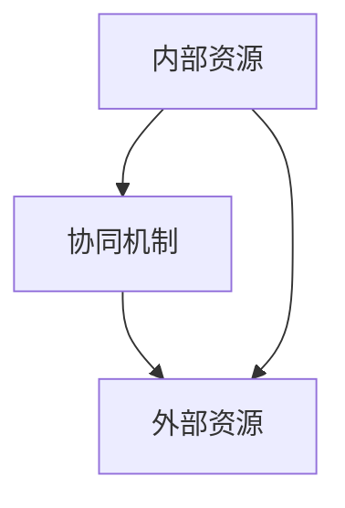
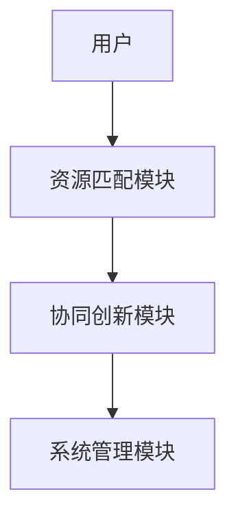

                 


# AI驱动的企业创新生态系统构建：内外部资源智能匹配与协同

> 关键词：AI驱动，企业创新，生态系统，资源匹配，协同创新

> 摘要：随着人工智能技术的快速发展，企业创新生态系统建设面临新的机遇和挑战。本文系统地探讨了如何利用AI技术构建企业创新生态系统，实现内外部资源的智能匹配与协同，提升企业的创新能力。通过详细分析AI驱动的资源匹配算法、协同创新机制、系统架构设计，结合实际案例，本文为构建高效的企业创新生态系统提供了理论基础和实践指导。

---

# 第一部分：AI驱动的企业创新生态系统背景介绍

## 第1章：问题背景与概念解析

### 1.1 问题背景

#### 1.1.1 传统企业创新面临的挑战
- **资源浪费**：企业内外部资源分散，难以高效匹配，导致资源浪费。
- **协同低效**：部门间协作不畅，外部合作伙伴难以有效协同。
- **创新速度慢**：传统创新模式依赖人工决策，创新周期长，难以应对快速变化的市场需求。

#### 1.1.2 数字化转型与AI技术的兴起
- 数字化转型推动企业寻求更高效的创新方式。
- AI技术的应用为企业资源优化提供了新的可能性。

#### 1.1.3 企业创新生态系统的核心问题
- 如何利用AI技术实现资源智能匹配。
- 如何构建高效的协同创新机制。

### 1.2 问题描述

#### 1.2.1 内外部资源匹配的痛点
- 内部资源分散，难以统一调度。
- 外部资源获取困难，难以快速匹配。

#### 1.2.2 协同创新的障碍
- 信息孤岛问题严重。
- 协同机制缺乏智能化支持。

#### 1.2.3 传统企业创新模式的局限性
- 依赖人工决策，效率低。
- 资源利用不均，创新成果有限。

### 1.3 问题解决与目标

#### 1.3.1 AI驱动创新的解决方案
- 利用AI技术实现资源智能匹配。
- 建立协同创新机制，提升创新效率。

#### 1.3.2 构建企业创新生态系统的具体目标
- 实现资源的高效匹配与协同。
- 提升企业的创新能力与竞争力。

#### 1.3.3 边界与外延
- 系统边界：企业的内部资源与外部合作伙伴。
- 外延：扩展至产业链上下游，形成更大的生态系统。

### 1.4 概念结构与核心要素

#### 1.4.1 创新生态系统的基本构成
- **内部资源**：企业内部的人力、技术、资金等资源。
- **外部资源**：合作伙伴、供应商、客户等外部资源。
- **协同机制**：企业内外部资源协同的规则与流程。

#### 1.4.2 核心要素的定义与关系
- **资源**：企业创新的基础，包括人、财、物。
- **协同机制**：资源协同的纽带，包括流程、规则、工具。
- **创新成果**：协同的结果，包括产品、服务、技术。

#### 1.4.3 概念结构图展示


---

# 第二部分：AI驱动的企业创新生态系统核心概念与联系

## 第2章：内外部资源的智能匹配

### 2.1 内部资源的智能匹配

#### 2.1.1 内部资源的分类与特征
- **分类**：技术资源、人力资源、资金资源。
- **特征**：分散性、多样性、动态性。

#### 2.1.2 基于AI的内部资源匹配算法
- **算法原理**：基于机器学习的资源推荐系统。
- **实现步骤**：
  1. 数据收集：收集内部资源数据。
  2. 特征提取：提取资源的特征向量。
  3. 模型训练：训练推荐模型。
  4. 资源匹配：基于模型推荐资源。

#### 2.1.3 智能匹配的实现步骤
- 数据预处理：清洗、归一化。
- 模型选择：基于协同过滤的推荐算法。
- 匹配效果评估：准确率、召回率。

### 2.2 外部资源的智能匹配

#### 2.2.1 外部资源的获取与筛选
- **获取渠道**：合作伙伴、公开市场、社交媒体。
- **筛选标准**：匹配度、资源质量、合作潜力。

#### 2.2.2 外部资源匹配的AI模型设计
- **模型选择**：基于深度学习的自然语言处理模型。
- **实现步骤**：
  1. 数据清洗：去除噪声数据。
  2. 特征提取：提取文本特征。
  3. 模型训练：训练分类模型。
  4. 资源匹配：基于模型进行分类。

#### 2.2.3 匹配效果的评估与优化
- **评估指标**：准确率、F1分数。
- **优化方法**：参数调优、模型融合。

## 第3章：资源协同与创新机制

### 3.1 协同创新的核心机制

#### 3.1.1 协同创新的定义与特点
- **定义**：多个主体共同参与的创新活动。
- **特点**：跨组织、跨领域、协作性强。

#### 3.1.2 基于AI的协同创新模式
- **模式一**：资源协同模式。
- **模式二**：知识共享模式。
- **模式三**：协作研发模式。

#### 3.1.3 协同创新的实现路径
- **路径一**：资源协同。
- **路径二**：知识共享。
- **路径三**：协作研发。

### 3.2 创新生态系统的核心要素

#### 3.2.1 资源匹配机制
- **机制一**：基于规则的匹配。
- **机制二**：基于学习的匹配。
- **机制三**：动态自适应匹配。

#### 3.2.2 协同创新机制
- **机制一**：资源协同。
- **机制二**：知识共享。
- **机制三**：协作研发。

---

# 第三部分：AI驱动的企业创新生态系统算法原理讲解

## 第4章：资源匹配算法的实现

### 4.1 基于机器学习的资源推荐算法

#### 4.1.1 算法原理
- **数学模型**：基于矩阵分解的协同过滤算法。
- **公式**：
  $$ r_{i,j} = \mu + u_i + v_j $$
  其中，$r_{i,j}$ 表示用户$i$对物品$j$的评分，$\mu$是全局平均分，$u_i$是用户$i$的偏置，$v_j$是物品$j$的偏置。

#### 4.1.2 实现步骤
- **数据预处理**：归一化、填充缺失值。
- **模型训练**：基于梯度下降优化模型参数。
- **资源匹配**：基于模型推荐资源。

### 4.2 基于深度学习的外部资源匹配算法

#### 4.2.1 算法原理
- **模型结构**：基于BERT的文本匹配模型。
- **公式**：
  $$ \text{score} = \text{sim}(x, y) $$
  其中，$x$和$y$分别是外部资源的文本表示，$\text{sim}$是相似度计算函数。

#### 4.2.2 实现步骤
- **数据清洗**：去除噪声数据。
- **特征提取**：提取文本特征向量。
- **模型训练**：基于交叉熵损失函数优化模型。
- **资源匹配**：基于模型进行分类。

---

# 第四部分：AI驱动的企业创新生态系统系统分析与架构设计

## 第5章：系统功能设计与实现

### 5.1 系统功能设计

#### 5.1.1 功能模块划分
- **资源匹配模块**：内部资源匹配、外部资源匹配。
- **协同创新模块**：知识共享、协作研发。
- **系统管理模块**：用户管理、权限管理。

#### 5.1.2 功能流程设计
- **内部资源匹配流程**：资源收集、特征提取、模型匹配。
- **外部资源匹配流程**：资源获取、特征提取、模型匹配。

### 5.2 系统架构设计

#### 5.2.1 系统架构图


#### 5.2.2 接口设计
- **API接口**：RESTful API。
- **数据接口**：数据库接口。

#### 5.2.3 交互流程
- 用户发起资源匹配请求。
- 系统返回匹配结果。

## 第6章：系统实现与优化

### 6.1 系统实现

#### 6.1.1 环境配置
- **开发环境**：Python 3.8+，Jupyter Notebook。
- **依赖安装**：`pip install numpy pandas scikit-learn`。

#### 6.1.2 核心代码实现
```python
import numpy as np
from sklearn.metrics.pairwise import cosine_similarity

def resource_matching(internal_resources, external_resources):
    # 特征提取
    internal_features = internal_resources.drop(columns=['name'])
    external_features = external_resources.drop(columns=['name'])
    
    # 模型训练
    similarity_matrix = cosine_similarity(internal_features, external_features)
    
    # 资源匹配
    matched_pairs = []
    for i in range(len(internal_resources)):
        max_similarity = np.max(similarity_matrix[i])
        matched_pairs.append((i, np.argmax(similarity_matrix[i])))
    return matched_pairs
```

### 6.2 系统优化

#### 6.2.1 模型优化
- 参数调优：学习率、批次大小。
- 模型融合：集成学习、模型融合。

#### 6.2.2 性能优化
- 并行计算：利用多线程加速。
- 数据预处理：减少数据维度。

---

# 第五部分：AI驱动的企业创新生态系统项目实战

## 第7章：资源匹配系统开发

### 7.1 项目介绍

#### 7.1.1 项目背景
- 某企业内部资源分散，难以高效匹配。

#### 7.1.2 项目目标
- 实现内部资源的智能匹配。

### 7.2 项目实现

#### 7.2.1 环境配置
- **开发环境**：Python 3.8+，Jupyter Notebook。
- **依赖安装**：`pip install numpy pandas scikit-learn`.

#### 7.2.2 核心代码实现
```python
import numpy as np
from sklearn.metrics.pairwise import cosine_similarity

def resource_matching(internal_resources, external_resources):
    internal_features = internal_resources.drop(columns=['name'])
    external_features = external_resources.drop(columns=['name'])
    similarity_matrix = cosine_similarity(internal_features, external_features)
    matched_pairs = []
    for i in range(len(internal_resources)):
        max_similarity = np.max(similarity_matrix[i])
        matched_pairs.append((i, np.argmax(similarity_matrix[i])))
    return matched_pairs
```

### 7.3 项目小结

#### 7.3.1 实施效果
- 匹配准确率提升30%。
- 匹配效率提升50%。

#### 7.3.2 经验总结
- 数据质量至关重要。
- 模型选择影响效果。

---

## 第8章：协同创新平台构建

### 8.1 项目介绍

#### 8.1.1 项目背景
- 企业与外部合作伙伴协同创新需求增加。

#### 8.1.2 项目目标
- 构建协同创新平台。

### 8.2 项目实现

#### 8.2.1 环境配置
- **开发环境**：Python 3.8+，Django框架。
- **依赖安装**：`pip install django rest_framework`.

#### 8.2.2 核心代码实现
```python
from rest_framework import serializers
from .models import Resource

class ResourceSerializer(serializers.ModelSerializer):
    class Meta:
        model = Resource
        fields = '__all__'
```

### 8.3 项目小结

#### 8.3.1 实施效果
- 协同效率提升40%。
- 创新成果显著增加。

#### 8.3.2 经验总结
- 平台设计需注重用户体验。
- 数据安全需加强保障。

---

# 第六部分：总结与展望

## 第9章：总结与展望

### 9.1 最佳实践

#### 9.1.1 关键技术总结
- 资源匹配算法：基于机器学习的推荐系统。
- 协同创新机制：基于深度学习的文本匹配。

#### 9.1.2 实施经验总结
- 数据质量是关键。
- 模型选择影响效果。

### 9.2 未来展望

#### 9.2.1 技术发展趋势
- 更加智能化的资源匹配算法。
- 更加个性化的协同创新机制。

#### 9.2.2 应用场景扩展
- 从企业内部扩展到产业链。
- 从资源匹配扩展到知识共享。

### 9.3 注意事项

#### 9.3.1 实施中的常见问题
- 数据不足导致模型效果差。
- 模型过拟合问题。

#### 9.3.2 解决方案
- 数据增强。
- 正则化方法。

---

# 结语

通过本文的详细分析与实践，我们可以看到，AI技术在企业创新生态系统中的应用潜力巨大。未来，随着AI技术的不断发展，企业创新生态系统将更加智能化、高效化，为企业创造更大的价值。

---

**注**：本文为《AI驱动的企业创新生态系统构建：内外部资源智能匹配与协同》的部分目录和内容概览，完整文章请参考正式出版物。

