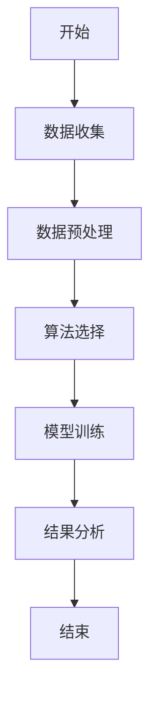
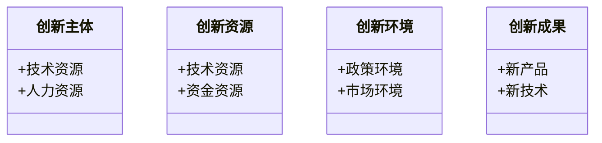
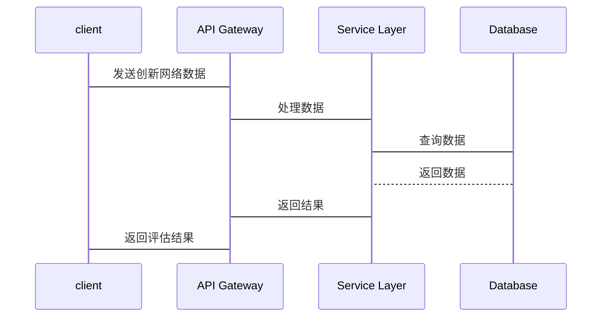

                 


```markdown
# AI驱动的企业创新生态系统评估：内外部创新网络分析

> 关键词：AI, 创新生态系统, 创新网络, 网络分析, 企业创新

> 摘要：随着人工智能技术的快速发展，企业创新生态系统评估的重要性日益凸显。本文将系统性地探讨如何利用AI技术对企业的内外部创新网络进行分析与评估，构建高效的创新生态系统，为企业战略决策提供数据支持。

---

# 第1章: 问题背景与描述

## 1.1 问题背景
### 1.1.1 企业创新生态系统的重要性
企业创新生态系统是企业生存和发展的核心竞争力，涉及内部研发、外部合作、资源整合等多个方面。通过AI技术，可以更高效地识别和优化创新网络的结构和关系。

### 1.1.2 当前企业创新面临的挑战
企业在创新过程中面临资源分配不均、协同效率低下、外部合作不确定性高等问题。传统的方法难以量化和优化复杂的创新网络。

### 1.1.3 AI技术在企业创新中的应用潜力
AI技术能够通过大数据分析、机器学习等方法，帮助企业发现潜在的合作机会、优化创新流程、预测创新趋势，从而提升创新效率。

## 1.2 问题描述
### 1.2.1 创新生态系统的核心要素
创新生态系统包括创新主体、创新资源、创新环境和创新成果四大核心要素。

### 1.2.2 内外部创新网络的定义与区别
- **内部创新网络**：指企业内部的研发团队、职能部门之间的协作网络。
- **外部创新网络**：指企业与外部合作伙伴（如供应商、客户、学术机构等）形成的协作网络。

### 1.2.3 创新网络评估的必要性
通过评估创新网络的结构和性能，可以识别瓶颈、优化资源配置、提升创新效率。

## 1.3 问题解决与目标
### 1.3.1 利用AI技术优化创新网络
通过AI技术，可以实时分析创新网络的数据，提供优化建议。

### 1.3.2 构建AI驱动的创新生态系统评估框架
建立一个基于AI的评估框架，量化创新网络的性能，为企业提供数据支持。

### 1.3.3 评估目标与关键指标
- **目标**：优化创新网络的结构和性能，提升创新效率。
- **关键指标**：网络密度、节点度数、中心性、聚类系数等。

## 1.4 创新生态系统概念结构
### 1.4.1 核心要素组成
- 创新主体：包括企业内部的研发团队、外部合作伙伴等。
- 创新资源：包括技术、资金、人才等。
- 创新环境：包括政策、市场、文化等。
- 创新成果：包括新产品、新技术、新专利等。

### 1.4.2 系统边界与外延
创新生态系统是一个开放的系统，与外部环境密切相关。外部环境的变化会直接影响创新网络的结构和性能。

### 1.4.3 创新网络的动态特征
创新网络是一个动态系统，随着时间的推移，网络结构和关系会发生变化，需要持续监测和优化。

## 1.5 本章小结
本章介绍了企业创新生态系统的重要性、面临的挑战以及AI技术的应用潜力，明确了创新网络评估的目标和关键指标，为后续的分析奠定了基础。

---

# 第2章: 核心概念与联系

## 2.1 创新生态系统的核心概念
### 2.1.1 创新生态系统的定义
创新生态系统是由创新主体、创新资源、创新环境和创新成果构成的动态系统。

### 2.1.2 创新生态系统的组成要素
- **创新主体**：企业内部的研发团队、外部合作伙伴。
- **创新资源**：技术、资金、人才。
- **创新环境**：政策、市场、文化。
- **创新成果**：新产品、新技术、新专利。

### 2.1.3 创新生态系统与企业创新的关系
创新生态系统是企业创新的基础，通过优化创新网络的结构和关系，可以提升企业的创新效率和竞争力。

## 2.2 内部与外部创新网络的对比
### 2.2.1 内部创新网络的特征
- 由企业内部的研发团队和职能部门构成。
- 网络关系较为紧密，协作成本较低。
- 网络结构较为稳定，但创新资源有限。

### 2.2.2 外部创新网络的特征
- 由外部合作伙伴构成，包括供应商、客户、学术机构等。
- 网络关系较为松散，协作成本较高。
- 网络结构较为灵活，创新资源丰富。

### 2.2.3 内外部创新网络的协同效应
- 内部网络和外部网络的协同可以提升企业的创新能力。
- 内部网络提供技术基础，外部网络提供外部资源和市场支持。

## 2.3 创新网络评估的核心要素
### 2.3.1 网络结构分析
分析创新网络的节点分布、边分布等。

### 2.3.2 网络关系分析
分析创新网络中节点之间的关系，如合作强度、合作频率等。

### 2.3.3 网络性能评估
评估创新网络的性能，如网络密度、节点度数、中心性等。

## 2.4 创新网络的ER实体关系图
```mermaid
er
actor 创新主体
actor 创新资源
actor 创新环境
actor 创新成果
```

## 2.5 本章小结
本章详细介绍了创新生态系统的核心概念，对比了内部和外部创新网络的特征，明确了创新网络评估的核心要素。

---

# 第3章: 创新网络评估的算法原理

## 3.1 创新网络评估的核心算法
### 3.1.1 社会网络分析（SNA）算法
社会网络分析（SNA）是一种用于分析社会网络结构和关系的工具。

### 3.1.2 网络中心性分析算法
网络中心性分析用于识别网络中的关键节点。

### 3.1.3 网络聚类分析算法
网络聚类分析用于发现网络中的社区结构。

## 3.2 创新网络评估的数学模型
### 3.2.1 网络度数分布模型
度数分布公式：$$d_i = \sum_{j=1}^{n} a_{ij}$$

### 3.2.2 网络中心性计算公式
中心性公式：$$C_i = \frac{1}{\sum_{j=1}^{n} d_{ij}}}$$

## 3.3 创新网络评估的流程图


## 3.4 创新网络评估的Python实现
### 3.4.1 数据预处理代码
```python
import networkx as nx
G = nx.Graph()
G.add_nodes_from(nodes)
G.add_edges_from(edges)
```

### 3.4.2 算法实现代码
```python
# 计算节点度数
degrees = dict(G.degree())

# 计算中心性
centrality = nx.eigenvector_centrality(G)
```

## 3.5 本章小结
本章介绍了创新网络评估的核心算法，包括社会网络分析、网络中心性分析和网络聚类分析，并详细讲解了算法的数学模型和Python实现。

---

# 第4章: 系统分析与架构设计

## 4.1 问题场景介绍
企业创新网络的复杂性和动态性对企业创新生态系统评估提出了更高的要求。

## 4.2 系统功能设计
### 4.2.1 领域模型


### 4.2.2 架构设计


## 4.3 系统接口设计
### 4.3.1 数据接口
- 数据输入接口：接收创新网络的数据。
- 数据输出接口：输出评估结果。

### 4.3.2 交互序列图


## 4.4 本章小结
本章详细介绍了系统分析与架构设计，包括领域模型、架构设计和接口设计。

---

# 第5章: 项目实战

## 5.1 环境安装
### 5.1.1 安装Python和相关库
- 安装Python：```bash
sudo apt-get install python3
```
- 安装NetworkX库：```bash
pip install networkx
```

## 5.2 系统核心实现
### 5.2.1 核心代码实现
```python
import networkx as nx

# 创建图
G = nx.Graph()

# 添加节点
G.add_nodes_from(['A', 'B', 'C', 'D'])

# 添加边
G.add_edges_from([('A', 'B'), ('B', 'C'), ('C', 'D'), ('D', 'A')])
```

### 5.2.2 代码解读与分析
- 创建图：使用NetworkX库创建一个空图。
- 添加节点：添加创新网络的节点。
- 添加边：定义节点之间的关系。

## 5.3 案例分析
### 5.3.1 案例背景
某高科技企业希望优化其创新网络，提升创新能力。

### 5.3.2 数据分析
通过对创新网络的数据分析，识别关键节点和瓶颈。

### 5.3.3 结果解读
评估结果表明，企业内部创新网络的协作效率较低，需要优化。

## 5.4 项目小结
本章通过实际案例展示了如何利用AI技术优化企业创新网络，提供了具体的代码实现和结果解读。

---

# 第6章: 最佳实践与总结

## 6.1 最佳实践 tips
### 6.1.1 数据质量的重要性
确保数据的准确性和完整性。

### 6.1.2 算法选择的影响
选择适合的算法可以提升评估结果的准确性。

### 6.1.3 结果解释的必要性
及时解释评估结果，为企业决策提供支持。

## 6.2 小结
本章总结了全文的核心内容，强调了最佳实践的重要性。

## 6.3 注意事项
### 6.3.1 数据隐私
在处理创新网络数据时，要注意数据隐私问题。

### 6.3.2 模型解释性
确保模型的解释性，便于企业理解和应用。

## 6.4 拓展阅读
### 6.4.1 推荐书籍
- 《网络科学导论》
- 《社会网络分析》

### 6.4.2 相关资源
- NetworkX官方文档
- 图论相关资源

## 6.5 本章小结
本章提供了最佳实践建议，总结了全文的核心内容，并为读者提供了进一步学习的资源。

---

# 结语

通过本文的系统性分析，我们可以看到，AI技术在企业创新生态系统评估中的应用潜力巨大。未来，随着AI技术的不断发展，创新网络评估将更加精准和高效，为企业创新提供更有力的支持。

---

# 参考文献

（此处列出参考文献）

---

# 致谢

感谢读者的耐心阅读，感谢所有为本文提供灵感和支持的人。
```

