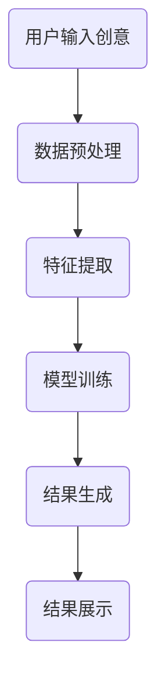

                 


# AI驱动的企业创新管理平台：从创意孵化到商业化

> 关键词：AI，企业创新管理，创意孵化，商业化，人工智能，创新平台

> 摘要：本文将详细探讨AI在企业创新管理中的应用，从创意的孵化到商业化的实现，分析其核心概念、算法原理、系统架构以及实际案例，为企业提供创新的管理思路和技术支持。

---

## 第一部分：AI驱动的企业创新管理平台概述

### 第1章：企业创新管理的现状与挑战

#### 1.1 企业创新管理的背景
随着市场竞争的加剧，企业创新管理的重要性日益凸显。传统的企业管理方式依赖于人工决策，效率低下且难以捕捉市场趋势。而AI技术的应用为企业创新管理提供了新的可能性，能够通过数据分析和机器学习优化决策过程。

#### 1.2 创意孵化的痛点
- **市场需求不清**：企业难以准确预测市场需求，导致创意方向偏离实际。
- **资源分配不合理**：创意项目缺乏有效评估，资源浪费严重。
- **创新周期长**：从创意到商业化的过程复杂，耗时长，成本高。

#### 1.3 AI在企业创新管理中的潜力
- **数据驱动决策**：通过AI分析市场数据，优化创意评估。
- **自动化流程**：AI能够自动化处理大量数据，缩短创新周期。
- **精准预测**：利用机器学习预测市场趋势，提高商业化的成功率。

### 第2章：AI驱动的企业创新管理平台的核心概念

#### 2.1 创意孵化的定义与特点
创意孵化是指将初步的想法转化为可行的商业计划的过程。其特点包括：
- **灵活性**：能够快速调整创意方向。
- **数据驱动**：依赖于市场数据进行决策。
- **目标导向**：以商业化为目标。

#### 2.2 商业化过程的关键环节
- **市场分析**：通过AI分析市场趋势，确定目标客户。
- **竞争分析**：识别竞争对手的优势和劣势。
- **商业模式设计**：基于AI分析结果，制定可持续的商业模式。

#### 2.3 AI在企业创新管理中的角色
AI不仅是一个工具，更是企业创新管理的核心驱动力。它能够：
- **自动化数据处理**：快速处理大量数据，生成有价值的洞察。
- **辅助决策**：通过预测模型，提供科学的决策支持。
- **优化流程**：自动化处理流程，提高效率。

---

## 第二部分：AI驱动的企业创新管理平台的核心技术

### 第3章：创意孵化的AI支持

#### 3.1 数据收集与预处理
- **数据来源**：市场报告、消费者反馈、行业趋势等。
- **数据清洗**：去除噪声数据，确保数据质量。
- **数据特征提取**：提取关键特征，如市场需求、竞争状况等。

#### 3.2 创意评估模型
- **评估指标**：市场潜力、技术可行性、成本效益等。
- **评估方法**：利用机器学习模型对创意进行评分。
- **模型训练**：通过历史数据训练模型，提高评估准确性。

#### 3.3 创意优化建议
- **优化方向**：基于模型结果，提出创意改进方向。
- **案例分析**：通过实际案例，展示AI如何优化创意。

### 第4章：商业化过程的AI支持

#### 4.1 市场预测与风险评估
- **市场预测模型**：利用时间序列分析预测市场需求。
- **风险评估方法**：通过回归分析评估潜在风险。
- **案例分析**：某企业如何利用AI预测市场趋势。

#### 4.2 商业模式设计
- **商业模式选择**：基于AI分析结果，选择最适合的商业模式。
- **定价策略**：利用聚类分析确定目标客户，并制定相应价格策略。
- **渠道选择**：通过网络分析确定最优销售渠道。

---

## 第三部分：系统架构与实现

### 第5章：系统架构设计

#### 5.1 系统组成
- **数据层**：数据存储和管理。
- **算法层**：创意评估和市场预测的算法实现。
- **用户层**：用户界面，供企业用户使用。

#### 5.2 系统功能模块
- **数据输入模块**：用户输入创意和相关数据。
- **数据处理模块**：对数据进行清洗和特征提取。
- **模型运行模块**：运行机器学习模型，生成评估结果。
- **结果展示模块**：将评估结果以可视化形式展示给用户。

#### 5.3 系统流程图


### 第6章：系统实现与优化

#### 6.1 环境配置
- **编程语言**：Python 3.8+
- **框架选择**：使用Scikit-learn进行机器学习。
- **工具安装**：安装必要的库，如pandas、numpy、matplotlib。

#### 6.2 核心代码实现
```python
# 示例代码：创意评估模型
from sklearn.model_selection import train_test_split
from sklearn.metrics import accuracy_score
from sklearn.svm import SVC

# 数据加载
data = pd.read_csv('data.csv')
X = data.drop('label', axis=1)
y = data['label']

# 数据分割
X_train, X_test, y_train, y_test = train_test_split(X, y, test_size=0.2)

# 模型训练
model = SVC()
model.fit(X_train, y_train)

# 模型预测
y_pred = model.predict(X_test)

# 模型评估
print("准确率：", accuracy_score(y_test, y_pred))
```

#### 6.3 系统优化
- **性能优化**：通过网格搜索优化模型参数。
- **可扩展性优化**：采用分布式计算处理大规模数据。

---

## 第四部分：案例分析与最佳实践

### 第7章：实际案例分析

#### 7.1 案例背景
某科技公司希望通过AI优化其新产品的创意孵化过程。

#### 7.2 数据分析与模型选择
- **数据来源**：市场报告、消费者调研。
- **模型选择**：选择随机森林进行市场潜力预测。

#### 7.3 模型实现与结果
```python
# 示例代码：随机森林模型
from sklearn.ensemble import RandomForestClassifier

model = RandomForestClassifier()
model.fit(X_train, y_train)
y_pred = model.predict(X_test)
print("准确率：", accuracy_score(y_test, y_pred))
```

#### 7.4 结果解读与优化
- **结果解读**：模型预测该产品市场潜力较高。
- **优化建议**：调整产品功能，以满足目标客户的需求。

### 第8章：最佳实践与注意事项

#### 8.1 最佳实践
- **数据质量**：确保数据的准确性和完整性。
- **模型选择**：根据具体问题选择合适的算法。
- **结果解读**：结合业务背景解读模型结果。

#### 8.2 注意事项
- **数据隐私**：注意保护用户数据隐私。
- **模型解释性**：确保模型结果易于解释。
- **持续优化**：定期更新模型，以适应市场变化。

---

## 第五部分：总结与展望

### 第9章：总结

#### 9.1 核心观点回顾
- AI在企业创新管理中的作用日益重要。
- 创意孵化和商业化过程可以通过AI技术优化。
- 系统化的方法能够提高创新管理的效率和效果。

#### 9.2 本书的主要贡献
- 提供了AI驱动企业创新管理的系统化方法。
- 结合实际案例，展示了AI技术的应用价值。

### 第10章：未来展望

#### 10.1 技术趋势
- AI与区块链结合，确保数据安全和透明。
- 自然语言处理技术进步，提升创意评估的准确性。

#### 10.2 应用前景
- 更多行业将引入AI驱动的创新管理模式。
- 创意孵化和商业化过程将更加自动化和智能化。

---

通过以上分析，我们可以看到，AI技术在企业创新管理中的应用潜力巨大。从创意孵化到商业化，AI不仅能够提高效率，还能为企业提供科学的决策支持。未来，随着技术的不断进步，AI在企业创新管理中的作用将更加重要。

---

