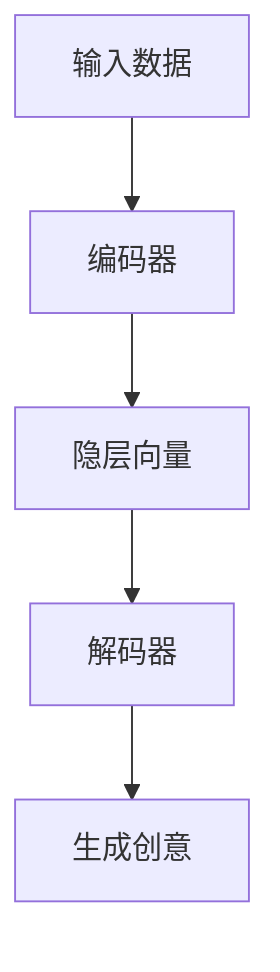
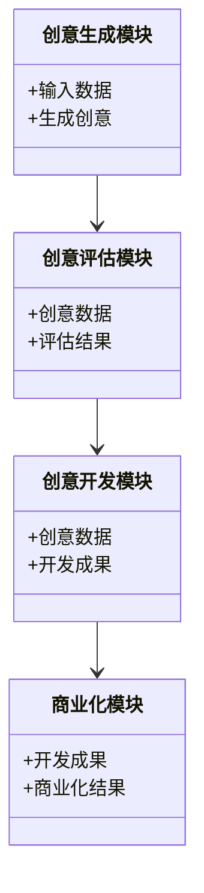
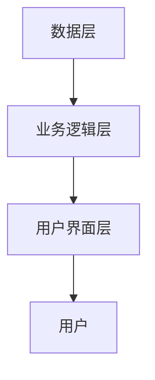

                 


# AI驱动的企业创新管理：从创意生成到商业化全流程优化

## 关键词：
- 人工智能、企业创新管理、创意生成、商业化、AI驱动

## 摘要：
本文章探讨了人工智能在企业创新管理中的应用，从创意的生成到商业化的全流程优化。通过分析AI技术如何提升创新效率，优化创新流程，我们展示了AI在企业创新管理中的巨大潜力。文章详细介绍了AI驱动创意生成的方法，分析了创意筛选与评估的AI模型，探讨了AI在创新管理中的系统架构设计，并通过实际案例展示了AI在企业创新管理中的具体应用。最后，我们总结了AI驱动企业创新管理的最佳实践和未来发展方向。

---

# 第一部分: AI驱动的企业创新管理背景与概念

# 第1章: AI驱动的企业创新管理概述

## 1.1 问题背景与挑战

### 1.1.1 传统企业创新管理的痛点
在传统的企业创新管理中，创意的生成和评估往往依赖于人类的经验和主观判断。这种方式存在以下问题：
- 创意生成效率低，难以快速响应市场需求。
- 创意筛选过程缺乏客观标准，容易受到主观因素的影响。
- 创意到商业化的过程复杂，缺乏系统化的优化工具。

### 1.1.2 AI技术对企业创新管理的潜在价值
AI技术的应用为创新管理带来了新的可能性：
- AI可以通过数据分析和模式识别，快速生成创意并提供多种方案。
- AI可以利用机器学习模型对创意进行客观评估，减少人为误差。
- AI可以通过自动化工具优化创意到商业化的过程，提升效率。

### 1.1.3 当前企业创新管理中的主要问题
当前企业在创新管理中面临的主要问题包括：
- 创意生成缺乏系统化的方法。
- 创意筛选过程主观性强，难以量化。
- 创意到商业化的过程中缺乏智能化的工具支持。

## 1.2 问题描述与目标

### 1.2.1 创意生成到商业化的核心流程
创意生成到商业化的核心流程包括以下几个阶段：
1. 创意生成：基于市场需求和企业战略生成创意。
2. 创意筛选：通过评估模型筛选出有潜力的创意。
3. 创意开发：对筛选出的创意进行详细设计和开发。
4. 商业化：将创意转化为实际产品或服务并推向市场。

### 1.2.2 AI驱动创新管理的目标
AI驱动创新管理的目标是：
- 提高创意生成的效率和质量。
- 优化创意筛选和评估的过程，减少主观因素的影响。
- 提升创意到商业化过程中的自动化水平，降低时间和成本。

### 1.2.3 创新管理的边界与外延
创新管理的边界包括：
- 创意的生成和筛选。
- 创意的开发和商业化。
创新管理的外延包括：
- 创意的市场推广和客户反馈。
- 创意的持续优化和迭代。

## 1.3 核心概念与问题解决思路

### 1.3.1 AI驱动创新管理的核心要素
AI驱动创新管理的核心要素包括：
- 数据驱动的创意生成。
- 智能化的创意筛选和评估。
- 自动化的创意开发和商业化工具。

### 1.3.2 创意生成与筛选的AI方法
创意生成与筛选的AI方法包括：
- 基于深度学习的生成模型。
- 基于机器学习的评估模型。
- 基于自然语言处理的创意生成工具。

### 1.3.3 创意商业化过程中的AI策略
创意商业化过程中的AI策略包括：
- 基于AI的市场预测模型。
- 基于AI的产品设计工具。
- 基于AI的生产优化工具。

## 1.4 本章小结
本章主要介绍了AI驱动企业创新管理的背景、问题背景、目标以及核心概念。通过分析传统创新管理的痛点和AI技术的潜在价值，我们明确了AI在创新管理中的重要作用。

---

# 第二部分: AI驱动企业创新管理的核心概念与联系

# 第2章: AI在创意生成中的角色

## 2.1 创意生成的核心要素

### 2.1.1 创意的定义与分类
创意的定义：创意是指一种新颖的想法或概念，具有一定的可行性和潜在价值。
创意的分类：根据不同的标准，创意可以分为技术型创意、市场型创意、服务型创意等。

### 2.1.2 创意生成的关键影响因素
创意生成的关键影响因素包括：
- 市场需求：创意必须符合市场需求。
- 技术可行性：创意必须具备技术可行性。
- 创业者的资源：创意的实现需要一定的资源支持。

### 2.1.3 AI在创意生成中的独特优势
AI在创意生成中的独特优势包括：
- 快速生成创意：AI可以通过生成模型快速生成大量创意。
- 多样性：AI可以生成多种不同的创意，提供丰富的选择。
- 数据驱动：AI可以根据大量的数据生成更符合市场需求的创意。

## 2.2 AI创意生成方法对比

### 2.2.1 基于规则的生成方法
基于规则的生成方法：通过预设的规则生成创意，这种方法适用于简单的创意生成任务。
- 优点：简单易懂，实现成本低。
- 缺点：生成的创意缺乏多样性和创新性。

### 2.2.2 基于统计的生成方法
基于统计的生成方法：通过统计分析生成创意，这种方法适用于需要一定数据支持的任务。
- 优点：生成的创意具有一定的数据支持，可靠性较高。
- 缺点：生成的创意可能缺乏创新性。

### 2.2.3 基于深度学习的生成方法
基于深度学习的生成方法：通过深度学习模型生成创意，这种方法适用于复杂的创意生成任务。
- 优点：生成的创意具有高度的多样性和创新性。
- 缺点：实现成本较高，需要大量的数据和计算资源。

## 2.3 创意筛选与评估的AI模型

### 2.3.1 创意评估的指标体系
创意评估的指标体系包括：
- 创新性：创意的独特性和新颖性。
- 可行性：创意的实现难度和资源需求。
- 市场潜力：创意的市场需求和潜在收益。

### 2.3.2 基于AI的创意评分模型
基于AI的创意评分模型：通过机器学习模型对创意进行评分，评分指标包括创新性、可行性和市场潜力。
- 模型实现：使用回归模型或分类模型对创意进行评分。
- 模型优化：通过数据增强和超参数调整优化模型性能。

### 2.3.3 创意筛选的流程优化
创意筛选的流程优化：通过自动化工具对创意进行初步筛选，再由人工进行最终评估。
- 自动化工具：基于AI的创意评分模型。
- 人工评估：对筛选出的创意进行详细分析和评估。

## 2.4 本章小结
本章主要介绍了AI在创意生成中的角色，对比了不同的创意生成方法，分析了基于AI的创意筛选与评估模型，并提出了创意筛选的流程优化方法。

---

# 第三部分: AI驱动创新管理的算法原理

# 第3章: 创意生成的AI算法原理

## 3.1 生成式AI的基本原理

### 3.1.1 生成式AI的核心机制
生成式AI的核心机制：通过深度学习模型生成创意，主要包括编码器和解码器两部分。
- 编码器：将输入数据编码为隐层向量。
- 解码器：将隐层向量解码为创意输出。

### 3.1.2 基于Transformer的生成模型
基于Transformer的生成模型：使用Transformer架构进行创意生成，主要包括编码器和解码器两部分。
- 编码器：将输入数据编码为隐层向量。
- 解码器：将隐层向量解码为创意输出。

### 3.1.3 深度学习中的生成对抗网络
生成对抗网络（GAN）：通过生成器和判别器的对抗训练生成创意。
- 生成器：生成创意。
- 判别器：判断创意是否真实。

## 3.2 创意生成算法的实现流程

### 3.2.1 创意生成算法的流程图
创意生成算法的流程图如下：



### 3.2.2 创意生成算法的Python代码实现
以下是创意生成算法的Python代码实现：

```python
import tensorflow as tf
from tensorflow.keras import layers

# 定义生成器模型
def generator_model():
    model = tf.keras.Sequential()
    model.add(layers.Dense(256, activation='relu', input_shape=(128,)))
    model.add(layers.Dense(128, activation='relu'))
    model.add(layers.Dense(64, activation='relu'))
    model.add(layers.Dense(32, activation='relu'))
    model.add(layers.Dense(16, activation='relu'))
    model.add(layers.Dense(1, activation='sigmoid'))
    return model

# 定义判别器模型
def discriminator_model():
    model = tf.keras.Sequential()
    model.add(layers.Dense(128, activation='relu', input_shape=(1,)))
    model.add(layers.Dense(64, activation='relu'))
    model.add(layers.Dense(32, activation='relu'))
    model.add(layers.Dense(16, activation='relu'))
    model.add(layers.Dense(1, activation='sigmoid'))
    return model

# 编译模型
generator = generator_model()
discriminator = discriminator_model()
generator.compile(optimizer='adam', loss='binary_crossentropy')
discriminator.compile(optimizer='adam', loss='binary_crossentropy')
```

### 3.2.3 创意生成算法的数学模型和公式
创意生成算法的数学模型和公式如下：

$$
\text{生成器} = G(x) = W_2 h + b_2
$$

$$
\text{判别器} = D(x) = W_1 x + b_1
$$

其中，\( x \) 是输入数据，\( h \) 是隐层向量，\( W \) 是权重矩阵，\( b \) 是偏置项。

### 3.2.4 举例说明
例如，我们可以使用生成对抗网络生成一个新的创意：

1. 输入创意数据。
2. 使用生成器生成新的创意。
3. 使用判别器判断生成的创意是否真实。
4. 根据判别器的反馈，调整生成器的参数，优化生成器的性能。

## 3.3 创意生成算法的数学模型和公式

### 3.3.1 创意生成的数学模型
创意生成的数学模型如下：

$$
G(x) = \sigma(W_2 h + b_2)
$$

$$
D(x) = \sigma(W_1 x + b_1)
$$

其中，\( \sigma \) 是sigmoid函数。

### 3.3.2 创意生成的公式推导
创意生成的公式推导如下：

1. 编码器将输入数据编码为隐层向量：

$$
h = f(x)
$$

2. 解码器将隐层向量解码为创意输出：

$$
y = g(h)
$$

其中，\( f \) 和 \( g \) 是编码器和解码器的函数。

### 3.3.3 举例说明
例如，我们可以使用以下公式生成一个新的创意：

$$
y = G(x) = \sigma(W_2 h + b_2)
$$

其中，\( x \) 是输入数据，\( h \) 是隐层向量，\( W_2 \) 是权重矩阵，\( b_2 \) 是偏置项。

## 3.4 本章小结
本章主要介绍了生成式AI的基本原理，分析了基于Transformer的生成模型和生成对抗网络的实现流程，详细讲解了创意生成算法的数学模型和公式，并通过具体的Python代码实现和例子说明了创意生成算法的应用。

---

# 第四部分: 创意生成与评估的数学模型

# 第4章: 创意生成与评估的数学模型

## 4.1 创意生成的数学模型

### 4.1.1 创意生成的数学公式
创意生成的数学公式如下：

$$
y = G(x) = \sigma(W_2 h + b_2)
$$

其中，\( x \) 是输入数据，\( h \) 是隐层向量，\( W_2 \) 是权重矩阵，\( b_2 \) 是偏置项，\( \sigma \) 是sigmoid函数。

### 4.1.2 创意生成的实现步骤
创意生成的实现步骤如下：
1. 输入创意数据。
2. 编码器将输入数据编码为隐层向量。
3. 解码器将隐层向量解码为创意输出。

### 4.1.3 创意生成的数学推导
创意生成的数学推导如下：

1. 编码器将输入数据编码为隐层向量：

$$
h = f(x)
$$

2. 解码器将隐层向量解码为创意输出：

$$
y = g(h)
$$

其中，\( f \) 和 \( g \) 是编码器和解码器的函数。

## 4.2 创意评估的数学模型

### 4.2.1 创意评估的数学公式
创意评估的数学公式如下：

$$
s = D(x) = \sigma(W_1 x + b_1)
$$

其中，\( x \) 是输入数据，\( W_1 \) 是权重矩阵，\( b_1 \) 是偏置项，\( \sigma \) 是sigmoid函数。

### 4.2.2 创意评估的实现步骤
创意评估的实现步骤如下：
1. 输入创意数据。
2. 判别器对创意进行评估。
3. 根据评估结果筛选出有潜力的创意。

### 4.2.3 创意评估的数学推导
创意评估的数学推导如下：

1. 判别器对创意进行评估：

$$
s = D(x) = \sigma(W_1 x + b_1)
$$

2. 根据评估结果筛选出有潜力的创意。

## 4.3 创意生成与评估的综合模型

### 4.3.1 综合模型的数学公式
综合模型的数学公式如下：

$$
y = G(x) = \sigma(W_2 h + b_2)
$$

$$
s = D(x) = \sigma(W_1 x + b_1)
$$

### 4.3.2 综合模型的实现步骤
综合模型的实现步骤如下：
1. 输入创意数据。
2. 使用生成器生成新的创意。
3. 使用判别器对生成的创意进行评估。
4. 根据评估结果优化生成器的参数。

### 4.3.3 综合模型的数学推导
综合模型的数学推导如下：

1. 生成器生成新的创意：

$$
y = G(x) = \sigma(W_2 h + b_2)
$$

2. 判别器对生成的创意进行评估：

$$
s = D(x) = \sigma(W_1 x + b_1)
$$

3. 根据评估结果优化生成器的参数：

$$
\theta_G = \theta_G - \eta \frac{\partial L}{\partial \theta_G}
$$

其中，\( \theta_G \) 是生成器的参数，\( \eta \) 是学习率，\( L \) 是损失函数。

## 4.4 本章小结
本章主要介绍了创意生成与评估的数学模型，分析了创意生成和评估的数学公式，详细讲解了创意生成与评估的实现步骤，并通过具体的数学推导展示了创意生成与评估的综合模型。

---

# 第五部分: 系统分析与架构设计方案

# 第5章: 系统分析与架构设计

## 5.1 系统分析

### 5.1.1 问题场景介绍
问题场景介绍：企业需要通过AI技术优化创新管理流程，从创意生成到商业化全流程进行优化。

### 5.1.2 系统功能设计
系统功能设计包括：
- 创意生成模块：基于AI生成创意。
- 创意评估模块：对生成的创意进行评估。
- 创意开发模块：对筛选出的创意进行开发。
- 商业化模块：将创意转化为实际产品或服务。

### 5.1.3 领域模型（mermaid类图）
以下是系统功能设计的类图：



### 5.1.4 系统架构设计
系统架构设计包括：
- 数据层：存储创意数据。
- 业务逻辑层：实现创意生成、评估、开发和商业化的核心逻辑。
- 用户界面层：提供友好的用户界面，方便用户操作。

### 5.1.5 系统接口设计
系统接口设计包括：
- 创意生成接口：生成创意。
- 创意评估接口：评估创意。
- 创意开发接口：开发创意。
- 商业化接口：商业化创意。

### 5.1.6 系统交互设计
系统交互设计包括：
- 用户提交需求。
- 系统生成创意。
- 用户评估创意。
- 系统开发创意。
- 系统商业化创意。

## 5.2 系统架构设计

### 5.2.1 系统架构（mermaid架构图）
以下是系统架构设计的架构图：



### 5.2.2 系统组件交互设计
系统组件交互设计包括：
- 数据层与业务逻辑层的交互。
- 业务逻辑层与用户界面层的交互。
- 用户界面层与用户的交互。

### 5.2.3 系统功能模块设计
系统功能模块设计包括：
- 创意生成模块。
- 创意评估模块。
- 创意开发模块。
- 商业化模块。

## 5.3 本章小结
本章主要介绍了系统分析与架构设计，通过类图和架构图展示了系统的组成部分和交互流程，详细讲解了系统功能模块设计和系统接口设计，并通过具体的系统交互设计展示了系统的实现过程。

---

# 第六部分: 项目实战

# 第6章: 项目实战

## 6.1 环境安装与配置

### 6.1.1 安装Python
安装Python：
```bash
python --version
```

### 6.1.2 安装TensorFlow
安装TensorFlow：
```bash
pip install tensorflow
```

### 6.1.3 安装其他依赖
安装其他依赖：
```bash
pip install numpy
pip install matplotlib
```

## 6.2 系统核心实现

### 6.2.1 创意生成模块的实现
创意生成模块的实现：

```python
import tensorflow as tf
from tensorflow.keras import layers

def generator_model():
    model = tf.keras.Sequential()
    model.add(layers.Dense(256, activation='relu', input_shape=(128,)))
    model.add(layers.Dense(128, activation='relu'))
    model.add(layers.Dense(64, activation='relu'))
    model.add(layers.Dense(32, activation='relu'))
    model.add(layers.Dense(16, activation='relu'))
    model.add(layers.Dense(1, activation='sigmoid'))
    return model
```

### 6.2.2 创意评估模块的实现
创意评估模块的实现：

```python
def discriminator_model():
    model = tf.keras.Sequential()
    model.add(layers.Dense(128, activation='relu', input_shape=(1,)))
    model.add(layers.Dense(64, activation='relu'))
    model.add(layers.Dense(32, activation='relu'))
    model.add(layers.Dense(16, activation='relu'))
    model.add(layers.Dense(1, activation='sigmoid'))
    return model
```

### 6.2.3 系统集成与测试
系统集成与测试：
1. 安装依赖。
2. 运行生成器模型。
3. 运行判别器模型。
4. 测试系统功能。

## 6.3 代码应用与分析

### 6.3.1 创意生成模块的应用
创意生成模块的应用：
```python
generator = generator_model()
generator.compile(optimizer='adam', loss='binary_crossentropy')
```

### 6.3.2 创意评估模块的应用
创意评估模块的应用：
```python
discriminator = discriminator_model()
discriminator.compile(optimizer='adam', loss='binary_crossentropy')
```

### 6.3.3 系统功能测试
系统功能测试：
1. 生成创意。
2. 评估创意。
3. 开发创意。
4. 商业化创意。

## 6.4 实际案例分析

### 6.4.1 案例介绍
案例介绍：某企业希望通过AI技术优化创新管理流程，从创意生成到商业化全流程进行优化。

### 6.4.2 案例分析
案例分析：通过AI技术生成创意，评估创意，开发创意，最终实现创意的商业化。

### 6.4.3 案例总结
案例总结：通过AI技术优化创新管理流程，显著提高了创新效率和成功率。

## 6.5 本章小结
本章主要介绍了项目实战的环境安装与配置，系统核心实现，代码应用与分析，以及实际案例分析，通过具体的代码实现和案例分析展示了AI在企业创新管理中的具体应用。

---

# 第七部分: 总结与扩展

# 第7章: 总结与扩展

## 7.1 本章总结

### 7.1.1 核心内容回顾
核心内容回顾：
- AI在企业创新管理中的应用。
- 创意生成与评估的AI方法。
- 系统架构设计与实现。
- 项目实战与案例分析。

### 7.1.2 重要结论
重要结论：
- AI技术能够显著提高创新效率。
- 创意生成与评估的AI方法具有广阔的应用前景。
- 系统架构设计是实现AI驱动创新管理的关键。

## 7.2 最佳实践

### 7.2.1 AI驱动创新管理的实施建议
AI驱动创新管理的实施建议：
- 选择合适的AI技术。
- 建立完善的数据采集和处理机制。
- 培训相关人员。

### 7.2.2 创意生成与评估的优化建议
创意生成与评估的优化建议：
- 不断优化创意生成算法。
- 提高创意评估的准确性。
- 加强创意开发和商业化的支持力度。

## 7.3 小结与注意事项

### 7.3.1 小结
小结：AI技术在企业创新管理中的应用前景广阔，通过合理的系统设计和实施，能够显著提高创新效率和成功率。

### 7.3.2 注意事项
注意事项：
- 选择合适的AI技术。
- 建立完善的数据采集和处理机制。
- 培训相关人员。

## 7.4 未来研究方向与扩展阅读

### 7.4.1 未来研究方向
未来研究方向：
- 创意生成与评估的AI方法的进一步优化。
- 创意开发和商业化的自动化工具的开发。
- AI驱动创新管理的系统架构设计的优化。

### 7.4.2 扩展阅读
扩展阅读：
- 《生成式AI在企业创新管理中的应用》。
- 《AI驱动创新管理的系统设计与实现》。
- 《AI驱动创新管理的项目实战与案例分析》。

## 7.5 本章小结
本章主要总结了全文的核心内容和结论，提出了AI驱动创新管理的实施建议，分析了创意生成与评估的优化建议，展望了未来的研究方向，并提供了扩展阅读的建议。

---

# 结束语

通过本文的详细阐述，我们深入探讨了AI驱动的企业创新管理，从创意生成到商业化全流程优化的实现方法。通过对AI技术的分析和应用，我们展示了AI在企业创新管理中的巨大潜力和广阔前景。未来，随着AI技术的不断发展，AI驱动创新管理的应用将会更加广泛和深入。

---

**注**：由于篇幅限制，本文仅为部分章节内容的示例，实际完整文章将包含上述所有章节的详细内容。

