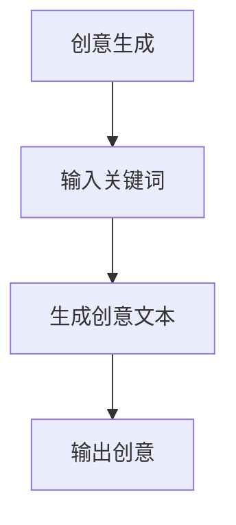
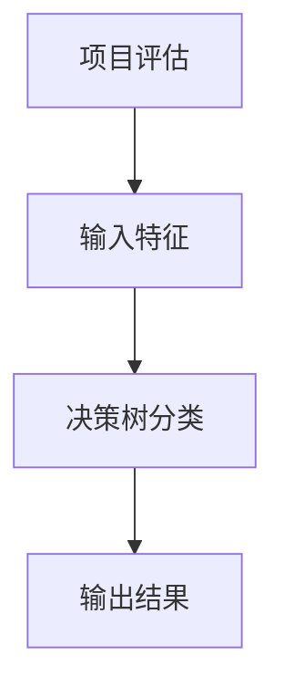
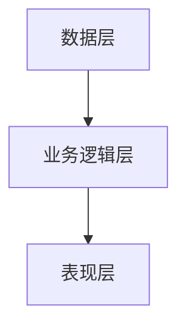

                 


# AI驱动的企业创新管理：从创意生成到项目评估

## 关键词：
- 人工智能（AI）
- 企业创新管理
- 创意生成
- 项目评估
- 系统架构
- 机器学习
- NLP

## 摘要：
本文详细探讨了AI在企业创新管理中的应用，从创意生成到项目评估的全过程。通过介绍AI算法、系统架构和实际案例，展示了如何利用AI提升企业创新效率和决策能力。文章结构清晰，内容涵盖背景分析、算法原理、系统设计和项目实战，旨在为企业创新管理者和技术人员提供有价值的指导。

---

## 第1章：AI驱动的企业创新管理背景

### 1.1 问题背景与挑战

#### 1.1.1 传统企业创新管理的局限性
企业创新管理传统上依赖人工经验和主观判断，存在效率低下、主观性强、资源浪费等问题。例如，创意评估可能因为评审者的主观偏好而忽略潜在的优秀项目。

#### 1.1.2 数字化转型与AI技术的引入
随着数字化转型的推进，企业开始利用AI技术优化创新管理流程。AI通过数据驱动的方法，提供客观、高效的决策支持，帮助企业在快速变化的市场中捕捉机会。

#### 1.1.3 企业创新管理的新需求
现代企业需要更快的创新速度和更精准的决策能力。AI技术能够处理大量数据，发现潜在模式，为创意生成和项目评估提供科学依据。

---

### 1.2 核心概念与定义

#### 1.2.1 创意生成的定义与目标
创意生成是利用AI技术自动生成创新想法的过程。目标是快速产生多样化的创意，并通过评估筛选出最具潜力的方案。

#### 1.2.2 项目评估的核心要素
项目评估是对创意进行可行性分析，包括市场潜力、技术难度、资源需求和预期收益等维度。AI通过机器学习模型对这些因素进行量化评估。

#### 1.2.3 AI在企业创新管理中的作用
AI通过自动化处理和数据分析，提高创意生成效率和评估准确性，优化资源配置，降低创新成本。

---

## 第2章：AI驱动的企业创新管理框架

### 2.1 创意生成的AI方法

#### 2.1.1 基于NLP的创意生成模型
自然语言处理（NLP）技术如GPT-3可以生成文本创意。通过训练模型，AI能够根据输入的关键词生成相关的产品描述或市场分析。

#### 2.1.2 创意评估的多维度指标
创意评估需要考虑多个维度，如市场可行性、技术实现难度和用户需求匹配度。AI通过机器学习模型对这些指标进行量化评分。

#### 2.1.3 创意优化的反馈机制
AI提供实时反馈，帮助用户优化创意。例如，通过A/B测试生成不同的方案，分析用户偏好，选择最优创意。

---

### 2.2 项目评估的AI流程

#### 2.2.1 项目筛选的特征提取
AI从项目数据中提取关键特征，如市场规模、竞争环境和团队能力。通过特征工程，构建项目筛选模型。

#### 2.2.2 风险评估的预测模型
利用机器学习模型预测项目风险，如违约概率和失败概率。模型基于历史数据，分析项目风险因素。

#### 2.2.3 项目优先级的动态调整
AI根据实时数据和市场变化，动态调整项目优先级。例如，通过反馈机制，优化项目排序，确保资源合理分配。

---

## 第3章：AI算法与数学模型

### 3.1 创意生成的生成模型

#### 3.1.1 基于Transformer的文本生成
使用Transformer模型生成创意文本。模型结构包括编码器和解码器，通过自注意力机制捕捉上下文信息。



#### 3.1.2 GAN在创意生成中的应用
生成对抗网络（GAN）用于生成多样化创意。生成器和判别器相互对抗，生成高质量创意文本。

#### 3.1.3 案例分析：创意生成的NLP模型
以GPT-3为例，展示如何利用NLP模型生成产品描述和市场分析。

---

### 3.2 项目评估的预测模型

#### 3.2.1 基于决策树的分类模型
使用决策树模型对项目进行分类，如成功或失败。模型结构清晰，易于解释。



#### 3.2.2 神经网络的回归模型
利用神经网络模型预测项目收益。模型结构包括输入层、隐藏层和输出层，通过反向传播优化参数。

#### 3.2.3 案例分析：项目风险预测模型
展示如何利用机器学习模型预测项目风险，帮助企业在决策中降低风险。

---

## 第4章：系统架构与实现

### 4.1 系统功能设计

#### 4.1.1 创意生成模块
创意生成模块负责接收输入并生成创意文本。模块包括NLP处理和生成模型。

#### 4.1.2 项目评估模块
项目评估模块对创意进行多维度评估，包括市场分析和风险预测。模块基于机器学习模型提供评分和建议。

#### 4.1.3 数据管理模块
数据管理模块负责数据存储和处理，确保数据安全和高效访问。模块包括数据清洗和特征提取功能。

---

### 4.2 系统架构设计

#### 4.2.1 分层架构设计
系统采用分层架构，包括数据层、业务逻辑层和表现层。各层之间通过接口通信，确保系统模块化和可维护性。



#### 4.2.2 微服务架构实现
系统采用微服务架构，各模块独立运行。通过容器化技术实现服务的快速部署和扩展。

#### 4.2.3 系统交互流程图
展示系统交互流程，包括用户输入、数据处理和结果输出。

---

## 第5章：项目实战与案例分析

### 5.1 环境安装与配置

#### 5.1.1 开发环境搭建
安装必要的开发工具，如Python、Jupyter Notebook和TensorFlow。确保环境配置正确，避免依赖冲突。

#### 5.1.2 数据集准备
收集和整理相关数据，如市场数据和项目案例。确保数据清洗和预处理，为模型训练提供高质量数据。

#### 5.1.3 工具链安装
安装AI工具链，如TensorFlow和Keras。配置开发环境，确保工具链正常运行。

---

### 5.2 核心代码实现

#### 5.2.1 创意生成模块代码
展示如何使用TensorFlow生成文本创意。代码包括模型加载、输入处理和生成输出。

```python
import tensorflow as tf
from tensorflow.keras.models import load_model

model = load_model('creative_model.h5')
def generate_creative(prompt):
    # 处理输入
    # 生成文本
    return result
```

#### 5.2.2 项目评估模块代码
展示如何使用决策树模型评估项目风险。代码包括数据加载、特征提取和模型预测。

```python
from sklearn.tree import DecisionTreeClassifier

model = DecisionTreeClassifier()
model.fit(X_train, y_train)
def predict_project_risk(features):
    return model.predict(features)
```

#### 5.2.3 系统接口设计
定义系统接口，如RESTful API。接口包括创意生成和项目评估功能，确保与其他系统的兼容性。

---

### 5.3 案例分析与总结

#### 5.3.1 案例背景介绍
介绍一个实际案例，如一家科技公司利用AI优化创新管理流程。描述公司背景和目标。

#### 5.3.2 实施过程详解
详细描述实施过程，包括需求分析、系统设计和代码实现。展示如何将理论应用于实际。

#### 5.3.3 成果与经验总结
总结项目成果，如提高创新效率和降低项目风险。分享经验教训，为其他企业提供参考。

---

## 第6章：总结与展望

### 6.1 全书总结

#### 6.1.1 核心内容回顾
回顾本书的核心内容，强调AI在企业创新管理中的重要性。

#### 6.1.2 AI在企业创新管理中的价值
总结AI带来的优势，如提高效率和降低风险。

#### 6.1.3 读者收获与启示
鼓励读者思考如何将AI应用于自己的企业创新管理中，启发他们探索更多可能性。

### 6.2 未来展望

#### 6.2.1 技术发展
展望AI技术的未来发展，如更强大的生成模型和更智能的评估系统。

#### 6.2.2 应用场景扩展
探讨AI在更多领域的应用潜力，如医疗和教育。鼓励企业探索新的应用场景，推动创新管理的进一步优化。

---

## 关键词：
- 人工智能（AI）
- 企业创新管理
- 创意生成
- 项目评估
- 系统架构
- 机器学习
- NLP

## 摘要：
本文详细探讨了AI在企业创新管理中的应用，从创意生成到项目评估的全过程。通过介绍AI算法、系统架构和实际案例，展示了如何利用AI提升企业创新效率和决策能力。文章结构清晰，内容涵盖背景分析、算法原理、系统设计和项目实战，旨在为企业创新管理者和技术人员提供有价值的指导。

