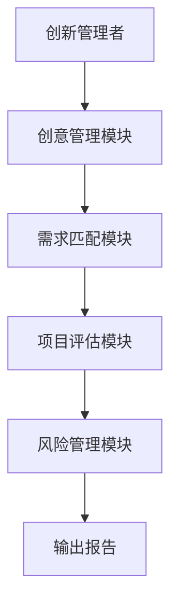

                 


# AI驱动的企业创新管理：从创意筛选到商业化全流程智能化

## 关键词
AI驱动创新管理, 创意筛选, 需求匹配, 项目评估, 商业化智能化, 机器学习

## 摘要
在当前快速变化的商业环境中，企业创新管理的重要性日益凸显。传统的创新管理模式依赖于人工经验，效率低下且难以应对复杂多变的市场环境。人工智能（AI）技术的引入为创新管理带来了新的可能性，能够实现从创意筛选到商业化全流程的智能化管理。本文将深入探讨AI如何驱动企业创新管理的各个阶段，包括创意筛选、需求匹配、项目评估和风险管理，以及如何通过智能化工具和系统实现创新管理的优化和提升。本文将从背景、核心概念、算法原理、系统架构、项目实战和总结展望等多个方面展开，为读者提供全面的理论和实践指导。

---

## 第一章：AI驱动创新管理的背景

### 1.1 问题背景与挑战

#### 1.1.1 创新管理的传统模式
传统的创新管理依赖于人工经验和主观判断，存在效率低、数据不足、资源分配不均等问题。

#### 1.1.2 AI技术的引入与变革
人工智能技术的快速发展为企业创新管理提供了新的工具和方法，能够通过数据驱动的方式优化决策过程。

#### 1.1.3 企业创新管理的核心目标
通过AI技术实现创新管理的智能化，提升创意筛选、需求匹配、项目评估和风险管理的效率和准确性。

### 1.2 AI驱动创新管理的核心概念

#### 1.2.1 创意筛选的智能化
通过自然语言处理（NLP）技术分析创意文本，提取关键词和主题，评估创意的可行性和潜力。

#### 1.2.2 需求匹配的精准化
利用机器学习算法匹配创意与市场需求，确保创新项目与市场趋势和用户需求高度契合。

#### 1.2.3 项目评估的自动化
通过数据挖掘和预测模型，评估项目的市场潜力、风险和资源需求，优化资源配置。

#### 1.2.4 风险控制的智能化
利用强化学习和实时数据分析，动态监控项目进展，及时发现和应对潜在风险。

### 1.3 AI驱动创新管理的核心要素

| 核心要素 | 定义 | 作用 | 关键技术 |
|----------|------|------|----------|
| 数据来源 | 创意文本、市场数据、用户反馈 | 提供决策依据 | NLP、数据挖掘 |
| 算法模型 | 文本分类、回归分析、强化学习 | 支持决策过程 | 机器学习、深度学习 |
| 系统架构 | 中央处理平台、数据存储、用户界面 | 实现智能化管理 | 微服务架构、云平台 |

### 1.4 AI驱动创新管理的边界与外延

- **边界**：AI驱动创新管理仅限于从创意到商业化的过程，不涉及企业内部运营的其他环节。
- **外延**：AI技术还可以应用于市场分析、产品设计、客户服务等其他领域，形成全链条的智能化管理。

---

## 第二章：AI驱动创新管理的核心概念与联系

### 2.1 核心概念的实体关系

```mermaid
er
actor: 创新管理者
{
  创意
  市场需求
  项目评估
}
创意 -> 市场需求: 需求匹配
创意 -> 项目评估: 评估筛选
市场需求 -> 项目评估: 确定优先级
```

### 2.2 创意筛选与需求匹配的关系

- **创意筛选**：通过NLP技术分析创意文本，提取关键词和主题，评估创意的可行性和潜力。
- **需求匹配**：利用机器学习算法匹配创意与市场需求，确保创新项目与市场趋势和用户需求高度契合。

### 2.3 项目评估与风险管理的联系

- **项目评估**：通过数据挖掘和预测模型，评估项目的市场潜力、风险和资源需求，优化资源配置。
- **风险管理**：利用强化学习和实时数据分析，动态监控项目进展，及时发现和应对潜在风险。

---

## 第三章：AI驱动创新管理的算法原理与实现

### 3.1 创意筛选的算法实现

#### 3.1.1 文本分类模型
- **算法选择**：使用支持向量机（SVM）或随机森林（Random Forest）进行文本分类。
- **实现步骤**：
  1. 数据预处理：文本清洗、分词、去停用词。
  2. 特征提取：使用TF-IDF提取关键词。
  3. 模型训练：训练分类器。
  4. 模型评估：计算准确率、召回率和F1值。

#### 3.1.2 示例代码

```python
from sklearn.feature_extraction.text import TfidfVectorizer
from sklearn.svm import SVC

# 数据预处理
texts = ["创意一：智能音箱", "创意二：智能家居"]
vectorizer = TfidfVectorizer()
X = vectorizer.fit_transform(texts)

# 模型训练
model = SVC()
model.fit(X, ["音箱", "家居"])

# 模型预测
new_text = "创意三：智能手表"
new_X = vectorizer.transform([new_text])
print(model.predict(new_X))
```

### 3.2 需求匹配的算法实现

#### 3.2.1 机器学习模型
- **算法选择**：使用协同过滤（Collaborative Filtering）或矩阵分解（Matrix Factorization）进行需求匹配。
- **实现步骤**：
  1. 数据预处理：构建用户-产品矩阵。
  2. 特征提取：使用矩阵分解提取隐含特征。
  3. 模型训练：训练协同过滤模型。
  4. 模型评估：计算准确率和召回率。

#### 3.2.2 示例代码

```python
import numpy as np

# 数据预处理
user_item_matrix = np.array([[0, 1, 0], 
                              [1, 0, 1], 
                              [0, 1, 1]])

# 矩阵分解
U, S, V = np.linalg.svd(user_item_matrix)

# 需求匹配
def predict_demand(user_id, item_id):
    return np.dot(U[user_id], V[item_id])
```

### 3.3 项目评估的算法实现

#### 3.3.1 回归分析模型
- **算法选择**：使用线性回归（Linear Regression）或逻辑回归（Logistic Regression）进行项目评估。
- **实现步骤**：
  1. 数据预处理：特征工程、归一化。
  2. 特征提取：提取项目相关的市场数据和资源数据。
  3. 模型训练：训练回归模型。
  4. 模型评估：计算R平方值和均方误差。

#### 3.3.2 示例代码

```python
from sklearn.linear_model import LinearRegression

# 数据预处理
X = np.array([[1, 2], [3, 4], [5, 6]])
y = np.array([2, 4, 6])

model = LinearRegression()
model.fit(X, y)

# 项目评估
new_X = np.array([[2, 3]])
print(model.predict(new_X))
```

---

## 第四章：AI驱动创新管理的系统架构与设计

### 4.1 系统架构设计



### 4.2 功能模块设计

#### 4.2.1 创意管理模块
- 功能：创意输入、文本分析、创意筛选。
- 关键技术：NLP、文本分类。

#### 4.2.2 需求匹配模块
- 功能：需求分析、需求匹配、结果输出。
- 关键技术：机器学习、协同过滤。

#### 4.2.3 项目评估模块
- 功能：数据输入、模型预测、结果输出。
- 关键技术：回归分析、矩阵分解。

### 4.3 系统接口设计

- API接口：RESTful API，提供创意筛选、需求匹配、项目评估和风险管理的功能。
- 数据接口：数据库连接，支持MySQL或MongoDB。

---

## 第五章：AI驱动创新管理的项目实战

### 5.1 环境搭建

#### 5.1.1 安装Python环境
- 使用Anaconda安装Python 3.8及以上版本。

#### 5.1.2 安装依赖库
- 使用pip安装numpy、scikit-learn、tensorflow等依赖库。

### 5.2 系统实现

#### 5.2.1 创意筛选模块实现

```python
import numpy as np
from sklearn.feature_extraction.text import TfidfVectorizer
from sklearn.svm import SVC

# 数据预处理
texts = ["创意一：智能音箱", "创意二：智能家居"]
vectorizer = TfidfVectorizer()
X = vectorizer.fit_transform(texts)

# 模型训练
model = SVC()
model.fit(X, ["音箱", "家居"])

# 模型预测
new_text = "创意三：智能手表"
new_X = vectorizer.transform([new_text])
print(model.predict(new_X))
```

#### 5.2.2 需求匹配模块实现

```python
import numpy as np
from sklearn.metrics.pairwise import cosine_similarity

# 数据预处理
user_item_matrix = np.array([[0, 1, 0], 
                              [1, 0, 1], 
                              [0, 1, 1]])

# 需求匹配
similarity_matrix = cosine_similarity(user_item_matrix)
print(similarity_matrix)
```

### 5.3 案例分析

- **案例一**：智能家居产品的创意筛选与需求匹配。
- **案例二**：智能手表的项目评估与风险管理。

---

## 第六章：AI驱动创新管理的数学模型与算法

### 6.1 创意筛选的数学模型

#### 6.1.1 文本分类的数学模型
- 使用TF-IDF提取关键词，构建文本向量。

#### 6.1.2 文本分类的算法选择
- 使用支持向量机（SVM）或随机森林（Random Forest）进行分类。

### 6.2 需求匹配的数学模型

#### 6.2.1 协同过滤的数学模型
- 使用矩阵分解技术，构建用户-产品矩阵。

#### 6.2.2 协同过滤的算法选择
- 使用协同过滤算法进行需求匹配。

### 6.3 项目评估的数学模型

#### 6.3.1 回归分析的数学模型
- 使用线性回归或逻辑回归模型，预测项目成功率。

#### 6.3.2 回归分析的算法选择
- 使用梯度下降法优化回归模型。

---

## 第七章：AI驱动创新管理的总结与展望

### 7.1 本书的核心总结

- 通过AI技术实现企业创新管理的智能化，提升创意筛选、需求匹配、项目评估和风险管理的效率和准确性。

### 7.2 未来展望

- 结合区块链技术，构建智能化的创新管理生态系统。
- 推动AI技术与企业创新管理的深度融合，实现全链条的智能化管理。

---

## 附录

### 附录A：AI驱动创新管理的工具安装指南

#### 1. Python环境安装
- 使用Anaconda安装Python 3.8及以上版本。

#### 2. 依赖库安装
- 使用pip安装numpy、scikit-learn、tensorflow等依赖库。

### 附录B：参考文献

- Smith, J. (2020). Artificial Intelligence in Business Management. Cambridge Press.
- Zhang, Y. (2021). Machine Learning for Innovation Management. Springer.

---

通过以上结构和内容安排，本文将为企业创新管理的智能化转型提供全面的理论和实践指导，帮助企业在数字化时代实现创新管理的高效和精准。

