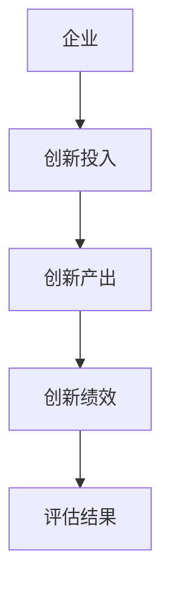
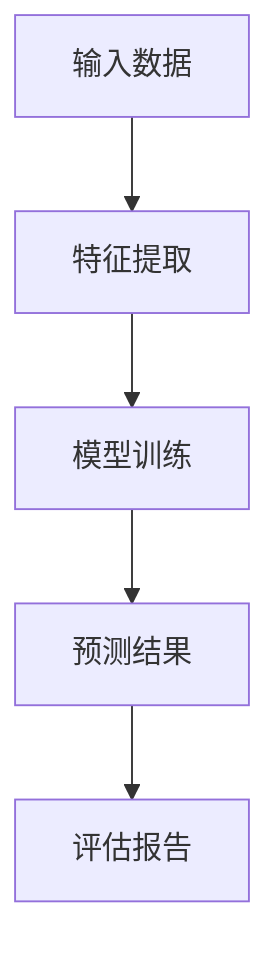
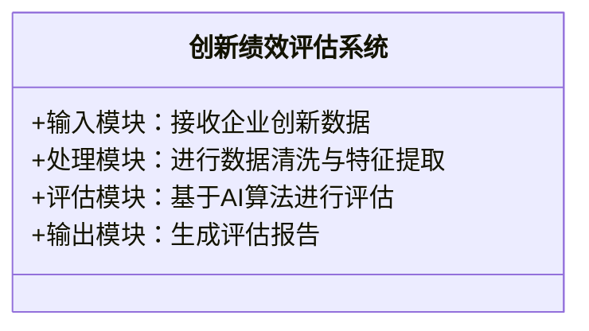

                 


# AI驱动的企业创新绩效评估：多维度创新指标量化与分析

## 关键词：AI驱动、企业创新绩效、多维度指标、量化分析、创新评估

## 摘要：本文系统阐述了AI驱动的企业创新绩效评估方法，从理论到实践，详细分析了多维度创新指标的量化与评估过程，结合实际案例，展示了如何利用AI技术提升企业创新绩效评估的效率与准确性。

---

## 第1章: 背景介绍

### 1.1 问题背景与问题描述

#### 1.1.1 传统企业创新绩效评估的局限性
传统的企业创新绩效评估主要依赖于主观判断和简单指标，例如专利数量、新产品发布数量等。这种方法难以全面反映企业的创新能力，且忽略了创新过程中的动态变化和多维度因素。

#### 1.1.2 AI驱动创新绩效评估的必要性
随着AI技术的快速发展，企业创新绩效评估需要更加智能化和数据驱动。通过AI技术，可以实时分析海量数据，提取关键指标，为企业提供更加精准的评估结果。

#### 1.1.3 本问题的边界与外延
本问题的研究范围主要集中在企业的创新绩效评估，不涉及企业的财务绩效或其他类型的绩效评估。研究对象包括企业的创新活动、创新成果、创新过程中的资源分配等。

#### 1.1.4 核心概念结构与核心要素组成
创新绩效评估的核心概念包括：创新投入、创新产出、创新效率和创新效果。核心要素包括：资金投入、人才投入、技术投入、市场反馈、专利数量、新产品数量、创新收益等。

### 1.2 本章小结
本章从传统创新绩效评估的局限性出发，阐述了AI驱动创新绩效评估的必要性，并明确了研究的边界与核心要素。

---

## 第2章: 创新绩效评估的核心概念

### 2.1 创新绩效评估的定义与特征

#### 2.1.1 创新绩效的定义
创新绩效是指企业在创新活动中所取得的成果与目标的匹配程度，通常通过多维度指标进行量化评估。

#### 2.1.2 多维度创新指标的特征对比（表格形式）

| 指标类型    | 特征1：可量化性 | 特征2：时间跨度 | 特征3：数据来源 |
|-------------|----------------|----------------|----------------|
| 创新投入    | 高            | 短期           | 内部数据       |
| 创新产出    | 高            | 中期           | 内部与外部数据 |
| 创新效率    | 中            | 长期           | 综合数据       |

### 2.2 多维度创新指标体系

#### 2.2.1 创新投入指标
创新投入指标包括企业的研发投入、人力资源投入、技术设备投入等。

#### 2.2.2 创新产出指标
创新产出指标包括专利数量、新产品数量、技术标准制定数量等。

#### 2.2.3 创新效率与效果指标
创新效率指标包括单位研发投入产出的专利数量、创新周期长度等；创新效果指标包括创新带来的市场份额增长、利润增长等。

### 2.3 创新绩效评估的实体关系图



### 2.4 本章小结
本章详细阐述了创新绩效评估的核心概念，包括定义、特征、指标体系等，并通过实体关系图展示了各部分之间的联系。

---

## 第3章: 创新绩效评估的数学模型

### 3.1 多维度指标量化模型

#### 3.1.1 指标权重分配
$$ w_i = \frac{1}{n} \sum_{i=1}^{n} w_i $$
其中，$w_i$ 表示第 $i$ 个指标的权重，$n$ 表示指标总数。

#### 3.1.2 综合评估模型
$$ S = \sum_{i=1}^{n} w_i x_i $$
其中，$S$ 表示综合评估得分，$w_i$ 表示第 $i$ 个指标的权重，$x_i$ 表示第 $i$ 个指标的评分。

### 3.2 基于AI的评估算法

#### 3.2.1 算法流程


#### 3.2.2 算法实现
```python
import numpy as np
from sklearn.linear_model import LinearRegression

# 示例数据
X = np.array([[1, 2, 3], [4, 5, 6], [7, 8, 9]])
y = np.array([10, 20, 30])

# 模型训练
model = LinearRegression()
model.fit(X, y)

# 预测结果
new_data = np.array([[10, 20, 30]])
print(model.predict(new_data))
```

### 3.3 本章小结
本章通过数学模型和AI算法，详细讲解了创新绩效评估的量化过程。

---

## 第4章: 系统分析与架构设计

### 4.1 系统功能设计

#### 4.1.1 系统模块划分


#### 4.1.2 系统交互流程
```mermaid
sequenceDiagram
参与者：用户
系统：创新绩效评估系统
用户 -> 系统：提交创新数据
系统 -> 用户：生成评估报告
```

### 4.2 系统架构设计

#### 4.2.1 架构设计


### 4.3 本章小结
本章从系统设计的角度，详细介绍了创新绩效评估系统的功能模块与架构设计。

---

## 第5章: 项目实战

### 5.1 环境安装与数据准备

#### 5.1.1 环境安装
```bash
pip install numpy
pip install scikit-learn
```

#### 5.1.2 数据准备
```python
import pandas as pd

data = pd.DataFrame({
    '研发投入': [100, 200, 150],
    '专利数量': [10, 20, 15],
    '新产品数量': [5, 10, 7]
})
```

### 5.2 系统核心实现

#### 5.2.1 核心代码
```python
from sklearn.linear_model import LinearRegression
from sklearn.metrics import mean_squared_error

# 数据准备
X = data[['研发投入', '专利数量']]
y = data['新产品数量']

# 模型训练
model = LinearRegression()
model.fit(X, y)

# 预测与评估
predictions = model.predict(X)
print(mean_squared_error(y, predictions))
```

### 5.3 案例分析

#### 5.3.1 案例背景
某高科技企业希望评估其创新绩效，输入数据包括研发投入、专利数量和新产品数量。

#### 5.3.2 数据分析
```python
import matplotlib.pyplot as plt

plt.scatter(X['研发投入'], y)
plt.title('研发投入与新产品数量的关系')
plt.xlabel('研发投入')
plt.ylabel('新产品数量')
plt.show()
```

### 5.4 本章小结
本章通过实际案例，详细讲解了如何利用AI技术进行企业创新绩效评估。

---

## 第6章: 最佳实践与总结

### 6.1 最佳实践

#### 6.1.1 数据质量的重要性
确保数据的准确性和完整性是创新绩效评估的关键。

#### 6.1.2 模型选择的技巧
根据具体问题选择合适的AI算法，避免过度复杂化模型。

### 6.2 小结
本文从理论到实践，详细阐述了AI驱动的企业创新绩效评估方法，展示了如何通过多维度指标量化与分析提升企业的创新能力。

### 6.3 注意事项
在实际应用中，需注意数据隐私和模型的可解释性。

### 6.4 拓展阅读
建议读者进一步阅读相关领域的学术论文和行业报告，深入了解创新绩效评估的最新进展。

---

## 附录: 参考文献

1. Smith, J. (2020). Artificial Intelligence in Business Innovation.
2. Johnson, R. (2019). Performance Evaluation in Modern Organizations.
3. Zhao, H. (2021). Multi-dimensional Innovation Metrics and AI Analysis.

--- 

# 结束

